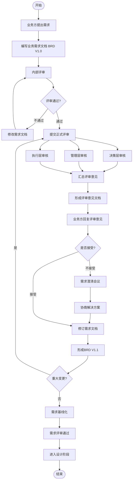

# Business Requirements Process Skill

This skill guides the complete business requirements documentation process for System project development.

## When to Use

- Creating new business requirements documents (BRD)
- Conducting requirements review with stakeholders
- Responding to review feedback and revising documents
- Establishing document numbering conventions
- Creating process flowcharts for requirements workflow

## Document Structure

### 1. Business Requirements Document (BRD) Format

```markdown
# [System Name] 业务需求文档（BRD）VX.X

**文档版本：** X.X
**创建日期：** YYYY-MM-DD
**最后更新：** YYYY-MM-DD
**文档作者：** 业务方/客户
**审批状态：** 待审批/已通过

## 修订记录

| 版本 | 修订日期 | 修订人 | 修订内容 |
|-----|---------|--------|---------|

## 1. 需求背景

### 1.1 业务背景
### 1.2 战略定位
### 1.3 痛点分析
### 1.4 目标价值

## 2. 投资回报分析（ROI）

### 2.1 成本节约分析
### 2.2 效率提升分析
### 2.3 风险降低价值
### 2.4 投资回报总结

## 3. 风险评估

### 3.1 风险矩阵
### 3.2 风险应对策略

## 4. 用户故事

### US-XXX：[故事名称]

**故事描述：**
作为 [角色]，
我希望 [目标]，
以便 [价值/收益]。

**验收标准：**
- [ ] 可验收的标准1
- [ ] 可验收的标准2

**优先级：** 高/中/低
**故事点：** X

## 5. 业务流程

### 流程X：[流程名称]

```
参与者：

正常流程：
1. 步骤1
2. 步骤2

异常流程：
- 异常1：处理方案
```

## 6. 业务规则

| 规则编号 | 规则名称 | 规则描述 | 优先级 |
|---------|---------|---------|--------|

## 7. 合规要求

### 7.1 等保三级要求
### 7.2 数据安全要求

## 8. 对外接口服务

## 9. 非功能性需求

### 9.1 性能需求
### 9.2 安全需求
### 9.3 可用性需求
### 9.4 兼容性需求

## 10. 数据字典

## 11. 附录

### 11.1 术语表
### 11.2 参考文档
### 11.3 V2.0需求规划
```

## 2. Review Response Document Format

```markdown
# 业务需求评审意见回复文档

**回复方：** 客户方需求提出人
**回复日期：** YYYY-MM-DD
**回复对象：** 业务需求评审意见

## 一、对决策层意见的回复

| 意见编号 | 决策层意见 | 客户方回复 | 处理方式 |
|---------|-----------|-----------|---------|

## 二、对管理层意见的回复

## 三、对执行层意见的回复

## 四、综合回复结论

### 4.1 意见处理统计
### 4.2 修订计划
### 4.3 不接受的意见说明
### 4.4 暂缓处理的意见说明

## 五、客户方声明
```

## 3. Review Opinion Document Format

```markdown
# 业务需求评审意见文档

**评审对象：** System 系统业务需求文档（BRD）
**评审日期：** YYYY-MM-DD
**评审状态：** 有条件通过，需修订

## 一、决策层（CEO/总经理）审核意见

### 1.1 总体评价
### 1.2 审核意见表格
### 1.3 决策结论
### 1.4 决策层要求补充内容

## 二、管理层（部门总监/IT负责人）审核意见

## 三、执行层（产品经理/开发负责人）审核意见

## 四、综合审核总结

### 4.1 各层级审核结论
### 4.2 问题优先级分布
### 4.3 下一步行动计划
### 4.4 评审结论
```

## Document Numbering Convention

### Directory Structure
```
docs/
├── 00-project-preparation/
│   └── 01-requirements-research/
│       └── 01-business-requirements/
├── 01-project-initiation/
├── 02-design/
└── ...
```

### File Naming
- Format: `XX-filename-vX.X.md`
- Example: `01-business-requirements-v1.0.md`

### Document Types
| Code | Type | Description |
|-----|------|-------------|
| BRD | Business Requirements Document | 业务需求文档 |
| REV | Review | 评审意见 |
| RES | Response | 回复文档 |
| TR | Technical Research | 技术预研 |
| FA | Feasibility Analysis | 可行性分析 |
| AD | Architecture Design | 架构设计 |
| DD | Database Design | 数据库设计 |
| ID | Interface Design | 接口设计 |
| TP | Test Plan | 测试计划 |

## Process Flowchart

Create requirement-process.mmd:



## Key Steps Summary

1. **需求编写** → Create BRD V1.0
2. **内部评审** → Internal review cycle
3. **正式评审** → Three-level review (Decision/Management/Execution)
4. **意见回复** → Response document
5. **需求修订** → BRD V1.1
6. **基线化** → Approved baseline
7. **进入设计** → Next phase

## User Story Template

```markdown
### US-XXX：[故事名称]

**故事描述：**
作为 [角色]，
我希望 [目标]，
以便 [价值/收益]。

**验收标准：**
- [ ] 标准1（具体、可测试）
- [ ] 标准2（包含边界条件）
- [ ] 标准3（包含异常处理）

**优先级：** 高/中/低
**故事点：** X（Fibonacci: 1,2,3,5,8,13）
```

## Checklist

Before submitting BRD:
- [ ] All user stories follow INVEST principles
- [ ] Acceptance criteria are specific and testable
- [ ] Business rules are clearly defined
- [ ] ROI analysis is quantified
- [ ] Risk assessment is complete
- [ ] Document follows numbering convention
- [ ] All stakeholders have reviewed
