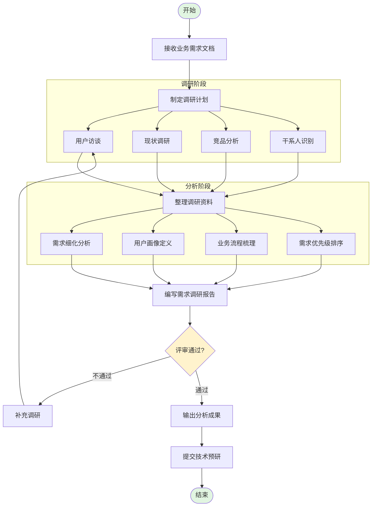

# 需求分析流程图

**文档编号：** SYS-RA-PD-001  
**版本：** 1.0  
**日期：** 2026-03-04  
**编制：** 项目经理  
**审核：** 已审核

---

## 流程说明

本文档描述了需求调研与分析阶段的完整流程，包括调研阶段和分析阶段两个主要部分。

---

## 流程图



---

## 阶段说明

### 一、准备阶段

| 步骤 | 任务 | 输出物 |
|-----|------|--------|
| 1 | 接收业务需求文档 | BRD文档 |
| 2 | 制定调研计划 | 调研计划文档 |

### 二、调研阶段

| 步骤 | 任务 | 输出物 | 对应目录 |
|-----|------|--------|---------|
| 3 | 用户访谈 | 访谈记录、访谈纪要 | `01-user-interview-records/` |
| 4 | 现状调研 | 现状调研报告 | `02-current-situation-report/` |
| 5 | 竞品分析 | 竞品分析报告 | `03-competitor-analysis/` |
| 6 | 干系人识别 | 干系人登记册 | `04-stakeholder-analysis/` |

### 三、分析阶段

| 步骤 | 任务 | 输出物 | 对应目录 |
|-----|------|--------|---------|
| 7 | 需求细化分析 | 需求规格说明 | `05-user-story-mapping/` |
| 8 | 用户画像定义 | 用户画像文档 | `06-user-persona/` |
| 9 | 业务流程梳理 | 业务流程文档 | `07-business-process-refinement/` |
| 10 | 需求优先级排序 | 需求优先级矩阵 | `08-requirements-priority/` |

### 四、总结阶段

| 步骤 | 任务 | 输出物 | 对应目录 |
|-----|------|--------|---------|
| 11 | 编写需求调研报告 | 需求调研报告 | `09-requirements-research-report/01-requirements-research-report.md` |
| 12 | 干系人审核 | 审核意见文档 | `09-requirements-research-report/02-requirements-research-report-review.md` |
| 13 | 处理审核意见 | 修订后的报告 | `09-requirements-research-report/01-requirements-research-report.md` |
| 14 | 输出分析成果 | 最终交付物 | - |
| 15 | 提交技术预研 | 技术预研申请 | - |

---

## 评审节点

流程图中包含一个关键评审节点：**评审通过?**

### 干系人审核流程

```
编写需求调研报告
       ↓
   干系人审核
       ↓
   审核通过?
   ├─ 是 → 处理审核意见 → 输出分析成果 → 提交技术预研
   └─ 否 → 补充调研 → 重新编写报告
```

### 审核要求

| 审核层级 | 审核人员 | 审核重点 |
|---------|---------|---------|
| 决策层 | CEO | 战略价值、投资回报、合规性 |
| 管理层 | IT总监、部门经理 | 技术可行性、业务需求、实施计划 |
| 执行层 | 系统管理员、普通员工代表 | 易用性、功能完整性、运维支持 |

### 审核结果处理

- **通过**：整理审核意见，修订报告，进入技术预研阶段
- **不通过**：根据意见补充调研，重新编写需求调研报告

---

## 相关文档

| 文档 | 路径 |
|-----|------|
| 流程图源文件 | `requirements-analysis-process.mmd` |
| 流程图图片 | `requirements-analysis-process.png` |
| 需求分析检查清单 | `../requirements-analysis-checklist.md` |
| 需求调研报告 V1.0 | `../../09-requirements-research-report/01-requirements-research-report.md` |
| 需求调研报告 V1.1 | `../../09-requirements-research-report/01-requirements-research-report-v1.1.md` |
| 审核意见文档 | `../../09-requirements-research-report/02-requirements-research-report-review.md` |

---

**文档版本历史**

| 版本 | 日期 | 修改内容 | 修改人 |
|-----|------|---------|--------|
| 1.0 | 2026-03-04 | 初始版本 | 项目经理 |
| 1.1 | 2026-03-09 | 补充干系人审核流程说明 | 项目经理 |
| 1.2 | 2026-03-10 | 更新相关文档链接，增加V1.1报告引用 | 项目经理 |
