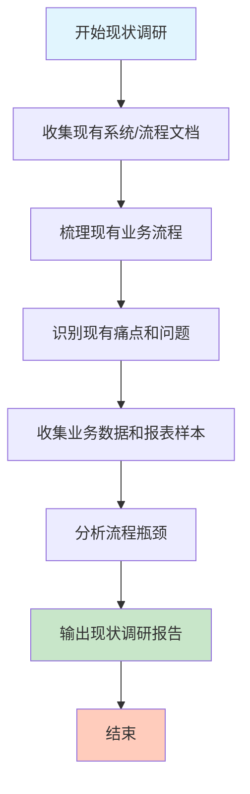

# 现状调研流程

## 一、流程概述

现状调研是需求调研与分析阶段的核心工作，通过系统性地收集和分析现有系统、流程、数据、痛点，为项目规划和系统设计提供事实依据。

## 二、调研目标

1. 全面了解现有系统架构和功能
2. 梳理现有业务流程和痛点
3. 识别数据质量问题和同步需求
4. 量化效率损失和成本
5. 评估安全风险和合规风险
6. 为系统设计提供改进方向

## 三、调研范围

### 3.1 系统范围
- 核心业务系统（ERP、CRM、OA、财务、HR等）
- 用户管理系统
- 权限管理系统
- 组织架构管理系统

### 3.2 业务范围
- 用户全生命周期管理（入职、在职、离职）
- 权限管理（申请、审批、配置）
- 组织架构管理（部门、岗位、汇报关系）
- 系统认证和登录

### 3.3 数据范围
- 用户基础数据
- 角色权限数据
- 组织架构数据
- 操作日志数据
- 统计报表数据

## 四、调研步骤

### 步骤1：收集现有系统/流程文档

**工作内容：**
- 收集各系统的功能说明文档
- 收集系统架构图和集成关系
- 收集现有业务流程文档
- 收集用户手册和操作指南

**输出物：**
- 系统概述文档（每个系统一份）
- 系统功能清单
- 系统集成关系图
- 现有问题记录

**关键检查点：**
- [ ] 是否覆盖所有核心业务系统？
- [ ] 系统信息是否完整（版本、厂商、用户数等）？
- [ ] 是否记录了系统间的集成关系？
- [ ] 是否识别了系统的主要问题？

---

### 步骤2：梳理现有业务流程

**工作内容：**
- 识别核心业务流程
- 绘制现状流程图
- 记录流程参与角色
- 统计流程耗时
- 识别流程痛点

**核心流程清单：**
1. 用户入职流程
2. 用户离职流程
3. 密码重置流程
4. 权限申请流程
5. 组织架构同步流程
6. 用户信息变更流程

**输出物：**
- 业务流程文档（每个流程一份）
- 流程图（Mermaid源码和PNG图片）
- 流程耗时统计
- 流程痛点分析

**关键检查点：**
- [ ] 是否覆盖所有核心业务流程？
- [ ] 流程图是否清晰准确？
- [ ] 是否记录了流程耗时数据？
- [ ] 是否识别了流程瓶颈？

---

### 步骤3：识别现有痛点和问题

**工作内容：**
- 基于用户访谈识别痛点
- 基于流程梳理识别问题
- 分类整理痛点（按层级、按系统）
- 评估痛点影响程度
- 量化痛点损失

**痛点分类维度：**
- 按层级：决策层、管理层、执行层
- 按系统：ERP、CRM、OA、财务、HR等
- 按类型：效率、安全、体验、成本

**输出物：**
- 痛点识别文档
- 痛点优先级矩阵
- 痛点与需求映射表
- 痛点解决价值评估

**关键检查点：**
- [ ] 是否覆盖所有干系人层级？
- [ ] 痛点是否有真实用户反馈支撑？
- [ ] 是否量化了痛点影响？
- [ ] 是否评估了解决价值？

---

### 步骤4：收集业务数据和报表样本

**工作内容：**
- 收集用户基础数据样本
- 收集各系统用户数据
- 收集角色权限数据
- 收集统计报表样本
- 分析数据质量

**数据类型：**
1. 用户基础信息（员工编号、姓名、部门、岗位等）
2. 用户账号信息（各系统的用户表）
3. 角色权限信息（角色定义、权限分配）
4. 操作日志（登录日志、权限变更日志）
5. 统计报表（用户统计、使用统计、运维统计）

**输出物：**
- 数据样本文档
- 数据统计分析
- 数据质量问题清单
- 数据同步需求分析

**关键检查点：**
- [ ] 是否收集了各系统的数据样本？
- [ ] 是否分析了数据一致性？
- [ ] 是否识别了数据质量问题？
- [ ] 是否提出了数据同步需求？

---

### 步骤5：分析流程瓶颈

**工作内容：**
- 分析各流程的耗时分布
- 识别流程瓶颈点
- 分析瓶颈根因
- 评估优化价值
- 制定优化路线图

**分析方法：**
- 时间分析：流程各阶段耗时
- 资源分析：人力投入情况
- 质量分析：错误率/返工率
- 风险分析：安全/合规风险

**输出物：**
- 流程瓶颈分析文档
- 瓶颈根因分析图
- 优化建议清单
- 优化路线图
- 价值评估报告

**关键检查点：**
- [ ] 是否分析了所有核心流程？
- [ ] 瓶颈点是否量化？
- [ ] 根因分析是否到位？
- [ ] 优化建议是否可行？

---

### 步骤6：输出现状调研报告

**工作内容：**
- 汇总所有调研成果
- 编写执行摘要
- 分析问题根因
- 提出改进建议
- 制定实施路线图

**报告结构：**
1. 执行摘要
2. 现有系统现状
3. 业务流程现状
4. 痛点与问题分析
5. 数据质量分析
6. 成本与效率分析
7. 风险评估
8. 改进建议
9. 结论与建议
10. 附录

**输出物：**
- 现状调研报告（主文档）
- 相关支撑文档（按目录组织）

**关键检查点：**
- [ ] 报告是否覆盖所有调研内容？
- [ ] 核心发现是否清晰？
- [ ] 建议是否具体可行？
- [ ] 是否附上了所有支撑文档？

## 五、文档清单

| 序号 | 文档名称 | 存放路径 | 说明 |
|-----|---------|---------|------|
| 1 | 现有系统文档 | `01-existing-systems-docs/` | 各系统概述 |
| 2 | 业务流程文档 | `02-business-process-flow/` | 流程图和说明 |
| 3 | 痛点分析 | `03-pain-points-analysis.md` | 痛点识别和分析 |
| 4 | 数据样本 | `04-business-data-samples/` | 数据和报表样本 |
| 5 | 瓶颈分析 | `05-process-bottleneck-analysis.md` | 流程瓶颈分析 |
| 6 | 现状调研报告 | `06-current-situation-report.md` | 汇总报告 |

## 六、最佳实践

### 6.1 调研技巧
1. **多角度收集**：从系统、流程、数据、人员多个角度收集信息
2. **量化分析**：尽量用数据说话，避免主观描述
3. **用户验证**：调研结果与用户确认，确保准确性
4. **持续更新**：随着调研深入，不断更新和完善文档

### 6.2 常见问题
1. **信息不完整**：部分系统文档缺失，需要通过访谈补充
2. **数据获取难**：部分系统数据难以导出，需要协调管理员
3. **流程不统一**：同一流程在不同部门执行方式不同
4. **痛点难量化**：部分痛点难以用数据量化，需要通过案例说明

### 6.3 注意事项
1. 保持客观中立，避免预设立场
2. 区分现状和问题，不要混为一谈
3. 重视数据质量，确保数据准确性
4. 及时整理文档，避免信息丢失

## 七、流程图

## 八、验收标准

现状调研完成的标准：
- [ ] 所有核心业务系统文档已收集
- [ ] 所有核心业务流程已梳理并绘制流程图
- [ ] 痛点已识别并量化影响
- [ ] 数据样本已收集并分析质量
- [ ] 流程瓶颈已分析并提出优化建议
- [ ] 现状调研报告已完成并通过评审

---

**文档版本：** 1.0  
**创建日期：** 2026-03-08  
**适用项目：** System 平台项目  
**审核状态：** 待确认
