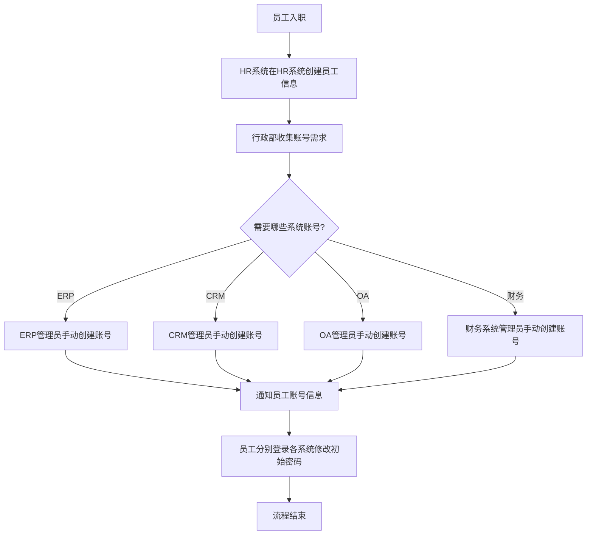

# 现有系统 - 用户入职流程（现状）

## 一、流程概述

| 项目 | 内容 |
|-----|------|
| **流程名称** | 用户入职账号开通流程 |
| **流程目标** | 为新入职员工开通各业务系统账号 |
| **涉及系统** | HR系统、ERP、CRM、OA、财务系统 |
| **流程痛点** | 多系统重复操作、容易遗漏、耗时长 |

## 二、现有流程图

## 三、流程步骤说明

| 步骤 | 执行人 | 操作内容 | 耗时 | 问题 |
|-----|-------|---------|------|------|
| 1 | HR专员 | 在HR系统创建员工基本信息 | 10分钟 | 信息可能不完整 |
| 2 | 行政部 | 收集各部门账号需求 | 1-2天 | 沟通成本高 |
| 3 | 各系统管理员 | 手动创建账号 | 每系统10-30分钟 | 重复劳动 |
| 4 | 各系统管理员 | 通知员工账号信息 | 10分钟 | 信息分散 |
| 5 | 员工 | 分别登录各系统修改密码 | 每系统5分钟 | 体验差 |

## 四、流程痛点分析

### 4.1 效率痛点
- **耗时长**：入职到账号开通需要2-3天
- **重复劳动**：各系统管理员重复录入相同信息
- **沟通成本高**：需要多次确认账号需求

### 4.2 质量痛点
- **信息不一致**：各系统员工信息可能不一致
- **容易遗漏**：可能漏开某些系统账号
- **权限错误**：手动配置容易出错

### 4.3 体验痛点
- **员工体验差**：需要记住多套账号密码
- **管理员负担重**：频繁处理账号开通请求

## 五、优化方向

### 5.1 短期优化
- [ ] 制定标准化的账号开通 checklist
- [ ] 建立账号开通模板
- [ ] 使用邮件批量通知账号信息

### 5.2 长期优化（System平台）
- [ ] HR系统作为源头，自动同步到各业务系统
- [ ] 统一用户中心，一处创建，处处可用
- [ ] 单点登录（SSO），一套密码
- [ ] 自助密码重置

## 六、流程数据

| 指标 | 现状数据 | 目标数据 |
|-----|---------|---------|
| 平均开通时间 | 2-3天 | 实时/小时级 |
| 账号遗漏率 | 约5% | 0% |
| 信息错误率 | 约10% | <1% |
| 管理员耗时 | 2-3小时/人 | 0（自动化） |

---

**流程梳理时间：** 2026-03-08  
**梳理人：** 项目经理  
**审核状态：** 待确认
