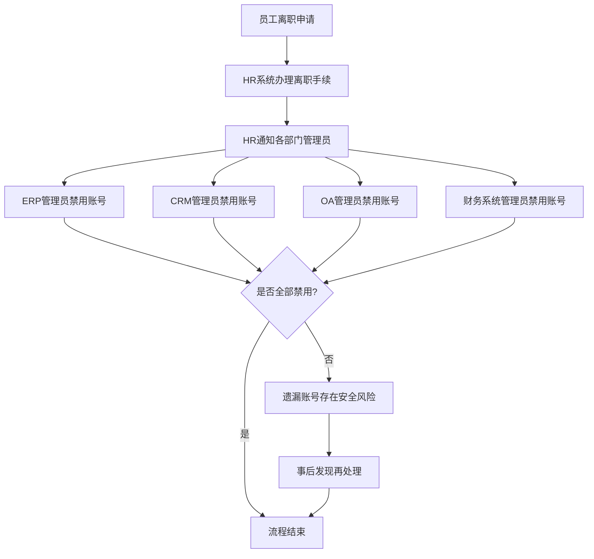

# 现有系统 - 用户离职流程（现状）

## 一、流程概述

| 项目 | 内容 |
|-----|------|
| **流程名称** | 用户离职账号禁用流程 |
| **流程目标** | 及时禁用离职员工各业务系统账号 |
| **涉及系统** | HR系统、ERP、CRM、OA、财务系统 |
| **流程痛点** | 容易遗漏、不及时、存在安全风险 |

## 二、现有流程图

## 三、流程步骤说明

| 步骤 | 执行人 | 操作内容 | 耗时 | 问题 |
|-----|-------|---------|------|------|
| 1 | HR专员 | 办理离职手续 | 30分钟 | - |
| 2 | HR专员 | 邮件通知各系统管理员 | 10分钟 | 可能遗漏通知 |
| 3 | 各系统管理员 | 手动禁用账号 | 每系统5-10分钟 | 可能遗漏处理 |
| 4 | - | 确认全部禁用 | - | 无统一确认机制 |

## 四、流程痛点分析

### 4.1 安全风险
- **账号禁用不及时**：离职后账号可能仍可使用数天
- **容易遗漏**：某些系统账号被遗忘禁用
- **无统一审计**：无法确认是否全部禁用

### 4.2 效率痛点
- **依赖人工**：需要各管理员手动操作
- **响应慢**：从通知到处理有时间差
- **追溯困难**：事后发现遗漏难以追溯

### 4.3 真实案例（访谈中提及）
> "之前有个员工离职后，CRM账号过了两周才发现没禁用，存在数据泄露风险。"
> —— IT总监访谈记录

## 五、优化方向

### 5.1 短期优化
- [ ] 建立离职账号禁用 checklist
- [ ] 设置禁用完成确认机制
- [ ] 定期审计各系统离职人员账号

### 5.2 长期优化（System平台）
- [ ] HR系统操作离职自动触发禁用
- [ ] 统一用户中心一键禁用所有系统
- [ ] 自动审计报告，确保无遗漏
- [ ] 实时同步，秒级禁用

## 六、流程数据

| 指标 | 现状数据 | 目标数据 |
|-----|---------|---------|
| 平均禁用时间 | 1-2天 | 实时 |
| 账号遗漏率 | 约8% | 0% |
| 安全风险暴露时间 | 数小时至数周 | 0 |
| 人工操作点 | 5+个系统 | 1个操作 |

---

**流程梳理时间：** 2026-03-08  
**梳理人：** 项目经理  
**审核状态：** 待确认
