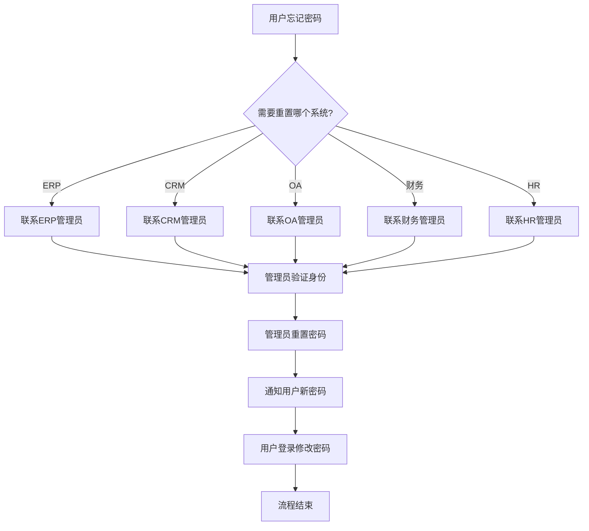

# 现有系统 - 密码重置流程（现状）

## 一、流程概述

| 项目 | 内容 |
|-----|------|
| **流程名称** | 用户密码重置流程 |
| **流程目标** | 帮助用户重置忘记的密码 |
| **涉及系统** | ERP、CRM、OA、财务系统、HR系统 |
| **流程痛点** | 流程繁琐、耗时长、管理员负担重 |

## 二、现有流程图

## 三、流程步骤说明

| 步骤 | 执行人 | 操作内容 | 耗时 | 问题 |
|-----|-------|---------|------|------|
| 1 | 用户 | 发现忘记密码，联系管理员 | - | 不知道找谁 |
| 2 | 用户 | 等待管理员响应 | 数小时至数天 | 影响工作 |
| 3 | 管理员 | 验证用户身份 | 5-10分钟 | 验证标准不统一 |
| 4 | 管理员 | 重置密码 | 5分钟 | 重复劳动 |
| 5 | 管理员 | 通知用户 | 5分钟 | 安全性差 |
| 6 | 用户 | 登录修改密码 | 5分钟 | - |

## 四、流程痛点分析

### 4.1 用户痛点
- **不知道找谁**：各系统管理员不同
- **等待时间长**：管理员可能不在或忙
- **多套密码**：不同系统密码不同，容易混淆

### 4.2 管理员痛点
- **频繁被打断**：密码重置请求频繁
- **验证困难**：难以确认申请人身份
- **安全性问题**：通过电话或邮件告知密码不安全

### 4.3 效率数据
- 平均处理时间：2-4小时（从请求到完成）
- 管理员日均处理量：5-10次
- 用户满意度：低

## 五、优化方向

### 5.1 短期优化
- [ ] 建立密码重置服务台
- [ ] 制定统一的身份验证标准
- [ ] 使用安全的密码通知方式

### 5.2 长期优化（System平台）
- [ ] 统一认证，一套密码
- [ ] 自助密码重置（手机/邮箱验证）
- [ ] 密码策略统一管理
- [ ] 单点登录，减少密码记忆负担

## 六、流程数据

| 指标 | 现状数据 | 目标数据 |
|-----|---------|---------|
| 平均处理时间 | 2-4小时 | 5分钟（自助） |
| 管理员日均处理量 | 5-10次 | 0（自助化） |
| 用户满意度 | 低 | 高 |
| 安全风险 | 中（明文传输） | 低（加密+自助） |

---

**流程梳理时间：** 2026-03-08  
**梳理人：** 项目经理  
**审核状态：** 待确认
