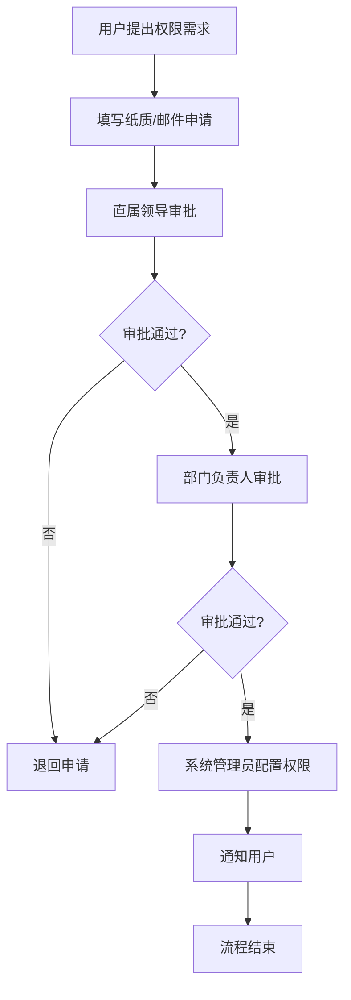

# 现有系统 - 权限申请流程（现状）

## 一、流程概述

| 项目 | 内容 |
|-----|------|
| **流程名称** | 用户权限申请流程 |
| **流程目标** | 为用户申请业务系统权限 |
| **涉及系统** | ERP、CRM、OA、财务系统等 |
| **流程痛点** | 流程长、审批慢、不透明 |

## 二、现有流程图

## 三、流程步骤说明

| 步骤 | 执行人 | 操作内容 | 耗时 | 问题 |
|-----|-------|---------|------|------|
| 1 | 用户 | 填写申请表/邮件 | 10-20分钟 | 格式不统一 |
| 2 | 直属领导 | 审批申请 | 数小时至数天 | 可能遗漏 |
| 3 | 部门负责人 | 审批申请 | 数小时至数天 | 可能遗漏 |
| 4 | 系统管理员 | 配置权限 | 10-30分钟 | 理解可能有偏差 |
| 5 | 系统管理员 | 通知用户 | 5分钟 | - |

## 四、流程痛点分析

### 4.1 效率痛点
- **周期长**：从申请到完成需要数天
- **审批慢**：领导忙时审批延迟
- **不透明**：申请人不知道审批进度

### 4.2 质量痛点
- **权限描述不清**：申请人不清楚需要什么权限
- **配置错误**：管理员理解偏差导致配置错误
- **缺乏审计**：无法追溯权限变更历史

### 4.3 体验痛点
- **重复申请**：不同系统需要分别申请
- **无法查询**：无法查看自己有哪些权限
- **离职权限**：离职时权限清理不彻底

## 五、优化方向

### 5.1 短期优化
- [ ] 建立标准化的权限申请模板
- [ ] 建立权限目录，明确各权限范围
- [ ] 设置审批提醒机制

### 5.2 长期优化（System平台）
- [ ] 统一权限申请入口
- [ ] 工作流自动化审批
- [ ] 权限自助查询
- [ ] 基于角色的权限模板
- [ ] 权限定期审计和回收

## 六、流程数据

| 指标 | 现状数据 | 目标数据 |
|-----|---------|---------|
| 平均审批周期 | 2-5天 | 实时/小时级 |
| 权限配置错误率 | 约15% | <5% |
| 用户满意度 | 中低 | 高 |
| 权限审计覆盖率 | 低 | 100% |

---

**流程梳理时间：** 2026-03-08  
**梳理人：** 项目经理  
**审核状态：** 待确认
