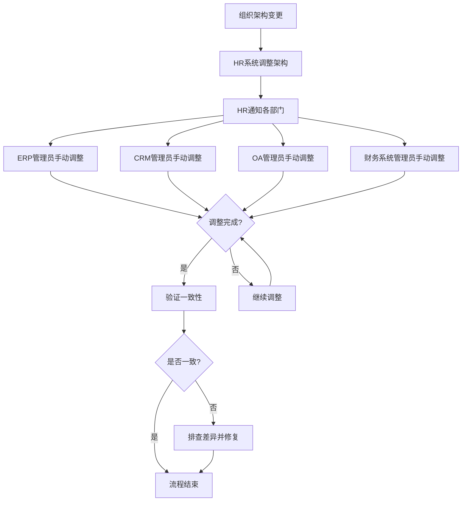

# 现有系统 - 组织架构同步流程（现状）

## 一、流程概述

| 项目 | 内容 |
|-----|------|
| **流程名称** | 组织架构变更同步流程 |
| **流程目标** | 确保各系统组织架构一致 |
| **涉及系统** | HR系统、ERP、CRM、OA、财务系统 |
| **流程痛点** | 多处维护、容易不一致、调整工作量大 |

## 二、现有流程图

## 三、流程步骤说明

| 步骤 | 执行人 | 操作内容 | 耗时 | 问题 |
|-----|-------|---------|------|------|
| 1 | HR专员 | 在HR系统调整组织架构 | 30分钟 | - |
| 2 | HR专员 | 通知各系统管理员 | 10分钟 | 可能遗漏 |
| 3 | 各系统管理员 | 手动调整组织架构 | 每系统30-60分钟 | 重复劳动 |
| 4 | - | 验证各系统一致性 | 数小时 | 容易遗漏 |
| 5 | 各系统管理员 | 修复差异 | 不定 | 被动发现 |

## 四、流程痛点分析

### 4.1 效率痛点
- **调整工作量大**：每次架构调整需要5个系统分别操作
- **耗时长**：完整同步需要数天
- **验证困难**：难以确保所有系统完全一致

### 4.2 质量痛点
- **信息不一致**：各系统架构经常不一致
- **影响业务**：审批流程、报表统计出错
- **历史数据**：架构变更历史难以追溯

### 4.3 真实案例（访谈中提及）
> "上个月组织架构调整后，审批流程卡了好几天，后来发现是OA系统和HR系统的部门名称不一致导致的。"
> —— 行政经理访谈记录

## 五、组织架构现状

### 5.1 维护现状
| 系统 | 维护方式 | 更新频率 | 准确性 |
|-----|---------|---------|-------|
| HR系统 | 源头系统 | 实时 | 高 |
| ERP | 手动同步 | 延迟 | 中 |
| CRM | 手动同步 | 延迟 | 中 |
| OA | 手动同步 | 延迟 | 中低 |
| 财务 | 手动同步 | 延迟 | 中 |

### 5.2 常见问题
- 部门名称不一致
- 汇报关系不同步
- 岗位名称差异
- 人员归属错误

## 六、优化方向

### 6.1 短期优化
- [ ] 建立组织架构变更通知机制
- [ ] 制定统一的组织架构编码规范
- [ ] 建立定期核对机制

### 6.2 长期优化（System平台）
- [ ] HR系统作为组织架构源头
- [ ] 自动同步到各业务系统
- [ ] 实时同步，一处变更处处更新
- [ ] 架构变更历史追溯
- [ ] 统一组织架构视图

## 七、流程数据

| 指标 | 现状数据 | 目标数据 |
|-----|---------|---------|
| 平均同步时间 | 2-5天 | 实时 |
| 系统一致性 | 约80% | 100% |
| 人工操作点 | 5个系统 | 1个源头 |
| 架构错误影响 | 经常 | 0 |

---

**流程梳理时间：** 2026-03-08  
**梳理人：** 项目经理  
**审核状态：** 待确认
