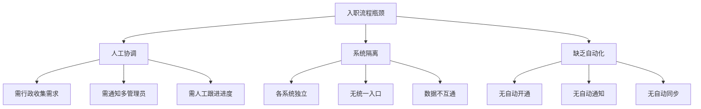
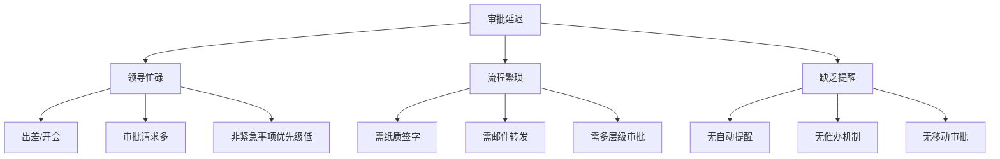
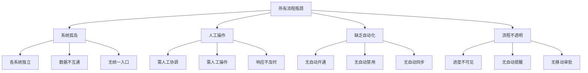

# 流程瓶颈分析

## 一、分析概述

基于业务流程梳理、痛点识别和数据分析，对现有用户管理相关流程进行瓶颈分析，识别关键瓶颈点并提出优化建议。

---

## 二、流程瓶颈分析方法

### 2.1 分析维度
- **时间维度**：流程耗时分析
- **资源维度**：人力投入分析
- **质量维度**：错误率/返工率分析
- **风险维度**：安全/合规风险分析

### 2.2 评估标准
| 等级 | 瓶颈程度 | 处理建议 |
|-----|---------|---------|
| P0 | 严重瓶颈 | 必须立即优化 |
| P1 | 重要瓶颈 | 需要优先优化 |
| P2 | 一般瓶颈 | 计划内优化 |
| P3 | 轻微瓶颈 | 持续改进 |

---

## 三、核心流程瓶颈分析

### 3.1 用户入职流程瓶颈分析

#### 流程耗时分析

```
┌─────────────────────────────────────────────────────────────┐
│  用户入职流程耗时分布                                        │
├─────────────────────────────────────────────────────────────┤
│  HR录入信息          ████████░░░░░░░░░░░░  30分钟           │
│  收集账号需求        ████░░░░░░░░░░░░░░░░  2-4小时          │
│  ERP创建账号         ████████░░░░░░░░░░░░  30分钟           │
│  CRM创建账号         ████████░░░░░░░░░░░░  30分钟           │
│  OA创建账号          ████████░░░░░░░░░░░░  30分钟           │
│  财务创建账号        ████████░░░░░░░░░░░░  30分钟           │
│  通知员工            ██░░░░░░░░░░░░░░░░░░  15分钟           │
│  员工修改密码        ████████░░░░░░░░░░░░  30分钟×5系统      │
├─────────────────────────────────────────────────────────────┤
│  总耗时：2-3天（主要瓶颈：人工逐个创建、等待协调）            │
└─────────────────────────────────────────────────────────────┘
```

#### 瓶颈点识别

| 序号 | 瓶颈点 | 耗时 | 等级 | 影响 |
|-----|-------|------|------|------|
| 1 | 账号需求收集 | 2-4小时 | P0 | 等待行政协调 |
| 2 | 多系统分别创建 | 2-3小时 | P0 | 重复劳动 |
| 3 | 等待管理员处理 | 1-2天 | P0 | 响应不及时 |
| 4 | 员工逐个修改密码 | 2.5小时 | P1 | 体验差 |

#### 瓶颈根因分析



#### 优化建议
- **短期**：建立入职申请单模板，标准化需求收集
- **中期**：开发入职自动化脚本，一键开通账号
- **长期**：HR系统作为源头，自动同步到各业务系统

---

### 3.2 用户离职流程瓶颈分析

#### 流程耗时分析

```
┌─────────────────────────────────────────────────────────────┐
│  用户离职流程耗时分布                                        │
├─────────────────────────────────────────────────────────────┤
│  HR办理离职          ██████████████░░░░░░  1-2天            │
│  通知各管理员        ██░░░░░░░░░░░░░░░░░░  即时             │
│  ERP禁用账号         ████░░░░░░░░░░░░░░░░  1-4小时          │
│  CRM禁用账号         ████░░░░░░░░░░░░░░░░  1-4小时          │
│  OA禁用账号          ████░░░░░░░░░░░░░░░░  1-4小时          │
│  财务禁用账号        ████░░░░░░░░░░░░░░░░  1-4小时          │
│  验证全部禁用        ████████░░░░░░░░░░░░  不确定            │
├─────────────────────────────────────────────────────────────┤
│  总耗时：1-2天（主要瓶颈：人工禁用、容易遗漏）               │
└─────────────────────────────────────────────────────────────┘
```

#### 瓶颈点识别

| 序号 | 瓶颈点 | 耗时 | 等级 | 影响 |
|-----|-------|------|------|------|
| 1 | HR通知延迟 | 1-2天 | P0 | 安全风险暴露 |
| 2 | 管理员响应慢 | 1-4小时 | P0 | 账号未及时禁用 |
| 3 | 容易遗漏系统 | - | P0 | 安全隐患 |
| 4 | 缺乏验证机制 | - | P1 | 无法确认全部禁用 |

#### 风险分析

| 风险类型 | 风险等级 | 风险描述 | 潜在损失 |
|---------|---------|---------|---------|
| 数据泄露 | 高 | 离职人员仍可访问系统 | 商业机密泄露 |
| 恶意操作 | 高 | 离职人员恶意删除数据 | 数据损失 |
| 合规风险 | 高 | 等保三级要求不达标 | 合规处罚 |

#### 优化建议
- **立即**：建立离职检查清单，确保不遗漏
- **短期**：开发离职自动化，一键禁用所有账号
- **长期**：HR系统触发自动禁用，实时生效

---

### 3.3 密码重置流程瓶颈分析

#### 流程耗时分析

```
┌─────────────────────────────────────────────────────────────┐
│  密码重置流程耗时分布                                        │
├─────────────────────────────────────────────────────────────┤
│  用户联系管理员      ██░░░░░░░░░░░░░░░░░░  即时             │
│  等待管理员响应      ████████████████████  30分钟-2小时      │
│  身份验证            ██████░░░░░░░░░░░░░░  5-10分钟         │
│  重置密码            ██░░░░░░░░░░░░░░░░░░  2-5分钟          │
│  通知用户            ██░░░░░░░░░░░░░░░░░░  即时             │
│  用户修改密码        ████░░░░░░░░░░░░░░░░  5-10分钟         │
├─────────────────────────────────────────────────────────────┤
│  总耗时：2-4小时（主要瓶颈：等待管理员响应）                 │
└─────────────────────────────────────────────────────────────┘
```

#### 瓶颈点识别

| 序号 | 瓶颈点 | 耗时 | 等级 | 影响 |
|-----|-------|------|------|------|
| 1 | 等待管理员响应 | 30分钟-2小时 | P0 | 用户无法工作 |
| 2 | 需人工验证身份 | 5-10分钟 | P1 | 效率低 |
| 3 | 需人工重置 | 2-5分钟 | P1 | 重复劳动 |
| 4 | 明文传输密码 | - | P0 | 安全风险 |

#### 量化影响

| 指标 | 当前值 | 目标值 | 差距 |
|-----|-------|-------|------|
| 平均处理时间 | 2-4小时 | 5分钟 | 24-48倍 |
| 管理员周耗时 | 20小时 | 0 | 100%节省 |
| 用户等待时间 | 100小时/周 | 0 | 100%节省 |

#### 优化建议
- **立即**：建立自助密码重置流程（邮箱/手机验证）
- **短期**：开发密码自助服务页面
- **长期**：统一密码策略，单点登录减少密码数量

---

### 3.4 权限申请流程瓶颈分析

#### 流程耗时分析

```
┌─────────────────────────────────────────────────────────────┐
│  权限申请流程耗时分布                                        │
├─────────────────────────────────────────────────────────────┤
│  填写申请            ████░░░░░░░░░░░░░░░░  15-30分钟        │
│  直属领导审批        ████████████████████  1-3天            │
│  部门负责人审批      ████████████████████  1-2天            │
│  系统管理员配置      ████████░░░░░░░░░░░░  2-4小时          │
│  通知用户            ██░░░░░░░░░░░░░░░░░░  即时             │
├─────────────────────────────────────────────────────────────┤
│  总耗时：2-5天（主要瓶颈：审批周期长）                       │
└─────────────────────────────────────────────────────────────┘
```

#### 瓶颈点识别

| 序号 | 瓶颈点 | 耗时 | 等级 | 影响 |
|-----|-------|------|------|------|
| 1 | 领导审批慢 | 1-3天 | P0 | 影响工作效率 |
| 2 | 流程不透明 | - | P1 | 申请人不知道进度 |
| 3 | 需人工配置 | 2-4小时 | P1 | 管理员工作量大 |
| 4 | 缺乏审计 | - | P1 | 无法追溯 |

#### 审批延迟根因



#### 优化建议
- **短期**：建立权限申请电子化流程
- **中期**：开发工作流引擎，自动流转和提醒
- **长期**：预定义权限模板，常用权限自动审批

---

### 3.5 组织架构同步流程瓶颈分析

#### 流程耗时分析

```
┌─────────────────────────────────────────────────────────────┐
│  组织架构同步流程耗时分布                                    │
├─────────────────────────────────────────────────────────────┤
│  HR调整架构          ████░░░░░░░░░░░░░░░░  即时             │
│  通知各部门          ██░░░░░░░░░░░░░░░░░░  即时             │
│  ERP调整             ████████████████░░░░  1-2天            │
│  CRM调整             ████████████████░░░░  1-2天            │
│  OA调整              ████████████████░░░░  1-2天            │
│  财务调整            ████████████████░░░░  1-2天            │
│  验证一致性          ████████████████████  1-3天            │
│  修复差异            ████████████████░░░░  1-2天            │
├─────────────────────────────────────────────────────────────┤
│  总耗时：2-5天（主要瓶颈：多系统分别调整、容易不一致）        │
└─────────────────────────────────────────────────────────────┘
```

#### 瓶颈点识别

| 序号 | 瓶颈点 | 耗时 | 等级 | 影响 |
|-----|-------|------|------|------|
| 1 | 多系统分别调整 | 1-2天/系统 | P0 | 重复劳动 |
| 2 | 容易不一致 | 1-3天 | P0 | 影响业务 |
| 3 | 缺乏自动同步 | - | P0 | 延迟严重 |
| 4 | 验证困难 | 1-3天 | P1 | 问题发现晚 |

#### 数据不一致影响

| 影响场景 | 影响程度 | 具体表现 |
|---------|---------|---------|
| 审批流程 | 高 | 找不到审批人、流程卡住 |
| 报表统计 | 高 | 部门数据不准确 |
| 权限管理 | 中 | 按部门授权失效 |
| 消息通知 | 中 | 发送给错误部门 |

#### 优化建议
- **立即**：建立架构变更通知机制
- **短期**：开发架构同步工具
- **长期**：HR系统作为源头，实时同步到所有系统

---

## 四、瓶颈汇总与优先级

### 4.1 瓶颈汇总表

| 流程 | 瓶颈点 | 等级 | 当前耗时 | 优化后耗时 | 提升倍数 |
|-----|-------|------|---------|-----------|---------|
| 入职 | 人工逐个创建 | P0 | 2-3天 | 实时 | 数十倍 |
| 离职 | 人工禁用+易遗漏 | P0 | 1-2天 | 实时 | 数十倍 |
| 密码重置 | 等待管理员 | P0 | 2-4小时 | 5分钟 | 24-48倍 |
| 权限申请 | 审批周期长 | P0 | 2-5天 | 小时级 | 10-50倍 |
| 架构同步 | 多系统分别调整 | P0 | 2-5天 | 实时 | 数十倍 |

### 4.2 瓶颈根因汇总



### 4.3 优化路线图

```
┌────────────────────────────────────────────────────────────┐
│                    流程优化路线图                           │
├────────────────────────────────────────────────────────────┤
│                                                            │
│  第一阶段（1-2月）           第二阶段（3-4月）              │
│  ┌──────────────┐          ┌──────────────┐               │
│  │ • 自助密码重置 │          │ • 入职自动化  │               │
│  │ • 电子化审批  │          │ • 离职自动化  │               │
│  │ • 统一入口   │          │ • 权限自动化  │               │
│  └──────────────┘          └──────────────┘               │
│         ↓                         ↓                       │
│  第三阶段（5-6月）           第四阶段（7-8月）              │
│  ┌──────────────┐          ┌──────────────┐               │
│  │ • 架构自动同步 │          │ • 全面自动化  │               │
│  │ • 数据一致性  │          │ • 智能审批   │               │
│  │ • 实时监控   │          │ • 预测性维护  │               │
│  └──────────────┘          └──────────────┘               │
│                                                            │
└────────────────────────────────────────────────────────────┘
```

---

## 五、优化价值评估

### 5.1 效率提升

| 流程 | 当前效率 | 优化后效率 | 年节省工时 | 年节省成本 |
|-----|---------|-----------|-----------|-----------|
| 入职 | 2-3天 | 实时 | 240小时 | 7.2万元 |
| 离职 | 1-2天 | 实时 | 180小时 | 5.4万元 |
| 密码重置 | 2-4小时 | 5分钟 | 1040小时 | 31.2万元 |
| 权限申请 | 2-5天 | 小时级 | 360小时 | 10.8万元 |
| 架构同步 | 2-5天 | 实时 | 120小时 | 3.6万元 |
| **合计** | - | - | **1940小时** | **58.2万元** |

### 5.2 风险降低

| 风险类型 | 当前风险 | 优化后风险 | 风险降低 |
|---------|---------|-----------|---------|
| 数据泄露 | 高 | 低 | 显著降低 |
| 账号遗漏 | 高 | 无 | 完全消除 |
| 合规风险 | 中 | 低 | 降低 |
| 操作失误 | 中 | 低 | 降低 |

---

## 六、待确认问题

- [ ] 各系统API接口可用性
- [ ] HR系统作为数据源的可行性
- [ ] 自动化流程的异常处理机制
- [ ] 权限分级管理标准
- [ ] 审批流程优化方案确认

---

**文档整理时间：** 2026-03-08  
**整理人：** 项目经理  
**审核状态：** 待确认
