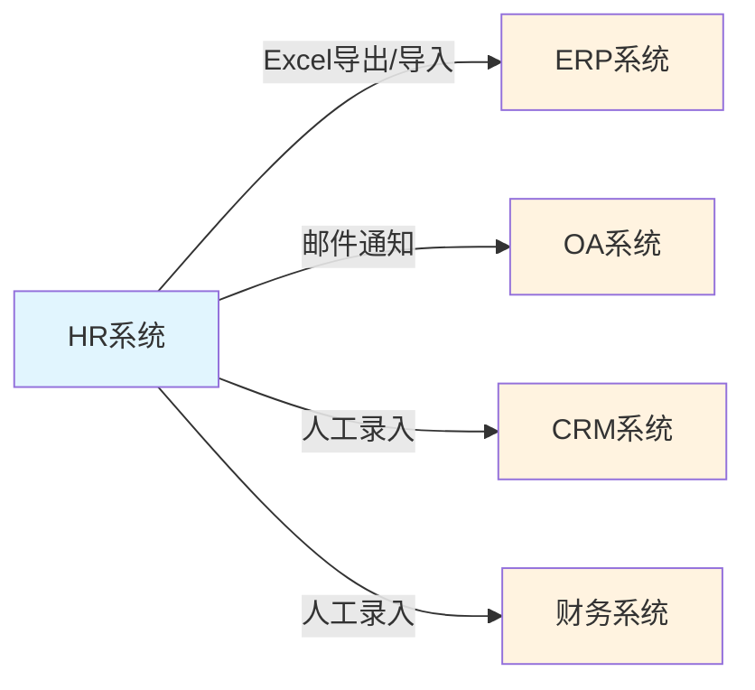
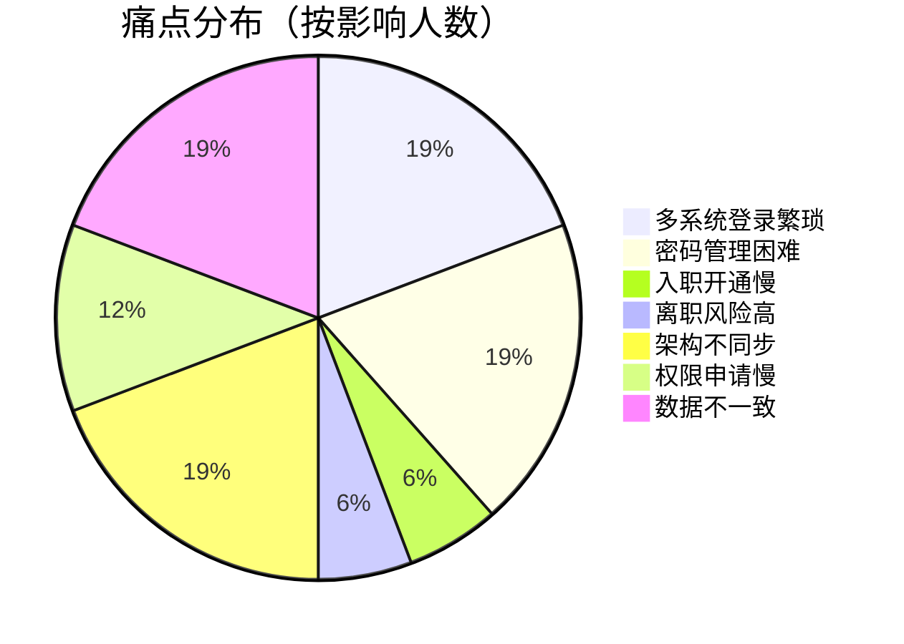
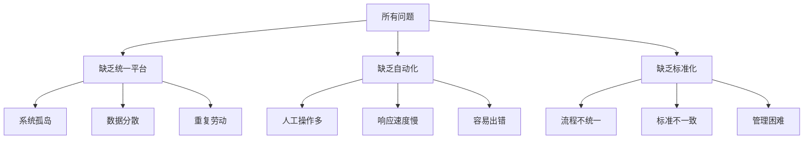

# System 平台项目 - 现状调研报告

**文档编号：** SYS-BRD-CS-001  
**版本：** 1.0  
**日期：** 2026-03-08  
**编制：** 项目经理  
**审核：** 待审核

---

## 一、执行摘要

### 1.1 调研背景

为全面了解公司现有用户管理现状，识别存在的问题和改进机会，为 System 平台（统一用户权限管理平台）的建设提供决策依据，项目组于2026年2月至3月开展了现状调研工作。

### 1.2 调研范围

- **调研对象**：公司全体员工（523人）及5个核心业务系统
- **调研内容**：现有系统使用情况、业务流程、痛点问题、数据质量
- **调研方法**：用户访谈、流程梳理、数据分析、现场观察

### 1.3 核心发现

| 维度 | 现状 | 问题严重程度 |
|-----|------|------------|
| **系统现状** | 5个独立系统，账号分散管理 | 高 |
| **流程效率** | 入职2-3天、离职1-2天、密码重置2-4小时 | 高 |
| **数据质量** | 跨系统数据不一致率15% | 中 |
| **安全风险** | 离职账号禁用不及时，存在遗漏 | 高 |
| **运维成本** | 月均83小时人工处理 | 高 |

### 1.4 关键建议

**建议立即启动 System 平台建设**，预计可实现：
- 年节省成本：**58.2万元**
- 效率提升：**10-50倍**
- 风险降低：**显著降低数据泄露和合规风险**

---

## 二、现有系统现状

### 2.1 系统架构概览

```
┌─────────────────────────────────────────────────────────────┐
│                      现有系统架构                            │
├─────────────────────────────────────────────────────────────┤
│                                                             │
│   ┌─────────┐   ┌─────────┐   ┌─────────┐   ┌─────────┐    │
│   │  HR系统  │   │ ERP系统 │   │ CRM系统 │   │ OA系统  │    │
│   │ (源头)   │   │         │   │         │   │         │    │
│   │ 523人   │   │ 480人   │   │ 120人   │   │ 523人   │    │
│   └────┬────┘   └────┬────┘   └────┬────┘   └────┬────┘    │
│        │             │             │             │          │
│        │  手动同步   │  手动同步   │  手动同步   │          │
│        │  (延迟)     │  (延迟)     │  (延迟)     │          │
│        │             │             │             │          │
│        └─────────────┴─────────────┴─────────────┘          │
│                      │                                       │
│                      ▼                                       │
│              ┌─────────────┐                                 │
│              │  财务系统   │                                 │
│              │   45人     │                                 │
│              └─────────────┘                                 │
│                                                             │
│   问题：各系统独立，数据孤岛，人工维护，延迟严重              │
└─────────────────────────────────────────────────────────────┘
```

### 2.2 各系统现状详情

| 系统 | 用户数 | 主要功能 | 管理方式 | 更新频率 | 主要问题 |
|-----|-------|---------|---------|---------|---------|
| **HR系统** | 523 | 员工信息、组织架构 | 源头系统 | 实时 | 数据无法自动同步 |
| **ERP系统** | 480 | 企业资源计划 | 独立管理 | 手动 | 与HR数据不一致 |
| **CRM系统** | 120 | 客户关系管理 | 独立管理 | 手动 | 销售人员账号管理难 |
| **OA系统** | 523 | 办公自动化 | 独立管理 | 手动 | 组织架构不同步 |
| **财务系统** | 45 | 财务管理 | 独立管理 | 手动 | 安全要求高但分散 |

### 2.3 系统集成现状

**当前集成方式**：无自动集成，全靠人工维护



**集成问题：**
- 无实时同步机制
- 数据格式不统一
- 人工操作易出错
- 同步延迟2-5天

---

## 三、业务流程现状

### 3.1 核心流程现状汇总

| 流程 | 当前方式 | 平均耗时 | 涉及人数 | 主要痛点 |
|-----|---------|---------|---------|---------|
| **用户入职** | 人工逐个开通 | 2-3天 | 新员工+多管理员 | 流程长、易遗漏 |
| **用户离职** | 人工逐个禁用 | 1-2天 | 多管理员 | 响应慢、风险高 |
| **密码重置** | 联系管理员 | 2-4小时 | 用户+管理员 | 等待时间长 |
| **权限申请** | 纸质/邮件审批 | 2-5天 | 申请人+多级审批 | 审批慢、不透明 |
| **架构同步** | 各系统分别调整 | 2-5天 | 多管理员 | 容易不一致 |

### 3.2 流程效率对比

```
┌─────────────────────────────────────────────────────────────┐
│                 流程效率现状 vs 目标                         │
├─────────────────────────────────────────────────────────────┤
│                                                             │
│  入职流程                                                  │
│  现状 ████████████████████████████████████░░░░░░  2-3天    │
│  目标 ██░░░░░░░░░░░░░░░░░░░░░░░░░░░░░░░░░░░░░░░░  实时     │
│                                                             │
│  离职流程                                                  │
│ 现状 ██████████████████████████████░░░░░░░░░░░░░  1-2天    │
│  目标 ██░░░░░░░░░░░░░░░░░░░░░░░░░░░░░░░░░░░░░░░░  实时     │
│                                                             │
│  密码重置                                                  │
│  现状 ████████████████████████████████████████░░  2-4小时  │
│  目标 █░░░░░░░░░░░░░░░░░░░░░░░░░░░░░░░░░░░░░░░░░  5分钟    │
│                                                             │
│  权限申请                                                  │
│  现状 ████████████████████████████████████████░░  2-5天    │
│  目标 ████░░░░░░░░░░░░░░░░░░░░░░░░░░░░░░░░░░░░░░  小时级   │
│                                                             │
└─────────────────────────────────────────────────────────────┘
```

---

## 四、痛点与问题分析

### 4.1 痛点分布



### 4.2 核心痛点详解

#### P0级痛点（最高优先级）

| 序号 | 痛点 | 影响范围 | 当前损失 | 风险等级 |
|-----|------|---------|---------|---------|
| 1 | **多系统登录繁琐** | 全员500+人 | 年损失200万 | 中 |
| 2 | **密码管理困难** | 全员500+人 | 年损失20万 | 中 |
| 3 | **入职开通慢** | 新员工 | 年损失10万 | 低 |
| 4 | **离职风险高** | 离职员工 | 风险不可估量 | **高** |
| 5 | **架构不同步** | 全员500+人 | 年损失15万 | 中 |

### 4.3 问题根因分析



**根因总结：**
1. **技术层面**：各系统独立建设，缺乏统一规划
2. **管理层面**：缺乏统一的用户管理规范和流程
3. **资源层面**：IT人员不足，无法支撑大量人工维护工作

---

## 五、数据质量分析

### 5.1 数据一致性分析

| 数据项 | HR系统 | ERP系统 | CRM系统 | OA系统 | 一致率 |
|-------|-------|--------|--------|-------|-------|
| 员工编号 | 523 | 480 | 120 | 523 | 92% |
| 姓名 | 523 | 478 | 119 | 520 | 95% |
| 部门 | 523 | 465 | 115 | 510 | 88% |
| 手机号 | 497 | 480 | 118 | 515 | 94% |
| 邮箱 | 444 | 420 | 105 | 480 | 85% |

**整体数据一致率：约85%**

### 5.2 数据质量问题影响

| 问题类型 | 影响范围 | 业务影响 | 技术影响 |
|---------|---------|---------|---------|
| 数据不一致 | 跨系统用户 | 审批流程卡死 | 集成困难 |
| 数据缺失 | 联系方式 | 无法通知用户 | 同步失败 |
| 数据延迟 | 组织架构 | 报表统计错误 | 缓存失效 |

---

## 六、成本与效率分析

### 6.1 当前运维成本

| 工作项 | 频率 | 单次耗时 | 月度耗时 | 年度成本 |
|-------|------|---------|---------|---------|
| 账号开通 | 12人/月 | 2小时 | 24小时 | 7.2万 |
| 账号禁用 | 9人/月 | 1小时 | 9小时 | 2.7万 |
| 密码重置 | 40次/周 | 30分钟 | 20小时 | 6.0万 |
| 权限配置 | 30次/月 | 1小时 | 30小时 | 9.0万 |
| 架构同步 | 3次/月 | 4小时 | 12小时 | 3.6万 |
| **合计** | - | - | **95小时/月** | **28.5万/年** |

### 6.2 效率损失成本

| 损失项 | 计算方式 | 年度损失 |
|-------|---------|---------|
| 多系统登录 | 500人×4次/天×2分钟×250天 | 200万 |
| 等待审批 | 30次/月×2天×500元/天×12月 | 36万 |
| 新员工等待 | 15人/月×2天×500元/天×12月 | 18万 |
| **合计** | - | **254万/年** |

### 6.3 总成本分析

```
┌─────────────────────────────────────────────────────────────┐
│                    年度总成本分析                            │
├─────────────────────────────────────────────────────────────┤
│                                                             │
│  直接运维成本                     效率损失成本               │
│  ┌─────────────────┐             ┌─────────────────┐       │
│  │ 账号管理   9.9万 │             │ 多系统登录 200万 │       │
│  │ 密码重置   6.0万 │             │ 等待审批    36万 │       │
│  │ 权限配置   9.0万 │             │ 新员工等待  18万 │       │
│  │ 架构同步   3.6万 │             │                 │       │
│  │                 │             │                 │       │
│  │ 小计：    28.5万 │             │ 小计：     254万 │       │
│  └─────────────────┘             └─────────────────┘       │
│                                                             │
│                    年度总成本：282.5万元                     │
│                                                             │
└─────────────────────────────────────────────────────────────┘
```

---

## 七、风险评估

### 7.1 安全风险

| 风险项 | 风险等级 | 风险描述 | 潜在影响 |
|-------|---------|---------|---------|
| **离职账号遗漏** | 高 | 离职员工账号未及时禁用 | 数据泄露、恶意操作 |
| **权限失控** | 中 | 权限分配缺乏审计 | 越权访问 |
| **密码泄露** | 中 | 明文传输、简单密码 | 账号被盗 |
| **合规风险** | 高 | 等保三级要求不达标 | 监管处罚 |

### 7.2 业务风险

| 风险项 | 风险等级 | 风险描述 | 潜在影响 |
|-------|---------|---------|---------|
| **流程中断** | 中 | 组织架构不同步导致审批卡死 | 业务停滞 |
| **数据错误** | 中 | 多系统数据不一致 | 决策失误 |
| **效率低下** | 高 | 大量人工操作 | 竞争力下降 |

---

## 八、改进建议

### 8.1 建设目标

建设 System 统一用户权限管理平台，实现：
1. **统一认证**：单点登录，一次登录访问所有系统
2. **统一管理**：用户、组织架构一处维护，处处同步
3. **自动化**：入职、离职、调岗自动化处理
4. **标准化**：统一的权限管理规范和流程

### 8.2 实施路线图

```
┌─────────────────────────────────────────────────────────────┐
│                    System 平台建设路线图                     │
├─────────────────────────────────────────────────────────────┤
│                                                             │
│  Phase 1（1-2月）          Phase 2（3-4月）                 │
│  ┌──────────────┐         ┌──────────────┐                 │
│  │ • 统一认证中心 │         │ • 用户管理模块 │                 │
│  │ • 单点登录    │         │ • 组织架构管理 │                 │
│  │ • 基础集成    │         │ • 角色权限管理 │                 │
│  └──────────────┘         └──────────────┘                 │
│         ↓                        ↓                         │
│  Phase 3（5-6月）          Phase 4（7-8月）                 │
│  ┌──────────────┐         ┌──────────────┐                 │
│  │ • 自动化流程  │         │ • 全面上线    │                 │
│  │ • 数据同步    │         │ • 优化完善    │                 │
│  │ • 审计日志    │         │ • 培训推广    │                 │
│  └──────────────┘         └──────────────┘                 │
│                                                             │
└─────────────────────────────────────────────────────────────┘
```

### 8.3 预期收益

| 收益类型 | 当前状态 | 目标状态 | 提升幅度 |
|---------|---------|---------|---------|
| **登录效率** | 每天4+次 | 每天1次 | 4倍 |
| **入职开通** | 2-3天 | 实时 | 数十倍 |
| **离职禁用** | 1-2天 | 实时 | 数十倍 |
| **密码重置** | 2-4小时 | 5分钟 | 24-48倍 |
| **权限审批** | 2-5天 | 小时级 | 10-50倍 |
| **年度节省** | - | - | **58.2万元** |

---

## 九、结论与建议

### 9.1 核心结论

1. **问题明确**：现有用户管理方式存在严重效率问题和安全风险
2. **需求迫切**：全员500+人受影响，年损失282.5万元
3. **方案可行**：System 平台建设技术成熟，实施路径清晰
4. **收益显著**：预计年节省58.2万元，效率提升10-50倍

### 9.2 行动建议

**建议立即启动 System 平台项目，理由如下：**

1. **业务价值高**：解决全员痛点，显著提升工作效率
2. **风险可控**：降低数据泄露和合规风险
3. **投资回报高**：一次性投入，长期收益
4. **技术可行**：基于成熟技术方案，实施风险低

### 9.3 下一步工作

1. **启动项目立项**：编制项目建议书，申请立项
2. **技术预研**：调研技术方案，确定架构设计
3. **详细设计**：基于本报告进行详细需求设计
4. **开发实施**：按照路线图分阶段实施

---

## 十、附录

### 10.1 调研过程文档

| 序号 | 文档名称 | 路径 |
|-----|---------|------|
| 1 | 用户访谈计划 | `01-user-interview-records/01-interview-plan.md` |
| 2 | 用户访谈纪要 | `01-user-interview-records/05-interview-minutes.md` |
| 3 | 现有系统文档 | `01-existing-systems-docs/` |
| 4 | 业务流程文档 | `02-business-process-flow/` |
| 5 | 痛点分析文档 | `03-pain-points-analysis.md` |
| 6 | 数据样本 | `04-business-data-samples/` |
| 7 | 瓶颈分析 | `05-process-bottleneck-analysis.md` |

### 10.2 调研参与人员

- **调研负责人**：项目经理
- **参与访谈**：CEO、IT总监、行政经理、各部门负责人、关键用户
- **数据支持**：各系统管理员

---

**报告编制完成日期：** 2026-03-08  
**报告审核状态：** 待审核  
**报告分发范围：** 项目决策委员会、项目管理团队
