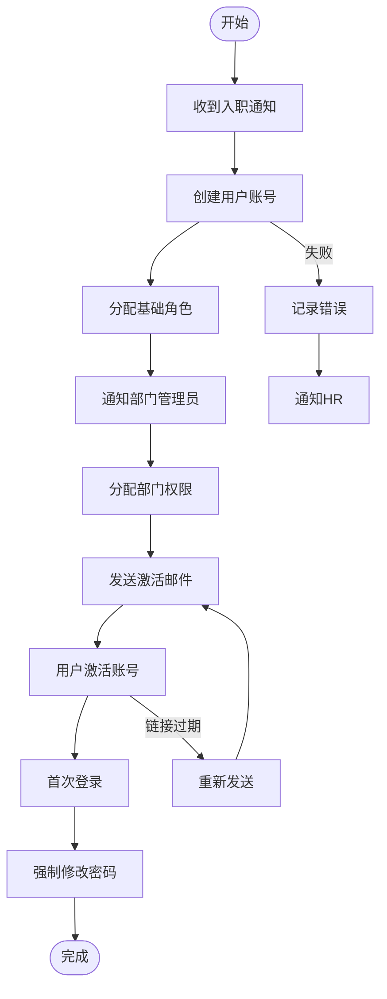
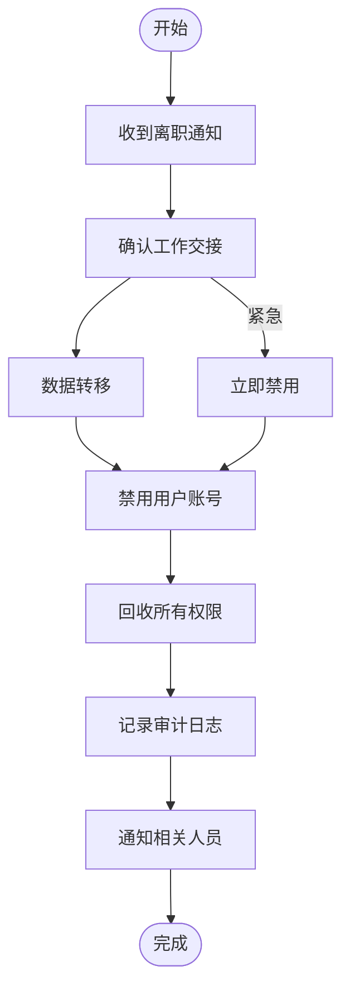
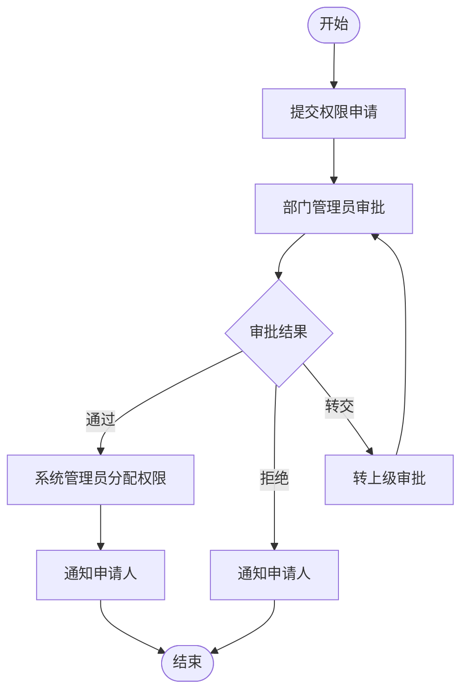
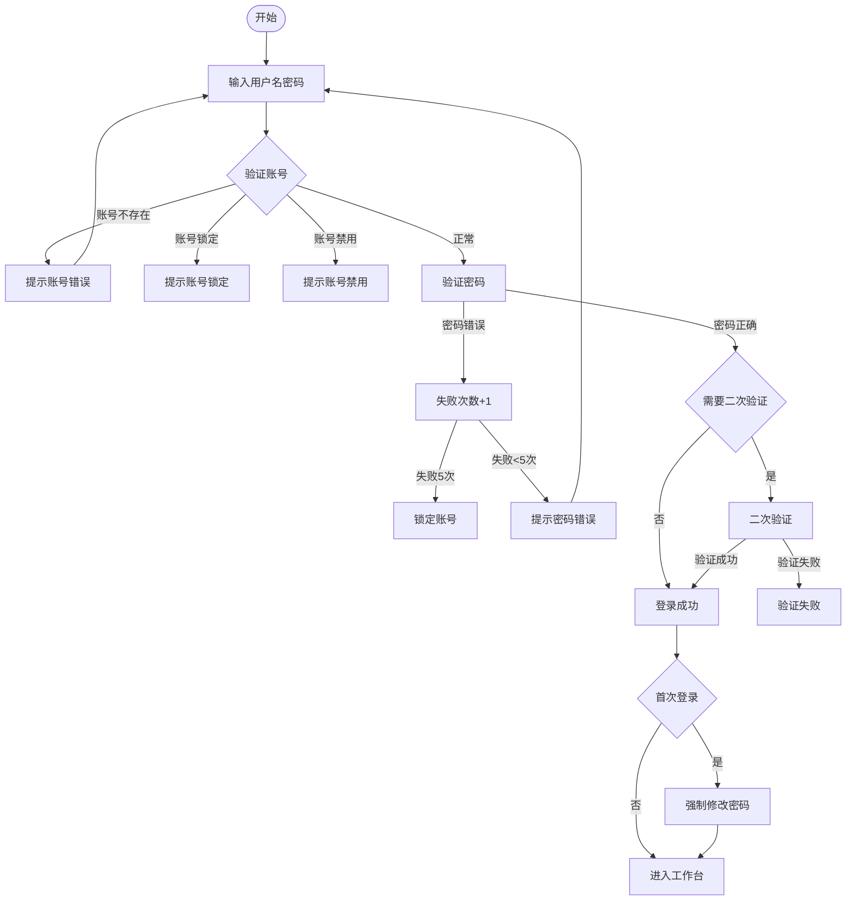
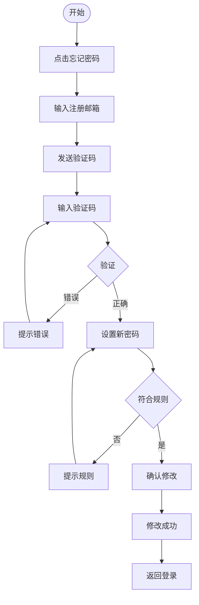
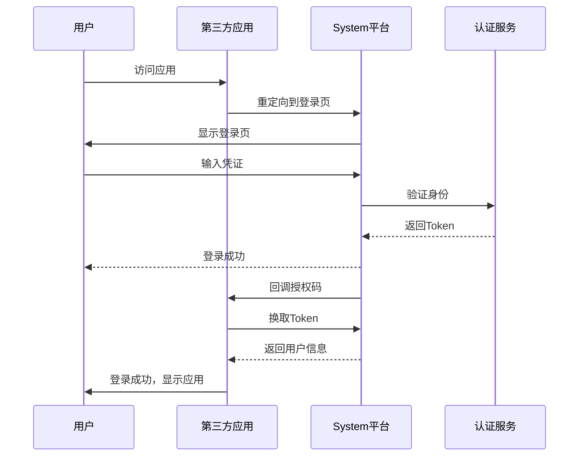

# 业务流程图

**文档编号：** SYS-RA-BP-006  
**版本：** 1.0  
**日期：** 2026-03-08  
**编制：** 项目经理

---

## 一、流程图说明

本文档使用Mermaid语法绘制业务流程图，可导出为图片使用。

---

## 二、用户入职流程图

---

## 三、用户离职流程图

---

## 四、权限申请流程图

---

## 五、用户登录流程图

---

## 六、密码重置流程图

---

## 七、SSO登录流程图

---

## 八、流程图文件

以上流程图已保存为独立的 `.mmd` 文件，可导出为图片：

| 流程 | MMD文件 | PNG文件 |
|-----|---------|---------|
| 用户入职 | `user-onboarding-process.mmd` | `user-onboarding-process.png` |
| 用户离职 | `user-offboarding-process.mmd` | `user-offboarding-process.png` |
| 权限申请 | `permission-application-process.mmd` | `permission-application-process.png` |
| 用户登录 | `user-login-process.mmd` | `user-login-process.png` |
| 密码重置 | `password-reset-process.mmd` | `password-reset-process.png` |
| SSO登录 | `sso-login-process.mmd` | `sso-login-process.png` |

---

**文档整理时间：** 2026-03-08
