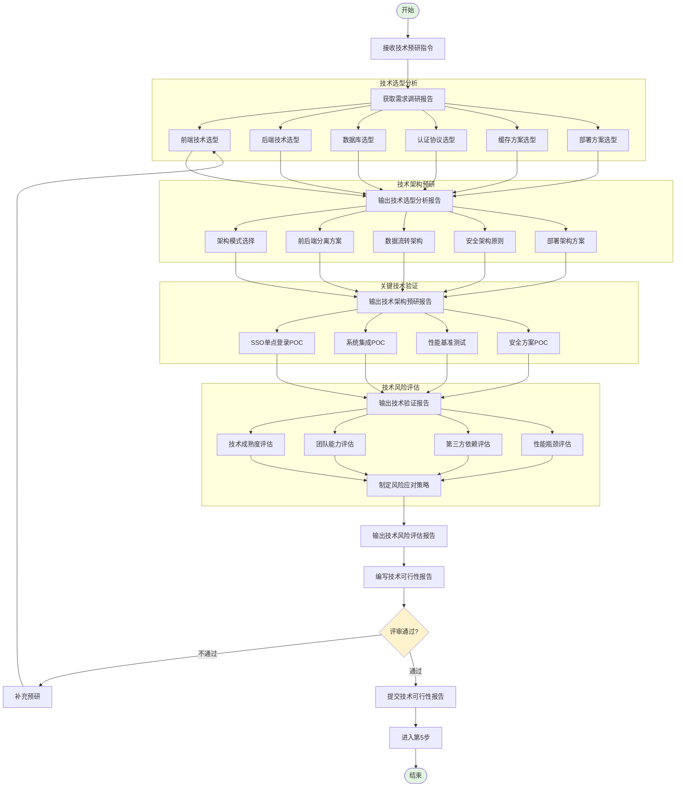

# 技术预研流程图

**文档编号：** SYS-TR-PD-001  
**版本：** 1.0  
**日期：** 2026-03-10  
**编制：** 系统架构师  
**审核：** 待审核

---

## 流程说明

本文档描述了技术预研阶段（第4步-技术选型与POC）的完整工作流程。

---

## 流程图



---

## 阶段说明

### 一、准备阶段

| 步骤 | 任务 | 输入 | 输出 |
|-----|------|------|------|
| 1 | 接收技术预研指令 | 第3步指令 | 预研任务书 |
| 2 | 获取需求调研报告 | 第2步输出 | 需求理解 |

### 二、技术选型分析

| 步骤 | 任务 | 输出文档 |
|-----|------|---------|
| 3 | 前端技术选型（Vue3 vs React vs Angular） | `01-frontend-selection.md` |
| 4 | 后端技术选型（Spring Boot vs Node.js vs Go） | `02-backend-selection.md` |
| 5 | 数据库选型（MySQL vs PostgreSQL） | `03-database-selection.md` |
| 6 | 认证协议选型（OAuth2.0 vs OIDC vs SAML） | `04-auth-protocol-selection.md` |
| 7 | 缓存方案选型（Redis vs Memcached） | `05-cache-selection.md` |
| 8 | 部署方案选型（Docker vs 传统部署） | `06-deployment-selection.md` |
| 9 | 汇总技术选型分析 | `00-technology-selection-summary.md` |

### 三、技术架构预研

| 步骤 | 任务 | 输出文档 |
|-----|------|---------|
| 10 | 架构模式选择（单体 vs 微服务） | `01-architecture-pattern.md` |
| 11 | 前后端分离架构方案 | `02-frontend-backend-separation.md` |
| 12 | 数据流转架构方案 | `03-data-flow-architecture.md` |
| 13 | 安全架构基本原则 | `04-security-architecture.md` |
| 14 | 部署架构初步方案 | `05-deployment-architecture.md` |
| 15 | 汇总技术架构预研 | `00-architecture-research-summary.md` |

### 四、关键技术验证（POC）

| 步骤 | 任务 | 输出文档 |
|-----|------|---------|
| 16 | SSO单点登录POC验证 | `01-sso-poc-report.md` |
| 17 | 与现有系统集成POC验证 | `02-integration-poc-report.md` |
| 18 | 性能基准测试验证 | `03-performance-poc-report.md` |
| 19 | 安全方案POC验证 | `04-security-poc-report.md` |
| 20 | 汇总技术验证报告 | `00-technical-validation-summary.md` |

### 五、技术风险评估

| 步骤 | 任务 | 输出文档 |
|-----|------|---------|
| 21 | 技术成熟度风险评估 | `01-technology-maturity-risk.md` |
| 22 | 团队技术能力风险评估 | `02-team-capability-risk.md` |
| 23 | 第三方依赖风险评估 | `03-third-party-risk.md` |
| 24 | 性能瓶颈风险评估 | `04-performance-risk.md` |
| 25 | 制定风险应对策略 | `05-risk-mitigation-strategy.md` |
| 26 | 汇总技术风险评估 | `00-risk-assessment-summary.md` |

### 六、总结阶段

| 步骤 | 任务 | 输出文档 | 去向 |
|-----|------|---------|------|
| 27 | 编写技术可行性报告 | `01-technical-feasibility-report.md` | 第5步 |
| 28 | 技术预研评审 | 评审意见 | - |
| 29 | 提交技术可行性报告 | 终版报告 | 第5步 |

---

## 评审节点

### 技术预研评审

```
编写技术可行性报告
         ↓
     技术预研评审
         ↓
     评审通过?
     ├─ 是 → 提交技术可行性报告 → 进入第5步
     └─ 否 → 补充预研 → 重新编写报告
```

### 评审内容

| 评审项 | 评审标准 |
|--------|---------|
| 技术选型 | 有充分对比分析，选型理由充分 |
| 架构设计 | 架构方向明确，满足需求 |
| POC验证 | 关键技术已通过验证 |
| 风险评估 | 风险已识别并有应对策略 |

---

## 相关文档

| 文档 | 路径 |
|-----|------|
| 流程图源文件 | `technical-research-process.mmd` |
| 技术预研检查清单 | `../technical-research-checklist.md` |
| 技术选型分析报告 | `../../01-technology-selection/00-technology-selection-summary.md` |
| 技术架构预研报告 | `../../02-architecture-research/00-architecture-research-summary.md` |
| 技术验证报告 | `../../03-technical-validation/00-technical-validation-summary.md` |
| 技术风险评估报告 | `../../04-risk-assessment/00-risk-assessment-summary.md` |
| 技术可行性报告 | `../../05-technical-feasibility-report/01-technical-feasibility-report.md` |

---

**文档版本历史**

| 版本 | 日期 | 修改内容 | 修改人 |
|-----|------|---------|--------|
| 1.0 | 2026-03-10 | 初始版本 | 系统架构师 |
