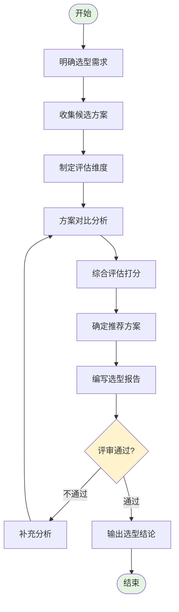

# 技术选型流程标准

**文档编号：** SYS-TR-PS-001  
**版本：** 1.0  
**日期：** 2026-03-10  
**编制：** 系统架构师  
**审核：** 待审核

---

## 1. 流程概述

技术选型是技术预研阶段的核心工作之一，通过对不同技术方案的对比分析，选择最适合项目需求的技术栈。

---

## 2. 技术选型流程

### 2.1 流程图



---

## 3. 详细步骤

### 步骤1：明确选型需求

**输入：**
- 需求调研报告
- 技术预研指令
- 现有系统技术栈

**任务：**
- 分析业务需求对技术的要求
- 识别技术约束条件
- 确定选型范围

**输出：**
- 选型需求说明书

---

### 步骤2：收集候选方案

**任务：**
- 调研业界主流技术方案（2-3个候选）
- 了解各方案的技术特点
- 收集社区评价和案例

**输出：**
- 候选方案清单

**常用技术选型领域：**

| 领域 | 常见候选方案 |
|-----|-------------|
| 前端框架 | Vue 3 / React / Angular |
| 后端框架 | Spring Boot / Node.js / Go |
| 数据库 | MySQL / PostgreSQL / MongoDB |
| 缓存 | Redis / Memcached |
| 认证协议 | OAuth 2.0 / OIDC / SAML |
| 部署方案 | Docker / K8s / 传统部署 |

---

### 步骤3：制定评估维度

**通用评估维度：**

| 维度 | 说明 | 权重建议 |
|-----|------|---------|
| 团队熟悉度 | 团队对该技术的掌握程度 | 20-25% |
| 生态成熟度 | 社区活跃度、工具链完善度 | 15-20% |
| 性能表现 | 是否满足性能需求 | 15-20% |
| 与现有系统集成 | 与现有系统的兼容性 | 15-20% |
| 开发效率 | 开发速度和维护成本 | 10-15% |
| 长期维护 | 技术发展前景、人才招聘 | 10-15% |

---

### 步骤4：方案对比分析

**分析内容：**

#### 4.1 技术特点分析
- 核心特性
- 架构设计
- 适用场景

#### 4.2 优势分析
- 技术优势
- 生态优势
- 团队优势

#### 4.3 劣势分析
- 技术局限
- 生态不足
- 团队短板

#### 4.4 适用场景
- 最佳适用场景
- 不适用场景

---

### 步骤5：综合评估打分

**评分标准（1-10分）：**

| 分数 | 说明 |
|-----|------|
| 9-10 | 优秀，强烈推荐 |
| 7-8 | 良好，推荐 |
| 5-6 | 一般，可用 |
| 3-4 | 较差，不推荐 |
| 1-2 | 很差，避免使用 |

**评分表示例：**

| 评估维度 | 方案A | 方案B | 方案C | 权重 |
|---------|-------|-------|-------|------|
| 团队熟悉度 | 9 | 6 | 4 | 25% |
| 生态成熟度 | 9 | 9 | 7 | 20% |
| 性能表现 | 8 | 9 | 9 | 15% |
| 与现有系统集成 | 9 | 5 | 5 | 20% |
| 开发效率 | 9 | 7 | 6 | 10% |
| 长期维护 | 9 | 9 | 7 | 10% |
| **综合得分** | **8.9** | **7.3** | **6.1** | 100% |

---

### 步骤6：确定推荐方案

**选型结论要素：**
1. 推荐方案名称
2. 选型理由（3-5条）
3. 技术栈组合
4. 风险与应对
5. 下一步行动

---

### 步骤7：编写选型报告

**报告结构：**

```
1. 选型背景
2. 候选方案
   2.1 方案一：XXX
   2.2 方案二：XXX
   2.3 方案三：XXX
3. 评估对比
4. 选型结论
5. 风险与应对
6. 下一步行动
```

---

### 步骤8：评审与确认

**评审检查项：**
- [ ] 候选方案是否充分（至少2-3个）
- [ ] 评估维度是否合理
- [ ] 打分是否客观公正
- [ ] 选型理由是否充分
- [ ] 风险识别是否全面

**评审角色：**
- 技术负责人
- 架构师
- 项目经理

---

## 4. 输出文档

### 4.1 单个技术选型文档

| 序号 | 文档名称 | 命名规范 |
|-----|---------|---------|
| 1 | 前端技术选型 | `01-frontend-selection.md` |
| 2 | 后端技术选型 | `02-backend-selection.md` |
| 3 | 数据库选型 | `03-database-selection.md` |
| 4 | 认证协议选型 | `04-auth-protocol-selection.md` |
| 5 | 缓存方案选型 | `05-cache-selection.md` |
| 6 | 部署方案选型 | `06-deployment-selection.md` |

### 4.2 汇总报告

| 文档名称 | 命名规范 |
|---------|---------|
| 技术选型分析报告（汇总） | `00-technology-selection-summary.md` |

---

## 5. 最佳实践

### 5.1 选型原则

1. **团队优先**：优先选择团队熟悉的技术
2. **成熟稳定**：优先选择生态成熟的技术
3. **适度超前**：可以引入新技术，但需控制风险
4. **成本可控**：考虑学习成本、运维成本、招聘成本

### 5.2 避坑指南

1. **避免盲目追新**：新技术风险高，需谨慎评估
2. **避免过度设计**：不要为了技术而技术
3. **避免单一维度**：不能只看性能，要综合评估
4. **避免忽视团队**：技术再好，团队不会用也是白搭

### 5.3 文档规范

1. **客观公正**：对比分析要客观，不能预设立场
2. **数据支撑**：评估打分要有依据
3. **理由充分**：选型结论要有说服力
4. **风险前置**：提前识别风险，制定应对措施

---

## 6. 模板与工具

### 6.1 文档模板

技术选型文档模板位于：`../templates/technology-selection-template.md`

### 6.2 评估工具

- 评分表：Excel评分表
- 决策矩阵：加权评分法

---

## 7. 相关文档

| 文档 | 路径 |
|-----|------|
| 技术预研检查清单 | `../technical-research-checklist.md` |
| 技术选型汇总报告 | `../../01-technology-selection/00-technology-selection-summary.md` |
| 技术预研流程图 | `../01-process-diagrams/technical-research-process.md` |

---

**文档版本历史**

| 版本 | 日期 | 修改内容 | 修改人 |
|-----|------|---------|--------|
| 1.0 | 2026-03-10 | 初始版本 | 系统架构师 |
