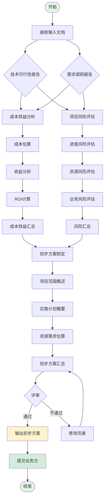

# 项目可行性流程图

本文档展示项目可行性分析的完整流程。

## 流程图

## 流程说明

### 1. 输入阶段
- **接收输入文档**：获取技术可行性报告和需求调研报告

### 2. 分析阶段
- **成本效益分析**：评估项目的投入产出比
  - 成本估算
  - 收益分析
  - ROI计算
  - 成本效益汇总

- **项目风险评估**：识别和评估项目风险
  - 进度风险评估
  - 资源风险评估
  - 业务风险评估
  - 风险汇总

### 3. 方案制定阶段
- **初步方案制定**：基于分析结果制定项目方案
  - 项目范围概述
  - 实施计划概要
  - 资源需求估算
  - 初步方案汇总

### 4. 评审阶段
- **评审**：对方案进行评审
  - 通过：输出初步方案
  - 不通过：修改完善后重新汇总

### 5. 输出阶段
- **输出初步方案**：形成最终的项目可行性方案
- **提交业务方**：将方案提交给业务方审批
