# 项目章程制定流程说明

**文档编号**：SYS-PI-PC-PROCESS  
**版本**：1.0  
**日期**：2026-03-10  
**状态**：已发布

---

## 1. 流程概述

### 1.1 流程定位
项目章程制定流程是项目立项阶段的第一步，用于正式授权项目的存在，并为项目经理提供授权使用组织资源开展项目活动的权力。

### 1.2 流程目标
- 明确项目的基本信息和边界
- 定义项目的目标和成功标准
- 识别项目干系人和约束条件
- 获得项目发起人的正式批准

### 1.3 流程范围
涵盖从项目启动到项目章程发布的全过程，共9个主要步骤。

---

## 2. 流程图说明

```mermaid
flowchart TD
    Start([开始]) --> Step1[步骤1：项目基本信息定义]
    
    Step1 --> Step1_Review{项目经理审核}
    Step1_Review -->|通过| Step2[步骤2：项目目标定义]
    Step1_Review -->|不通过| Step1
    
    Step2 --> Step2_Review{业务负责人审核}
    Step2_Review -->|通过| Step3[步骤3：项目范围界定]
    Step2_Review -->|不通过| Step2
    
    Step3 --> Step3_Review{项目团队评审}
    Step3_Review -->|通过| Step4[步骤4：干系人识别]
    Step3_Review -->|不通过| Step3
    
    Step4 --> Step4_Review{项目经理审核}
    Step4_Review -->|通过| Step5[步骤5：项目约束与假设识别]
    Step4_Review -->|不通过| Step4
    
    Step5 --> Step5_Review{各职能负责人审核}
    Step5_Review -->|通过| Step6[步骤6：项目风险初步识别]
    Step5_Review -->|不通过| Step5
    
    Step6 --> Step6_Review{项目团队评审}
    Step6_Review -->|通过| Step7[步骤7：项目里程碑定义]
    Step6_Review -->|不通过| Step6
    
    Step7 --> Step7_Review{项目经理审核}
    Step7_Review -->|通过| Step8[步骤8：项目资源需求估算]
    Step7_Review -->|不通过| Step7
    
    Step8 --> Step8_Review1{技术负责人审核}
    Step8_Review1 -->|通过| Step8_Review2{财务负责人审核}
    Step8_Review1 -->|不通过| Step8
    Step8_Review2 -->|通过| Step9[步骤9：项目章程汇总与审批]
    Step8_Review2 -->|不通过| Step8
    
    Step9 --> Step9_Review1{团队评审}
    Step9_Review1 -->|通过| Step9_Review2{技术审核}
    Step9_Review2 -->|通过| Step9_Review3{业务审核}
    Step9_Review3 -->|通过| Step9_Review4{财务审核}
    Step9_Review4 -->|通过| Step9_Review5{法务审核}
    Step9_Review5 -->|通过| Step9_Review6{发起人批准}
    
    Step9_Review1 -->|不通过| Step9
    Step9_Review2 -->|不通过| Step9
    Step9_Review3 -->|不通过| Step9
    Step9_Review4 -->|不通过| Step9
    Step9_Review5 -->|不通过| Step9
    Step9_Review6 -->|不通过| Step9
    
    Step9_Review6 -->|批准| End([项目章程发布])
```



---

## 3. 详细步骤说明

### 步骤1：项目基本信息定义

**输入**：
- 初步方案
- 业务需求文档

**活动**：
1. 确定项目名称和标识
2. 明确项目发起人
3. 指定项目经理
4. 定义项目起止时间
5. 确定项目预算范围

**审核**：项目经理审核

**输出**：
- 项目标识信息
- 项目授权书

---

### 步骤2：项目目标定义

**输入**：
- 业务方审核意见
- 业务需求文档

**活动**：
1. 明确业务目标（可量化）
2. 定义技术目标
3. 设定成功标准
4. 确定关键绩效指标（KPI）

**审核**：业务负责人审核

**输出**：
- 业务目标
- 成功标准

---

### 步骤3：项目范围界定

**输入**：
- 业务目标
- 需求规格说明

**活动**：
1. 定义项目范围说明
2. 明确范围边界（包含/不包含）
3. 识别主要交付物
4. 确定验收标准

**审核**：项目团队评审

**输出**：
- 项目范围说明
- 范围边界文档

---

### 步骤4：干系人识别

**输入**：
- 组织架构图
- 项目范围说明

**活动**：
1. 识别内部干系人
2. 识别外部干系人
3. 分析干系人影响力和利益
4. 制定干系人管理策略

**审核**：项目经理审核

**输出**：
- 干系人登记册

---

### 步骤5：项目约束与假设识别

**输入**：
- 技术调研报告
- 业务需求文档

**活动**：
1. 识别技术约束
2. 识别业务约束
3. 识别资源约束
4. 记录关键假设
5. 识别依赖关系

**审核**：各职能负责人审核

**输出**：
- 约束条件清单
- 假设日志

---

### 步骤6：项目风险初步识别

**输入**：
- 约束条件
- 假设日志

**活动**：
1. 识别技术风险
2. 识别业务风险
3. 识别资源风险
4. 评估风险概率和影响
5. 制定初步应对策略

**审核**：项目团队评审

**输出**：
- 风险登记册

---

### 步骤7：项目里程碑定义

**输入**：
- 项目范围
- 交付物清单

**活动**：
1. 定义主要里程碑
2. 设定里程碑时间节点
3. 明确里程碑交付物
4. 确定里程碑验收标准

**审核**：项目经理审核

**输出**：
- 里程碑计划

---

### 步骤8：项目资源需求估算

**输入**：
- 里程碑计划
- 工作分解结构（WBS）

**活动**：
1. 估算人力资源需求
2. 估算硬件资源需求
3. 估算软件资源需求
4. 估算外部资源需求
5. 编制资源需求计划

**审核**：
- 技术负责人审核（技术可行性）
- 财务负责人审核（预算合理性）

**输出**：
- 资源需求估算

---

### 步骤9：项目章程汇总与审批

**输入**：
- 前8个步骤的所有输出文档

**活动**：
1. 汇总项目章程文档
2. 编制执行摘要
3. 整理附件材料
4. 发起审批流程

**审批流程**：
1. 团队评审
2. 技术审核
3. 业务审核
4. 财务审核
5. 法务审核
6. 发起人批准

**输出**：
- 项目章程汇总
- 章程审批记录

---

## 4. 输入输出清单

### 4.1 输入文档

| 序号 | 输入项 | 来源 | 使用步骤 |
|-----|--------|------|---------|
| 1 | 初步方案 | 业务方 | 步骤1 |
| 2 | 业务方审核意见 | 业务部门 | 步骤2 |
| 3 | 技术调研报告 | 技术团队 | 步骤5 |
| 4 | 组织架构图 | HR部门 | 步骤4 |

### 4.2 输出文档

| 序号 | 输出项 | 文档编号 | 产生步骤 |
|-----|--------|---------|---------|
| 1 | 项目章程汇总 | SYS-PI-PC-000 | 步骤9 |
| 2 | 项目标识信息 | SYS-PI-PC-001 | 步骤1 |
| 3 | 项目授权书 | SYS-PI-PC-002 | 步骤1 |
| 4 | 业务目标 | SYS-PI-PC-003 | 步骤2 |
| 5 | 成功标准 | SYS-PI-PC-004 | 步骤2 |
| 6 | 项目范围说明 | SYS-PI-PC-005 | 步骤3 |
| 7 | 范围边界 | SYS-PI-PC-006 | 步骤3 |
| 8 | 干系人登记册 | SYS-PI-PC-007 | 步骤4 |
| 9 | 约束条件 | SYS-PI-PC-008 | 步骤5 |
| 10 | 假设日志 | SYS-PI-PC-009 | 步骤5 |
| 11 | 风险登记册 | SYS-PI-PC-010 | 步骤6 |
| 12 | 里程碑计划 | SYS-PI-PC-011 | 步骤7 |
| 13 | 资源需求估算 | SYS-PI-PC-012 | 步骤8 |
| 14 | 章程审批记录 | SYS-PI-PC-013 | 步骤9 |

---

## 5. 审核节点说明

### 5.1 审核流程图

```
步骤1 → 项目经理审核 → 步骤2 → 业务负责人审核 → 步骤3 → 项目团队评审 → 步骤4 → 项目经理审核 → 步骤5 → 各职能负责人审核 → 步骤6 → 项目团队评审 → 步骤7 → 项目经理审核 → 步骤8 → 技术负责人审核 → 财务负责人审核 → 步骤9 → 团队评审 → 技术审核 → 业务审核 → 财务审核 → 法务审核 → 发起人批准
```

### 5.2 审核标准

| 审核节点 | 审核人 | 审核重点 | 通过标准 |
|---------|--------|---------|---------|
| 项目经理审核 | 项目经理 | 信息完整性、准确性 | 无重大遗漏 |
| 业务负责人审核 | 业务负责人 | 业务目标合理性 | 符合业务战略 |
| 项目团队评审 | 项目团队 | 范围可行性 | 技术可实现 |
| 各职能负责人审核 | 职能负责人 | 约束合理性 | 资源可支持 |
| 技术负责人审核 | 技术负责人 | 技术可行性 | 方案可实施 |
| 财务负责人审核 | 财务负责人 | 预算合理性 | 预算可批准 |
| 发起人批准 | 项目发起人 | 整体可行性 | 值得投资 |

---

## 6. 角色与职责

| 角色 | 职责 |
|-----|------|
| 项目发起人 | 提供项目资金，批准项目章程，解决重大问题 |
| 项目经理 | 负责章程制定全过程，协调各方输入，组织审核流程 |
| 业务负责人 | 提供业务需求，审核业务目标和范围 |
| 技术负责人 | 评估技术可行性，审核技术方案和资源需求 |
| 财务负责人 | 审核预算合理性，控制项目成本 |
| 法务负责人 | 审核合规性，识别法律风险 |
| 项目团队 | 参与范围评审、风险识别、里程碑定义 |

---

## 7. 流程特点

### 7.1 迭代审核机制
- 每个步骤都有审核节点
- 审核不通过则返回修改
- 确保每个环节的质量

### 7.2 多维度审批
- 技术维度：技术负责人审核
- 业务维度：业务负责人审核
- 财务维度：财务负责人审核
- 法律维度：法务负责人审核

### 7.3 正式授权
- 最终由项目发起人批准
- 形成正式的项目授权文件
- 为后续项目活动提供依据

---

## 8. 注意事项

1. **文档完整性**：确保所有输入文档齐全
2. **审核及时性**：各审核节点应在2个工作日内完成
3. **修改记录**：每次修改都应记录变更原因
4. **签字完整**：所有审核节点必须签字确认
5. **版本控制**：文档变更应进行版本管理

---

## 9. 相关文档

- 项目章程制定工作清单
- 项目章程制定流程标准
- 项目章程制定Skill
- 商业论证与ROI分析流程

---

**文档版本历史**

| 版本 | 日期 | 修改内容 | 修改人 |
|-----|------|---------|--------|
| 1.0 | 2026-03-10 | 初始版本 | 项目经理 |

---

*本文档详细说明了项目章程制定的完整流程，用于指导项目立项工作。*
