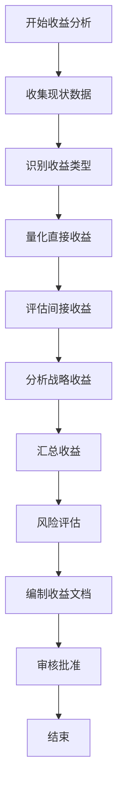

# 收益分析流程标准

**文档编号**：SYS-PI-BC-PS-002  
**版本**：1.0  
**日期**：2026-03-13  
**状态**：已批准

---

## 1. 流程概述

### 1.1 目的
规范System系统基础平台项目收益分析工作流程，确保收益分析全面、准确、可量化，为商业论证和投资决策提供可靠依据。

### 1.2 适用范围
适用于System系统基础平台项目的收益分析工作，包括直接收益、间接收益和战略收益的分析。

### 1.3 参考文档
- System系统基础平台项目章程（SYS-PI-PC-000）
- 成本分析流程标准（SYS-PI-BC-PS-001）
- 商业论证检查清单（business-case-checklist.md）

---

## 2. 收益分类体系

### 2.1 收益类型定义

| 收益类型 | 定义 | 量化难度 | 分析重点 |
|---------|------|---------|---------|
| **直接收益** | 可直接量化的财务收益 | 容易 | 效率提升、成本节约 |
| **间接收益** | 难以直接量化的收益 | 较难 | 数据质量、管理效率 |
| **战略收益** | 长期战略性收益 | 困难 | 数字化转型、竞争优势 |

### 2.2 收益分析维度

```
收益分析
├── 直接收益
│   ├── 效率提升收益
│   │   ├── 用户管理效率
│   │   ├── 权限申请效率
│   │   └── 密码重置效率
│   └── 人力节省收益
│       └── IT运维人力
├── 间接收益
│   ├── 数据质量提升
│   ├── 管理效率提升
│   ├── 员工体验提升
│   └── 技术架构收益
└── 战略收益
    ├── 数字化转型支撑
    ├── 组织能力建设
    ├── 竞争优势构建
    ├── 风险管理能力
    └── 生态体系建设
```

---

## 3. 收益分析流程

### 3.1 流程步骤



### 3.2 详细步骤说明

#### 步骤1：收集现状数据

**输入**：
- 项目章程
- 业务需求文档
- 现有系统使用情况

**活动**：
1. 收集现有系统用户数量
2. 统计月均入职/离职人数
3. 统计月均权限申请次数
4. 统计月均密码重置次数
5. 了解现有运维人员配置
6. 收集人力成本数据

**输出**：
- 现状数据收集表

#### 步骤2：识别收益类型

**活动**：
1. 根据项目性质识别适用的收益类型
2. 对于内部系统，重点关注：
   - 效率提升收益
   - 人力节省收益
   - 数据质量提升
   - 安全风险降低
3. 排除不适用的收益类型（如销售收入）

**输出**：
- 收益类型识别清单

#### 步骤3：量化直接收益

**活动**：
1. **用户管理效率提升**
   - 计算原人均处理时间
   - 计算新人均处理时间
   - 计算节省时间
   - 计算年节省成本

2. **权限申请效率提升**
   - 统计月均权限申请数
   - 计算原平均处理时间
   - 计算新平均处理时间
   - 计算年节省成本

3. **密码重置效率提升**
   - 统计月均密码重置数
   - 计算IT处理时间
   - 计算年节省成本

4. **IT运维人力节省**
   - 计算节省运维人员数
   - 计算年节省成本

**计算公式**：
```
年节省成本 = 月发生次数 × 单次节省时间 × 人力成本 × 12个月
```

**输出**：
- 直接收益计算表

#### 步骤4：评估间接收益

**活动**：
1. **数据质量提升**
   - 评估数据一致性改善价值
   - 评估数据安全性提升价值

2. **管理效率提升**
   - 评估组织架构管理效率
   - 评估决策支持改善价值

3. **员工体验提升**
   - 评估用户操作体验改善
   - 评估管理员工作效率

4. **技术架构收益**
   - 评估避免重复建设价值
   - 评估降低维护成本价值

**评估方法**：
- 对比分析法
- 专家评估法
- 历史数据参考法

**输出**：
- 间接收益评估表

#### 步骤5：分析战略收益

**活动**：
1. **数字化转型支撑**
   - 分析基础设施价值
   - 分析数据驱动决策价值

2. **组织能力建设**
   - 分析IT治理能力提升
   - 分析组织敏捷性提升

3. **竞争优势构建**
   - 分析技术领先优势
   - 分析运营效率优势

4. **风险管理能力**
   - 分析安全风险降低
   - 分析业务连续性保障

5. **生态体系建设**
   - 分析内部生态价值
   - 分析长期发展潜力

**输出**：
- 战略收益分析报告

#### 步骤6：汇总收益

**活动**：
1. 汇总各类收益
2. 计算年度总收益
3. 计算3年/5年累计收益
4. 分析收益构成

**输出**：
- 收益汇总表

#### 步骤7：风险评估

**活动**：
1. 识别收益实现风险
   - 用户接受度风险
   - 系统稳定性风险
   - 推广进度风险

2. 评估风险影响
3. 制定应对措施
4. 计算风险调整后收益

**输出**：
- 收益风险评估表

#### 步骤8：编制收益文档

**文档清单**：
1. 直接收益分析（04-benefit-direct.md）
2. 间接收益分析（05-benefit-indirect.md）
3. 战略收益分析（06-benefit-strategic.md）

**文档内容要求**：
- 分析假设明确
- 计算方法清晰
- 数据来源可靠
- 风险评估充分

#### 步骤9：审核批准

**审核要点**：
1. 数据准确性
2. 计算方法合理性
3. 假设条件合理性
4. 风险评估充分性

**审批流程**：
- 编制人：产品经理
- 审核人：财务负责人/战略负责人
- 批准人：项目发起人

---

## 4. 收益计算方法

### 4.1 效率提升收益计算

**公式**：
```
年节省成本 = 月发生次数 × (原时间 - 新时间) × 人力成本 × 12
```

**示例**：
| 项目 | 数值 |
|-----|------|
| 月均权限申请 | 200次 |
| 原处理时间 | 4小时 |
| 新处理时间 | 1小时 |
| 节省时间 | 3小时 |
| 人力成本 | 80元/小时 |
| 月节省 | 200 × 3 × 80 = 48,000元 |
| 年节省 | 48,000 × 12 = 57.6万元 |

### 4.2 人力节省收益计算

**公式**：
```
年节省成本 = 节省人数 × 人均年成本
```

**示例**：
| 项目 | 数值 |
|-----|------|
| 节省运维人员 | 2人 |
| 人均年成本 | 25万元 |
| 年节省 | 2 × 25 = 50万元 |

### 4.3 风险调整计算

**公式**：
```
风险调整后收益 = 预期收益 × 调整系数
```

**调整系数**：
| 场景 | 调整系数 |
|-----|---------|
| 乐观场景 | 100% |
| 基准场景 | 75-85% |
| 保守场景 | 50-70% |

---

## 5. 文档模板

### 5.1 直接收益分析模板

```markdown
# 直接收益分析

## 1. 效率提升收益

### 1.1 XXX效率提升

**现状问题**：
- 问题描述

**改善后**：
- 改善描述

**收益计算**：

| 指标 | 数值 |
|-----|------|
| 月发生次数 | XX次 |
| 原处理时间 | XX小时 |
| 新处理时间 | XX小时 |
| 节省时间 | XX小时 |
| 人力成本 | XX元/小时 |
| 月节省成本 | XX元 |
| 年节省成本 | XX万元 |

## 2. 人力节省收益

### 2.1 XXX人力节省

**现状**：
- 现状描述

**改善后**：
- 改善描述

**收益计算**：

| 指标 | 数值 |
|-----|------|
| 节省人数 | XX人 |
| 人均年成本 | XX万元 |
| 年节省成本 | XX万元 |

## 3. 直接收益汇总

| 收益类别 | 年收益（万元） |
|---------|---------------|
| 效率提升收益 | XX |
| 人力节省收益 | XX |
| **合计** | **XX** |
```

### 5.2 间接收益分析模板

```markdown
# 间接收益分析

## 1. XXX收益

### 1.1 现状问题
- 问题描述

### 1.2 改善后
- 改善描述

### 1.3 收益评估

| 收益项 | 说明 | 预估价值 |
|-------|------|---------|
| 收益1 | 说明 | XX万元/年 |
| 收益2 | 说明 | 难以量化 |

## 2. 间接收益汇总

| 收益类别 | 年收益（万元） |
|---------|---------------|
| XXX收益 | XX |
| **合计** | **XX** |
```

### 5.3 战略收益分析模板

```markdown
# 战略收益分析

## 1. XXX战略收益

### 1.1 战略价值
- 价值描述

### 1.2 收益评估

| 收益项 | 说明 | 价值 |
|-------|------|------|
| 收益1 | 说明 | XX万元/年 |
| 收益2 | 说明 | 战略价值高 |

## 2. 战略收益汇总

| 收益类别 | 战略价值等级 |
|---------|-------------|
| XXX收益 | ⭐⭐⭐⭐⭐ |
```

---

## 6. 质量控制

### 6.1 审核检查清单

| 检查项 | 检查内容 | 合格标准 |
|-------|---------|---------|
| 数据准确性 | 基础数据是否准确 | 数据来源可靠 |
| 计算正确性 | 计算公式是否正确 | 计算无误 |
| 假设合理性 | 假设条件是否合理 | 符合实际 |
| 覆盖完整性 | 收益类型是否完整 | 无重大遗漏 |
| 风险评估 | 风险是否充分评估 | 风险识别完整 |

### 6.2 常见错误

| 错误类型 | 错误示例 | 正确做法 |
|---------|---------|---------|
| 收益类型错误 | 内部系统计算销售收入 | 只计算效率提升和成本节约 |
| 重复计算 | 同一收益在多个类别中计算 | 确保收益不重复计算 |
| 过度乐观 | 使用100%实现系数 | 使用保守的基准场景系数 |
| 遗漏风险 | 未考虑用户接受度风险 | 全面识别和评估风险 |

---

## 7. 工具与模板

### 7.1 计算工具

- Excel计算模板
- 收益计算器
- 对比分析表

### 7.2 参考数据

- 行业基准数据
- 历史项目数据
- 人力成本标准

---

## 8. 附录

### 8.1 术语定义

| 术语 | 定义 |
|-----|------|
| 直接收益 | 可直接量化的财务收益 |
| 间接收益 | 难以直接量化的收益 |
| 战略收益 | 长期战略性收益 |
| 调整系数 | 考虑风险后的收益折扣系数 |

### 8.2 参考案例

参见已完成的收益分析文档：
- 04-benefit-direct.md
- 05-benefit-indirect.md
- 06-benefit-strategic.md

---

**文档审批**

| 角色 | 签名 | 日期 |
|-----|------|------|
| 编制人 | 产品经理 | 2026-03-13 |
| 审核人 | 财务负责人 | 2026-03-13 |
| 批准人 | 项目发起人 | 2026-03-13 |

---

*文档版本历史*

| 版本 | 日期 | 修改内容 | 修改人 |
|-----|------|---------|-------|
| 1.0 | 2026-03-13 | 初始版本 | 产品经理 |
