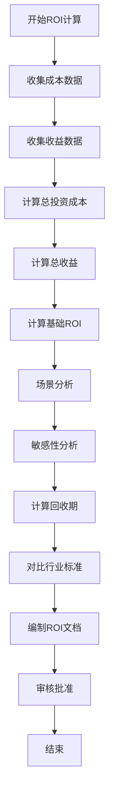

# ROI计算流程标准

**文档编号**：SYS-PI-BC-PS-003  
**版本**：1.0  
**日期**：2026-03-13  
**状态**：已批准

---

## 1. 流程概述

### 1.1 目的
规范System系统基础平台项目ROI计算工作流程，确保投资回报率计算准确、全面，为投资决策提供可靠依据。

### 1.2 适用范围
适用于System系统基础平台项目的ROI计算和投资回收期分析工作。

### 1.3 参考文档
- 成本分析流程标准（SYS-PI-BC-PS-001）
- 收益分析流程标准（SYS-PI-BC-PS-002）
- 商业论证检查清单（business-case-checklist.md）

---

## 2. ROI计算流程

### 2.1 流程步骤



### 2.2 详细步骤说明

#### 步骤1：收集成本数据

**输入**：
- 开发成本分析文档
- 运维成本分析文档
- 其他成本分析文档

**活动**：
1. 汇总开发成本（含风险储备）
2. 汇总运维成本（按年限）
3. 汇总其他成本
4. 确定成本时间分布

**输出**：
- 成本汇总表

#### 步骤2：收集收益数据

**输入**：
- 直接收益分析文档
- 间接收益分析文档
- 战略收益分析文档

**活动**：
1. 汇总直接收益
2. 汇总间接收益（可量化部分）
3. 汇总战略收益（可量化部分）
4. 确定收益时间分布

**输出**：
- 收益汇总表

#### 步骤3：计算总投资成本

**计算公式**：
```
总投资成本 = 开发成本 + 运维成本（年限） + 其他成本
```

**年度成本分布**：
| 年份 | 开发成本 | 运维成本 | 其他成本 | 年度合计 |
|-----|---------|---------|---------|---------|
| 第1年 | XXX | XXX | XXX | XXX |
| 第2年 | 0 | XXX | 0 | XXX |
| 第3年 | 0 | XXX | 0 | XXX |

#### 步骤4：计算总收益

**计算公式**：
```
总收益 = 直接收益 + 间接收益 + 战略收益
```

**年度收益分布**：
| 年份 | 直接收益 | 间接收益 | 战略收益 | 年度合计 |
|-----|---------|---------|---------|---------|
| 第1年 | XXX | XXX | XXX | XXX |
| 第2年 | XXX | XXX | XXX | XXX |
| 第3年 | XXX | XXX | XXX | XXX |

**第1年收益调整**：
- 系统上线时间通常在年中
- 第1年收益建议按全年收益的50-70%计算
- 保守估计：50%
- 基准估计：60%
- 乐观估计：70%

#### 步骤5：计算基础ROI

**ROI公式**：
```
ROI = (总收益 - 总成本) / 总成本 × 100%
```

**计算示例**：
| 指标 | 数值（万元） |
|-----|-------------|
| 3年总收益 | 1,559.61 |
| 3年总成本 | 469.92 |
| 净收益 | 1,089.69 |
| ROI | 231.9% |

**年度ROI分解**：
| 年份 | 年度收益 | 年度成本 | 净收益 | 年度ROI |
|-----|---------|---------|--------|---------|
| 第1年 | XXX | XXX | XXX | XXX% |
| 第2年 | XXX | XXX | XXX | XXX% |
| 第3年 | XXX | XXX | XXX | XXX% |

#### 步骤6：场景分析

**场景定义**：

| 场景 | 描述 | 收益调整系数 | 成本调整系数 |
|-----|------|-------------|-------------|
| **乐观场景** | 收益超预期，成本控制良好 | 100% | 100% |
| **基准场景** | 按预期实现收益和成本 | 85% | 100% |
| **保守场景** | 收益低于预期，成本超支 | 70% | 110% |

**场景ROI计算**：

| 场景 | 总收益 | 总成本 | 净收益 | ROI |
|-----|-------|-------|-------|-----|
| 乐观场景 | XXX | XXX | XXX | XXX% |
| 基准场景 | XXX | XXX | XXX | XXX% |
| 保守场景 | XXX | XXX | XXX | XXX% |

#### 步骤7：敏感性分析

**关键变量识别**：
- 直接收益变化
- 间接收益变化
- 战略收益变化
- 开发成本变化
- 运维成本变化

**敏感性矩阵**：

| 收益变化 \ 成本变化 | -20% | -10% | 基准 | +10% | +20% |
|-------------------|------|------|------|------|------|
| **+20%** | XXX% | XXX% | XXX% | XXX% | XXX% |
| **+10%** | XXX% | XXX% | XXX% | XXX% | XXX% |
| **基准** | XXX% | XXX% | XXX% | XXX% | XXX% |
| **-10%** | XXX% | XXX% | XXX% | XXX% | XXX% |
| **-20%** | XXX% | XXX% | XXX% | XXX% | XXX% |

#### 步骤8：计算回收期

**静态回收期**：
```
静态回收期 = 累计现金流由负转正的年份 - 1 + |上年累计现金流| / 当年净现金流
```

**动态回收期（考虑折现）**：
```
折现现金流 = 未来现金流 / (1 + 折现率)^n
动态回收期 = 累计折现现金流由负转正的时间点
```

**折现率选择**：
- 通常取8-12%
- 建议取10%作为基准

**回收期计算示例**：
| 类型 | 回收期 |
|-----|-------|
| 静态回收期 | 11个月 |
| 动态回收期（10%） | 15个月 |

#### 步骤9：对比行业标准

**IT项目ROI基准**：
| 项目类型 | 典型ROI范围 | 优秀ROI |
|---------|------------|---------|
| 内部系统建设 | 50%-150% | >150% |
| 基础设施项目 | 30%-100% | >100% |
| 数字化转型项目 | 100%-300% | >250% |

**IT项目回收期基准**：
| 项目类型 | 典型回收期 | 优秀回收期 |
|---------|-----------|-----------|
| 内部系统建设 | 1.5-3年 | <1.5年 |
| 基础设施项目 | 2-4年 | <2年 |
| 数字化转型项目 | 1-2年 | <1年 |

#### 步骤10：编制ROI文档

**文档清单**：
1. ROI计算（07-roi-calculation.md）
2. 投资回收期分析（08-payback-period.md）

**文档内容要求**：
- 成本数据准确
- 收益数据准确
- 计算过程清晰
- 场景分析完整
- 敏感性分析充分
- 结论明确

#### 步骤11：审核批准

**审核要点**：
1. 成本数据准确性
2. 收益数据准确性
3. ROI计算正确性
4. 场景分析合理性
5. 结论合理性

**审批流程**：
- 编制人：产品经理
- 审核人：财务负责人
- 批准人：项目发起人

---

## 3. ROI计算方法

### 3.1 基础ROI计算

**公式**：
```
ROI = (总收益 - 总成本) / 总成本 × 100%
```

**示例**：
| 指标 | 数值 |
|-----|------|
| 总收益 | 1,559.61万元 |
| 总成本 | 469.92万元 |
| 净收益 | 1,089.69万元 |
| ROI | 231.9% |

### 3.2 年度ROI计算

**公式**：
```
年度ROI = (年度收益 - 年度成本) / 年度成本 × 100%
```

### 3.3 累计ROI计算

**公式**：
```
累计ROI = (累计收益 - 累计成本) / 累计成本 × 100%
```

### 3.4 风险调整ROI

**公式**：
```
风险调整后ROI = (调整后收益 - 总成本) / 总成本 × 100%
```

---

## 4. 回收期计算方法

### 4.1 静态回收期

**公式**：
```
静态回收期 = 累计现金流由负转正的年份 - 1 + |上年累计现金流| / 当年净现金流
```

**计算步骤**：
1. 计算每年净现金流
2. 计算累计现金流
3. 找到累计现金流由负转正的年份
4. 按公式计算回收期

### 4.2 动态回收期

**公式**：
```
折现现金流 = 未来现金流 / (1 + 折现率)^n
动态回收期 = 累计折现现金流由负转正的时间点
```

**计算步骤**：
1. 确定折现率
2. 计算每年折现现金流
3. 计算累计折现现金流
4. 找到累计折现现金流由负转正的时间点

---

## 5. 文档模板

### 5.1 ROI计算模板

```markdown
# ROI计算

## 1. 成本汇总

| 成本类别 | 金额（万元） |
|---------|-------------|
| 开发成本 | XXX |
| 运维成本（3年） | XXX |
| 其他成本 | XXX |
| **总投资成本** | **XXX** |

## 2. 收益汇总

| 收益类别 | 3年累计（万元） |
|---------|----------------|
| 直接收益 | XXX |
| 间接收益 | XXX |
| 战略收益 | XXX |
| **总收益** | **XXX** |

## 3. ROI计算

| 指标 | 数值 |
|-----|------|
| 总收益 | XXX万元 |
| 总成本 | XXX万元 |
| 净收益 | XXX万元 |
| **ROI** | **XXX%** |

## 4. 场景分析

| 场景 | ROI |
|-----|-----|
| 乐观场景 | XXX% |
| 基准场景 | XXX% |
| 保守场景 | XXX% |

## 5. 结论

**投资建议**：批准/不批准

**理由**：
1. XXX
2. XXX
3. XXX
```

### 5.2 投资回收期模板

```markdown
# 投资回收期分析

## 1. 现金流分析

| 年份 | 成本支出 | 收益实现 | 净现金流 | 累计现金流 |
|-----|---------|---------|---------|-----------|
| 第1年 | XXX | XXX | XXX | XXX |
| 第2年 | XXX | XXX | XXX | XXX |
| 第3年 | XXX | XXX | XXX | XXX |

## 2. 回收期计算

| 类型 | 回收期 |
|-----|-------|
| 静态回收期 | XX个月 |
| 动态回收期（10%） | XX个月 |

## 3. 结论

**回收期评价**：优秀/良好/一般

**理由**：
1. XXX
2. XXX
```

---

## 6. 质量控制

### 6.1 审核检查清单

| 检查项 | 检查内容 | 合格标准 |
|-------|---------|---------|
| 成本数据 | 成本数据是否准确 | 与成本分析一致 |
| 收益数据 | 收益数据是否准确 | 与收益分析一致 |
| ROI计算 | 计算公式是否正确 | 计算无误 |
| 场景分析 | 场景设置是否合理 | 覆盖主要风险 |
| 敏感性分析 | 关键变量是否识别 | 影响分析完整 |
| 回收期计算 | 计算方法是否正确 | 计算无误 |

### 6.2 常见错误

| 错误类型 | 错误示例 | 正确做法 |
|---------|---------|---------|
| 成本遗漏 | 遗漏运维成本 | 包含全生命周期成本 |
| 收益高估 | 第1年按全年计算 | 考虑上线时间，适当打折 |
| 计算错误 | 公式使用错误 | 使用标准ROI公式 |
| 场景不全 | 只分析乐观场景 | 分析乐观、基准、保守三种场景 |

---

## 7. 工具与模板

### 7.1 计算工具

- Excel ROI计算模板
- 现金流分析表
- 敏感性分析表

### 7.2 参考数据

- 行业ROI基准数据
- 行业回收期基准数据
- 折现率参考值

---

## 8. 附录

### 8.1 术语定义

| 术语 | 定义 |
|-----|------|
| ROI | 投资回报率，(收益-成本)/成本 |
| 静态回收期 | 不考虑资金时间价值的回收期 |
| 动态回收期 | 考虑资金时间价值的回收期 |
| 折现率 | 资金时间价值的利率 |
| NPV | 净现值 |
| IRR | 内部收益率 |

### 8.2 参考案例

参见已完成的ROI文档：
- 07-roi-calculation.md
- 08-payback-period.md

---

**文档审批**

| 角色 | 签名 | 日期 |
|-----|------|------|
| 编制人 | 产品经理 | 2026-03-13 |
| 审核人 | 财务负责人 | 2026-03-13 |
| 批准人 | 项目发起人 | 2026-03-13 |

---

*文档版本历史*

| 版本 | 日期 | 修改内容 | 修改人 |
|-----|------|---------|-------|
| 1.0 | 2026-03-13 | 初始版本 | 产品经理 |
