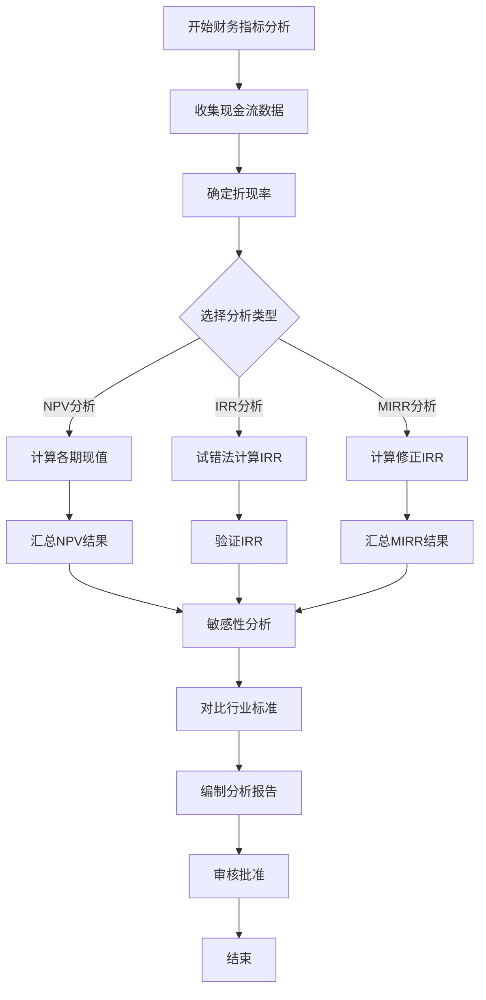

# 财务指标分析流程标准

> **文档编号**：SYS-PI-BC-PROC-004  
> **版本**：1.0  
> **日期**：2026-03-13  
> **适用范围**：System系统基础平台项目商业论证

---

## 1. 目的

规范财务指标分析流程，确保NPV、IRR等关键财务指标计算的准确性和一致性，为项目投资决策提供可靠的财务依据。

---

## 2. 适用范围

本流程适用于：
- NPV净现值分析
- IRR内部收益率分析
- MIRR修正内部收益率分析
- 财务指标敏感性分析

---

## 3. 财务指标分析流程

### 3.1 流程图



### 3.2 流程步骤

#### 步骤1：收集现金流数据

**输入**：
- 成本分析文档
- 收益分析文档
- ROI计算文档

**输出**：
- 项目现金流时间表
- 各期净现金流数据

**关键活动**：
1. 整理初始投资（第0年）
2. 整理各期运营成本
3. 整理各期收益实现
4. 计算各期净现金流

#### 步骤2：确定折现率

**折现率选择标准**：

| 选择依据 | 适用情况 | 典型值 |
|---------|---------|--------|
| 公司WACC | 常规项目 | 8-10% |
| 行业基准 | 对标分析 | 10-15% |
| 风险调整 | 高风险项目 | WACC+风险溢价 |
| 要求回报率 | 投资决策 | 公司设定 |

**本项目折现率**：10%

**依据**：
- 公司WACC约8-10%
- 符合IT行业惯例
- 与ROI计算保持一致

#### 步骤3：NPV计算

**计算公式**：
```
NPV = Σ(CFt / (1 + r)^t) - C0
```

**计算步骤**：
1. 计算各期折现系数：1 / (1 + r)^t
2. 计算各期现值：CFt × 折现系数
3. 汇总现值：Σ现值
4. 计算NPV：现值总和 - 初始投资

**评价标准**：

| NPV范围 | 评价 | 投资建议 |
|---------|------|---------|
| > 500万 | 优秀 | 强烈推荐 |
| 200-500万 | 良好 | 推荐 |
| 0-200万 | 一般 | 可考虑 |
| < 0 | 不佳 | 不建议 |

#### 步骤4：IRR计算

**计算方法**：试错法

**计算步骤**：
1. 选择初始折现率（如10%）
2. 计算NPV
3. 调整折现率，使NPV趋近于0
4. 线性插值精确计算IRR
5. 验证IRR（使用IRR计算NPV应≈0）

**评价标准**：

| IRR vs 要求回报率 | 评价 | 投资建议 |
|------------------|------|---------|
| IRR > 要求回报率×2 | 非常优秀 | 强烈推荐 |
| IRR > 要求回报率×1.5 | 优秀 | 推荐 |
| IRR > 要求回报率 | 良好 | 可考虑 |
| IRR ≤ 要求回报率 | 不佳 | 不建议 |

#### 步骤5：MIRR计算

**计算步骤**：
1. 计算负现金流现值（PV）
2. 计算正现金流终值（FV）
3. 计算MIRR：(FV / |PV|)^(1/n) - 1

**参数设置**：
- 融资成本：公司WACC
- 再投资率：公司要求回报率或WACC

#### 步骤6：敏感性分析

**分析维度**：

| 维度 | 变化范围 | 分析目的 |
|-----|---------|---------|
| 折现率 | 5%-20% | 测试资金成本敏感度 |
| 收益变化 | -30% ~ +10% | 测试收益实现风险 |
| 成本变化 | -20% ~ +50% | 测试成本控制风险 |

**输出**：敏感性分析表、敏感性曲线图

#### 步骤7：对比行业标准

**对比指标**：
- NPV vs 行业NPV基准
- IRR vs 行业IRR基准
- 现值收益/成本比

**行业基准**：

| 项目类型 | 典型IRR | 优秀IRR |
|---------|---------|---------|
| 内部系统建设 | 15-30% | >30% |
| 基础设施项目 | 10-20% | >20% |
| 数字化转型 | 20-50% | >40% |

#### 步骤8：编制分析报告

**报告内容**：
1. 现金流数据汇总
2. NPV计算过程和结果
3. IRR计算过程和结果
4. MIRR计算结果
5. 敏感性分析
6. 行业标准对比
7. 结论与建议

#### 步骤9：审核批准

**审核要点**：
- 现金流数据准确性
- 折现率选择合理性
- 计算过程正确性
- 结论合理性

**审批流程**：
编制人 → 财务负责人审核 → 项目发起人批准

---

## 4. 关键计算公式

### 4.1 折现系数

```
折现系数 = 1 / (1 + r)^t

其中：
- r = 折现率
- t = 期数
```

### 4.2 NPV公式

```
NPV = Σ(CFt / (1 + r)^t) - C0

其中：
- CFt = 第t期净现金流
- r = 折现率
- t = 期数
- C0 = 初始投资
```

### 4.3 IRR公式

```
Σ(CFt / (1 + IRR)^t) - C0 = 0

求解IRR使NPV=0
```

### 4.4 MIRR公式

```
MIRR = (FV / |PV|)^(1/n) - 1

其中：
- FV = 正现金流按再投资率计算的终值
- PV = 负现金流按融资成本计算的现值
- n = 项目期数
```

---

## 5. 输出模板

### 5.1 NPV分析模板

| 年份 | 净现金流 | 折现系数 | 现值 | 累计现值 |
|-----|---------|---------|------|---------|
| 第0年 | | 1.000 | | |
| 第1年 | | | | |
| 第2年 | | | | |
| 第3年 | | | | |
| **NPV** | | | | |

### 5.2 IRR计算模板

| 折现率 | NPV | 与0关系 |
|-------|-----|--------|
| | | |
| | | |
| **IRR** | **≈0** | |

### 5.3 敏感性分析模板

| 场景 | 参数变化 | NPV | IRR | 评价 |
|-----|---------|-----|-----|------|
| 乐观 | | | | |
| 基准 | | | | |
| 保守 | | | | |

---

## 6. 质量控制

### 6.1 数据质量要求

- 现金流数据需与成本分析、收益分析保持一致
- 折现率选择需有明确依据
- 计算过程需保留中间结果

### 6.2 计算验证要求

- NPV计算需验证：各期现值之和 = NPV + 初始投资
- IRR计算需验证：使用IRR计算NPV应≈0
- MIRR计算需验证：FV/PV = (1+MIRR)^n

### 6.3 审核检查清单

- [ ] 现金流数据来源正确
- [ ] 折现率选择合理
- [ ] 计算公式应用正确
- [ ] 计算结果验证通过
- [ ] 敏感性分析完整
- [ ] 行业标准对比合理
- [ ] 结论与数据一致

---

## 7. 相关文档

- NPV净现值分析（SYS-PI-BC-009）
- IRR内部收益率分析（SYS-PI-BC-010）
- ROI计算（SYS-PI-BC-007）
- 投资回收期分析（SYS-PI-BC-008）

---

## 8. 版本历史

| 版本 | 日期 | 修改内容 | 修改人 |
|-----|------|---------|-------|
| 1.0 | 2026-03-13 | 初始版本 | 产品经理 |
