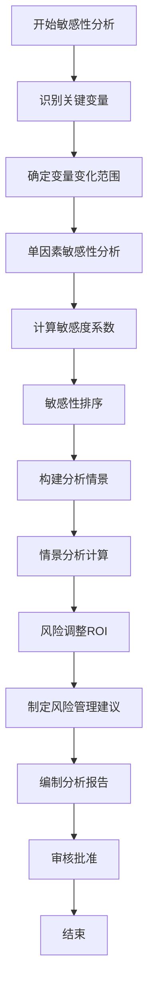

# 敏感性分析流程标准

> **文档编号**：SYS-PI-BC-PROC-005  
> **版本**：1.0  
> **日期**：2026-03-13  
> **适用范围**：System系统基础平台项目商业论证

---

## 1. 目的

规范敏感性分析流程，识别项目关键风险因素，评估不同情景下的项目表现，为投资决策提供全面的风险视角。

---

## 2. 适用范围

本流程适用于：
- 敏感性变量识别与分析
- 情景分析（乐观、基准、保守）
- 风险调整ROI计算
- 风险管理建议制定

---

## 3. 敏感性分析流程

### 3.1 流程图



### 3.2 流程步骤

#### 步骤1：识别关键变量

**变量分类**：

| 类别 | 典型变量 | 说明 |
|-----|---------|------|
| **成本类** | 开发成本、运维成本、其他成本 | 影响项目投资的变量 |
| **收益类** | 直接收益、间接收益、战略收益 | 影响项目回报的变量 |
| **时间类** | 上线时间、项目周期 | 影响现金流时点的变量 |
| **外部类** | 折现率、通胀率 | 影响资金成本的变量 |

**识别方法**：
1. 基于历史项目经验
2. 参考类似项目案例
3. 专家访谈和头脑风暴
4. 利益相关者反馈

#### 步骤2：确定变量变化范围

**变化范围设定原则**：

| 情景 | 变化范围 | 设定依据 |
|-----|---------|---------|
| 乐观 | -10% ~ +10% | 理想情况 |
| 基准 | 0% | 最可能情况 |
| 保守 | -40% ~ +30% | 风险情况 |

**典型变化范围**：

| 变量类型 | 悲观变化 | 基准 | 乐观变化 |
|---------|---------|------|---------|
| 成本类 | +20%~+30% | 100% | -10% |
| 收益类 | -30%~-40% | 100% | +10% |
| 时间类 | 延迟3个月 | 按时 | 提前1个月 |
| 外部类 | 不利变化 | 基准 | 有利变化 |

#### 步骤3：单因素敏感性分析

**分析方法**：
每次只改变一个变量，保持其他变量不变，观察对财务指标的影响。

**分析步骤**：
1. 选择要分析的变量
2. 设定变量的变化范围
3. 计算不同变化幅度下的财务指标
4. 记录分析结果

**输出模板**：

| 变量变化 | 财务指标1 | 财务指标2 | ... |
|---------|----------|----------|-----|
| -30% | | | |
| -20% | | | |
| -10% | | | |
| 基准 | | | |
| +10% | | | |
| +20% | | | |
| +30% | | | |

#### 步骤4：计算敏感度系数

**敏感度系数公式**：
```
敏感度系数 = (财务指标变化率) / (变量变化率)

例如：
敏感度 = (NPV变化率) / (变量变化率)
       = (新NPV - 原NPV) / 原NPV / 变量变化率
```

**敏感度等级**：

| 敏感度系数绝对值 | 敏感程度 | 颜色标识 |
|----------------|---------|---------|
| > 0.8 | 高敏感 | 🔴 红色 |
| 0.5 ~ 0.8 | 较高敏感 | 🟡 黄色 |
| 0.3 ~ 0.5 | 中等敏感 | 🟢 绿色 |
| < 0.3 | 低敏感 | ⚪ 灰色 |

#### 步骤5：敏感性排序

**排序方法**：
按敏感度系数绝对值从大到小排序

**输出形式**：
1. 敏感性排序表
2. 龙卷风图（Tornado Diagram）
3. 敏感性矩阵

**龙卷风图示例**：
```
敏感度系数
    │
+1.0┤                    [变量A ████████]
    │
+0.8┤            [变量B ██████]
    │
+0.6┤    [变量C ████]
    │
+0.4┤
    │
+0.2┤
    ├────────────────────────────────────────
 0.0│
    │
-0.2┤
    │
-0.4┤[变量D ███]  [变量E ██]
    │
-0.6┤
    │
-0.8┤
    │
-1.0┤
    └────────────────────────────────────────
```

#### 步骤6：构建分析情景

**情景设定**：

| 情景 | 概率 | 特点 | 用途 |
|-----|------|------|------|
| 乐观 | 20% | 所有有利因素同时发生 | 上限评估 |
| 基准 | 60% | 最可能发生的正常情况 | 主要决策依据 |
| 保守 | 20% | 主要风险因素同时发生 | 下限评估 |

**情景参数设定**：

| 参数 | 乐观情景 | 基准情景 | 保守情景 |
|-----|---------|---------|---------|
| 成本调整 | -10% | 100% | +20% |
| 收益调整 | +10% | 100% | -30% |
| 时间调整 | 提前1月 | 按时 | 延迟2月 |

#### 步骤7：情景分析计算

**计算内容**：
1. 各情景下的成本和收益
2. 各情景下的财务指标（ROI、NPV、IRR）
3. 期望财务指标（概率加权）

**期望财务指标计算**：
```
期望NPV = Σ(情景NPV × 概率)
期望IRR = Σ(情景IRR × 概率)
```

#### 步骤8：风险调整ROI

**风险调整方法**：

1. **确定性等价法**：
   ```
   风险调整收益 = 期望收益 × 风险调整系数
   ```

2. **风险调整折现率法**：
   ```
   风险调整折现率 = 基准折现率 + 风险溢价
   ```

3. **概率加权法**：
   ```
   风险调整ROI = (风险调整收益 - 风险调整成本) / 风险调整成本
   ```

**风险调整系数**：

| 风险水平 | 风险调整系数 | 适用情况 |
|---------|------------|---------|
| 低风险 | 0.95 | 成熟技术、明确需求 |
| 中低风险 | 0.90 | 标准项目 |
| 中等风险 | 0.85 | 一般项目 |
| 中高风险 | 0.80 | 创新项目 |
| 高风险 | 0.75 | 突破性项目 |

#### 步骤9：制定风险管理建议

**针对高敏感变量的措施**：

| 敏感变量 | 风险措施 | 责任方 |
|---------|---------|--------|
| 战略收益 | 建立跟踪机制、定期评估 | 项目管理办公室 |
| 间接收益 | 数据质量监控、流程优化 | 业务部门 |
| 直接收益 | 用户培训、功能优化 | 产品团队 |

**通用风险管理建议**：
1. 建立风险监控机制
2. 制定风险应对预案
3. 定期风险评估
4. 动态调整策略

#### 步骤10：编制分析报告

**报告内容**：
1. 敏感性变量识别结果
2. 单因素敏感性分析结果
3. 敏感度排序和龙卷风图
4. 情景分析结果
5. 风险调整ROI
6. 风险管理建议
7. 结论与投资建议

#### 步骤11：审核批准

**审核要点**：
- 变量识别完整性
- 变化范围合理性
- 计算准确性
- 分析结论合理性
- 风险管理建议可行性

**审批流程**：
编制人 → 财务负责人审核 → 项目发起人批准

---

## 4. 关键计算公式

### 4.1 敏感度系数

```
敏感度系数 = (财务指标变化率) / (变量变化率)

其中：
- 财务指标变化率 = (新指标值 - 原指标值) / 原指标值
- 变量变化率 = (新变量值 - 原变量值) / 原变量值
```

### 4.2 期望财务指标

```
期望值 = Σ(情景值 × 概率)

例如：
期望NPV = NPV_乐观×P_乐观 + NPV_基准×P_基准 + NPV_保守×P_保守
```

### 4.3 风险调整ROI

```
风险调整ROI = (风险调整收益 - 风险调整成本) / 风险调整成本 × 100%

其中：
- 风险调整收益 = 期望收益 × 风险调整系数
- 风险调整成本 = 期望成本 × (1 + 成本风险溢价)
```

---

## 5. 输出模板

### 5.1 敏感性分析表

| 变量 | 变化范围 | NPV变化 | IRR变化 | 敏感度系数 | 敏感程度 |
|-----|---------|--------|--------|-----------|---------|
| 变量A | -30%~+30% | | | | |
| 变量B | -30%~+30% | | | | |

### 5.2 情景分析表

| 情景 | 概率 | 成本 | 收益 | ROI | NPV | IRR |
|-----|------|------|------|-----|-----|-----|
| 乐观 | 20% | | | | | |
| 基准 | 60% | | | | | |
| 保守 | 20% | | | | | |
| 期望 | 100% | | | | | |

### 5.3 风险调整分析表

| 风险水平 | 风险调整系数 | 风险调整收益 | 风险调整成本 | 风险调整ROI |
|---------|------------|------------|------------|------------|
| 低风险 | 0.95 | | | |
| 中等风险 | 0.85 | | | |
| 高风险 | 0.75 | | | |

---

## 6. 质量控制

### 6.1 数据质量要求

- 变量识别需全面，覆盖所有关键因素
- 变化范围设定需有依据
- 情景概率估计需合理

### 6.2 计算验证要求

- 敏感度系数计算需验证
- 情景分析计算需交叉验证
- 风险调整计算需合理性检查

### 6.3 审核检查清单

- [ ] 变量识别完整
- [ ] 变化范围合理
- [ ] 计算过程正确
- [ ] 敏感度排序正确
- [ ] 情景设定合理
- [ ] 概率估计合理
- [ ] 风险调整方法合理
- [ ] 风险管理建议可行
- [ ] 结论与数据一致

---

## 7. 相关文档

- 敏感性变量分析（SYS-PI-BC-011）
- 情景分析（SYS-PI-BC-012）
- 风险调整ROI（SYS-PI-BC-013）
- NPV净现值分析（SYS-PI-BC-009）
- IRR内部收益率分析（SYS-PI-BC-010）

---

## 8. 版本历史

| 版本 | 日期 | 修改内容 | 修改人 |
|-----|------|---------|-------|
| 1.0 | 2026-03-13 | 初始版本 | 产品经理 |
