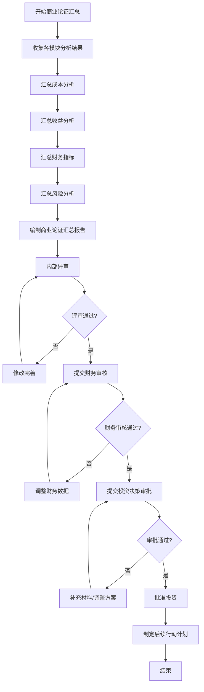

# 商业论证汇总流程标准

> **文档编号**：SYS-PI-BC-PROC-006  
> **版本**：1.0  
> **状态**：✅ 已发布  
> **发布日期**：2026-03-13  
> **适用范围**：System系统基础平台项目商业论证汇总阶段

---

## 1. 流程目标

### 1.1 目的

规范商业论证汇总阶段的文档编制和审批流程，确保商业论证报告的完整性、准确性和决策支持价值。

### 1.2 适用范围

- 商业论证汇总报告编制
- 商业论证审批流程
- 投资决策支持文档准备

### 1.3 流程价值

1. **决策支持**：为项目立项提供全面的财务和战略分析
2. **风险揭示**：识别和评估项目关键风险因素
3. **资源规划**：明确项目投资和收益预期
4. **治理基础**：建立项目治理和监控机制

---

## 2. 角色与职责

### 2.1 角色定义

| 角色 | 职责 | 交付物 |
|-----|------|--------|
| **产品经理** | 编制商业论证汇总报告 | 商业论证汇总报告 |
| **财务负责人** | 审核财务指标计算 | 财务审核意见 |
| **项目经理** | 提供项目计划和资源需求 | 项目计划 |
| **项目发起人** | 最终审批投资决策 | 审批意见 |
| **技术负责人** | 提供技术可行性评估 | 技术评估报告 |

### 2.2 职责矩阵

| 活动 | 产品经理 | 财务负责人 | 项目经理 | 项目发起人 |
|-----|---------|-----------|---------|-----------|
| 汇总成本分析 | R | C | I | I |
| 汇总收益分析 | R | C | I | I |
| 汇总财务指标 | R | A | I | I |
| 编制汇总报告 | R | C | C | I |
| 财务审核 | I | R | I | I |
| 投资决策审批 | I | C | I | A |

*注：R=负责，A=批准，C=咨询，I=知会*

---

## 3. 商业论证汇总流程

### 3.1 流程图



### 3.2 流程步骤详解

#### 步骤1：收集各模块分析结果（1天）

**输入**：
- 成本分析文档（3份）
- 收益分析文档（3份）
- ROI计算文档（2份）
- 财务指标分析文档（2份）
- 敏感性分析文档（3份）

**活动**：
1. 确认所有前置文档已完成并审核
2. 收集各模块关键数据和结论
3. 整理文档清单

**输出**：
- 各模块分析结果汇总表

**质量检查点**：
- [ ] 所有前置文档已完成
- [ ] 所有文档已审核签字
- [ ] 数据一致性检查通过

#### 步骤2：汇总成本分析（0.5天）

**活动**：
1. 汇总开发成本、运维成本、其他成本
2. 计算总投资
3. 分析成本构成和占比

**输出**：
- 成本分析汇总表

**关键数据**：
```
开发成本：229.03万元
运维成本：191.43万元
其他成本：49.46万元
总投资：469.92万元
```

#### 步骤3：汇总收益分析（0.5天）

**活动**：
1. 汇总直接收益、间接收益、战略收益
2. 计算总收益
3. 分析收益构成和实现路径

**输出**：
- 收益分析汇总表

**关键数据**：
```
直接收益：358.71万元
间接收益：510.90万元
战略收益：690.00万元
总收益：1,559.61万元
```

#### 步骤4：汇总财务指标（0.5天）

**活动**：
1. 汇总各情景财务指标
2. 计算期望财务指标
3. 对比行业标准

**输出**：
- 财务指标汇总表

**关键数据**：
```
ROI：231.9%（基准）/ 284.8%（乐观）/ 99.5%（保守）
NPV：623.99万元（基准）/ 712.45万元（乐观）/ 289.57万元（保守）
IRR：60.3%（基准）/ 78.5%（乐观）/ 42.8%（保守）
回收期：11个月（静态）/ 15个月（动态）
```

#### 步骤5：汇总风险分析（0.5天）

**活动**：
1. 汇总敏感性分析结果
2. 汇总情景分析结果
3. 汇总风险调整ROI

**输出**：
- 风险分析汇总表

**关键发现**：
```
最敏感变量：战略收益（+0.91）、间接收益（+0.84）
风险调整ROI：140.1%
80%概率实现基准或更好情景
```

#### 步骤6：编制商业论证汇总报告（2天）

**报告结构**：

1. **执行摘要**
   - 项目概述
   - 投资建议
   - 关键结论

2. **项目背景**
   - 业务背景
   - 项目目标
   - 项目范围

3. **成本分析汇总**
   - 投资成本
   - 成本构成分析
   - 成本控制措施

4. **收益分析汇总**
   - 预期收益
   - 收益实现路径
   - 收益跟踪机制

5. **财务指标汇总**
   - 核心财务指标
   - 风险调整指标
   - 行业标准对比

6. **风险分析汇总**
   - 关键风险因素
   - 情景分析结论
   - 风险缓解策略

7. **投资决策建议**
   - 投资建议
   - 实施建议
   - 后续行动

8. **附件清单**

9. **审核记录**

**输出**：
- 商业论证汇总报告（SYS-PI-BC-014）

**质量检查点**：
- [ ] 数据准确性检查
- [ ] 逻辑一致性检查
- [ ] 格式规范性检查
- [ ] 附件完整性检查

#### 步骤7：内部评审（1天）

**参与人**：产品经理、项目经理、技术负责人

**评审内容**：
1. 数据准确性
2. 逻辑完整性
3. 结论合理性
4. 格式规范性

**输出**：
- 内部评审记录
- 修改意见清单

#### 步骤8：财务审核（1天）

**审核人**：财务负责人

**审核内容**：
1. 成本数据准确性
2. 收益估算合理性
3. 财务指标计算正确性
4. 折现率选择合理性

**输出**：
- 财务审核意见

**审核结果处理**：
- 通过：进入投资决策审批
- 不通过：调整财务数据后重新提交

#### 步骤9：投资决策审批（1天）

**审批人**：项目发起人

**审批依据**：
1. 财务指标是否达到投资标准
2. 风险是否可控
3. 战略价值是否明确
4. 资源是否可保障

**审批结果**：
- 批准：进入项目实施阶段
- 拒绝：项目终止
- 需补充材料：补充后重新审批

**输出**：
- 投资决策审批表（SYS-PI-BC-015）

#### 步骤10：制定后续行动计划（0.5天）

**活动**：
1. 制定项目启动计划
2. 明确关键里程碑
3. 分配资源
4. 建立监控机制

**输出**：
- 后续行动计划

---

## 4. 输出模板

### 4.1 商业论证汇总报告模板

```markdown
# 商业论证汇总报告

## 1. 执行摘要
### 1.1 项目概述
### 1.2 投资建议
### 1.3 关键结论

## 2. 项目背景
### 2.1 业务背景
### 2.2 项目目标
### 2.3 项目范围

## 3. 成本分析汇总
### 3.1 投资成本
### 3.2 成本构成分析
### 3.3 成本控制措施

## 4. 收益分析汇总
### 4.1 预期收益
### 4.2 收益实现路径
### 4.3 收益跟踪机制

## 5. 财务指标汇总
### 5.1 核心财务指标
### 5.2 风险调整指标
### 5.3 行业标准对比

## 6. 风险分析汇总
### 6.1 关键风险因素
### 6.2 情景分析结论
### 6.3 风险缓解策略

## 7. 投资决策建议
### 7.1 投资建议
### 7.2 实施建议
### 7.3 后续行动

## 8. 附件清单

## 9. 审核记录
```

### 4.2 投资决策审批表模板

```markdown
# 商业论证审批表

## 1. 项目基本信息
## 2. 投资决策建议
## 3. 审批流程
### 3.1 审批层级
### 3.2 审批意见
## 4. 投资决策条件
## 5. 后续行动计划
## 6. 项目治理
## 7. 风险监控与应对
## 8. 附件清单
## 9. 审批记录
```

---

## 5. 质量检查清单

### 5.1 汇总报告检查清单

| 检查项 | 检查内容 | 检查方法 | 合格标准 |
|-------|---------|---------|---------|
| 数据完整性 | 所有财务数据是否完整 | 逐项核对 | 无缺失数据 |
| 数据一致性 | 各模块数据是否一致 | 交叉验证 | 数据一致 |
| 计算准确性 | 财务指标计算是否正确 | 重新计算 | 计算正确 |
| 逻辑完整性 | 分析逻辑是否完整 | 逻辑审查 | 逻辑严密 |
| 格式规范性 | 文档格式是否符合标准 | 格式检查 | 符合模板 |
| 附件完整性 | 附件是否齐全 | 清单核对 | 附件完整 |

### 5.2 审批流程检查清单

| 检查项 | 检查内容 | 检查方法 | 合格标准 |
|-------|---------|---------|---------|
| 前置文档 | 所有前置文档是否完成 | 文档清单 | 全部完成 |
| 内部评审 | 是否完成内部评审 | 评审记录 | 评审通过 |
| 财务审核 | 是否完成财务审核 | 审核意见 | 审核通过 |
| 审批签字 | 是否完成审批签字 | 签字记录 | 签字完整 |
| 条件确认 | 投资条件是否满足 | 条件核对 | 条件满足 |

---

## 6. 关键成功因素

### 6.1 数据质量

- 确保各模块数据来源可靠
- 进行数据一致性校验
- 建立数据追溯机制

### 6.2 分析深度

- 多情景分析（乐观、基准、保守）
- 敏感性分析
- 风险调整分析

### 6.3 决策支持

- 明确投资建议
- 提供实施建议
- 制定后续行动计划

---

## 7. 常见问题与解决

### 7.1 数据不一致

**问题**：各模块数据不一致

**解决**：
1. 建立统一的数据基准
2. 进行数据交叉验证
3. 召开数据协调会议

### 7.2 财务指标不达标

**问题**：财务指标未达到投资标准

**解决**：
1. 重新评估收益估算
2. 优化成本结构
3. 调整项目范围

### 7.3 审批不通过

**问题**：投资决策审批不通过

**解决**：
1. 了解不通过原因
2. 补充必要材料
3. 调整项目方案

---

## 8. 相关文档

### 8.1 输入文档

- 成本分析文档（SYS-PI-BC-001~003）
- 收益分析文档（SYS-PI-BC-004~006）
- ROI计算文档（SYS-PI-BC-007~008）
- 财务指标分析文档（SYS-PI-BC-009~010）
- 敏感性分析文档（SYS-PI-BC-011~013）

### 8.2 输出文档

- 商业论证汇总报告（SYS-PI-BC-014）
- 商业论证审批表（SYS-PI-BC-015）

### 8.3 参考文档

- 项目章程（SYS-PI-PC-001）
- 商业论证总流程（business-case-process.md）
- 各模块流程标准文档

---

## 9. 流程改进

### 9.1 度量指标

| 指标 | 目标值 | 度量方法 |
|-----|--------|---------|
| 汇总报告编制周期 | ≤5天 | 实际天数 |
| 审批周期 | ≤3天 | 实际天数 |
| 数据一致性 | 100% | 错误数/总数 |
| 审批通过率 | ≥90% | 通过数/总数 |

### 9.2 改进机制

1. **定期回顾**：每个项目结束后进行流程回顾
2. **问题收集**：收集团队反馈的问题和建议
3. **流程优化**：根据反馈持续优化流程
4. **最佳实践**：总结并推广最佳实践

---

*文档版本历史*

| 版本 | 日期 | 修改内容 | 修改人 |
|-----|------|---------|-------|
| 1.0 | 2026-03-13 | 初始版本 | 产品经理 |
