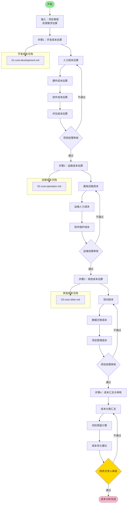

# 成本分析流程标准

**文档编号**：SYS-PI-BC-PROCESS-001  
**版本**：1.0  
**日期**：2026-03-10  
**状态**：已发布

---

## 1. 流程概述

### 1.1 流程定位
- **所属阶段**：第二阶段 - 项目立项（瀑布模式）
- **工作模块**：第1模块 - 成本分析
- **前置输入**：项目章程、资源需求估算
- **后置输出**：成本分析文档（开发成本、运维成本、其他成本）

### 1.2 流程目标
全面识别和估算项目全生命周期的成本，为ROI计算和商业论证提供准确的成本基础数据。

### 1.3 流程范围
涵盖开发成本、运维成本（3年）和其他相关成本的估算。

---

## 2. 流程图



---

## 3. 详细步骤

### 步骤1：开发成本估算

**目标**：估算项目开发阶段的所有成本

**输入**：
- 项目章程
- 资源需求估算
- 里程碑计划

**活动**：

#### 1.1 人力成本估算
- 确定项目团队角色和人数
- 估算各角色投入时间（月）
- 确定人员费率（含社保公积金）
- 计算人力成本小计

**关键角色**：
| 角色 | 人数 | 投入月数 | 参考费率（元/月） |
|-----|------|---------|------------------|
| 项目经理 | 1 | 6 | 25,000 |
| 高级前端工程师 | 2 | 5 | 22,000 |
| 中级前端工程师 | 2 | 5 | 18,000 |
| 高级后端工程师 | 2 | 5 | 24,000 |
| 中级后端工程师 | 2 | 5 | 20,000 |
| 架构师 | 1 | 3 | 30,000 |
| 测试工程师 | 2 | 4 | 16,000 |
| UI/UX设计师 | 1 | 3 | 18,000 |
| 产品经理 | 1 | 4 | 20,000 |
| DevOps工程师 | 1 | 2 | 22,000 |

#### 1.2 硬件成本估算
- 开发环境硬件：笔记本、显示器、外设
- 服务器硬件：开发服务器、测试服务器
- 网络设备：路由器、交换机

#### 1.3 软件成本估算
- 开发工具许可：IDE、设计工具
- 测试工具许可：测试管理工具
- 其他软件：项目管理工具、协作工具

#### 1.4 外包成本估算
- UI设计外包
- 安全渗透测试
- 性能测试服务
- 技术咨询

**风险预留**：建议增加15%风险储备金

**输出**：`01-cost-development.md`

**审核**：项目经理审核成本估算的完整性和准确性

---

### 步骤2：运维成本估算

**目标**：估算系统上线后3年的运维成本

**输入**：
- 系统架构设计
- 用户规模预测
- 数据增长预测

**活动**：

#### 2.1 基础设施成本
- 云服务器：生产环境、预发布环境
- 存储成本：数据库、文件存储、备份
- 网络与带宽：公网带宽、CDN、安全防护

**服务器配置参考**：
| 服务器类型 | 配置 | 数量 | 参考单价（元/月） |
|-----------|------|------|------------------|
| Web应用服务器 | 8核16G | 4 | 1,200 |
| API服务器 | 8核16G | 4 | 1,200 |
| 数据库服务器（主） | 16核32G | 2 | 2,500 |
| 数据库服务器（从） | 16核32G | 2 | 2,500 |
| 缓存服务器 | 4核8G | 2 | 600 |
| 消息队列服务器 | 4核8G | 2 | 600 |

#### 2.2 运维人力成本
- 运维经理
- 运维工程师（高级/中级）
- 数据库管理员（DBA）
- 安全工程师
- 技术支持工程师

**运维团队配置**：
| 角色 | 人数 | 参考费率（元/月） |
|-----|------|------------------|
| 运维经理 | 1 | 22,000 |
| 高级运维工程师 | 2 | 18,000 |
| 中级运维工程师 | 2 | 15,000 |
| DBA | 1 | 20,000 |
| 安全工程师 | 1 | 20,000 |
| 技术支持工程师 | 2 | 12,000 |

#### 2.3 软件维护成本
- 软件许可续费：数据库、监控工具
- 技术支持服务：云服务商、原厂支持

**风险预留**：建议增加10%风险储备金

**输出**：`02-cost-operation.md`

**审核**：运维经理审核资源配置合理性，财务负责人审核成本准确性

---

### 步骤3：其他成本估算

**目标**：估算培训、数据迁移和项目管理成本

**输入**：
- 用户规模
- 数据迁移范围
- 项目管理计划

**活动**：

#### 3.1 培训成本
- 用户培训：系统管理员、普通用户、管理层
- 运维培训：运维工程师、DBA、安全工程师

**培训对象**：
| 培训对象 | 人数 | 培训内容 | 培训方式 |
|---------|------|---------|---------|
| 系统管理员 | 5 | 系统配置、用户管理 | 现场培训 |
| 普通用户 | 200 | 系统功能使用 | 线上+现场 |
| 管理层 | 20 | 报表查看、数据分析 | 现场培训 |
| 运维工程师 | 6 | 系统架构、故障处理 | 现场+实操 |
| DBA | 2 | 数据库管理、性能优化 | 原厂培训 |

#### 3.2 数据迁移成本
- 数据迁移工具
- 数据清洗服务
- 数据验证服务
- 临时存储资源

#### 3.3 项目管理成本
- 项目管理工具
- 会议场地和餐饮
- 项目文档制作
- 项目审计

**风险预留**：建议10-20%风险储备金

**输出**：`03-cost-other.md`

**审核**：项目经理审核成本考虑周全性，财务负责人审核风险预留合理性

---

### 步骤4：成本汇总与审核

**目标**：汇总所有成本并进行最终审核

**输入**：
- 开发成本分析
- 运维成本分析
- 其他成本分析

**活动**：

#### 4.1 成本分类汇总
```
项目总成本 = 开发成本 + 运维成本（3年） + 其他成本
```

**成本构成分析**：
| 成本类别 | 典型占比 |
|---------|---------|
| 开发成本 | 20-25% |
| 运维成本（3年） | 70-75% |
| 其他成本 | 4-5% |

#### 4.2 风险预留计算
- 开发成本：15%风险储备
- 运维成本：10%风险储备
- 其他成本：10-20%风险储备

#### 4.3 成本优化建议
- 基础设施优化：容器化、Serverless
- 人力成本优化：自动化运维、AIOps
- 其他成本优化：线上培训、自动化工具

**审核**：财务负责人审核成本汇总准确性和风险预留合理性

**输出**：成本分析完成确认

---

## 4. 审核流程

### 4.1 审核节点

| 步骤 | 审核人 | 审核重点 | 通过标准 |
|-----|--------|---------|---------|
| 步骤1 | 项目经理 | 开发成本完整性、准确性 | 无重大遗漏 |
| 步骤2 | 运维经理、财务负责人 | 运维资源配置、成本准确性 | 资源合理、数据准确 |
| 步骤3 | 项目经理、财务负责人 | 其他成本周全性、风险预留 | 考虑周全、预留合理 |
| 步骤4 | 财务负责人 | 成本汇总准确性 | 计算无误 |

### 4.2 审核流程图

```
步骤1 → 项目经理审核 → 步骤2 → 运维经理审核 → 财务负责人审核 → 步骤3 → 项目经理审核 → 财务负责人审核 → 步骤4 → 财务负责人审核 → 完成
```

---

## 5. 输入输出

### 5.1 输入文档

| 序号 | 文档名称 | 文档编号 | 来源 |
|-----|---------|---------|------|
| 1 | 项目章程 | SYS-PI-PC-000 | 第1步输出 |
| 2 | 资源需求估算 | SYS-PI-PC-012 | 第1步输出 |
| 3 | 里程碑计划 | SYS-PI-PC-011 | 第1步输出 |

### 5.2 输出文档

| 序号 | 文档名称 | 文档编号 | 说明 |
|-----|---------|---------|------|
| 1 | 开发成本分析 | SYS-PI-BC-001 | 开发阶段成本 |
| 2 | 运维成本分析 | SYS-PI-BC-002 | 3年运维成本 |
| 3 | 其他成本分析 | SYS-PI-BC-003 | 培训、迁移、管理成本 |

---

## 6. 角色与职责

| 角色 | 职责 |
|-----|------|
| 项目经理 | 负责开发成本和其他成本估算，组织审核流程 |
| 运维经理 | 负责运维成本估算，审核资源配置合理性 |
| 财务负责人 | 审核所有成本估算的准确性和合理性 |
| 成本估算师 | 协助进行详细的成本数据收集和计算 |

---

## 7. 注意事项

1. **成本估算方法**：采用自下而上估算，从具体资源需求汇总
2. **数据来源**：参考市场行情、历史项目数据、供应商报价
3. **风险考虑**：充分考虑人员流动、需求变更、技术难点等风险
4. **审核要求**：必须经过项目经理和财务负责人双重审核
5. **文档规范**：使用统一的文档模板和编号体系
6. **版本控制**：成本变更应进行版本管理和变更记录

---

## 8. 质量标准

- 所有成本数据必须有明确的依据和来源
- 人力成本应包含完整的社保公积金等附加成本
- 基础设施成本应考虑3年的增长趋势
- 风险预留比例应符合行业标准和项目特点
- 所有审核节点必须签字确认

---

## 9. 相关文档

- 商业论证与ROI分析工作清单
- 商业论证总流程图
- 商业论证总流程标准
- 成本分析Skill

---

**文档版本历史**

| 版本 | 日期 | 修改内容 | 修改人 |
|-----|------|---------|--------|
| 1.0 | 2026-03-10 | 初始版本 | 项目经理 |

---

*本流程标准用于规范成本分析工作，确保项目成本估算的全面性和准确性。*
