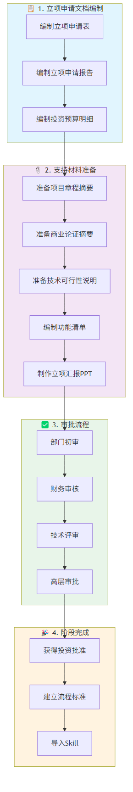

# 立项申请流程指南

> **文档编号**：SYS-PI-PA-PROC-GUIDE  
> **版本**：1.0  
> **日期**：2026-03-13  
> **作者**：产品经理  
> **审核人**：项目经理

---

## 1. 流程概述

### 1.1 流程目的
规范项目立项申请过程，确保立项申请材料完整、审批流程规范、投资决策科学。

### 1.2 适用范围
适用于System系统基础平台项目的立项申请阶段。

### 1.3 流程目标
- 编制完整的立项申请材料
- 完成规范的审批流程
- 获得正式的投资批准

---

## 2. 流程图

---

## 3. 流程步骤

### 3.1 立项申请文档编制

#### 3.1.1 编制立项申请表
**责任人**：产品经理  
**输入**：项目章程、商业论证报告  
**输出**：立项申请表

**工作内容**：
1. 填写项目基本信息
2. 阐述申请理由
3. 明确预期目标
4. 确定项目负责人

**完成标准**：
- [ ] 项目信息完整准确
- [ ] 申请理由充分
- [ ] 目标明确可衡量

#### 3.1.2 编制立项申请报告
**责任人**：产品经理  
**输入**：项目章程、初步方案  
**输出**：立项申请报告

**工作内容**：
1. 项目背景分析
2. 建设内容描述
3. 技术方案概述
4. 实施计划制定
5. 投资预算说明
6. 预期收益分析
7. 风险分析评估

**完成标准**：
- [ ] 内容完整，逻辑清晰
- [ ] 数据准确，来源可靠
- [ ] 方案可行，风险可控

#### 3.1.3 编制投资预算明细
**责任人**：财务负责人  
**输入**：成本分析文档  
**输出**：投资预算明细表

**工作内容**：
1. 开发成本明细
2. 运维成本明细
3. 其他费用明细
4. 预算汇总说明

**完成标准**：
- [ ] 预算数据与商业论证一致
- [ ] 成本分类清晰
- [ ] 计算过程准确

### 3.2 支持材料准备

#### 3.2.1 准备项目章程摘要
**责任人**：项目经理  
**输入**：项目章程  
**输出**：项目章程摘要

**工作内容**：
1. 提炼项目目标
2. 概括项目范围
3. 列出关键里程碑

#### 3.2.2 准备商业论证摘要
**责任人**：产品经理  
**输入**：商业论证汇总报告  
**输出**：商业论证摘要

**工作内容**：
1. ROI分析摘要
2. NPV/IRR指标摘要
3. 风险评估摘要

#### 3.2.3 准备技术可行性说明
**责任人**：技术负责人  
**输入**：初步方案  
**输出**：技术可行性说明

**工作内容**：
1. 技术架构说明
2. 技术风险评估
3. 技术保障措施

#### 3.2.4 编制功能清单
**责任人**：产品经理  
**输入**：需求分析文档  
**输出**：功能清单

**工作内容**：
1. 功能需求清单
   - 用户中心
   - 权限管理
   - 组织架构
   - 数据字典
   - 流程引擎
   - 系统监控

2. 非功能需求清单
   - 性能要求
   - 安全要求
   - 可用性要求
   - 可扩展性要求
   - 可维护性要求

#### 3.2.5 制作立项汇报PPT
**责任人**：产品经理  
**输入**：立项申请报告  
**输出**：立项汇报PPT

**PPT内容**：
1. 项目概述（背景、目标、范围）
2. 技术方案（架构、关键技术）
3. 投资预算（成本、收益、ROI）
4. 实施计划（里程碑、团队）
5. 风险与对策

### 3.3 审批流程

#### 3.3.1 部门初审
**审批人**：业务部门负责人  
**输入**：立项申请材料  
**输出**：部门初审意见

**审核内容**：
1. 项目必要性
2. 业务可行性
3. 资源匹配度

**审批结果**：
- ✅ 通过：进入财务审核
- ❌ 不通过：退回修改

#### 3.3.2 财务审核
**审批人**：财务负责人  
**输入**：投资预算明细  
**输出**：财务审核意见

**审核内容**：
1. 预算合理性
2. 资金来源
3. 投资回报

**审批结果**：
- ✅ 通过：进入技术评审
- ❌ 不通过：退回修改

#### 3.3.3 技术评审
**审批人**：技术委员会  
**输入**：技术可行性说明  
**输出**：技术评审意见

**审核内容**：
1. 技术可行性
2. 技术风险
3. 技术方案

**审批结果**：
- ✅ 通过：进入高层审批
- ❌ 不通过：退回修改

#### 3.3.4 高层审批
**审批人**：项目发起人/总经理  
**输入**：全套立项材料  
**输出**：投资决策

**审核内容**：
1. 战略价值
2. 投资效益
3. 风险可控性
4. 资源保障

**审批结果**：
- ✅ 批准：项目正式立项
- ❌ 不批准：项目终止或重新论证

### 3.4 流程标准建立

#### 3.4.1 建立流程标准文档
**责任人**：产品经理  
**输出**：立项申请流程标准

**内容**：
1. 流程步骤说明
2. 审批节点定义
3. 文档模板规范

#### 3.4.2 导入Skill
**责任人**：产品经理  
**输出**：立项申请Skill

**操作**：
1. 创建Skill文件
2. 导入系统
3. 备份到03-skills目录

---

## 4. 角色与职责

| 角色 | 职责 |
|-----|------|
| 产品经理 | 编制立项申请材料、制作PPT、建立流程标准 |
| 项目经理 | 准备项目章程摘要、协调审批流程 |
| 财务负责人 | 编制投资预算、财务审核 |
| 技术负责人 | 准备技术可行性说明、参与技术评审 |
| 业务部门负责人 | 部门初审 |
| 技术委员会 | 技术评审 |
| 项目发起人/总经理 | 高层审批、投资决策 |

---

## 5. 输入输出

### 5.1 输入文档
| 序号 | 文档名称 | 来源 |
|-----|---------|------|
| 1 | 项目章程 | 01-project-charter |
| 2 | 商业论证汇总报告 | 02-business-case |
| 3 | 初步方案 | 00-project-preparation |

### 5.2 输出文档
| 序号 | 文档名称 | 位置 |
|-----|---------|------|
| 1 | 立项申请表 | 01-application-documents/ |
| 2 | 立项申请报告 | 01-application-documents/ |
| 3 | 投资预算明细 | 01-application-documents/ |
| 4 | 项目章程摘要 | 02-supporting-materials/ |
| 5 | 商业论证摘要 | 02-supporting-materials/ |
| 6 | 技术可行性说明 | 02-supporting-materials/ |
| 7 | 功能清单 | 02-supporting-materials/ |
| 8 | 立项汇报PPT | 02-supporting-materials/ |
| 9 | 部门初审记录 | 03-approval-records/ |
| 10 | 财务审核记录 | 03-approval-records/ |
| 11 | 技术评审记录 | 03-approval-records/ |
| 12 | 高层审批表 | 03-approval-records/ |

---

## 6. 流程标准

### 6.1 文档规范
- 所有文档使用Markdown格式（PPT除外）
- 文档编号遵循SYS-PI-PA-XXX规则
- 文档需经过审核并签字

### 6.2 审批规范
- 每个审批环节需明确审批意见
- 审批不通过需说明原因并退回
- 所有审批记录需归档保存

### 6.3 时间要求
| 任务 | 时间要求 |
|-----|---------|
| 立项申请文档编制 | 3个工作日 |
| 支持材料准备 | 2个工作日 |
| 审批流程 | 5个工作日 |
| **总计** | **10个工作日** |

---

## 7. 审核记录

| 审核项 | 审核人 | 审核日期 | 审核结果 |
|-------|-------|---------|---------|
| 流程完整性 | | | 待审核 |
| 步骤清晰性 | | | 待审核 |
| 可操作性 | | | 待审核 |

---

**文档审批**

| 角色 | 签名 | 日期 |
|-----|------|------|
| 编制人 | 产品经理 | 2026-03-13 |
| 审核人 | 项目经理 | |
| 批准人 | 项目发起人 | |

---

*版本历史*

| 版本 | 日期 | 修改内容 | 修改人 |
|-----|------|---------|-------|
| 1.0 | 2026-03-13 | 初始版本 | 产品经理 |
