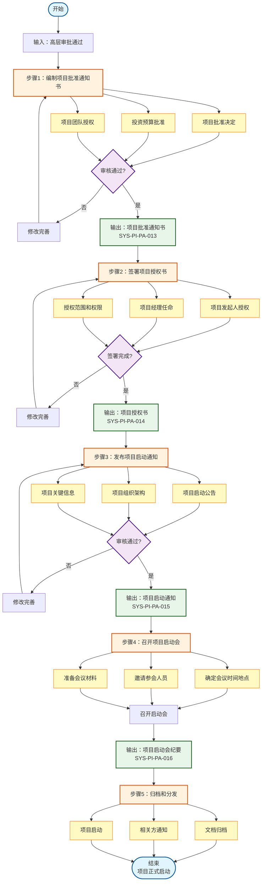

# 项目审批流程指南

> **文档编号**：SYS-PI-PA-PROC-001-GUIDE  
> **版本**：1.0  
> **日期**：2026-03-13  
> **作者**：项目经理  
> **审核人**：项目发起人  
> **状态**：⏳ 待审核

---

## 一、流程概述

### 1.1 流程目的
规范项目正式审批和授权流程，确保项目获得正式批准和授权，顺利启动项目执行。

### 1.2 适用范围
适用于System系统基础平台项目的正式审批和授权工作。

### 1.3 流程目标
- 编制项目批准通知书
- 签署项目授权书
- 发布项目启动通知
- 召开项目启动会
- 完成文档归档和分发

---

## 二、流程图

---

## 三、流程步骤详解

### 步骤1：编制项目批准通知书

**责任人**：项目经理  
**预计耗时**：0.5天  
**输入**：高层审批表（SYS-PI-PA-010）  
**输出**：项目批准通知书（SYS-PI-PA-013）

#### 3.1.1 项目批准决定
- 项目名称：System系统基础平台项目
- 项目编号：SYS-2026-001
- 批准决定：正式批准项目立项

#### 3.1.2 投资预算批准
- 批准总投资：469.92万元
- 年度预算分配：2026年280万、2027年120万、2028年69.92万
- 资金来源：年度IT预算

#### 3.1.3 项目团队授权
- 项目经理：张经理
- 项目团队：10人
- 授权范围：预算内资金支配权、团队调配权等

#### 3.1.4 审核流程
- 编制人自检
- 项目发起人审核
- 修改完善
- 最终确认

---

### 步骤2：签署项目授权书

**责任人**：项目发起人、项目经理  
**预计耗时**：0.5天  
**输入**：项目批准通知书  
**输出**：项目授权书（SYS-PI-PA-014）

#### 3.2.1 项目发起人授权
- 授权人：吴副总（项目发起人）
- 被授权人：张经理（项目经理）
- 授权期限：2026-03-17 至 2026-09-29

#### 3.2.2 项目经理任命
- 正式任命张经理为项目经理
- 明确项目经理职责和权限

#### 3.2.3 授权范围和权限
- 预算内资金支配权
- 项目团队成员调配权
- 项目进度计划调整权
- 项目范围变更审批权（预算内）

#### 3.2.4 签署流程
- 编制授权书
- 双方审阅确认
- 正式签署
- 归档保存

---

### 步骤3：发布项目启动通知

**责任人**：项目经理  
**预计耗时**：0.5天  
**输入**：项目授权书  
**输出**：项目启动通知（SYS-PI-PA-015）

#### 3.3.1 项目启动公告
- 项目正式启动公告
- 项目目标和意义
- 项目周期和里程碑

#### 3.3.2 项目组织架构
- 项目发起人：吴副总
- 项目经理：张经理
- 核心团队成员

#### 3.3.3 项目关键信息
- 项目编号：SYS-2026-001
- 项目周期：18个月
- 总投资：469.92万元

#### 3.3.4 发布流程
- 编制通知
- 审核确认
- 正式发布
- 确认收到

---

### 步骤4：召开项目启动会

**责任人**：项目经理  
**预计耗时**：0.5天  
**输入**：项目启动通知  
**输出**：项目启动会纪要（SYS-PI-PA-016）

#### 3.4.1 确定会议时间地点
- 会议时间：2026-03-17 上午9:00
- 会议地点：公司大会议室
- 会议时长：2小时

#### 3.4.2 邀请参会人员
- 项目发起人：吴副总
- 项目经理：张经理
- 核心团队成员
- 相关部门负责人

#### 3.4.3 准备会议材料
- 项目介绍PPT
- 项目计划
- 项目章程
- 立项申请报告

#### 3.4.4 召开启动会
- 项目介绍
- 目标明确
- 计划确认
- 团队动员
- 问题解答

---

### 步骤5：归档和分发

**责任人**：项目经理  
**预计耗时**：0.5天  
**输入**：所有审批文档  
**输出**：归档完成确认

#### 3.5.1 文档归档
- 项目批准通知书
- 项目授权书
- 项目启动通知
- 项目启动会纪要

#### 3.5.2 相关方通知
- 通知项目团队
- 通知相关部门
- 通知利益相关方

#### 3.5.3 项目启动
- 正式启动项目执行
- 开始项目管理工作
- 启动项目监控

---

## 四、流程标准

### 4.1 文档规范
- 所有文档使用Markdown格式
- 文档编号遵循SYS-PI-PA-XXX规则
- 文档需经过审核并签字

### 4.2 审核流程
- 编制人自检
- 项目发起人审核
- 问题修改完善
- 最终确认签字

### 4.3 时间要求
| 任务 | 时间要求 |
|-----|---------|
| 项目批准通知书 | 0.5个工作日 |
| 项目授权书 | 0.5个工作日 |
| 项目启动通知 | 0.5个工作日 |
| 项目启动会 | 0.5个工作日 |
| 归档和分发 | 0.5个工作日 |
| **总计** | **2.5个工作日** |

---

## 五、关键控制点

| 控制点 | 控制内容 | 责任人 |
|--------|---------|--------|
| 批准决定 | 确保项目获得正式批准 | 项目发起人 |
| 预算批准 | 确保投资预算获得批准 | 财务负责人 |
| 授权签署 | 确保授权书正式签署 | 项目发起人 |
| 启动通知 | 确保通知覆盖所有相关方 | 项目经理 |
| 启动会 | 确保启动会顺利召开 | 项目经理 |

---

## 六、常见问题

### Q1：项目批准通知书和高层审批表有什么区别？
**A**：高层审批表是审批过程的记录，项目批准通知书是正式的批准文件，具有法律效力。

### Q2：项目授权书必须签署吗？
**A**：是的，项目授权书是项目经理获得正式授权的法律文件，必须签署。

### Q3：项目启动会必须召开吗？
**A**：是的，项目启动会是项目正式启动的标志，必须召开。

---

## 七、相关文档

- 高层审批表：SYS-PI-PA-010
- 项目章程：SYS-PI-PC-000
- 立项申请报告：SYS-PI-PA-002
- 流程图：project-approval-process.mmd

---

**指南编制**：项目经理  
**指南审核**：项目发起人  
**编制日期**：2026-03-13

---

*版本历史*

| 版本 | 日期 | 修改内容 | 修改人 |
|-----|------|---------|-------|
| 1.0 | 2026-03-13 | 初始版本 | 项目经理 |
