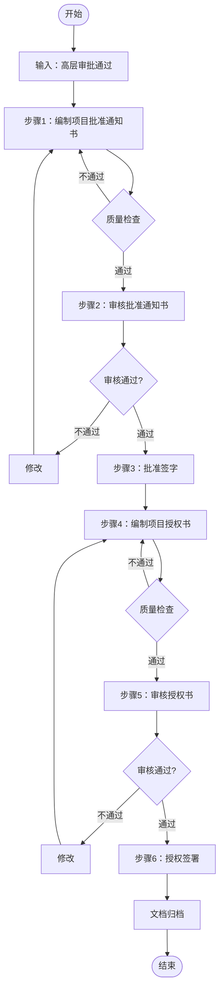

# 项目审批文档编制流程标准

> **文档编号**：SYS-PI-PA-PROC-001  
> **版本**：1.0  
> **编制日期**：2026-03-13  
> **编制部门**：项目管理办公室  
> **适用范围**：项目审批阶段 - 审批文档编制

---

## 一、流程概述

### 1.1 流程目的
规范项目审批阶段审批文档的编制过程，确保项目批准通知书和项目授权书的内容完整、格式规范、审批流程合规。

### 1.2 适用范围
- 项目批准通知书的编制与审批
- 项目授权书的编制与签署

### 1.3 输入条件
- 高层审批表（SYS-PI-PA-010）已批准
- 项目章程（SYS-PI-PC-000）已完成
- 立项申请报告（SYS-PI-PA-002）已审批
- 各部门审查意见已汇总

### 1.4 输出成果
| 序号 | 文档名称 | 文档编号 | 存储位置 |
|-----|---------|---------|---------|
| 1 | 项目批准通知书 | SYS-PI-PA-013 | `01-approval-documents/01-project-approval-notice.md` |
| 2 | 项目授权书 | SYS-PI-PA-014 | `01-approval-documents/02-project-authorization-letter.md` |

---

## 二、流程步骤

### 步骤1：编制项目批准通知书

**步骤编号**：PA-DOC-001  
**步骤名称**：编制项目批准通知书  
**执行角色**：项目管理办公室  
**预计工时**：0.5天

#### 2.1.1 输入信息
- 高层审批表（SYS-PI-PA-010）
- 项目章程（SYS-PI-PC-000）
- 立项申请报告（SYS-PI-PA-002）
- 部门审查意见
- 财务审查意见
- 技术审查意见

#### 2.1.2 编制内容

**1. 批准决定部分**
- 项目基本信息（名称、编号、部门、日期）
- 批准结果（批准立项/不予批准）
- 批准依据（相关文档清单）
- 投资预算批准（分项预算明细）
- 项目团队授权（组织架构、核心成员）

**2. 项目目标确认**
- 业务目标及成功标准
- 技术目标及成功标准
- 管理目标及成功标准
- 质量目标及成功标准
- 项目范围（包含/不包含）
- 关键里程碑计划

**3. 管理要求**
- 进度管理要求
- 质量管理要求
- 风险管理要求
- 变更管理要求
- 报告要求（周报、月报、里程碑报告）
- 沟通要求

**4. 资源保障**
- 人力资源配置
- 基础设施配置

#### 2.1.3 质量检查点
- [ ] 项目基本信息准确无误
- [ ] 预算金额与财务审查一致
- [ ] 里程碑时间与项目计划一致
- [ ] 团队配置符合项目需求
- [ ] 管理要求明确可执行

#### 2.1.4 输出物
- 项目批准通知书（初稿）

---

### 步骤2：审核项目批准通知书

**步骤编号**：PA-DOC-002  
**步骤名称**：审核项目批准通知书  
**执行角色**：项目发起人、相关部门负责人  
**预计工时**：0.5天

#### 2.2.1 审核流程

| 审核顺序 | 审核人 | 审核重点 | 审核时限 |
|---------|--------|---------|---------|
| 1 | 项目发起人 | 项目目标、预算合理性 | 1个工作日 |
| 2 | 信息技术部总监 | 技术方案、资源可行性 | 1个工作日 |
| 3 | 财务总监 | 预算准确性、资金来源 | 1个工作日 |
| 4 | 总经理 | 整体合理性、战略契合度 | 1个工作日 |

#### 2.2.2 审核内容

**项目发起人审核**：
- 项目目标是否符合战略方向
- 项目范围是否明确
- 预算是否合理
- 里程碑是否可行

**IT总监审核**：
- 技术方案是否可行
- 技术资源配置是否合理
- 技术风险是否可控

**财务总监审核**：
- 预算编制是否准确
- 资金来源是否落实
- 预算分类是否合理

**总经理审核**：
- 项目整体价值
- 与公司战略契合度
- 资源投入合理性

#### 2.2.3 审核结果处理

**审核通过**：
- 进入步骤3：批准签字

**审核不通过**：
- 记录修改意见
- 返回步骤1修改
- 重新提交审核

#### 2.2.4 输出物
- 审核意见记录
- 批准通知书（审核稿）

---

### 步骤3：批准签字

**步骤编号**：PA-DOC-003  
**步骤名称**：项目批准通知书签字  
**执行角色**：各级审批人  
**预计工时**：0.5天

#### 2.3.1 签字顺序

```
编制人签字 → 审核人签字 → 项目发起人签字 → IT总监签字 → 财务总监签字 → 总经理签字
```

#### 2.3.2 签字要求

| 签字人 | 签字位置 | 意见要求 |
|-------|---------|---------|
| 编制人 | 编制栏 | 确认内容完整准确 |
| 审核人 | 审核栏 | 确认审核通过 |
| 项目发起人 | 批准栏 | 批准立项，同意配置 |
| IT总监 | 批准栏 | 技术可行，资源落实 |
| 财务总监 | 批准栏 | 预算合理，资金确认 |
| 总经理 | 批准栏 | 同意批准，按计划执行 |

#### 2.3.3 文档归档
- 原件存档于项目管理办公室
- 扫描件分发相关部门
- 更新项目文档清单

#### 2.3.4 输出物
- 项目批准通知书（正式版）

---

### 步骤4：编制项目授权书

**步骤编号**：PA-DOC-004  
**步骤名称**：编制项目授权书  
**执行角色**：项目管理办公室  
**预计工时**：0.5天

#### 2.4.1 输入信息
- 项目批准通知书（SYS-PI-PA-013）
- 项目章程（SYS-PI-PC-000）
- 项目经理候选人信息
- 项目发起人信息

#### 2.4.2 编制内容

**1. 授权声明**
- 授权依据（批准通知书引用）
- 项目基本信息
- 授权日期和有效期

**2. 项目发起人授权**
- 发起人信息
- 核心职责
- 决策权限明细

**3. 项目经理任命**
- 项目经理信息
- 管理职责
- 权限明细：
  - 人员管理权限
  - 财务管理权限
  - 技术决策权限
  - 日常管理权限

**4. 核心团队成员任命**
- 技术负责人任命
- 业务负责人任命
- 项目管理专员任命

**5. 授权限制**
- 需上报审批的事项
- 禁止事项
- 授权有效期

**6. 责任与义务**
- 项目发起人责任
- 项目经理责任
- 团队成员责任

#### 2.4.3 质量检查点
- [ ] 授权依据引用正确
- [ ] 权限范围明确清晰
- [ ] 责任界定清楚
- [ ] 限制条件合理

#### 2.4.4 输出物
- 项目授权书（初稿）

---

### 步骤5：审核项目授权书

**步骤编号**：PA-DOC-005  
**步骤名称**：审核项目授权书  
**执行角色**：项目发起人、人力资源部、法务部  
**预计工时**：0.5天

#### 2.5.1 审核流程

| 审核顺序 | 审核人 | 审核重点 | 审核时限 |
|---------|--------|---------|---------|
| 1 | 项目发起人 | 授权范围合理性 | 1个工作日 |
| 2 | 人力资源部 | 人员任命合规性 | 1个工作日 |
| 3 | 法务部 | 法律合规性 | 1个工作日（如需要） |

#### 2.5.2 审核内容

**项目发起人审核**：
- 授权范围是否适当
- 权限边界是否清晰
- 责任界定是否合理

**人力资源部审核**：
- 人员任命是否符合制度
- 绩效考核方式是否明确
- 汇报关系是否清晰

**法务部审核**（如需要）：
- 授权条款是否合法
- 责任条款是否合规

#### 2.5.3 输出物
- 审核意见记录
- 项目授权书（审核稿）

---

### 步骤6：授权签署

**步骤编号**：PA-DOC-006  
**步骤名称**：项目授权书签署  
**执行角色**：项目发起人、项目经理、见证人  
**预计工时**：0.5天

#### 2.6.1 签署顺序

```
项目发起人签署 → 项目经理签署 → 见证人签署
```

#### 2.6.2 签署要求

| 签署人 | 签署位置 | 意见要求 |
|-------|---------|---------|
| 项目发起人 | 发起人签署栏 | 正式授权，提供支持 |
| 项目经理 | 项目经理签署栏 | 接受授权，承诺履职 |
| HR代表 | 见证人栏 | 见证签署过程 |
| IT总监 | 见证人栏 | 见证签署过程 |
| PMO | 见证人栏 | 见证签署过程 |

#### 2.6.3 签署仪式
- 正式签署仪式
- 三方各执一份
- 拍照存档

#### 2.6.4 文档归档
- 原件三方各执一份
- 扫描件存档
- 更新项目文档清单

#### 2.6.5 输出物
- 项目授权书（正式版）

---

## 三、流程控制

### 3.1 流程入口条件
- 高层审批表已批准
- 项目章程已完成
- 立项申请报告已审批

### 3.2 流程退出条件
- 项目批准通知书已签字
- 项目授权书已签署

### 3.3 关键控制点

| 控制点 | 控制内容 | 控制方式 |
|-------|---------|---------|
| CP1 | 批准通知书内容完整性 | 质量检查清单 |
| CP2 | 预算金额准确性 | 与财务审查核对 |
| CP3 | 授权范围合理性 | 项目发起人确认 |
| CP4 | 签字完整性 | 签字栏检查 |

### 3.4 异常处理

**场景1：审核不通过**
- 记录审核意见
- 返回修改
- 重新提交审核

**场景2：签字人不在**
- 授权他人代签
- 或延期签署
- 需书面说明

**场景3：授权范围争议**
- 召开协调会
- 明确权限边界
- 书面确认

---

## 四、质量标准

### 4.1 文档质量标准

| 质量项 | 标准 | 检查方法 |
|-------|------|---------|
| 完整性 | 所有必填项已填写 | 逐项检查 |
| 准确性 | 数据与源文档一致 | 交叉核对 |
| 规范性 | 格式符合模板要求 | 模板比对 |
| 一致性 | 各文档间信息一致 | 文档比对 |

### 4.2 审批质量标准

| 质量项 | 标准 | 检查方法 |
|-------|------|---------|
| 审核完整性 | 所有审核环节已完成 | 审核记录检查 |
| 签字完整性 | 所有签字栏已签署 | 签字页检查 |
| 意见明确性 | 审核意见清晰明确 | 意见内容检查 |

---

## 五、模板与工具

### 5.1 文档模板

| 模板名称 | 用途 | 位置 |
|---------|------|------|
| 项目批准通知书模板 | 编制批准通知书 | 项目管理办公室 |
| 项目授权书模板 | 编制授权书 | 项目管理办公室 |

### 5.2 检查清单

- 项目批准通知书编制检查清单
- 项目授权书编制检查清单
- 审核意见记录表

### 5.3 参考文档

- 《项目管理规范》
- 《文档管理规范》
- 《授权管理制度》

---

## 六、角色与职责

| 角色 | 职责 | 参与步骤 |
|-----|------|---------|
| 项目管理办公室 | 文档编制、流程协调 | 步骤1、4 |
| 项目发起人 | 审核、批准、授权 | 步骤2、3、5、6 |
| IT总监 | 技术审核、见证签署 | 步骤2、3、6 |
| 财务总监 | 财务审核、批准 | 步骤2、3 |
| 总经理 | 最终批准 | 步骤3 |
| 人力资源部 | 人员任命审核、见证 | 步骤5、6 |
| 项目经理 | 接受授权 | 步骤6 |

---

## 七、流程度量

### 7.1 效率指标

| 指标 | 目标值 | 计算方法 |
|-----|-------|---------|
| 编制周期 | ≤1天 | 步骤1+4实际用时 |
| 审核周期 | ≤2天 | 步骤2+5实际用时 |
| 签署周期 | ≤1天 | 步骤3+6实际用时 |
| 总周期 | ≤4天 | 全流程实际用时 |

### 7.2 质量指标

| 指标 | 目标值 | 计算方法 |
|-----|-------|---------|
| 一次通过率 | ≥80% | 一次通过次数/总次数 |
| 返工率 | ≤20% | 返工次数/总次数 |
| 文档完整率 | 100% | 完整文档数/总文档数 |

---

## 八、附录

### 8.1 流程图



### 8.2 文档清单

| 序号 | 文档名称 | 文档编号 | 责任人 | 保存期限 |
|-----|---------|---------|--------|---------|
| 1 | 项目批准通知书 | SYS-PI-PA-013 | PMO | 项目结束后5年 |
| 2 | 项目授权书 | SYS-PI-PA-014 | PMO | 项目结束后5年 |
| 3 | 审核意见记录 | - | PMO | 项目结束后3年 |

---

## 九、文档信息

| 属性 | 内容 |
|-----|------|
| **文档编号** | SYS-PI-PA-PROC-001 |
| **文档名称** | 项目审批文档编制流程标准 |
| **版本** | 1.0 |
| **编制日期** | 2026-03-13 |
| **编制部门** | 项目管理办公室 |
| **密级** | 内部公开 |
| **保存期限** | 长期有效 |

---

*本文档为项目审批文档编制的标准流程，请严格执行。*
