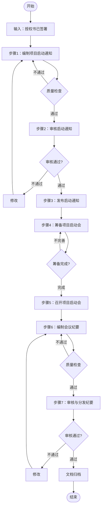

# 项目启动流程标准

> **文档编号**：SYS-PI-PA-PROC-002  
> **版本**：1.0  
> **编制日期**：2026-03-15  
> **编制部门**：项目管理办公室  
> **适用范围**：项目审批阶段 - 项目启动

---

## 一、流程概述

### 1.1 流程目的
规范项目启动阶段的工作流程，确保项目启动通知发布和项目启动会召开的顺利进行，为项目正式进入执行阶段奠定基础。

### 1.2 适用范围
- 项目启动通知的编制与发布
- 项目启动会的筹备与召开

### 1.3 输入条件
- 项目批准通知书（SYS-PI-PA-013）已签署
- 项目授权书（SYS-PI-PA-014）已签署
- 项目团队已组建
- 项目办公环境已准备

### 1.4 输出成果
| 序号 | 文档名称 | 文档编号 | 存储位置 |
|-----|---------|---------|---------|
| 1 | 项目启动通知 | SYS-PI-PA-015 | `02-project-launch/03-project-launch-notice.md` |
| 2 | 项目启动会纪要 | SYS-PI-PA-016 | `02-project-launch/04-project-kickoff-minutes.md` |

---

## 二、流程步骤

### 步骤1：编制项目启动通知

**步骤编号**：PL-001  
**步骤名称**：编制项目启动通知  
**执行角色**：项目管理办公室  
**预计工时**：0.5天

#### 2.1.1 输入信息
- 项目批准通知书（SYS-PI-PA-013）
- 项目授权书（SYS-PI-PA-014）
- 项目章程（SYS-PI-PC-000）
- 项目计划书（初稿）
- 项目团队成员名单

#### 2.1.2 编制内容

**1. 通知正文**
- 启动公告（项目批准信息）
- 批准文号、日期、预算、周期

**2. 项目组织架构**
- 项目指导委员会成员
- 项目管理团队
- 项目团队成员

**3. 项目关键信息**
- 项目目标（业务、技术、管理、质量）
- 项目范围（包含/不包含）
- 关键里程碑计划

**4. 沟通机制**
- 沟通渠道（日报、周会、月报）
- 联系方式
- 汇报关系

**5. 相关方配合要求**
- 业务部门配合要求
- 技术部门配合要求
- 其他部门配合要求

**6. 项目启动会安排**
- 会议时间、地点
- 参会人员
- 会议议程

#### 2.1.3 质量检查点
- [ ] 项目信息准确无误
- [ ] 组织架构完整清晰
- [ ] 里程碑时间与计划一致
- [ ] 沟通机制明确可行
- [ ] 配合要求具体明确

#### 2.1.4 输出物
- 项目启动通知（初稿）

---

### 步骤2：审核项目启动通知

**步骤编号**：PL-002  
**步骤名称**：审核项目启动通知  
**执行角色**：项目经理、项目发起人  
**预计工时**：0.5天

#### 2.2.1 审核流程

| 审核顺序 | 审核人 | 审核重点 | 审核时限 |
|---------|--------|---------|---------|
| 1 | 项目经理 | 内容完整性、准确性 | 0.5个工作日 |
| 2 | 项目发起人 | 战略一致性、权威性 | 0.5个工作日 |

#### 2.2.2 审核内容

**项目经理审核**：
- 项目信息是否准确
- 团队信息是否完整
- 里程碑是否可行
- 沟通机制是否合理

**项目发起人审核**：
- 内容是否符合公司规范
- 授权信息是否准确
- 发布范围是否适当

#### 2.2.3 审核结果处理

**审核通过**：
- 进入步骤3：发布启动通知

**审核不通过**：
- 记录修改意见
- 返回步骤1修改
- 重新提交审核

#### 2.2.4 输出物
- 审核意见记录
- 项目启动通知（审核稿）

---

### 步骤3：发布项目启动通知

**步骤编号**：PL-003  
**步骤名称**：发布项目启动通知  
**执行角色**：项目管理办公室  
**预计工时**：0.5天

#### 2.3.1 发布准备

**确认发布范围**：
- 公司管理层
- 项目指导委员会成员
- 项目团队成员
- 相关部门负责人
- 关键用户代表

**准备发布渠道**：
- 邮件列表
- 公告栏
- 内部OA系统
- 项目协作平台

#### 2.3.2 发布执行

**邮件发布**：
- 发送给所有相关方
- 抄送项目指导委员会
- 设置回执确认

**公告发布**：
- 公告栏张贴
- OA系统发布
- 协作平台同步

#### 2.3.3 发布确认

**确认接收**：
- 跟踪邮件回执
- 确认关键人员已阅
- 记录未接收人员

**补充通知**：
- 对未接收人员单独通知
- 确保信息传达到位

#### 2.3.4 输出物
- 项目启动通知（正式发布）
- 发布记录

---

### 步骤4：筹备项目启动会

**步骤编号**：PL-004  
**步骤名称**：筹备项目启动会  
**执行角色**：项目管理专员  
**预计工时**：1天

#### 2.4.1 会议规划

**确定会议信息**：
| 项目 | 内容 |
|-----|------|
| 会议名称 | 智慧企业管理系统平台建设项目启动会 |
| 会议时间 | [具体日期时间] |
| 会议地点 | [会议室名称] |
| 会议形式 | 现场会议/视频会议 |

**制定会议议程**：
| 时间 | 议程 | 主讲人 | 时长 |
|-----|------|--------|------|
| 开场致辞 | 项目发起人 | 10分钟 |
| 项目介绍 | 项目经理 | 20分钟 |
| 技术方案概述 | 技术负责人 | 20分钟 |
| 业务需求说明 | 业务负责人 | 20分钟 |
| 项目实施计划 | 项目经理 | 20分钟 |
| 问答与讨论 | 全体参会人员 | 20分钟 |
| 总结与动员 | 项目发起人 | 10分钟 |

#### 2.4.2 参会人员邀请

**必须参会人员**：
- 项目发起人
- 项目经理
- 技术负责人
- 业务负责人
- 项目指导委员会成员

**邀请参会人员**：
- 项目团队成员
- 相关部门负责人
- 关键用户代表

**发送会议邀请**：
- 提前3-5天发送邀请
- 包含会议议程
- 要求确认出席

#### 2.4.3 会议材料准备

**演示材料**：
- 项目介绍PPT
- 技术方案PPT
- 业务需求PPT
- 实施计划PPT

**文档材料**：
- 项目启动通知
- 项目批准通知书
- 项目授权书
- 项目章程
- 会议签到表

**设备准备**：
- 投影仪/显示屏
- 音响设备
- 视频会议设备（如需要）
- 翻页笔
- 录音设备（如需要）

#### 2.4.4 会场布置

**物理会场**：
- 座位安排（按角色分区）
- 名牌摆放
- 资料摆放
- 茶水准备

**虚拟会场**（如线上）：
- 会议室创建
- 权限设置
- 设备测试

#### 2.4.5 质量检查点
- [ ] 会议时间地点已确认
- [ ] 所有参会人员已邀请并确认
- [ ] 演示材料已准备并测试
- [ ] 会议设备已调试
- [ ] 会场已布置完成

#### 2.4.6 输出物
- 会议邀请函
- 会议议程
- 演示材料
- 会议材料包

---

### 步骤5：召开项目启动会

**步骤编号**：PL-005  
**步骤名称**：召开项目启动会  
**执行角色**：项目发起人、项目经理、全体参会人员  
**预计工时**：0.5-1天

#### 2.5.1 会前准备

**提前到场**：
- 提前30分钟到场
- 设备最终检查
- 材料最终确认
- 接待参会人员

**签到管理**：
- 参会人员签到
- 发放会议材料
- 引导入座

#### 2.5.2 会议执行

**按议程进行**：
1. **开场致辞**（项目发起人）
   - 宣布项目启动
   - 强调项目重要性
   - 表达期望和支持

2. **项目介绍**（项目经理）
   - 项目背景和目标
   - 项目基本信息
   - 项目组织架构

3. **技术方案概述**（技术负责人）
   - 技术架构
   - 技术选型
   - 关键技术点

4. **业务需求说明**（业务负责人）
   - 业务目标
   - 核心功能
   - 配合要求

5. **项目实施计划**（项目经理）
   - 阶段划分
   - 里程碑计划
   - 管理机制

6. **问答与讨论**（全体参会人员）
   - 回答问题
   - 收集意见
   - 讨论问题

7. **总结与动员**（项目发起人）
   - 总结要点
   - 明确责任
   - 团队动员

**会议记录**：
- 记录会议内容
- 记录决议事项
- 记录行动项
- 记录问题与风险

#### 2.5.3 会后整理

**会场整理**：
- 收集会议材料
- 整理会场
- 设备归位

**资料整理**：
- 整理会议记录
- 收集演示材料
- 整理签到表

#### 2.5.4 输出物
- 会议记录（初稿）
- 签到表
- 演示材料（最终版）

---

### 步骤6：编制项目启动会纪要

**步骤编号**：PL-006  
**步骤名称**：编制项目启动会纪要  
**执行角色**：项目管理专员  
**预计工时**：0.5天

#### 2.6.1 输入信息
- 会议记录
- 签到表
- 演示材料
- 会议决议

#### 2.6.2 编制内容

**1. 会议基本信息**
- 会议名称、时间、地点
- 参会人员名单
- 缺席人员名单

**2. 会议议程记录**
- 每个议程的内容要点
- 关键发言记录
- 讨论要点记录

**3. 会议决议**
- 决议事项列表
- 决策人
- 决议状态

**4. 行动项**
- 待办事项列表
- 负责人
- 完成期限
- 优先级

**5. 风险与问题**
- 识别的风险
- 待解决的问题

**6. 会议评价**
- 会议效果评价
- 改进建议

#### 2.6.3 质量检查点
- [ ] 会议信息准确完整
- [ ] 议程记录清晰完整
- [ ] 决议事项明确
- [ ] 行动项可执行
- [ ] 风险问题已记录

#### 2.6.4 输出物
- 项目启动会纪要（初稿）

---

### 步骤7：审核与分发纪要

**步骤编号**：PL-007  
**步骤名称**：审核与分发项目启动会纪要  
**执行角色**：项目经理、项目发起人  
**预计工时**：0.5天

#### 2.7.1 纪要审核

**项目经理审核**：
- 内容准确性
- 完整性检查
- 行动项合理性

**项目发起人审核**：
- 决议事项准确性
- 授权信息准确性
- 整体质量把关

#### 2.7.2 纪要修改

根据审核意见修改纪要，确保：
- 内容准确无误
- 决议清晰明确
- 行动项可执行

#### 2.7.3 纪要分发

**分发范围**：
- 所有参会人员
- 项目相关方
- 相关部门负责人

**分发方式**：
- 邮件发送
- 项目文档库上传
- 协作平台同步

**分发确认**：
- 确认关键人员已接收
- 收集反馈意见

#### 2.7.4 输出物
- 项目启动会纪要（正式版）
- 分发记录

---

## 三、流程控制

### 3.1 流程入口条件
- 项目批准通知书已签署
- 项目授权书已签署
- 项目团队已组建

### 3.2 流程退出条件
- 项目启动通知已发布
- 项目启动会已召开
- 项目启动会纪要已分发

### 3.3 关键控制点

| 控制点 | 控制内容 | 控制方式 |
|-------|---------|---------|
| CP1 | 启动通知内容准确性 | 与批准文档核对 |
| CP2 | 参会人员邀请完整性 | 参会人员清单检查 |
| CP3 | 会议材料准备充分性 | 材料清单检查 |
| CP4 | 纪要内容完整性 | 纪要模板检查 |

### 3.4 异常处理

**场景1：关键人员无法参会**
- 提前录制视频发言
- 会后单独沟通
- 委托代表参会

**场景2：会议时间冲突**
- 协调调整时间
- 分批次召开
- 改为线上会议

**场景3：纪要审核不通过**
- 记录修改意见
- 补充完善内容
- 重新提交审核

---

## 四、质量标准

### 4.1 启动通知质量标准

| 质量项 | 标准 | 检查方法 |
|-------|------|---------|
| 准确性 | 信息与批准文档一致 | 交叉核对 |
| 完整性 | 包含所有必要信息 | 模板比对 |
| 及时性 | 启动会前3-5天发布 | 时间检查 |
| 覆盖性 | 相关方均已通知 | 通知清单检查 |

### 4.2 启动会质量标准

| 质量项 | 标准 | 检查方法 |
|-------|------|---------|
| 参会率 | 关键人员参会率100% | 签到表统计 |
| 议程完成 | 所有议程按时完成 | 议程检查 |
| 决议明确 | 决议事项清晰可执行 | 决议记录检查 |
| 行动项 | 行动项明确可跟踪 | 行动项检查 |

### 4.3 纪要质量标准

| 质量项 | 标准 | 检查方法 |
|-------|------|---------|
| 准确性 | 如实记录会议内容 | 参会人员确认 |
| 完整性 | 包含所有必要内容 | 模板比对 |
| 及时性 | 会后2个工作日内发布 | 时间检查 |
| 可追溯 | 行动项可跟踪 | 跟踪机制检查 |

---

## 五、模板与工具

### 5.1 文档模板

| 模板名称 | 用途 | 位置 |
|---------|------|------|
| 项目启动通知模板 | 编制启动通知 | 项目管理办公室 |
| 项目启动会纪要模板 | 编制会议纪要 | 项目管理办公室 |
| 会议邀请函模板 | 邀请参会人员 | 项目管理办公室 |
| 会议签到表模板 | 会议签到 | 项目管理办公室 |

### 5.2 检查清单

- 项目启动通知编制检查清单
- 项目启动会筹备检查清单
- 会议纪要编制检查清单

### 5.3 参考文档

- 《会议管理规范》
- 《文档管理规范》
- 《项目管理规范》

---

## 六、角色与职责

| 角色 | 职责 | 参与步骤 |
|-----|------|---------|
| 项目管理办公室 | 编制启动通知、发布通知 | 步骤1、3 |
| 项目经理 | 审核通知、主持会议、审核纪要 | 步骤2、5、7 |
| 项目发起人 | 审核通知、致辞、审核纪要 | 步骤2、5、7 |
| 项目管理专员 | 筹备会议、编制纪要 | 步骤4、6 |
| 技术负责人 | 技术方案汇报 | 步骤5 |
| 业务负责人 | 业务需求汇报 | 步骤5 |

---

## 七、流程度量

### 7.1 效率指标

| 指标 | 目标值 | 计算方法 |
|-----|-------|---------|
| 通知编制周期 | ≤0.5天 | 步骤1实际用时 |
| 会议筹备周期 | ≤1天 | 步骤4实际用时 |
| 纪要编制周期 | ≤0.5天 | 步骤6实际用时 |
| 纪要发布周期 | ≤2天 | 会后到发布用时 |

### 7.2 质量指标

| 指标 | 目标值 | 计算方法 |
|-----|-------|---------|
| 通知准确率 | 100% | 无错误信息 |
| 关键人员参会率 | 100% | 关键人员实际参会数/应参会数 |
| 纪要一次通过率 | ≥90% | 一次通过次数/总次数 |

---

## 八、附录

### 8.1 流程图

### 8.2 文档清单

| 序号 | 文档名称 | 文档编号 | 责任人 | 保存期限 |
|-----|---------|---------|--------|---------|
| 1 | 项目启动通知 | SYS-PI-PA-015 | PMO | 项目结束后5年 |
| 2 | 项目启动会纪要 | SYS-PI-PA-016 | PMO | 项目结束后5年 |
| 3 | 会议签到表 | - | PMO | 项目结束后3年 |
| 4 | 会议演示材料 | - | PMO | 项目结束后3年 |

---

## 九、文档信息

| 属性 | 内容 |
|-----|------|
| **文档编号** | SYS-PI-PA-PROC-002 |
| **文档名称** | 项目启动流程标准 |
| **版本** | 1.0 |
| **编制日期** | 2026-03-15 |
| **编制部门** | 项目管理办公室 |
| **密级** | 内部公开 |
| **保存期限** | 长期有效 |

---

*本文档为项目启动阶段的标准流程，请严格执行。*
