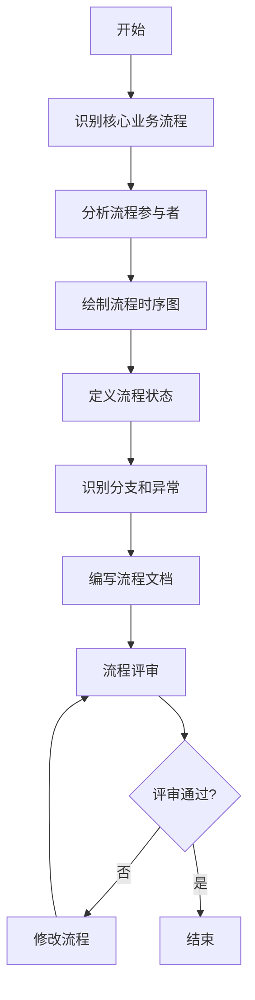
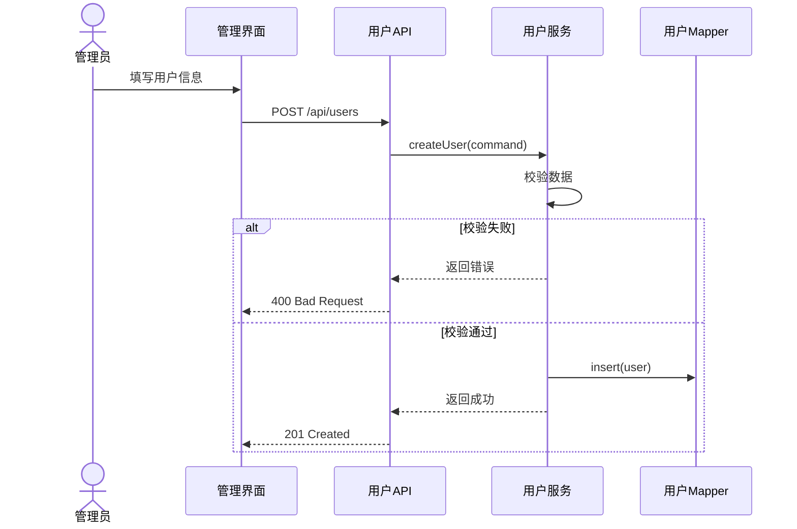
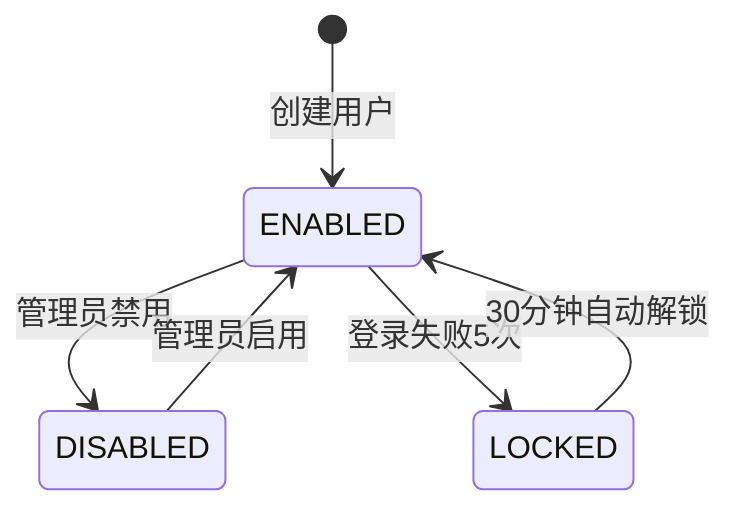
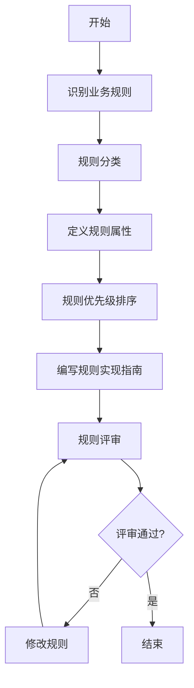

# 业务流程分析流程标准

> **文档编号**：SYS-STD-ARCH-003  
> **文档版本**：1.0  
> **创建日期**：2026-03-08  
> **文档作者**：架构师  
> **文档状态**：已发布

---

## 1. 概述

### 1.1 目的
本文档定义业务流程分析的标准流程，确保业务流程文档的一致性、完整性和可追溯性。

### 1.2 适用范围
- 核心业务流程分析
- 业务规则梳理
- 业务流程优化

### 1.3 输入
- 领域边界划分文档
- 领域模型设计文档
- 业务需求文档（BRD）

### 1.4 输出
- 核心业务流程分析文档
- 业务规则梳理文档

---

## 2. 核心业务流程分析流程

### 2.1 流程概览



### 2.2 详细步骤

#### 步骤1：识别核心业务流程（1-2天）

**输入**：领域边界划分、领域模型设计

**任务**：
1. 基于限界上下文识别核心业务流程
2. 确定流程边界和范围
3. 识别流程触发条件和输出结果

**检查清单**：
- [ ] 是否识别了所有核心业务流程？
- [ ] 每个流程是否有明确的触发条件？
- [ ] 每个流程是否有明确的输出结果？
- [ ] 流程边界是否清晰？

**输出**：核心业务流程清单

**示例**：
```markdown
## 核心业务流程清单

### 用户管理域
1. 用户生命周期流程
   - 触发：用户入职/创建
   - 输出：用户账号
   
2. 用户密码管理流程
   - 触发：密码重置请求
   - 输出：新密码

### 权限管理域
3. 角色管理流程
   - 触发：创建角色
   - 输出：角色配置

4. 用户授权流程
   - 触发：分配角色
   - 输出：用户权限
```

#### 步骤2：分析流程参与者（0.5天）

**输入**：核心业务流程清单

**任务**：
1. 识别流程参与者（Actor）
2. 识别系统组件
3. 定义参与者职责

**检查清单**：
- [ ] 是否识别了所有参与者？
- [ ] 参与者职责是否清晰？
- [ ] 系统组件划分是否合理？

**输出**：参与者清单和职责定义

**示例**：
```markdown
## 用户创建流程参与者

| 参与者 | 类型 | 职责 |
|-------|------|------|
| 管理员 | 人 | 填写用户信息、提交创建请求 |
| 管理界面 | 系统 | 展示表单、校验输入、提交请求 |
| 用户API | 系统 | 接收请求、调用服务 |
| 用户服务 | 系统 | 业务逻辑处理、数据校验 |
| 用户Mapper | 系统 | 数据持久化 |
| 事件处理器 | 系统 | 异步处理、发送通知 |
```

#### 步骤3：绘制流程时序图（2-3天）

**输入**：参与者清单

**任务**：
1. 绘制主流程时序图
2. 绘制分支流程时序图
3. 绘制异常处理流程

**检查清单**：
- [ ] 时序图是否覆盖主流程？
- [ ] 是否包含异常分支？
- [ ] 异步处理是否标注清楚？
- [ ] 数据库操作是否明确？

**输出**：流程时序图（Mermaid格式）

**示例**：
```markdown

```

#### 步骤4：定义流程状态（0.5天）

**输入**：流程时序图

**任务**：
1. 识别流程中的状态
2. 定义状态转换规则
3. 绘制状态图

**检查清单**：
- [ ] 是否识别了所有状态？
- [ ] 状态转换是否完整？
- [ ] 是否有非法状态转换？

**输出**：状态转换图

**示例**：
```markdown

```

#### 步骤5：识别分支和异常（1天）

**输入**：流程时序图、状态图

**任务**：
1. 识别业务分支条件
2. 识别异常场景
3. 定义异常处理策略

**检查清单**：
- [ ] 是否识别了所有分支条件？
- [ ] 是否识别了所有异常场景？
- [ ] 异常处理策略是否明确？
- [ ] 错误信息是否友好？

**输出**：分支和异常清单

**示例**：
```markdown
## 用户创建流程分支和异常

### 分支条件
1. 创建方式分支
   - 手动创建
   - 批量导入
   - HR同步

### 异常场景
1. 数据校验异常
   - 用户名已存在 → 返回409 Conflict
   - 邮箱格式错误 → 返回400 Bad Request
   
2. 系统异常
   - 数据库连接失败 → 返回500 Internal Server Error
   - 消息队列异常 → 记录日志，继续处理
```

#### 步骤6：编写流程文档（2天）

**输入**：所有前置输出

**任务**：
1. 编写流程概述
2. 编写详细流程说明
3. 编写流程优化建议

**文档结构**：
```markdown
# 核心业务流程分析

## 1. 概述
### 1.1 文档目的
### 1.2 输入文档
### 1.3 分析范围

## 2. [流程名称]流程
### 2.1 流程概述
### 2.2 流程时序图
### 2.3 流程状态
### 2.4 分支和异常
### 2.5 业务规则

## 3. 流程优化建议
### 3.1 性能优化
### 3.2 可靠性优化

## 4. 附录
```

**检查清单**：
- [ ] 文档结构是否完整？
- [ ] 时序图是否正确？
- [ ] 状态图是否正确？
- [ ] 异常处理是否完整？

**输出**：核心业务流程分析文档

#### 步骤7：流程评审（1天）

**输入**：核心业务流程分析文档

**任务**：
1. 组织评审会议
2. 记录评审意见
3. 修改流程文档

**评审检查清单**：
- [ ] 流程是否完整？
- [ ] 时序图是否正确？
- [ ] 异常处理是否完善？
- [ ] 业务规则是否正确？
- [ ] 性能考虑是否充分？

**输出**：评审记录、更新后的流程文档

---

## 3. 业务规则梳理流程

### 3.1 流程概览



### 3.2 详细步骤

#### 步骤1：识别业务规则（2天）

**输入**：核心业务流程文档、领域模型设计

**任务**：
1. 从流程中提取业务规则
2. 从领域模型中提取约束规则
3. 从需求文档中提取业务规则

**规则来源**：
- 数据约束（唯一性、格式、范围）
- 状态转换（状态机规则）
- 权限控制（访问控制规则）
- 业务逻辑（计算、校验规则）

**检查清单**：
- [ ] 是否覆盖了所有业务流程？
- [ ] 是否覆盖了所有领域实体？
- [ ] 是否覆盖了所有状态转换？
- [ ] 是否覆盖了所有权限控制点？

**输出**：业务规则清单（初稿）

**示例**：
```markdown
## 用户管理规则

### 用户标识规则
- UR-001: 用户ID全局唯一
- UR-002: 用户名全局唯一，不区分大小写
- UR-003: 用户名格式：字母开头，4-20位

### 用户状态规则
- UR-008: 状态枚举：启用、禁用、锁定
- UR-011: 登录失败5次自动锁定
```

#### 步骤2：规则分类（0.5天）

**输入**：业务规则清单

**任务**：
1. 按领域分类
2. 按规则类型分类
3. 按实现层次分类

**分类维度**：

| 分类维度 | 类别 | 说明 |
|---------|------|------|
| 领域 | 用户管理、权限管理、组织架构、系统配置 | 按业务领域划分 |
| 类型 | 结构性、行为性、计算性、安全性 | 按规则性质划分 |
| 层次 | 数据库层、实体层、服务层、接口层 | 按实现位置划分 |

**检查清单**：
- [ ] 每个规则都有明确的分类？
- [ ] 分类标准是否一致？
- [ ] 是否有遗漏的规则？

**输出**：分类后的业务规则清单

#### 步骤3：定义规则属性（1天）

**输入**：分类后的业务规则清单

**任务**：
1. 定义规则编号
2. 定义规则名称
3. 定义规则描述
4. 定义规则类型
5. 定义优先级
6. 定义实现方式

**规则属性模板**：
```markdown
| 规则编号 | 规则名称 | 规则描述 | 规则类型 | 优先级 | 实现方式 |
|---------|---------|---------|---------|--------|---------|
| UR-001 | 用户ID唯一性 | 用户ID全局唯一，系统自动生成UUID | 结构性 | 高 | 数据库主键约束 |
```

**优先级定义**：
- **高**：必须实现，影响核心功能
- **中**：建议实现，影响用户体验
- **低**：可选实现，增强功能

**检查清单**：
- [ ] 规则编号是否唯一？
- [ ] 规则描述是否清晰？
- [ ] 优先级是否合理？
- [ ] 实现方式是否明确？

**输出**：完整的业务规则属性表

#### 步骤4：规则优先级排序（0.5天）

**输入**：完整的业务规则属性表

**任务**：
1. 按优先级分组
2. 按实现阶段分组
3. 识别规则依赖关系

**实现阶段规划**：

| 阶段 | 规则优先级 | 规则数量 | 说明 |
|-----|-----------|---------|------|
| 第一阶段（MVP） | 高 | 40+ | 必须实现，影响核心功能 |
| 第二阶段（功能完善） | 中 | 20+ | 建议实现，完善功能 |
| 第三阶段（增强优化） | 低 | 10+ | 可选实现，优化体验 |

**检查清单**：
- [ ] 高优先级规则是否覆盖核心功能？
- [ ] 规则依赖关系是否明确？
- [ ] 实现阶段划分是否合理？

**输出**：按优先级排序的规则清单

#### 步骤5：编写规则实现指南（1天）

**输入**：按优先级排序的规则清单

**任务**：
1. 编写规则实现示例
2. 定义规则检查清单
3. 编写测试建议

**实现指南内容**：
```markdown
## 规则实现指南

### 数据库层实现
- 唯一索引
- 外键约束
- 检查约束

### 实体层实现
- 值对象校验
- 实体属性校验
- 领域方法校验

### 服务层实现
- 业务逻辑校验
- 跨实体校验
- 事务控制

### 接口层实现
- 参数校验
- 权限校验
- 限流控制
```

**检查清单**：
- [ ] 是否提供了实现示例？
- [ ] 检查清单是否完整？
- [ ] 测试建议是否可行？

**输出**：业务规则梳理文档

#### 步骤6：规则评审（1天）

**输入**：业务规则梳理文档

**任务**：
1. 组织评审会议
2. 验证规则完整性
3. 确认规则优先级
4. 修改规则文档

**评审检查清单**：
- [ ] 规则是否覆盖所有业务场景？
- [ ] 规则描述是否清晰准确？
- [ ] 优先级划分是否合理？
- [ ] 实现方式是否可行？
- [ ] 是否有冲突的规则？

**输出**：评审记录、更新后的规则文档

---

## 4. 质量标准

### 4.1 流程文档质量标准

| 检查项 | 标准 | 检查方式 |
|-------|------|---------|
| 完整性 | 覆盖所有核心业务流程 | 检查清单 |
| 准确性 | 时序图与代码实现一致 | 代码审查 |
| 清晰性 | 流程描述清晰易懂 | 同行评审 |
| 可追溯性 | 每个流程可追溯到需求 | 需求跟踪矩阵 |

### 4.2 规则文档质量标准

| 检查项 | 标准 | 检查方式 |
|-------|------|---------|
| 完整性 | 覆盖所有业务规则 | 检查清单 |
| 一致性 | 规则无冲突 | 规则矩阵检查 |
| 可测试性 | 每个规则可测试 | 测试用例评审 |
| 可实现性 | 规则可实现 | 技术评审 |

---

## 5. 文档模板

### 5.1 核心业务流程分析文档模板

```markdown
# 核心业务流程分析

> **文档编号**：SYS-DES-BA-XXX  
> **文档版本**：1.0  
> **创建日期**：YYYY-MM-DD  
> **文档作者**：架构师  
> **文档状态**：草稿

---

## 1. 概述

### 1.1 文档目的
### 1.2 输入文档
### 1.3 分析范围

## 2. [流程名称]流程

### 2.1 流程概述
### 2.2 流程时序图
### 2.3 流程状态
### 2.4 分支和异常

## 3. 流程优化建议

### 3.1 性能优化
### 3.2 可靠性优化

## 4. 附录
```

### 5.2 业务规则梳理文档模板

```markdown
# 业务规则梳理

> **文档编号**：SYS-DES-BA-XXX  
> **文档版本**：1.0  
> **创建日期**：YYYY-MM-DD  
> **文档作者**：架构师  
> **文档状态**：草稿

---

## 1. 概述

### 1.1 文档目的
### 1.2 输入文档
### 1.3 规则分类

## 2. [领域名称]规则

### 2.1 [实体名称]规则

| 规则编号 | 规则名称 | 规则描述 | 规则类型 | 优先级 | 实现方式 |
|---------|---------|---------|---------|--------|---------|

## 3. 规则优先级矩阵

## 4. 规则实现检查清单

## 5. 附录
```

---

## 6. 工具支持

### 6.1 流程图工具
- **Mermaid**：时序图、流程图、状态图
- **PlantUML**：复杂流程图
- **Draw.io**：架构图

### 6.2 文档工具
- **Markdown**：文档编写
- **Git**：版本控制
- **文档系统**：文档管理

---

## 7. 附录

### 7.1 修订记录

| 版本 | 日期 | 修订人 | 修订内容 |
|-----|------|-------|---------|
| 1.0 | 2026-03-08 | 架构师 | 初始版本 |

### 7.2 参考文档

- 领域边界划分文档
- 领域模型设计文档
- 业务需求文档（BRD）

---

**文档编制**：架构师  
**文档审核**：技术负责人  
**编制日期**：2026-03-08
