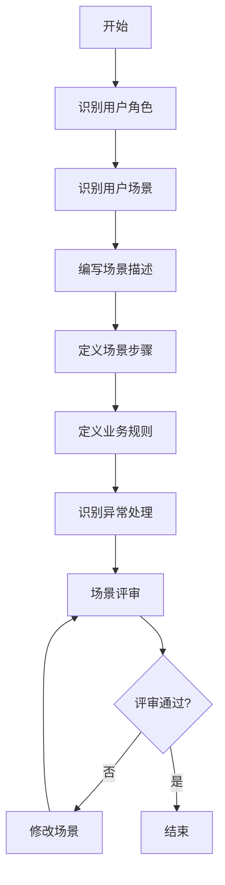
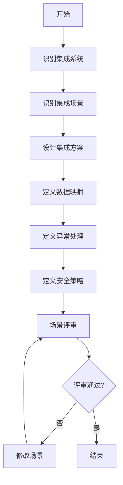

# 业务场景分析流程标准

> **文档编号**：SYS-STD-ARCH-004  
> **文档版本**：1.0  
> **创建日期**：2026-03-08  
> **文档作者**：架构师  
> **文档状态**：已发布

---

## 1. 概述

### 1.1 目的
本文档定义业务场景分析的标准流程，确保场景文档的一致性、完整性和可追溯性，帮助团队从用户视角理解系统功能。

### 1.2 适用范围
- 用户场景分析
- 系统集成场景分析
- 业务场景优化

### 1.3 输入
- 核心业务流程分析文档
- 业务规则梳理文档
- 用户画像文档
- 业务需求文档（BRD）

### 1.4 输出
- 用户场景分析文档
- 系统集成场景分析文档

---

## 2. 用户场景分析流程

### 2.1 流程概览



### 2.2 详细步骤

#### 步骤1：识别用户角色（0.5天）

**输入**：用户画像文档、业务需求文档

**任务**：
1. 识别系统的所有用户角色
2. 定义角色特征和职责
3. 确定角色权限范围

**角色分类**：
- **系统管理员**：系统级管理权限
- **部门管理员**：部门级管理权限
- **普通用户**：基础操作权限
- **特殊角色**：审计员、访客等

**检查清单**：
- [ ] 是否识别了所有用户角色？
- [ ] 每个角色的职责是否清晰？
- [ ] 角色权限范围是否明确？
- [ ] 角色之间关系是否清晰？

**输出**：用户角色清单

**示例**：
```markdown
## 用户角色清单

### 系统管理员
- **角色描述**：系统最高权限管理者
- **主要职责**：系统配置、用户管理、权限分配
- **权限范围**：全部数据和功能
- **使用频率**：每日

### 部门管理员
- **角色描述**：部门管理者
- **主要职责**：部门人员管理、部门权限申请
- **权限范围**：本部门及子部门数据
- **使用频率**：每日

### 普通用户
- **角色描述**：系统普通使用者
- **主要职责**：日常工作处理、个人信息管理
- **权限范围**：个人数据
- **使用频率**：每日
```

#### 步骤2：识别用户场景（1天）

**输入**：用户角色清单、核心业务流程分析

**任务**：
1. 基于业务流程识别用户场景
2. 按角色分类整理场景
3. 识别场景的触发条件和后置条件

**场景分类**：
- **首次使用场景**：注册、登录、初始化
- **日常使用场景**：常规操作、数据查询
- **管理场景**：配置、审批、监控
- **异常场景**：错误处理、故障恢复

**检查清单**：
- [ ] 是否覆盖了所有业务流程？
- [ ] 每个角色是否有对应的场景？
- [ ] 场景触发条件是否明确？
- [ ] 场景后置条件是否明确？

**输出**：用户场景清单

**示例**：
```markdown
## 用户场景清单

### 系统管理员场景
1. 系统初始化配置
   - 触发：系统首次部署
   - 频率：一次性
   
2. 日常用户管理
   - 触发：用户生命周期事件
   - 频率：每日

### 普通用户场景
1. 首次登录系统
   - 触发：账号创建后首次登录
   - 频率：一次性
   
2. 日常工作台使用
   - 触发：日常登录系统
   - 频率：每日
```

#### 步骤3：编写场景描述（1天）

**输入**：用户场景清单

**任务**：
1. 编写场景概述
2. 定义场景参与者
3. 定义前置条件
4. 定义后置条件

**场景描述模板**：
```markdown
#### 场景X.X.X：[场景名称]

**场景描述**：[一句话描述场景]

**参与者**：[主要参与者]

**前置条件**：
- [条件1]
- [条件2]

**场景步骤**：
[步骤表格]

**后置条件**：
- [结果1]
- [结果2]

**业务规则**：
- [规则1]
- [规则2]

**异常处理**：
- [异常1]：[处理方式]
- [异常2]：[处理方式]
```

**检查清单**：
- [ ] 场景描述是否清晰？
- [ ] 参与者是否明确？
- [ ] 前置条件是否完整？
- [ ] 后置条件是否完整？

**输出**：场景描述文档（初稿）

#### 步骤4：定义场景步骤（1-2天）

**输入**：场景描述文档

**任务**：
1. 细化场景操作步骤
2. 定义每个步骤的操作方
3. 定义每个步骤的系统响应
4. 定义每个步骤的预期结果

**步骤描述格式**：

| 步骤 | 操作 | 系统响应 | 预期结果 |
|-----|------|---------|---------|
| 1 | [用户操作] | [系统行为] | [验证点] |
| 2 | [用户操作] | [系统行为] | [验证点] |

**扩展场景**：
- 识别主场景的分支场景
- 定义扩展场景的触发条件
- 编写扩展场景的步骤

**检查清单**：
- [ ] 步骤是否完整？
- [ ] 步骤顺序是否正确？
- [ ] 每个步骤是否可验证？
- [ ] 扩展场景是否完整？

**输出**：完整的场景步骤描述

**示例**：
```markdown
| 步骤 | 操作 | 系统响应 | 预期结果 |
|-----|------|---------|---------|
| 1 | 使用默认账号登录系统 | 显示系统管理控制台 | 登录成功 |
| 2 | 修改默认密码 | 提示密码修改成功 | 密码已更新 |
| 3 | 进入系统配置模块 | 显示配置项列表 | 配置页面加载完成 |
| 4 | 配置系统基础信息 | 保存配置 | 系统信息已更新 |
```

#### 步骤5：定义业务规则（0.5天）

**输入**：业务规则梳理文档、场景步骤描述

**任务**：
1. 识别场景涉及的业务规则
2. 引用已有规则或定义新规则
3. 说明规则在场景中的应用

**检查清单**：
- [ ] 是否引用了正确的规则？
- [ ] 规则与场景是否匹配？
- [ ] 规则优先级是否明确？

**输出**：场景业务规则清单

**示例**：
```markdown
**业务规则**：
- BR-SYS-001: 系统首次登录必须修改默认密码
- BR-SYS-002: 系统名称不能为空，长度2-50字符
- BR-SYS-003: 至少创建一个部门才能创建用户
```

#### 步骤6：识别异常处理（0.5天）

**输入**：场景步骤描述

**任务**：
1. 识别每个步骤可能的异常
2. 定义异常处理策略
3. 定义用户提示信息

**异常分类**：
- **业务异常**：数据校验失败、权限不足
- **系统异常**：网络错误、服务不可用
- **用户异常**：操作错误、输入非法

**检查清单**：
- [ ] 是否识别了所有异常？
- [ ] 异常处理策略是否明确？
- [ ] 用户提示是否友好？

**输出**：异常处理清单

**示例**：
```markdown
**异常处理**：
- 配置保存失败：提示错误信息，保留当前输入
- 邮件测试失败：显示错误详情，提供排查建议
- 部门创建失败：检查部门编码唯一性
```

#### 步骤7：场景评审（1天）

**输入**：用户场景分析文档

**任务**：
1. 组织评审会议
2. 验证场景完整性
3. 确认场景优先级
4. 修改场景文档

**评审检查清单**：
- [ ] 场景是否覆盖所有功能？
- [ ] 场景步骤是否清晰？
- [ ] 异常处理是否完善？
- [ ] 业务规则是否正确？
- [ ] 用户体验是否良好？

**输出**：评审记录、更新后的场景文档

---

## 3. 系统集成场景分析流程

### 3.1 流程概览



### 3.2 详细步骤

#### 步骤1：识别集成系统（0.5天）

**输入**：现有系统架构资料、业务需求文档

**任务**：
1. 识别需要集成的内部系统
2. 识别需要集成的外部服务
3. 确定集成优先级

**集成系统分类**：
- **内部系统**：HR系统、ERP系统、OA系统、CRM系统、财务系统
- **外部服务**：邮件服务、短信服务、文件存储、身份认证

**检查清单**：
- [ ] 是否识别了所有集成系统？
- [ ] 每个系统的集成方式是否明确？
- [ ] 集成优先级是否合理？

**输出**：集成系统清单

**示例**：
```markdown
## 集成系统清单

| 系统名称 | 系统类型 | 集成方式 | 集成优先级 |
|---------|---------|---------|-----------|
| HR系统 | 内部系统 | API + 消息队列 | P0 |
| ERP系统 | 内部系统 | API | P1 |
| OA系统 | 内部系统 | API + SSO | P1 |
| 邮件服务 | 外部服务 | SMTP/IMAP | P0 |
| 短信服务 | 外部服务 | HTTP API | P1 |
```

#### 步骤2：识别集成场景（1天）

**输入**：集成系统清单、核心业务流程分析

**任务**：
1. 基于业务流程识别集成场景
2. 定义场景触发条件
3. 定义数据流向

**集成场景分类**：
- **数据同步场景**：员工同步、部门同步、主数据同步
- **认证集成场景**：单点登录、统一认证
- **业务流程集成场景**：待办同步、审批集成
- **通知集成场景**：邮件通知、短信通知

**检查清单**：
- [ ] 是否覆盖了所有业务流程？
- [ ] 每个集成场景是否必要？
- [ ] 场景触发条件是否明确？
- [ ] 数据流向是否清晰？

**输出**：集成场景清单

**示例**：
```markdown
## 集成场景清单

### HR系统集成
1. 员工入职同步
   - 触发：HR入职审批通过
   - 数据流向：HR → System
   
2. 员工离职同步
   - 触发：HR离职审批通过
   - 数据流向：HR → System

### OA系统集成
1. 单点登录（SSO）
   - 触发：OA系统跳转
   - 数据流向：OA ↔ System
```

#### 步骤3：设计集成方案（1-2天）

**输入**：集成场景清单

**任务**：
1. 选择集成技术方案
2. 设计接口规范
3. 定义交互流程

**集成技术选型**：
- **同步调用**：REST API、SOAP
- **异步消息**：消息队列（RabbitMQ、Kafka）
- **文件传输**：FTP、SFTP
- **数据库同步**：CDC、ETL

**检查清单**：
- [ ] 技术方案是否合适？
- [ ] 接口规范是否清晰？
- [ ] 交互流程是否完整？
- [ ] 性能要求是否满足？

**输出**：集成方案设计文档

**示例**：
```markdown
## 员工入职同步方案

**集成方式**：消息队列（异步）

**数据流向**：
```
HR系统 → 消息队列 → System平台 → 用户创建 → 通知发送
```

**场景步骤**：
| 步骤 | 操作方 | 操作内容 | 数据内容 |
|-----|-------|---------|---------|
| 1 | HR系统 | 入职审批通过 | 员工信息 |
| 2 | HR系统 | 发送入职事件 | EmployeeEntryEvent |
| 3 | System平台 | 消费入职事件 | 解析员工数据 |
| 4 | System平台 | 创建用户账号 | 用户信息 |
| 5 | System平台 | 发送通知邮件 | 账号信息 |
```

#### 步骤4：定义数据映射（0.5天）

**输入**：集成方案设计文档

**任务**：
1. 定义字段映射关系
2. 定义数据转换规则
3. 定义数据校验规则

**检查清单**：
- [ ] 字段映射是否完整？
- [ ] 转换规则是否清晰？
- [ ] 校验规则是否明确？

**输出**：数据映射表

**示例**：
```markdown
## 数据映射表

| HR字段 | System字段 | 转换规则 |
|-------|-----------|---------|
| employee_no | employee_no | 直接映射 |
| name | real_name | 直接映射 |
| email | email | 直接映射 |
| department_code | dept_id | 部门编码映射 |
| entry_date | entry_date | 日期格式转换 |
```

#### 步骤5：定义异常处理（0.5天）

**输入**：集成方案设计文档

**任务**：
1. 识别集成异常场景
2. 定义重试策略
3. 定义降级策略
4. 定义补偿机制

**异常分类**：
- **网络异常**：超时、断开
- **服务异常**：500错误、服务不可用
- **数据异常**：格式错误、数据缺失
- **业务异常**：重复数据、状态冲突

**检查清单**：
- [ ] 是否识别了所有异常？
- [ ] 重试策略是否合理？
- [ ] 降级策略是否可行？
- [ ] 补偿机制是否完善？

**输出**：异常处理策略文档

**示例**：
```markdown
## 异常处理策略

| 异常场景 | 处理策略 | 补偿机制 |
|---------|---------|---------|
| 消息消费失败 | 重试3次，间隔5分钟 | 死信队列，人工处理 |
| 部门映射失败 | 记录错误，分配默认部门 | 管理员手动调整 |
| 邮件发送失败 | 记录日志，不重试 | 管理员手动补发 |
```

#### 步骤6：定义安全策略（0.5天）

**输入**：集成方案设计文档

**任务**：
1. 定义传输安全要求
2. 定义认证授权机制
3. 定义数据安全措施

**安全要求**：
- **传输安全**：HTTPS、TLS
- **认证授权**：API Key、OAuth、JWT
- **数据安全**：加密、脱敏、签名

**检查清单**：
- [ ] 传输安全是否满足？
- [ ] 认证授权是否完善？
- [ ] 数据安全是否充分？

**输出**：安全策略文档

**示例**：
```markdown
## 安全策略

### 传输安全
- 所有接口使用HTTPS
- TLS 1.2+

### 认证授权
- API Key + Secret
- HMAC-SHA256签名

### 数据安全
- 敏感数据AES加密
- 日志数据脱敏
```

#### 步骤7：场景评审（1天）

**输入**：系统集成场景分析文档

**任务**：
1. 组织评审会议
2. 验证集成方案可行性
3. 确认集成优先级
4. 修改场景文档

**评审检查清单**：
- [ ] 集成方案是否可行？
- [ ] 数据映射是否正确？
- [ ] 异常处理是否完善？
- [ ] 安全策略是否充分？
- [ ] 性能要求是否满足？

**输出**：评审记录、更新后的场景文档

---

## 4. 质量标准

### 4.1 用户场景质量标准

| 检查项 | 标准 | 检查方式 |
|-------|------|---------|
| 完整性 | 覆盖所有用户角色和功能 | 检查清单 |
| 准确性 | 场景步骤与需求一致 | 需求对比 |
| 清晰性 | 场景描述清晰易懂 | 同行评审 |
| 可测试性 | 每个场景可测试 | 测试用例评审 |

### 4.2 集成场景质量标准

| 检查项 | 标准 | 检查方式 |
|-------|------|---------|
| 完整性 | 覆盖所有集成需求 | 检查清单 |
| 可行性 | 技术方案可实现 | 技术评审 |
| 安全性 | 满足安全要求 | 安全评审 |
| 可靠性 | 异常处理完善 | 故障演练 |

---

## 5. 文档模板

### 5.1 用户场景分析文档模板

```markdown
# 用户场景分析

> **文档编号**：SYS-DES-BA-XXX  
> **版本**：1.0  
> **创建日期**：YYYY-MM-DD  
> **作者**：架构师  
> **状态**：草稿

---

## 1. 概述

### 1.1 文档目的
### 1.2 输入文档
### 1.3 场景分类

## 2. [角色]场景

### 2.1 [场景名称]

**场景描述**：
**参与者**：
**前置条件**：

**场景步骤**：
| 步骤 | 操作 | 系统响应 | 预期结果 |
|-----|------|---------|---------|

**后置条件**：
**业务规则**：
**异常处理**：

## 3. 场景优先级

## 4. 场景与功能映射

## 5. 附录
```

### 5.2 系统集成场景分析文档模板

```markdown
# 系统集成场景分析

> **文档编号**：SYS-DES-BA-XXX  
> **版本**：1.0  
> **创建日期**：YYYY-MM-DD  
> **作者**：架构师  
> **状态**：草稿

---

## 1. 概述

### 1.1 文档目的
### 1.2 输入文档
### 1.3 集成系统清单

## 2. [系统]集成场景

### 2.1 [场景名称]

**场景描述**：
**集成方式**：
**触发条件**：

**数据流向**：
**场景步骤**：
| 步骤 | 操作方 | 操作内容 | 数据内容 |
|-----|-------|---------|---------|

**数据映射**：
**业务规则**：
**异常处理**：

## 3. 集成异常处理

## 4. 集成安全要求

## 5. 附录
```

---

## 6. 工具支持

### 6.1 场景设计工具
- **用户故事地图**：场景组织和优先级排序
- **流程图工具**：Mermaid、Draw.io
- **表格工具**：Excel、Markdown表格

### 6.2 文档工具
- **Markdown**：文档编写
- **Git**：版本控制
- **文档系统**：文档管理

---

## 7. 最佳实践

### 7.1 用户场景最佳实践

1. **从用户视角出发**：描述用户看到和做到的，而非系统内部实现
2. **保持简洁清晰**：每个场景聚焦一个目标
3. **使用具体数据**：避免模糊描述，使用具体数值
4. **考虑边界情况**：不仅考虑正常流程，也要考虑异常
5. **验证可实现性**：与技术团队确认场景可实现

### 7.2 集成场景最佳实践

1. **明确集成边界**：清晰定义系统边界和责任
2. **设计幂等接口**：确保重复调用不会导致问题
3. **考虑降级方案**：集成失败时系统如何表现
4. **监控集成状态**：建立集成监控和告警
5. **文档化接口**：详细记录接口规范和示例

---

## 8. 常见陷阱

### 8.1 用户场景陷阱

1. **过于技术化**：描述系统实现而非用户行为
2. **遗漏异常**：只考虑正常流程，忽略错误处理
3. **场景过于复杂**：一个场景包含太多步骤
4. **缺乏验证点**：没有明确的预期结果
5. **忽视用户体验**：只关注功能，不关注体验

### 8.2 集成场景陷阱

1. **低估复杂性**：集成比预期更复杂
2. **忽视数据质量**：源系统数据质量问题
3. **缺少超时处理**：长时间等待导致系统阻塞
4. **安全考虑不足**：传输和存储安全
5. **缺乏监控**：无法及时发现集成问题

---

## 9. 附录

### 9.1 修订记录

| 版本 | 日期 | 作者 | 变更内容 |
|-----|------|------|---------|
| 1.0 | 2026-03-08 | 架构师 | 初始版本 |

### 9.2 参考文档

- 核心业务流程分析文档
- 业务规则梳理文档
- 用户画像文档
- 业务需求文档（BRD）

---

**文档编制**：架构师  
**文档审核**：技术负责人  
**编制日期**：2026-03-08
