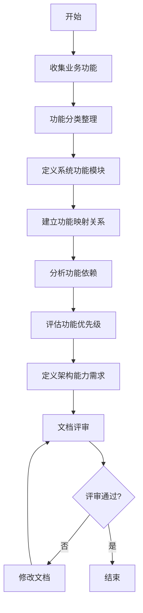
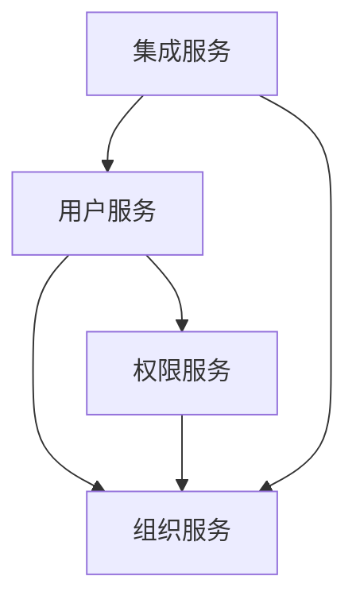
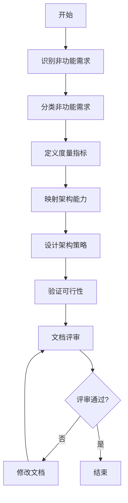

# 需求架构映射分析流程标准

> **文档编号**：SYS-STD-ARCH-005  
> **文档版本**：1.0  
> **创建日期**：2026-03-08  
> **文档作者**：架构师  
> **文档状态**：已发布

---

## 1. 概述

### 1.1 目的
本文档定义需求架构映射分析的标准流程，确保业务需求能够准确、完整地映射到系统架构能力，为架构设计提供清晰的需求依据。

### 1.2 适用范围
- 功能需求架构映射分析
- 非功能需求架构映射分析
- 需求优先级评估
- 架构能力规划

### 1.3 输入
- 业务需求文档（BRD）
- 业务领域分析文档
- 核心业务流程分析文档
- 用户场景分析文档
- 项目章程（非功能性需求定义）

### 1.4 输出
- 功能需求架构映射文档
- 非功能需求架构映射文档
- 需求优先级矩阵
- 架构能力需求清单

---

## 2. 功能需求架构映射流程

### 2.1 流程概览



### 2.2 详细步骤

#### 步骤1：收集业务功能（0.5天）

**输入**：业务需求文档、业务流程分析文档

**任务**：
1. 从BRD中提取所有业务功能点
2. 从业务流程分析中提取功能需求
3. 从用户场景中提取功能需求
4. 整理功能清单

**检查清单**：
- [ ] 是否收集了所有业务功能？
- [ ] 功能描述是否清晰？
- [ ] 功能来源是否可追溯？

**输出**：业务功能清单

**示例**：
```markdown
## 业务功能清单

### 用户中心
1. 用户登录/注册（来源：BRD-3.1）
2. 密码管理（来源：BRD-3.2）
3. 个人信息管理（来源：BRD-3.3）

### 权限管理
1. 角色管理（来源：BRD-4.1）
2. 菜单管理（来源：BRD-4.2）
3. 权限分配（来源：BRD-4.3）
```

#### 步骤2：功能分类整理（0.5天）

**输入**：业务功能清单

**任务**：
1. 按业务域分类功能
2. 识别核心功能和支撑功能
3. 识别通用功能和特有功能

**功能分类原则**：
- **核心功能**：直接支撑业务目标的功能
- **支撑功能**：为核心功能提供支持的功能
- **通用功能**：可复用的基础功能
- **特有功能**：业务特有的功能

**检查清单**：
- [ ] 功能分类是否合理？
- [ ] 核心功能是否识别完整？
- [ ] 通用功能是否可复用？

**输出**：分类后的功能清单

#### 步骤3：定义系统功能模块（1天）

**输入**：分类后的功能清单

**任务**：
1. 根据功能分类定义系统模块
2. 定义每个模块的职责边界
3. 定义模块间的接口

**模块设计原则**：
- **单一职责**：每个模块职责单一明确
- **高内聚**：相关功能聚合在同一模块
- **低耦合**：模块间依赖最小化
- **可复用**：通用功能抽象为独立模块

**检查清单**：
- [ ] 模块划分是否合理？
- [ ] 模块职责是否清晰？
- [ ] 模块数量是否适中（5-10个）？

**输出**：系统功能模块定义

**示例**：
```markdown
## 系统功能模块

### 1. 用户中心模块
- **职责**：用户生命周期管理、认证授权
- **功能**：登录注册、密码管理、个人信息
- **优先级**：P0

### 2. 权限管理模块
- **职责**：角色权限管理、访问控制
- **功能**：角色管理、菜单管理、权限分配
- **优先级**：P0
```

#### 步骤4：建立功能映射关系（1天）

**输入**：业务功能清单、系统功能模块定义

**任务**：
1. 建立业务功能到系统功能的映射
2. 定义映射关系类型（1:1、1:N、N:1、N:M）
3. 记录映射 rationale

**映射矩阵模板**：

| 业务功能 | 系统功能模块 | 功能描述 | 映射类型 | 优先级 |
|---------|-------------|---------|---------|-------|
| [业务功能] | [系统模块] | [描述] | [1:1/1:N/N:1/N:M] | [P0/P1/P2] |

**检查清单**：
- [ ] 所有业务功能都有映射？
- [ ] 映射关系是否准确？
- [ ] 映射 rationale 是否清晰？

**输出**：功能映射矩阵

#### 步骤5：分析功能依赖（0.5天）

**输入**：功能映射矩阵

**任务**：
1. 识别功能模块间的依赖关系
2. 分析依赖方向（单向/双向）
3. 识别循环依赖
4. 优化依赖关系

**依赖分析原则**：
- **单向依赖**：优先单向依赖，避免双向依赖
- **依赖倒置**：高层模块不依赖低层模块
- **接口隔离**：通过接口解耦

**检查清单**：
- [ ] 依赖关系是否清晰？
- [ ] 是否存在循环依赖？
- [ ] 依赖是否合理？

**输出**：功能依赖图

**示例**：


#### 步骤6：评估功能优先级（0.5天）

**输入**：功能映射矩阵、业务需求优先级

**任务**：
1. 评估每个功能的业务价值
2. 评估技术实现复杂度
3. 确定功能优先级（P0/P1/P2）

**优先级定义**：
- **P0（核心功能）**：必须实现，影响系统核心能力
- **P1（重要功能）**：应该实现，影响用户体验
- **P2（扩展功能）**：可以实现，增强系统能力

**评估维度**：
| 维度 | P0 | P1 | P2 |
|-----|-----|-----|-----|
| 业务价值 | 极高 | 高 | 中 |
| 用户影响 | 所有用户 | 大部分用户 | 部分用户 |
| 技术复杂度 | 中-高 | 中 | 低-中 |
| 依赖关系 | 被多个功能依赖 | 被少量功能依赖 | 独立功能 |

**检查清单**：
- [ ] 优先级评估是否合理？
- [ ] 是否与业务需求优先级一致？
- [ ] 技术团队是否认可？

**输出**：功能优先级清单

#### 步骤7：定义架构能力需求（1天）

**输入**：功能映射矩阵、功能优先级清单

**任务**：
1. 分析P0功能的架构能力需求
2. 分析P1功能的架构能力需求
3. 分析P2功能的架构能力需求
4. 汇总架构能力需求

**架构能力维度**：
- **可用性**：系统可用性指标
- **性能**：响应时间、吞吐量
- **安全**：认证授权、数据安全
- **扩展性**：水平扩展、垂直扩展
- **数据一致性**：强一致性、最终一致性

**检查清单**：
- [ ] 架构能力需求是否完整？
- [ ] 是否与功能优先级匹配？
- [ ] 是否可量化、可验证？

**输出**：架构能力需求清单

**示例**：
```markdown
## P0功能架构能力需求

| 能力维度 | 需求描述 | 架构策略 |
|---------|---------|---------|
| 可用性 | 99.9% | 集群部署 |
| 性能 | <500ms | 缓存优化 |
| 安全 | 等保三级 | 加密传输 |
| 扩展性 | 1000+并发 | 水平扩展 |
```

#### 步骤8：文档评审（1天）

**输入**：功能需求架构映射文档

**任务**：
1. 组织评审会议
2. 验证功能映射完整性
3. 确认优先级合理性
4. 确认架构能力需求可行性

**评审检查清单**：
- [ ] 功能映射是否完整？
- [ ] 模块划分是否合理？
- [ ] 依赖关系是否清晰？
- [ ] 优先级是否合理？
- [ ] 架构能力需求是否可行？

**输出**：评审记录、更新后的文档

---

## 3. 非功能需求架构映射流程

### 3.1 流程概览



### 3.2 详细步骤

#### 步骤1：识别非功能需求（0.5天）

**输入**：项目章程、业务需求文档

**任务**：
1. 从项目章程中提取非功能需求
2. 从BRD中提取非功能需求
3. 识别隐含的非功能需求

**非功能需求分类**：
- **性能需求**：响应时间、吞吐量、并发能力
- **安全需求**：认证授权、数据安全、传输安全
- **可用性需求**：系统可用性、故障恢复、备份恢复
- **可扩展性需求**：水平扩展、垂直扩展、功能扩展
- **可维护性需求**：可监控性、可测试性、可部署性
- **兼容性需求**：浏览器兼容、接口兼容、数据兼容

**检查清单**：
- [ ] 是否识别了所有非功能需求？
- [ ] 需求来源是否清晰？
- [ ] 需求是否可度量？

**输出**：非功能需求清单

#### 步骤2：分类非功能需求（0.5天）

**输入**：非功能需求清单

**任务**：
1. 按类型分类非功能需求
2. 识别关键非功能需求
3. 识别相互冲突的需求

**检查清单**：
- [ ] 分类是否清晰？
- [ ] 关键需求是否识别？
- [ ] 冲突是否识别并记录？

**输出**：分类后的非功能需求

#### 步骤3：定义度量指标（1天）

**输入**：分类后的非功能需求

**任务**：
1. 为每个非功能需求定义度量指标
2. 定义目标值和阈值
3. 定义测量方法

**度量指标示例**：

| 需求类型 | 度量指标 | 目标值 | 阈值 | 测量方法 |
|---------|---------|-------|------|---------|
| 性能 | 响应时间 | <500ms | <1s | APM监控 |
| 性能 | 吞吐量 | 2000 QPS | 1000 QPS | 压测工具 |
| 可用性 | 系统可用性 | 99.9% | 99.5% | 监控统计 |
| 安全 | 漏洞数量 | 0高危 | <3中危 | 安全扫描 |

**检查清单**：
- [ ] 指标是否可度量？
- [ ] 目标值是否合理？
- [ ] 测量方法是否可行？

**输出**：非功能需求度量指标

#### 步骤4：映射架构能力（1天）

**输入**：非功能需求度量指标

**任务**：
1. 分析每个非功能需求对架构的影响
2. 识别需要支持的架构能力
3. 建立需求到架构能力的映射

**架构能力映射矩阵**：

| 非功能需求 | 架构能力 | 影响程度 | 实现复杂度 |
|-----------|---------|---------|-----------|
| 响应时间<500ms | 缓存能力 | 高 | 中 |
| 并发1000+ | 水平扩展能力 | 高 | 高 |
| 等保三级 | 安全防护能力 | 高 | 高 |
| 99.9%可用性 | 高可用能力 | 高 | 高 |

**检查清单**：
- [ ] 映射是否完整？
- [ ] 影响程度评估是否准确？
- [ ] 实现复杂度评估是否合理？

**输出**：架构能力映射矩阵

#### 步骤5：设计架构策略（1-2天）

**输入**：架构能力映射矩阵

**任务**：
1. 为每个架构能力设计实现策略
2. 选择合适的技术方案
3. 设计架构模式

**架构策略设计原则**：
- **针对性**：策略针对具体能力设计
- **可行性**：技术方案可实现
- **经济性**：成本效益合理
- **可扩展**：支持未来扩展

**检查清单**：
- [ ] 策略是否针对性强？
- [ ] 技术方案是否可行？
- [ ] 是否考虑了成本？

**输出**：架构策略设计文档

**示例**：
```markdown
## 性能架构策略

### 响应时间优化
- **策略**：多级缓存 + 异步处理
- **技术**：Redis缓存 + 消息队列
- **实现**：查询缓存、写入异步

### 并发能力提升
- **策略**：无状态设计 + 水平扩展
- **技术**：负载均衡 + 应用集群
- **实现**：Nginx + Kubernetes
```

#### 步骤6：验证可行性（0.5天）

**输入**：架构策略设计文档

**任务**：
1. 验证技术方案可行性
2. 评估资源需求
3. 识别技术风险

**验证方法**：
- **技术调研**：验证技术方案可行性
- **原型验证**：关键能力原型验证
- **专家评审**：技术专家评估

**检查清单**：
- [ ] 技术方案是否经过验证？
- [ ] 资源需求是否评估？
- [ ] 风险是否识别？

**输出**：可行性验证报告

#### 步骤7：文档评审（1天）

**输入**：非功能需求架构映射文档

**任务**：
1. 组织评审会议
2. 验证非功能需求完整性
3. 确认度量指标合理性
4. 确认架构策略可行性

**评审检查清单**：
- [ ] 非功能需求是否完整？
- [ ] 度量指标是否合理？
- [ ] 架构策略是否可行？
- [ ] 资源需求是否评估？

**输出**：评审记录、更新后的文档

---

## 4. 质量标准

### 4.1 功能需求映射质量标准

| 检查项 | 标准 | 检查方式 |
|-------|------|---------|
| 完整性 | 所有业务功能都有映射 | 检查清单 |
| 准确性 | 映射关系正确 | 需求对比 |
| 一致性 | 与业务需求一致 | 文档对比 |
| 可追溯 | 映射来源可追溯 | 追溯检查 |

### 4.2 非功能需求映射质量标准

| 检查项 | 标准 | 检查方式 |
|-------|------|---------|
| 完整性 | 覆盖所有非功能需求 | 检查清单 |
| 可度量 | 指标可量化 | 指标验证 |
| 可行性 | 策略可实现 | 技术评审 |
| 可验证 | 可测试验证 | 测试评审 |

---

## 5. 文档模板

### 5.1 功能需求架构映射文档模板

```markdown
# 功能需求架构映射分析

> **文档编号**：SYS-ANA-ARCH-XXX  
> **版本**：1.0  
> **创建日期**：YYYY-MM-DD  
> **作者**：架构师  
> **状态**：草稿

---

## 1. 概述

### 1.1 文档目的
### 1.2 输入文档
### 1.3 输出目标

---

## 2. 业务功能到系统功能映射

### 2.1 映射方法论
### 2.2 功能映射矩阵

| 业务功能 | 系统功能模块 | 功能描述 | 优先级 |
|---------|-------------|---------|-------|

### 2.3 功能依赖关系

---

## 3. 功能优先级与架构能力映射

### 3.1 P0级功能
### 3.2 P1级功能
### 3.3 P2级功能

---

## 4. 功能架构视图

### 4.1 功能架构总览
### 4.2 功能模块详细视图

---

## 5. 附录

### 5.1 术语表
### 5.2 修订记录
```

### 5.2 非功能需求架构映射文档模板

```markdown
# 非功能需求架构映射分析

> **文档编号**：SYS-ANA-ARCH-XXX  
> **版本**：1.0  
> **创建日期**：YYYY-MM-DD  
> **作者**：架构师  
> **状态**：草稿

---

## 1. 概述

### 1.1 文档目的
### 1.2 输入文档
### 1.3 非功能需求分类

---

## 2. 性能需求映射

### 2.1 响应时间需求
### 2.2 吞吐量需求
### 2.3 并发能力需求

---

## 3. 安全需求映射

### 3.1 认证授权需求
### 3.2 数据安全需求
### 3.3 传输安全需求

---

## 4. 可用性需求映射

### 4.1 系统可用性需求
### 4.2 故障恢复需求
### 4.3 备份恢复需求

---

## 5. 架构策略设计

### 5.1 性能架构策略
### 5.2 安全架构策略
### 5.3 高可用架构策略

---

## 6. 附录

### 6.1 术语表
### 6.2 修订记录
```

---

## 6. 工具支持

### 6.1 需求分析工具
- **需求管理**：Jira、Confluence
- **流程建模**：Visio、Draw.io、Mermaid
- **表格工具**：Excel、Markdown表格

### 6.2 架构设计工具
- **架构绘图**：Archi、Draw.io
- **文档编写**：Markdown、Confluence
- **版本控制**：Git

---

## 7. 最佳实践

### 7.1 功能需求映射最佳实践

1. **从业务出发**：以业务需求为起点，而非技术实现
2. **保持简洁**：避免过度设计，聚焦核心功能
3. **优先级明确**：清晰定义功能优先级，资源聚焦
4. **依赖清晰**：明确功能依赖关系，避免循环依赖
5. **可扩展考虑**：预留功能扩展空间

### 7.2 非功能需求映射最佳实践

1. **可度量**：所有非功能需求必须可量化
2. **可验证**：设计可验证的测试方案
3. **权衡取舍**：平衡各项非功能需求
4. **成本意识**：考虑实现成本
5. **渐进优化**：分阶段实现，持续优化

---

## 8. 常见陷阱

### 8.1 功能需求映射陷阱

1. **遗漏功能**：遗漏边缘功能或支撑功能
2. **映射错误**：业务功能映射到错误的系统模块
3. **过度拆分**：功能模块拆分过细
4. **忽视依赖**：忽视功能间的依赖关系
5. **优先级偏差**：优先级评估偏离业务价值

### 8.2 非功能需求映射陷阱

1. **指标模糊**：度量指标不可量化
2. **目标过高**：设定不切实际的目标
3. **忽视冲突**：忽视非功能需求间的冲突
4. **策略不可行**：设计的架构策略无法实现
5. **验证缺失**：缺乏验证机制

---

## 9. 附录

### 9.1 修订记录

| 版本 | 日期 | 作者 | 变更内容 |
|-----|------|------|---------|
| 1.0 | 2026-03-08 | 架构师 | 初始版本 |

### 9.2 参考文档

- 业务需求文档（BRD）
- 业务领域分析文档
- 核心业务流程分析文档
- 项目章程

---

**文档编制**：架构师  
**文档审核**：技术负责人  
**编制日期**：2026-03-08
