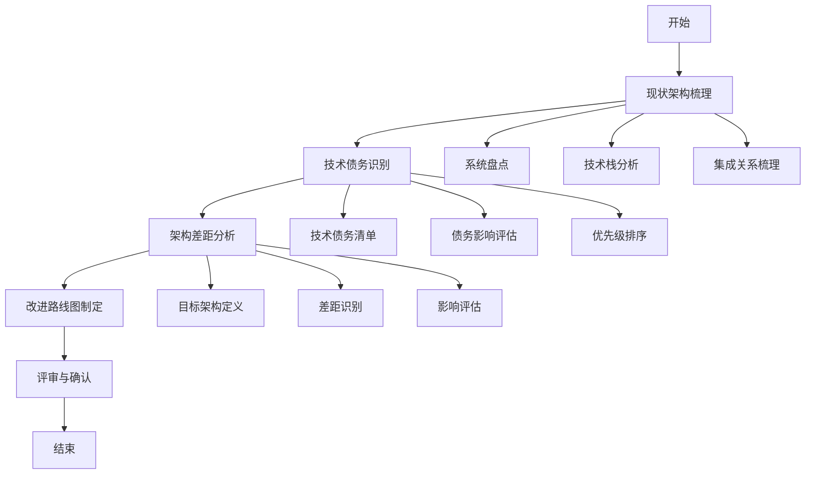

# 现有架构评估流程标准

> **文档编号**: SYS-STD-ARCH-005
> **版本**: 1.0
> **创建日期**: 2026-03-08
> **作者**: 架构师
> **状态**: 已发布

---

## 1. 目的

本文档定义现有架构评估的标准流程，确保架构评估工作的系统性、完整性和一致性，为架构设计提供可靠的现状基础。

---

## 2. 适用范围

适用于System平台及类似企业级系统建设项目的现有架构评估工作。

---

## 3. 流程概览



---

## 4. 流程步骤

### 步骤1：现状架构梳理

#### 1.1 系统盘点

**输入**：
- 企业系统清单
- 系统采购合同
- 运维文档

**活动**：
1. 识别所有相关系统
2. 收集系统基本信息：
   - 系统名称和供应商
   - 上线时间和版本
   - 用户规模
   - 部署方式
3. 绘制系统架构全景图

**输出**：
- 系统基本信息表
- 系统架构全景图

#### 1.2 技术栈分析

**输入**：
- 系统技术文档
- 运维手册
- 开发文档

**活动**：
1. 分析各系统技术栈：
   - 前端技术（框架、版本）
   - 后端技术（语言、框架、版本）
   - 数据库（类型、版本）
   - 中间件（缓存、消息队列等）
2. 评估技术栈现代化程度
3. 识别技术风险

**输出**：
- 技术栈矩阵表
- 技术风险评估

#### 1.3 集成关系梳理

**输入**：
- 系统集成文档
- 接口清单
- 数据流向图

**活动**：
1. 识别系统间集成关系
2. 分析集成方式：
   - 接口协议（REST/SOAP/RFC等）
   - 数据格式（JSON/XML等）
   - 调用频率
3. 绘制系统集成关系图

**输出**：
- 系统集成关系图
- 接口清单表

---

### 步骤2：技术债务识别

#### 2.1 技术债务清单

**输入**：
- 现状架构梳理结果
- 运维问题记录
- 开发团队反馈

**活动**：
1. 识别技术债务类型：
   - 技术栈老旧
   - 架构模式落后
   - 代码质量问题
   - 缺乏自动化
   - 文档缺失
2. 编制技术债务清单

**输出**：
- 技术债务清单

#### 2.2 债务影响评估

**输入**：
- 技术债务清单
- 业务影响分析

**活动**：
1. 评估每项债务的影响：
   - 对业务的影响
   - 对技术的影响
   - 安全风险
   - 运维成本
2. 量化债务成本

**输出**：
- 技术债务影响评估表

#### 2.3 优先级排序

**输入**：
- 技术债务影响评估

**活动**：
1. 使用优先级矩阵：
   - 高影响 + 高紧迫性 = 立即处理
   - 高影响 + 低紧迫性 = 优先规划
   - 低影响 + 高紧迫性 = 持续改进
   - 低影响 + 低紧迫性 = 酌情考虑
2. 确定债务处理优先级

**输出**：
- 技术债务优先级矩阵
- 债务处理计划

---

### 步骤3：架构差距分析

#### 3.1 目标架构定义

**输入**：
- 需求架构映射分析结果
- 业务目标
- 技术愿景

**活动**：
1. 定义目标架构蓝图
2. 明确目标架构能力：
   - 统一认证
   - 权限管理
   - 组织架构
   - 系统集成
   - 技术架构
3. 制定目标架构指标

**输出**：
- 目标架构蓝图
- 目标架构能力清单

#### 3.2 差距识别

**输入**：
- 现状架构梳理结果
- 目标架构定义

**活动**：
1. 对比现状与目标架构
2. 识别差距维度：
   - 身份认证与授权
   - 组织架构管理
   - 权限管理
   - 系统集成能力
   - 技术架构
   - 数据架构
   - 安全架构
3. 编制差距分析矩阵

**输出**：
- 架构差距分析矩阵
- 详细差距说明

#### 3.3 影响评估

**输入**：
- 架构差距分析

**活动**：
1. 评估差距的业务影响
2. 评估差距的技术影响
3. 分析改进的紧迫性

**输出**：
- 差距影响评估报告

---

### 步骤4：改进路线图制定

#### 4.1 改进方案设计

**输入**：
- 架构差距分析结果
- 技术债务清单
- 资源约束

**活动**：
1. 设计改进方案
2. 划分实施阶段
3. 制定阶段目标

**输出**：
- 改进方案文档

#### 4.2 时间规划

**输入**：
- 改进方案
- 资源可用性

**活动**：
1. 制定项目时间线
2. 确定关键里程碑
3. 识别依赖关系

**输出**：
- 改进路线图（甘特图）

#### 4.3 投资估算

**输入**：
- 改进方案
- 资源需求

**活动**：
1. 估算人力成本
2. 估算软硬件采购
3. 估算外部服务
4. 计算投资回报

**输出**：
- 投资估算表
- ROI分析

---

### 步骤5：评审与确认

#### 5.1 文档评审

**输入**：
- 现有架构评估文档

**活动**：
1. 组织评审会议
2. 审查文档完整性
3. 确认分析准确性
4. 讨论改进方案

**输出**：
- 评审意见
- 评审记录

#### 5.2 签字确认

**输入**：
- 评审通过的文档

**活动**：
1. 相关方签字确认
2. 归档评估文档
3. 发布评估结果

**输出**：
- 签字确认页
- 发布的评估报告

---

## 5. 文档模板

### 5.1 现状架构盘点文档结构

```
1. 概述
   1.1 目的
   1.2 范围
   1.3 方法

2. 现有系统架构概览
   2.1 系统架构全景图
   2.2 系统间交互关系

3. 各系统详细架构
   3.1 [系统名称]
       3.1.1 基本信息
       3.1.2 技术栈
       3.1.3 核心功能模块
       3.1.4 集成接口
       3.1.5 技术债务

4. 技术债务汇总
   4.1 技术债务矩阵
   4.2 技术债务优先级

5. 数据现状分析
   5.1 数据分布
   5.2 数据孤岛问题

6. 基础设施现状
   6.1 服务器资源
   6.2 网络架构

7. 安全现状
   7.1 安全措施
   7.2 安全风险

8. 总结与建议

9. 附录
```

### 5.2 架构差距分析文档结构

```
1. 概述
   1.1 目的
   1.2 范围
   1.3 分析方法

2. 目标架构定义
   2.1 目标架构蓝图
   2.2 目标架构能力要求

3. 差距分析矩阵
   3.1 架构维度差距总览
   3.2 详细差距分析

4. 差距影响评估
   4.1 业务影响
   4.2 技术影响

5. 改进路线图
   5.1 改进优先级
   5.2 阶段目标

6. 风险评估
   6.1 改进风险
   6.2 风险应对策略

7. 投资估算
   7.1 投资分类
   7.2 投资回报

8. 总结与建议

9. 附录
```

---

## 6. 质量标准

### 6.1 现状架构盘点质量标准

| 检查项 | 质量要求 | 检查方法 |
|-------|---------|---------|
| 系统覆盖 | 所有相关系统均已盘点 | 对照系统清单检查 |
| 信息完整 | 技术栈、功能、接口信息完整 | 文档审查 |
| 图表清晰 | 架构图、关系图清晰可读 | 可视化检查 |
| 债务识别 | 技术债务识别全面 | 团队评审 |

### 6.2 架构差距分析质量标准

| 检查项 | 质量要求 | 检查方法 |
|-------|---------|---------|
| 目标明确 | 目标架构定义清晰 | 文档审查 |
| 差距全面 | 各维度差距均已识别 | 对照检查表 |
| 分析深入 | 差距原因分析到位 | 专家评审 |
| 方案可行 | 改进方案切实可行 | 可行性评估 |

---

## 7. 最佳实践

### 7.1 现状架构盘点

1. **充分调研**：与系统负责人、运维人员深入交流
2. **文档核实**：核实系统文档的准确性和时效性
3. **工具辅助**：使用架构可视化工具绘制图表
4. **定期更新**：系统变更时及时更新盘点信息

### 7.2 架构差距分析

1. **客观评估**：避免主观臆断，基于事实分析
2. **量化分析**：尽可能量化差距的影响和成本
3. **多方参与**：邀请业务、技术、运维多方参与
4. **持续跟踪**：定期回顾差距分析，跟踪改进进展

---

## 8. 常见陷阱

| 陷阱 | 说明 | 避免方法 |
|-----|------|---------|
| 信息不全 | 遗漏关键系统或信息 | 使用标准化检查表 |
| 分析表面 | 仅描述现状，未深入分析 | 多问"为什么" |
| 目标模糊 | 目标架构定义不清晰 | 参考行业最佳实践 |
| 方案激进 | 改进方案过于激进 | 分阶段实施，渐进改进 |
| 忽视成本 | 未充分考虑改进成本 | 详细的投资估算 |

---

## 9. 工具推荐

| 工具类型 | 推荐工具 | 用途 |
|---------|---------|------|
| 架构绘图 | Draw.io、Visio | 绘制架构图 |
| 文档编写 | Markdown、Confluence | 编写评估文档 |
| 项目管理 | Jira、Project | 制定改进路线图 |
| 协作沟通 | 飞书、钉钉 | 团队协作 |

---

## 10. 附录

### 10.1 术语表

| 术语 | 定义 |
|------|------|
| 技术债务 | 为了快速交付而采取的非最优技术方案所产生的长期成本 |
| 架构差距 | 目标架构与现状架构之间的差异 |
| 改进路线图 | 分阶段实施架构改进的计划 |
| ROI | 投资回报率（Return on Investment）|

### 10.2 参考文档

- 架构设计Checklist
- 需求架构映射分析流程标准
- 技术选型流程标准

### 10.3 修订记录

| 版本 | 日期 | 作者 | 变更内容 |
|-----|------|------|---------|
| 1.0 | 2026-03-08 | 架构师 | 初始版本 |

---

**文档编制**: 架构师
**文档审核**: 技术负责人
**编制日期**: 2026-03-08
