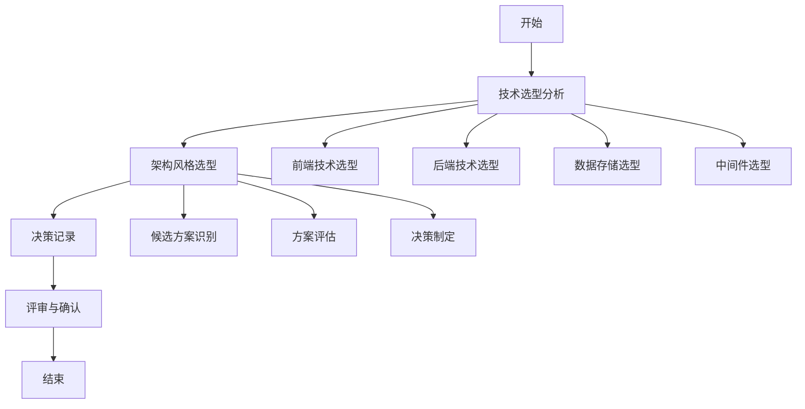

# 架构选型分析流程标准

> **文档编号**: SYS-STD-ARCH-006
> **版本**: 1.0
> **创建日期**: 2026-03-08
> **作者**: 架构师
> **状态**: 已发布

---

## 1. 目的

本文档定义架构选型分析的标准流程，确保技术选型和架构风格选择的科学性、合理性和一致性。

---

## 2. 适用范围

适用于System平台及类似企业级系统建设项目的架构选型分析工作。

---

## 3. 流程概览



---

## 4. 流程步骤

### 步骤1：技术选型分析

#### 1.1 前端技术选型

**输入**：
- 项目需求文档
- 用户界面原型
- 性能要求

**活动**：
1. **框架选型**
   - 识别候选框架（Vue/React/Angular）
   - 评估维度：学习成本、开发效率、性能、生态、团队熟悉度
   - 制定评估矩阵，加权评分
   - 确定最终框架

2. **UI组件库选型**
   - 识别候选组件库
   - 评估维度：组件丰富度、定制性、文档质量、社区活跃度
   - 确定组件库

3. **状态管理选型**
   - 识别候选方案（Pinia/Vuex/Redux）
   - 评估维度：易用性、TypeScript支持、性能
   - 确定状态管理方案

4. **构建工具选型**
   - 识别候选工具（Vite/Webpack/Rollup）
   - 评估维度：构建速度、配置复杂度、生态
   - 确定构建工具

**输出**：
- 前端技术栈清单
- 技术选型评估矩阵

#### 1.2 后端技术选型

**输入**：
- 功能需求
- 性能要求
- 安全要求
- 项目约束（项目章程）

**活动**：
1. **编程语言与框架选型**
   - 识别候选方案（Java/Spring、Go/Gin、Node.js/NestJS）
   - 评估维度：生态成熟度、团队熟悉度、企业级特性、性能
   - 制定评估矩阵
   - 确定语言和框架

2. **ORM框架选型**
   - 识别候选框架（MyBatis Plus、JPA、Spring Data JDBC）
   - 评估维度：灵活性、性能、功能丰富度
   - 确定ORM框架

3. **安全框架选型**
   - 识别候选方案（Spring Security、Shiro、自定义）
   - 评估维度：功能完整性、集成度、社区支持
   - 确定安全框架

4. **API文档工具选型**
   - 识别候选工具（SpringDoc、Swagger、Knife4j）
   - 确定API文档工具

**输出**：
- 后端技术栈清单
- 技术选型评估矩阵

#### 1.3 数据存储选型

**输入**：
- 数据模型
- 数据量预估
- 访问模式
- 项目约束

**活动**：
1. **关系型数据库选型**
   - 识别候选数据库（MySQL、PostgreSQL、Oracle）
   - 评估维度：性能、成本、生态、团队熟悉度
   - 确定关系型数据库

2. **缓存数据库选型**
   - 识别候选方案（Redis、Memcached）
   - 评估维度：功能丰富度、性能、持久化支持
   - 确定缓存方案

3. **搜索引擎选型**
   - 识别候选引擎（Elasticsearch、OpenSearch）
   - 评估维度：功能、性能、生态
   - 确定搜索引擎

**输出**：
- 数据存储技术栈清单

#### 1.4 中间件选型

**输入**：
- 异步处理需求
- 任务调度需求
- 消息传递需求

**活动**：
1. **消息队列选型**
   - 识别候选方案（RabbitMQ、Kafka、RocketMQ）
   - 评估维度：可靠性、吞吐量、运维复杂度
   - 确定消息队列

2. **任务调度选型**
   - 识别候选方案（XXL-JOB、Quartz、Elastic-Job）
   - 评估维度：功能、易用性、监控能力
   - 确定任务调度框架

**输出**：
- 中间件技术栈清单

#### 1.5 开发运维工具选型

**活动**：
1. 版本控制工具（Git/GitLab）
2. 构建工具（Maven/Gradle）
3. 容器化工具（Docker/Kubernetes）
4. 监控工具（Prometheus/Grafana）

**输出**：
- 完整技术栈总览图
- 技术栈版本矩阵

---

### 步骤2：架构风格选型

#### 2.1 候选方案识别

**输入**：
- 业务需求分析
- 非功能需求
- 团队能力评估
- 项目约束

**活动**：
1. **识别候选架构风格**
   - 微服务架构
   - 模块化单体架构
   - 分层模块化架构
   - 其他架构风格

2. **明确决策驱动因素**
   - 开发效率
   - 运维复杂度
   - 扩展性
   - 技术风险
   - 性能要求
   - 集成能力

**输出**：
- 候选架构方案列表
- 决策因素权重表

#### 2.2 方案评估

**活动**：
1. **制定评估矩阵**
   - 确定评估维度
   - 分配权重
   - 制定评分标准（1-10分）

2. **方案评分**
   - 对每个候选方案在各维度评分
   - 计算加权得分

3. **优劣势分析**
   - 分析每个方案的优势
   - 分析每个方案的劣势
   - 识别关键风险

**输出**：
- 架构方案评估矩阵
- 优劣势分析报告

#### 2.3 决策制定

**活动**：
1. **综合评估**
   - 对比各方案得分
   - 考虑项目约束
   - 评估长期影响

2. **决策确定**
   - 选择最优方案
   - 制定决策理由
   - 识别决策影响

**输出**：
- 架构风格决策
- 决策理由说明

---

### 步骤3：决策记录

#### 3.1 ADR编写

**活动**：
1. **编写ADR文档**
   - 背景说明
   - 决策驱动因素
   - 候选方案描述
   - 方案评估
   - 最终决策
   - 实施策略

2. **决策内容**
   - 技术选型决策
   - 架构风格决策
   - 版本选择

**输出**：
- 架构决策记录（ADR）
- 技术选型分析报告

---

### 步骤4：评审与确认

#### 4.1 技术评审

**活动**：
1. **组织评审会议**
   - 邀请技术负责人、开发负责人、运维负责人
   - 准备评审材料

2. **评审内容**
   - 技术选型合理性
   - 架构风格适用性
   - 风险评估
   - 实施可行性

**输出**：
- 评审意见
- 修改建议

#### 4.2 决策确认

**活动**：
1. **修改完善**
   - 根据评审意见修改
   - 完善决策理由

2. **签字确认**
   - 相关方签字
   - 归档决策文档

**输出**：
- 评审通过的决策文档
- 签字确认页

---

## 5. 文档模板

### 5.1 技术选型分析报告结构

```
1. 概述
   1.1 目的
   1.2 选型范围
   1.3 选型原则

2. 前端技术选型
   2.1 框架选型
   2.2 UI组件库选型
   2.3 状态管理选型
   2.4 构建工具选型

3. 后端技术选型
   3.1 编程语言与框架选型
   3.2 ORM框架选型
   3.3 安全框架选型
   3.4 API文档工具选型

4. 数据存储选型
   4.1 关系型数据库选型
   4.2 缓存数据库选型
   4.3 搜索引擎选型

5. 中间件选型
   5.1 消息队列选型
   5.2 任务调度选型

6. 开发运维工具选型

7. 技术栈总览
   7.1 完整技术栈图
   7.2 技术栈版本矩阵

8. 技术选型风险与应对

9. 总结与建议

10. 附录
```

### 5.2 架构决策记录（ADR）结构

```
1. 背景
   1.1 业务背景
   1.2 技术背景

2. 决策驱动因素
   2.1 关键决策因素
   2.2 约束条件

3. 候选方案
   3.1 方案一描述
   3.2 方案二描述
   3.3 方案三描述

4. 方案评估
   4.1 评估矩阵
   4.2 详细评估

5. 决策
   5.1 最终决策
   5.2 决策理由
   5.3 决策影响

6. 实施策略

7. 风险与缓解

8. 相关决策

9. 附录
```

---

## 6. 质量标准

### 6.1 技术选型质量标准

| 检查项 | 质量要求 | 检查方法 |
|-------|---------|---------|
| 选型全面 | 覆盖前端、后端、数据、中间件 | 对照检查表 |
| 评估客观 | 基于事实和数据评估 | 评审会议 |
| 约束遵守 | 符合项目章程约束 | 文档审查 |
| 风险识别 | 识别并制定应对措施 | 风险评估 |

### 6.2 架构风格选型质量标准

| 检查项 | 质量要求 | 检查方法 |
|-------|---------|---------|
| 方案完整 | 至少3个候选方案 | 文档审查 |
| 评估维度 | 覆盖关键决策因素 | 检查评估矩阵 |
| 决策合理 | 决策理由充分 | 专家评审 |
| 可实施 | 实施策略清晰 | 可行性评估 |

---

## 7. 最佳实践

### 7.1 技术选型

1. **充分调研**：了解各技术的优缺点和适用场景
2. **团队参与**：让开发团队参与选型过程
3. **POC验证**：对关键技术进行概念验证
4. **参考案例**：参考同行业成功案例
5. **考虑长期**：考虑技术的长期发展和维护成本

### 7.2 架构风格选型

1. **从实际出发**：基于团队能力和项目约束
2. **平衡效率与质量**：不盲目追求新技术
3. **保持演进性**：为未来架构演进留空间
4. **文档化决策**：记录决策理由和过程
5. **定期回顾**：根据项目进展调整架构

---

## 8. 常见陷阱

| 陷阱 | 说明 | 避免方法 |
|-----|------|---------|
| 盲目追新 | 选择最新但不成熟的技术 | 选择经过生产验证的技术 |
| 忽视约束 | 不考虑项目章程约束 | 首先明确约束条件 |
| 过度设计 | 为不需要的扩展性买单 | 基于实际需求设计 |
| 忽视团队 | 不考虑团队技术栈 | 评估团队学习能力 |
| 缺乏对比 | 只有一个候选方案 | 至少对比3个方案 |

---

## 9. 工具推荐

| 工具类型 | 推荐工具 | 用途 |
|---------|---------|------|
| 决策矩阵 | Excel/在线表格 | 方案评估打分 |
| 架构绘图 | Draw.io/Visio | 绘制架构图 |
| 文档编写 | Markdown/Confluence | 编写决策文档 |
| 版本管理 | Git | 管理决策文档版本 |

---

## 10. 附录

### 10.1 术语表

| 术语 | 定义 |
|------|------|
| ADR | 架构决策记录（Architecture Decision Record）|
| POC | 概念验证（Proof of Concept）|
| ORM | 对象关系映射（Object-Relational Mapping）|
| MVP | 最小可行产品（Minimum Viable Product）|

### 10.2 参考文档

- 项目章程
- 架构设计Checklist
- 现有架构评估流程标准

### 10.3 修订记录

| 版本 | 日期 | 作者 | 变更内容 |
|-----|------|------|---------|
| 1.0 | 2026-03-08 | 架构师 | 初始版本 |

---

**文档编制**: 架构师
**文档审核**: 技术负责人
**编制日期**: 2026-03-08
