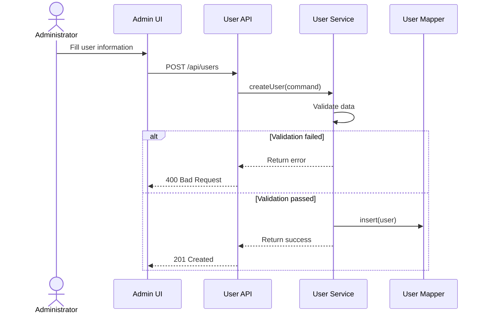
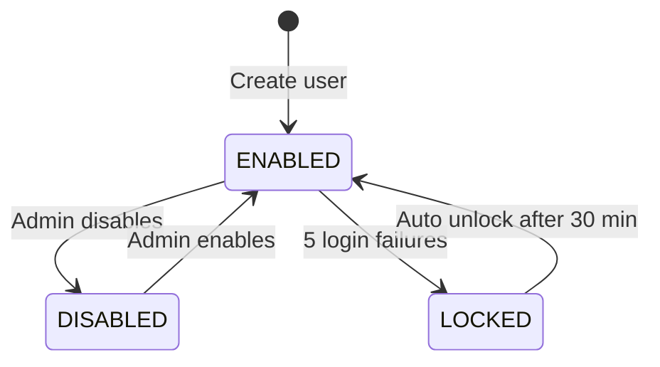

# Business Process Analysis Process

This skill guides the complete business process analysis process, including core process analysis and business rules documentation.

## When to Use

- Analyzing core business processes
- Creating business process documentation
- Defining business rules
- Optimizing business workflows
- Creating process standards

## Process Overview

### Phase 1: Core Business Process Analysis

#### Step 1: Identify Core Business Processes (1-2 days)

**Input**: Domain boundaries, domain model design

**Tasks**:
1. Identify core business processes based on bounded contexts
2. Define process boundaries and scope
3. Identify process triggers and outputs

**Checklist**:
- [ ] All core business processes identified?
- [ ] Each process has clear trigger conditions?
- [ ] Each process has clear outputs?
- [ ] Process boundaries are clear?

**Output**: Core business process list

**Example**:
```markdown
## Core Business Process List

### User Management Domain
1. User Lifecycle Process
   - Trigger: User onboarding/creation
   - Output: User account
   
2. User Password Management Process
   - Trigger: Password reset request
   - Output: New password

### Permission Management Domain
3. Role Management Process
   - Trigger: Create role
   - Output: Role configuration

4. User Authorization Process
   - Trigger: Assign role
   - Output: User permissions
```

#### Step 2: Analyze Process Participants (0.5 day)

**Input**: Core business process list

**Tasks**:
1. Identify process actors
2. Identify system components
3. Define participant responsibilities

**Checklist**:
- [ ] All participants identified?
- [ ] Participant responsibilities clear?
- [ ] System component division reasonable?

**Output**: Participant list and responsibility definitions

**Example**:
```markdown
## User Creation Process Participants

| Participant | Type | Responsibility |
|------------|------|----------------|
| Admin | Human | Fill user info, submit creation request |
| Admin UI | System | Display form, validate input, submit request |
| User API | System | Receive request, call service |
| User Service | System | Business logic processing, data validation |
| User Mapper | System | Data persistence |
| Event Handler | System | Async processing, send notifications |
```

#### Step 3: Draw Process Sequence Diagrams (2-3 days)

**Input**: Participant list

**Tasks**:
1. Draw main process sequence diagram
2. Draw branch process sequence diagrams
3. Draw exception handling processes

**Checklist**:
- [ ] Sequence diagram covers main process?
- [ ] Exception branches included?
- [ ] Async processing clearly marked?
- [ ] Database operations clear?

**Output**: Process sequence diagrams (Mermaid format)

**Example**:
```markdown

```

#### Step 4: Define Process States (0.5 day)

**Input**: Process sequence diagrams

**Tasks**:
1. Identify states in the process
2. Define state transition rules
3. Draw state diagrams

**Checklist**:
- [ ] All states identified?
- [ ] State transitions complete?
- [ ] No illegal state transitions?

**Output**: State transition diagrams

**Example**:
```markdown

```

#### Step 5: Identify Branches and Exceptions (1 day)

**Input**: Process sequence diagrams, state diagrams

**Tasks**:
1. Identify business branch conditions
2. Identify exception scenarios
3. Define exception handling strategies

**Checklist**:
- [ ] All branch conditions identified?
- [ ] All exception scenarios identified?
- [ ] Exception handling strategies clear?
- [ ] Error messages user-friendly?

**Output**: Branch and exception list

**Example**:
```markdown
## User Creation Process Branches and Exceptions

### Branch Conditions
1. Creation method branch
   - Manual creation
   - Batch import
   - HR sync

### Exception Scenarios
1. Data validation exceptions
   - Username exists → Return 409 Conflict
   - Email format error → Return 400 Bad Request
   
2. System exceptions
   - Database connection failure → Return 500 Internal Server Error
   - Message queue exception → Log and continue processing
```

#### Step 6: Write Process Documentation (2 days)

**Input**: All previous outputs

**Tasks**:
1. Write process overview
2. Write detailed process descriptions
3. Write process optimization suggestions

**Document Structure**:
```markdown
# Core Business Process Analysis

## 1. Overview
### 1.1 Document Purpose
### 1.2 Input Documents
### 1.3 Analysis Scope

## 2. [Process Name] Process
### 2.1 Process Overview
### 2.2 Process Sequence Diagram
### 2.3 Process States
### 2.4 Branches and Exceptions
### 2.5 Business Rules

## 3. Process Optimization Suggestions
### 3.1 Performance Optimization
### 3.2 Reliability Optimization

## 4. Appendix
```

**Checklist**:
- [ ] Document structure complete?
- [ ] Sequence diagrams correct?
- [ ] State diagrams correct?
- [ ] Exception handling complete?

**Output**: Core business process analysis document

#### Step 7: Process Review (1 day)

**Input**: Core business process analysis document

**Tasks**:
1. Organize review meeting
2. Record review comments
3. Modify process documents

**Review Checklist**:
- [ ] Process complete?
- [ ] Sequence diagrams correct?
- [ ] Exception handling complete?
- [ ] Business rules correct?
- [ ] Performance considerations adequate?

**Output**: Review records, updated process documents

---

### Phase 2: Business Rules Documentation

#### Step 1: Identify Business Rules (2 days)

**Input**: Core business process documents, domain model design

**Tasks**:
1. Extract business rules from processes
2. Extract constraint rules from domain models
3. Extract business rules from requirements

**Rule Sources**:
- Data constraints (uniqueness, format, range)
- State transitions (state machine rules)
- Permission controls (access control rules)
- Business logic (calculation, validation rules)

**Checklist**:
- [ ] All business processes covered?
- [ ] All domain entities covered?
- [ ] All state transitions covered?
- [ ] All permission control points covered?

**Output**: Business rules list (draft)

**Example**:
```markdown
## User Management Rules

### User Identity Rules
- UR-001: User ID globally unique
- UR-002: Username globally unique, case-insensitive
- UR-003: Username format: starts with letter, 4-20 characters

### User Status Rules
- UR-008: Status enum: ENABLED, DISABLED, LOCKED
- UR-011: Auto lock after 5 login failures
```

#### Step 2: Classify Rules (0.5 day)

**Input**: Business rules list

**Tasks**:
1. Classify by domain
2. Classify by rule type
3. Classify by implementation layer

**Classification Dimensions**:

| Dimension | Categories | Description |
|-----------|-----------|-------------|
| Domain | User Management, Permission Management, Organization, System Config | By business domain |
| Type | Structural, Behavioral, Computational, Security | By rule nature |
| Layer | Database, Entity, Service, Interface | By implementation location |

**Checklist**:
- [ ] Each rule has clear classification?
- [ ] Classification standards consistent?
- [ ] No missing rules?

**Output**: Classified business rules list

#### Step 3: Define Rule Attributes (1 day)

**Input**: Classified business rules list

**Tasks**:
1. Define rule ID
2. Define rule name
3. Define rule description
4. Define rule type
5. Define priority
6. Define implementation approach

**Rule Attributes Template**:
```markdown
| Rule ID | Rule Name | Rule Description | Rule Type | Priority | Implementation |
|---------|-----------|------------------|-----------|----------|----------------|
| UR-001 | User ID Uniqueness | User ID globally unique, auto-generated UUID | Structural | High | Database PK constraint |
```

**Priority Definitions**:
- **High**: Must implement, affects core functionality
- **Medium**: Recommended implement, affects user experience
- **Low**: Optional implement, enhancement feature

**Checklist**:
- [ ] Rule IDs unique?
- [ ] Rule descriptions clear?
- [ ] Priorities reasonable?
- [ ] Implementation approaches clear?

**Output**: Complete business rules attributes table

#### Step 4: Rule Priority Sorting (0.5 day)

**Input**: Complete business rules attributes table

**Tasks**:
1. Group by priority
2. Group by implementation phase
3. Identify rule dependencies

**Implementation Phase Planning**:

| Phase | Rule Priority | Rule Count | Description |
|-------|--------------|------------|-------------|
| Phase 1 (MVP) | High | 40+ | Must implement, affects core functionality |
| Phase 2 (Feature Complete) | Medium | 20+ | Recommended implement, complete features |
| Phase 3 (Enhancement) | Low | 10+ | Optional implement, optimize experience |

**Checklist**:
- [ ] High priority rules cover core functionality?
- [ ] Rule dependencies clear?
- [ ] Implementation phase division reasonable?

**Output**: Priority-sorted rules list

#### Step 5: Write Rule Implementation Guide (1 day)

**Input**: Priority-sorted rules list

**Tasks**:
1. Write rule implementation examples
2. Define rule checklists
3. Write testing suggestions

**Implementation Guide Content**:
```markdown
## Rule Implementation Guide

### Database Layer Implementation
- Unique indexes
- Foreign key constraints
- Check constraints

### Entity Layer Implementation
- Value object validation
- Entity attribute validation
- Domain method validation

### Service Layer Implementation
- Business logic validation
- Cross-entity validation
- Transaction control

### Interface Layer Implementation
- Parameter validation
- Permission validation
- Rate limiting
```

**Checklist**:
- [ ] Implementation examples provided?
- [ ] Checklists complete?
- [ ] Testing suggestions feasible?

**Output**: Business rules documentation

#### Step 6: Rule Review (1 day)

**Input**: Business rules documentation

**Tasks**:
1. Organize review meeting
2. Verify rule completeness
3. Confirm rule priorities
4. Modify rules documents

**Review Checklist**:
- [ ] Rules cover all business scenarios?
- [ ] Rule descriptions clear and accurate?
- [ ] Priority division reasonable?
- [ ] Implementation approaches feasible?
- [ ] No conflicting rules?

**Output**: Review records, updated rules documents

---

## Quality Standards

### Process Documentation Quality Standards

| Check Item | Standard | Check Method |
|-----------|----------|--------------|
| Completeness | Cover all core business processes | Checklist |
| Accuracy | Sequence diagrams consistent with code implementation | Code review |
| Clarity | Process descriptions clear and understandable | Peer review |
| Traceability | Each process traceable to requirements | Requirements traceability matrix |

### Rules Documentation Quality Standards

| Check Item | Standard | Check Method |
|-----------|----------|--------------|
| Completeness | Cover all business rules | Checklist |
| Consistency | No conflicting rules | Rules matrix check |
| Testability | Each rule testable | Test case review |
| Implementability | Rules implementable | Technical review |

---

## Document Templates

### Core Business Process Analysis Document Template

```markdown
# Core Business Process Analysis

> **Document ID**: SYS-DES-BA-XXX  
> **Version**: 1.0  
> **Created Date**: YYYY-MM-DD  
> **Author**: Architect  
> **Status**: Draft

---

## 1. Overview

### 1.1 Document Purpose
### 1.2 Input Documents
### 1.3 Analysis Scope

## 2. [Process Name] Process

### 2.1 Process Overview
### 2.2 Process Sequence Diagram
### 2.3 Process States
### 2.4 Branches and Exceptions

## 3. Process Optimization Suggestions

### 3.1 Performance Optimization
### 3.2 Reliability Optimization

## 4. Appendix
```

### Business Rules Documentation Template

```markdown
# Business Rules Documentation

> **Document ID**: SYS-DES-BA-XXX  
> **Version**: 1.0  
> **Created Date**: YYYY-MM-DD  
> **Author**: Architect  
> **Status**: Draft

---

## 1. Overview

### 1.1 Document Purpose
### 1.2 Input Documents
### 1.3 Rule Classification

## 2. [Domain Name] Rules

### 2.1 [Entity Name] Rules

| Rule ID | Rule Name | Rule Description | Rule Type | Priority | Implementation |
|---------|-----------|------------------|-----------|----------|----------------|

## 3. Rule Priority Matrix

## 4. Rule Implementation Checklist

## 5. Appendix
```

---

## Tools Support

### Diagram Tools
- **Mermaid**: Sequence diagrams, flowcharts, state diagrams
- **PlantUML**: Complex flowcharts
- **Draw.io**: Architecture diagrams

### Documentation Tools
- **Markdown**: Document writing
- **Git**: Version control
- **Documentation System**: Document management

---

## Best Practices

### Process Analysis Best Practices

1. **Start with Happy Path**: Define the main success scenario first
2. **Identify All Actors**: Include both human and system actors
3. **Use Consistent Naming**: Maintain consistent terminology
4. **Document Assumptions**: Clearly state all assumptions
5. **Include Edge Cases**: Don't forget boundary conditions

### Rules Documentation Best Practices

1. **Use Unique IDs**: Each rule must have a unique identifier
2. **Be Specific**: Avoid vague descriptions
3. **Prioritize Ruthlessly**: Not all rules are equal
4. **Consider Testability**: Every rule should be testable
5. **Version Control**: Track rule changes over time

---

## Common Pitfalls

### Process Analysis Pitfalls

1. **Over-engineering**: Don't model every minor detail
2. **Missing Exceptions**: Always consider error scenarios
3. **Inconsistent Level**: Maintain consistent abstraction level
4. **Ignoring Performance**: Consider performance implications
5. **No Stakeholder Review**: Always get business validation

### Rules Documentation Pitfalls

1. **Conflicting Rules**: Ensure rules don't contradict each other
2. **Unimplementable Rules**: Rules must be technically feasible
3. **Missing Context**: Rules need business context
4. **No Priority**: All rules seem equally important
5. **No Validation**: Rules must be validated with stakeholders

---

## Revision History

| Version | Date | Author | Changes |
|---------|------|--------|---------|
| 1.0 | 2026-03-08 | Architect | Initial version |

---

**Document Author**: Architect  
**Document Reviewer**: Technical Lead  
**Created Date**: 2026-03-08
