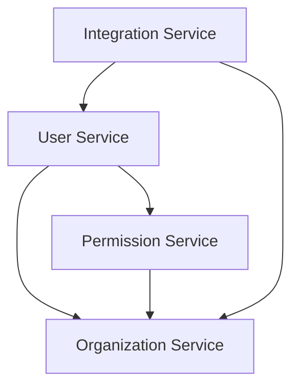

# Requirement Mapping Analysis Process

This skill guides the complete requirement mapping analysis process, including functional requirements mapping and non-functional requirements mapping to architecture capabilities.

## When to Use

- Mapping business requirements to system architecture
- Defining requirement priorities (P0/P1/P2)
- Planning architecture capabilities
- Analyzing functional dependencies
- Mapping non-functional requirements to architecture strategies

## Process Overview

### Phase 1: Functional Requirements Mapping

#### Step 1: Collect Business Functions (0.5 day)

**Input**: Business requirements document (BRD), business process analysis documents

**Tasks**:
1. Extract all business function points from BRD
2. Extract functional requirements from business process analysis
3. Extract functional requirements from user scenarios
4. Organize function list

**Checklist**:
- [ ] All business functions collected?
- [ ] Function descriptions clear?
- [ ] Function sources traceable?

**Output**: Business functions list

**Example**:
```markdown
## Business Functions List

### User Center
1. User login/registration (Source: BRD-3.1)
2. Password management (Source: BRD-3.2)
3. Personal information management (Source: BRD-3.3)

### Permission Management
1. Role management (Source: BRD-4.1)
2. Menu management (Source: BRD-4.2)
3. Permission assignment (Source: BRD-4.3)
```

#### Step 2: Classify Functions (0.5 day)

**Input**: Business functions list

**Tasks**:
1. Classify functions by business domain
2. Identify core functions and supporting functions
3. Identify common functions and specific functions

**Function Classification Principles**:
- **Core Functions**: Functions directly supporting business goals
- **Supporting Functions**: Functions supporting core functions
- **Common Functions**: Reusable basic functions
- **Specific Functions**: Business-specific functions

**Checklist**:
- [ ] Function classification reasonable?
- [ ] Core functions identified completely?
- [ ] Common functions reusable?

**Output**: Classified functions list

#### Step 3: Define System Function Modules (1 day)

**Input**: Classified functions list

**Tasks**:
1. Define system modules based on function classification
2. Define responsibility boundaries for each module
3. Define interfaces between modules

**Module Design Principles**:
- **Single Responsibility**: Each module has single clear responsibility
- **High Cohesion**: Related functions aggregated in same module
- **Low Coupling**: Minimal dependencies between modules
- **Reusability**: Common functions abstracted as independent modules

**Checklist**:
- [ ] Module division reasonable?
- [ ] Module responsibilities clear?
- [ ] Module count appropriate (5-10)?

**Output**: System function modules definition

**Example**:
```markdown
## System Function Modules

### 1. User Center Module
- **Responsibility**: User lifecycle management, authentication
- **Functions**: Login registration, password management, personal info
- **Priority**: P0

### 2. Permission Management Module
- **Responsibility**: Role permission management, access control
- **Functions**: Role management, menu management, permission assignment
- **Priority**: P0
```

#### Step 4: Establish Function Mapping (1 day)

**Input**: Business functions list, system function modules definition

**Tasks**:
1. Establish mapping from business functions to system functions
2. Define mapping relationship types (1:1, 1:N, N:1, N:M)
3. Record mapping rationale

**Mapping Matrix Template**:

| Business Function | System Module | Description | Mapping Type | Priority |
|------------------|---------------|-------------|--------------|----------|
| [Business Func] | [System Module] | [Desc] | [1:1/1:N/N:1/N:M] | [P0/P1/P2] |

**Checklist**:
- [ ] All business functions mapped?
- [ ] Mapping relationships accurate?
- [ ] Mapping rationale clear?

**Output**: Function mapping matrix

#### Step 5: Analyze Function Dependencies (0.5 day)

**Input**: Function mapping matrix

**Tasks**:
1. Identify dependencies between function modules
2. Analyze dependency direction (one-way/two-way)
3. Identify circular dependencies
4. Optimize dependency relationships

**Dependency Analysis Principles**:
- **One-way Dependency**: Prefer one-way, avoid two-way
- **Dependency Inversion**: High-level modules don't depend on low-level
- **Interface Isolation**: Decouple through interfaces

**Checklist**:
- [ ] Dependency relationships clear?
- [ ] Any circular dependencies?
- [ ] Dependencies reasonable?

**Output**: Function dependency diagram

**Example**:


#### Step 6: Evaluate Function Priorities (0.5 day)

**Input**: Function mapping matrix, business requirements priorities

**Tasks**:
1. Evaluate business value of each function
2. Evaluate technical implementation complexity
3. Determine function priorities (P0/P1/P2)

**Priority Definitions**:
- **P0 (Core)**: Must implement, affects core system capabilities
- **P1 (Important)**: Should implement, affects user experience
- **P2 (Extended)**: Can implement, enhances system capabilities

**Evaluation Dimensions**:
| Dimension | P0 | P1 | P2 |
|-----------|-----|-----|-----|
| Business Value | Very High | High | Medium |
| User Impact | All users | Most users | Some users |
| Technical Complexity | Medium-High | Medium | Low-Medium |
| Dependencies | Depended by many | Depended by few | Independent |

**Checklist**:
- [ ] Priority evaluation reasonable?
- [ ] Consistent with business requirements?
- [ ] Technical team agreed?

**Output**: Function priorities list

#### Step 7: Define Architecture Capability Requirements (1 day)

**Input**: Function mapping matrix, function priorities list

**Tasks**:
1. Analyze P0 functions' architecture capability requirements
2. Analyze P1 functions' architecture capability requirements
3. Analyze P2 functions' architecture capability requirements
4. Summarize architecture capability requirements

**Architecture Capability Dimensions**:
- **Availability**: System availability metrics
- **Performance**: Response time, throughput
- **Security**: Authentication, data security
- **Scalability**: Horizontal/vertical scaling
- **Data Consistency**: Strong/eventual consistency

**Checklist**:
- [ ] Architecture capability requirements complete?
- [ ] Match with function priorities?
- [ ] Quantifiable and verifiable?

**Output**: Architecture capability requirements list

**Example**:
```markdown
## P0 Functions Architecture Capability Requirements

| Capability | Requirement | Strategy |
|-----------|-------------|----------|
| Availability | 99.9% | Cluster deployment |
| Performance | <500ms | Cache optimization |
| Security | Level 3 | Encrypted transmission |
| Scalability | 1000+ concurrent | Horizontal scaling |
```

#### Step 8: Document Review (1 day)

**Input**: Functional requirements mapping document

**Tasks**:
1. Organize review meeting
2. Verify function mapping completeness
3. Confirm priority reasonableness
4. Confirm architecture capability feasibility

**Review Checklist**:
- [ ] Function mapping complete?
- [ ] Module division reasonable?
- [ ] Dependency relationships clear?
- [ ] Priorities reasonable?
- [ ] Architecture capability requirements feasible?

**Output**: Review records, updated document

---

### Phase 2: Non-Functional Requirements Mapping

#### Step 1: Identify Non-Functional Requirements (0.5 day)

**Input**: Project charter, business requirements document

**Tasks**:
1. Extract non-functional requirements from project charter
2. Extract non-functional requirements from BRD
3. Identify implicit non-functional requirements

**Non-Functional Requirements Categories**:
- **Performance**: Response time, throughput, concurrency
- **Security**: Authentication, data security, transmission security
- **Availability**: System availability, fault recovery, backup
- **Scalability**: Horizontal/vertical scaling, functional scaling
- **Maintainability**: Monitorability, testability, deployability
- **Compatibility**: Browser compatibility, interface compatibility

**Checklist**:
- [ ] All non-functional requirements identified?
- [ ] Requirements sources clear?
- [ ] Requirements measurable?

**Output**: Non-functional requirements list

#### Step 2: Classify Non-Functional Requirements (0.5 day)

**Input**: Non-functional requirements list

**Tasks**:
1. Classify non-functional requirements by type
2. Identify critical non-functional requirements
3. Identify conflicting requirements

**Checklist**:
- [ ] Classification clear?
- [ ] Critical requirements identified?
- [ ] Conflicts identified and recorded?

**Output**: Classified non-functional requirements

#### Step 3: Define Metrics (1 day)

**Input**: Classified non-functional requirements

**Tasks**:
1. Define measurement metrics for each requirement
2. Define target values and thresholds
3. Define measurement methods

**Metrics Examples**:

| Requirement Type | Metric | Target | Threshold | Method |
|-----------------|--------|--------|-----------|--------|
| Performance | Response Time | <500ms | <1s | APM |
| Performance | Throughput | 2000 QPS | 1000 QPS | Load test |
| Availability | System Availability | 99.9% | 99.5% | Monitoring |
| Security | Vulnerabilities | 0 critical | <3 medium | Security scan |

**Checklist**:
- [ ] Metrics measurable?
- [ ] Target values reasonable?
- [ ] Measurement methods feasible?

**Output**: Non-functional requirements metrics

#### Step 4: Map Architecture Capabilities (1 day)

**Input**: Non-functional requirements metrics

**Tasks**:
1. Analyze impact of each requirement on architecture
2. Identify architecture capabilities needed
3. Establish requirement to capability mapping

**Architecture Capability Mapping Matrix**:

| Non-Functional Requirement | Architecture Capability | Impact | Complexity |
|---------------------------|------------------------|--------|------------|
| Response time <500ms | Caching capability | High | Medium |
| Concurrency 1000+ | Horizontal scaling | High | High |
| Level 3 security | Security protection | High | High |
| 99.9% availability | High availability | High | High |

**Checklist**:
- [ ] Mapping complete?
- [ ] Impact assessment accurate?
- [ ] Complexity assessment reasonable?

**Output**: Architecture capability mapping matrix

#### Step 5: Design Architecture Strategies (1-2 days)

**Input**: Architecture capability mapping matrix

**Tasks**:
1. Design implementation strategy for each capability
2. Select appropriate technical solutions
3. Design architecture patterns

**Architecture Strategy Design Principles**:
- **Targeted**: Strategy designed for specific capability
- **Feasible**: Technical solution implementable
- **Economic**: Cost-effective
- **Scalable**: Support future expansion

**Checklist**:
- [ ] Strategy targeted?
- [ ] Technical solution feasible?
- [ ] Cost considered?

**Output**: Architecture strategy design document

**Example**:
```markdown
## Performance Architecture Strategy

### Response Time Optimization
- **Strategy**: Multi-level cache + async processing
- **Technology**: Redis cache + Message queue
- **Implementation**: Query cache, async writes

### Concurrency Enhancement
- **Strategy**: Stateless design + horizontal scaling
- **Technology**: Load balancer + App cluster
- **Implementation**: Nginx + Kubernetes
```

#### Step 6: Validate Feasibility (0.5 day)

**Input**: Architecture strategy design document

**Tasks**:
1. Validate technical solution feasibility
2. Evaluate resource requirements
3. Identify technical risks

**Validation Methods**:
- **Technical Research**: Validate solution feasibility
- **Prototype Validation**: Key capability prototype
- **Expert Review**: Technical expert assessment

**Checklist**:
- [ ] Technical solution validated?
- [ ] Resource requirements evaluated?
- [ ] Risks identified?

**Output**: Feasibility validation report

#### Step 7: Document Review (1 day)

**Input**: Non-functional requirements mapping document

**Tasks**:
1. Organize review meeting
2. Verify non-functional requirements completeness
3. Confirm metrics reasonableness
4. Confirm architecture strategy feasibility

**Review Checklist**:
- [ ] Non-functional requirements complete?
- [ ] Metrics reasonable?
- [ ] Architecture strategy feasible?
- [ ] Resource requirements evaluated?

**Output**: Review records, updated document

---

## Quality Standards

### Functional Requirements Mapping Quality Standards

| Check Item | Standard | Check Method |
|-----------|----------|--------------|
| Completeness | All business functions mapped | Checklist |
| Accuracy | Mapping relationships correct | Requirements comparison |
| Consistency | Consistent with business requirements | Document comparison |
| Traceability | Mapping sources traceable | Traceability check |

### Non-Functional Requirements Mapping Quality Standards

| Check Item | Standard | Check Method |
|-----------|----------|--------------|
| Completeness | Cover all non-functional requirements | Checklist |
| Measurability | Metrics quantifiable | Metrics validation |
| Feasibility | Strategy implementable | Technical review |
| Verifiability | Can be tested | Test review |

---

## Document Templates

### Functional Requirements Mapping Document Template

```markdown
# Functional Requirements Mapping Analysis

> **Document ID**: SYS-ANA-ARCH-XXX  
> **Version**: 1.0  
> **Created Date**: YYYY-MM-DD  
> **Author**: Architect  
> **Status**: Draft

---

## 1. Overview

### 1.1 Document Purpose
### 1.2 Input Documents
### 1.3 Output Goals

---

## 2. Business to System Function Mapping

### 2.1 Mapping Methodology
### 2.2 Function Mapping Matrix

| Business Function | System Module | Description | Priority |
|------------------|---------------|-------------|----------|

### 2.3 Function Dependency Relationships

---

## 3. Function Priority and Architecture Capability Mapping

### 3.1 P0 Functions
### 3.2 P1 Functions
### 3.3 P2 Functions

---

## 4. Function Architecture View

### 4.1 Function Architecture Overview
### 4.2 Function Module Detailed View

---

## 5. Appendix

### 5.1 Glossary
### 5.2 Revision History
```

### Non-Functional Requirements Mapping Document Template

```markdown
# Non-Functional Requirements Mapping Analysis

> **Document ID**: SYS-ANA-ARCH-XXX  
> **Version**: 1.0  
> **Created Date**: YYYY-MM-DD  
> **Author**: Architect  
> **Status**: Draft

---

## 1. Overview

### 1.1 Document Purpose
### 1.2 Input Documents
### 1.3 Non-Functional Requirements Classification

---

## 2. Performance Requirements Mapping

### 2.1 Response Time Requirements
### 2.2 Throughput Requirements
### 2.3 Concurrency Requirements

---

## 3. Security Requirements Mapping

### 3.1 Authentication Requirements
### 3.2 Data Security Requirements
### 3.3 Transmission Security Requirements

---

## 4. Availability Requirements Mapping

### 4.1 System Availability Requirements
### 4.2 Fault Recovery Requirements
### 4.3 Backup Recovery Requirements

---

## 5. Architecture Strategy Design

### 5.1 Performance Architecture Strategy
### 5.2 Security Architecture Strategy
### 5.3 High Availability Architecture Strategy

---

## 6. Appendix

### 6.1 Glossary
### 6.2 Revision History
```

---

## Best Practices

### Functional Requirements Mapping Best Practices

1. **Start from Business**: Take business requirements as starting point
2. **Keep It Simple**: Avoid over-design, focus on core functions
3. **Clear Priorities**: Clearly define function priorities
4. **Clear Dependencies**: Clear function dependency relationships
5. **Scalability Consideration**: Reserve space for function expansion

### Non-Functional Requirements Mapping Best Practices

1. **Measurable**: All non-functional requirements must be quantifiable
2. **Verifiable**: Design verifiable test plans
3. **Trade-offs**: Balance various non-functional requirements
4. **Cost Awareness**: Consider implementation costs
5. **Progressive Optimization**: Phase implementation, continuous optimization

---

## Common Pitfalls

### Functional Requirements Mapping Pitfalls

1. **Missing Functions**: Missing edge or supporting functions
2. **Wrong Mapping**: Business functions mapped to wrong system modules
3. **Over-splitting**: Function modules split too finely
4. **Ignoring Dependencies**: Ignoring dependencies between functions
5. **Priority Bias**: Priority evaluation deviates from business value

### Non-Functional Requirements Mapping Pitfalls

1. **Vague Metrics**: Measurement metrics not quantifiable
2. **Overly Ambitious**: Setting unrealistic goals
3. **Ignoring Conflicts**: Ignoring conflicts between requirements
4. **Infeasible Strategy**: Designed architecture strategy not implementable
5. **Missing Validation**: Lack of validation mechanism

---

## Revision History

| Version | Date | Author | Changes |
|---------|------|--------|---------|
| 1.0 | 2026-03-08 | Architect | Initial version |

---

**Document Author**: Architect  
**Document Reviewer**: Technical Lead  
**Created Date**: 2026-03-08
