# 核心业务流程分析

> **文档编号**：SYS-DES-BA-003  
> **文档版本**：1.0  
> **创建日期**：2026-03-08  
> **文档作者**：架构师  
> **文档状态**：✅ Reviewed and Approved（2026-03-08）

---

## 1. 概述

### 1.1 文档目的
本文档基于领域边界划分和领域模型设计，详细分析System基础平台的核心业务流程，为后续系统设计和开发提供流程指导。

### 1.2 输入文档
- 领域边界划分（SYS-DES-BA-001）
- 领域模型设计（SYS-DES-BA-002）
- System系统业务需求文档（BRD）V1.1

### 1.3 分析范围
- 用户管理流程
- 权限管理流程
- 组织架构管理流程
- 认证授权流程

---

## 2. 用户管理流程

### 2.1 用户生命周期流程

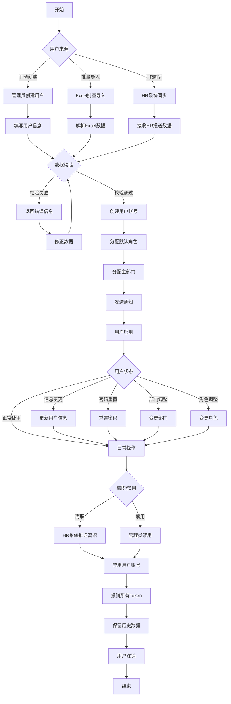
```mermaid
flowchart TD
    A[开始] --> B{用户来源}
    B -->|手动创建| C[管理员创建用户]
    B -->|批量导入| D[Excel批量导入]
    B -->|HR同步| E[HR系统同步]
    
    C --> F[填写用户信息]
    D --> G[解析Excel数据]
    E --> H[接收HR推送数据]
    
    F --> I{数据校验}
    G --> I
    H --> I
    
    I -->|校验失败| J[返回错误信息]
    I -->|校验通过| K[创建用户账号]
    
    J --> L[修正数据]
    L --> I
    
    K --> M[分配默认角色]
    M --> N[分配主部门]
    N --> O[发送通知]
    O --> P[用户启用]
    
    P --> Q{用户状态}
    Q -->|正常使用| R[日常操作]
    Q -->|信息变更| S[更新用户信息]
    Q -->|密码重置| T[重置密码]
    Q -->|部门调整| U[变更部门]
    Q -->|角色调整| V[变更角色]
    
    S --> R
    T --> R
    U --> R
    V --> R
    
    R --> W{离职/禁用}
    W -->|离职| X[HR系统推送离职]
    W -->|禁用| Y[管理员禁用]
    
    X --> Z[禁用用户账号]
    Y --> Z
    Z --> AA[撤销所有Token]
    AA --> AB[保留历史数据]
    AB --> AC[用户注销]
    
    AC --> AD[结束]
```

### 2.2 用户创建流程

#### 2.2.1 手动创建用户

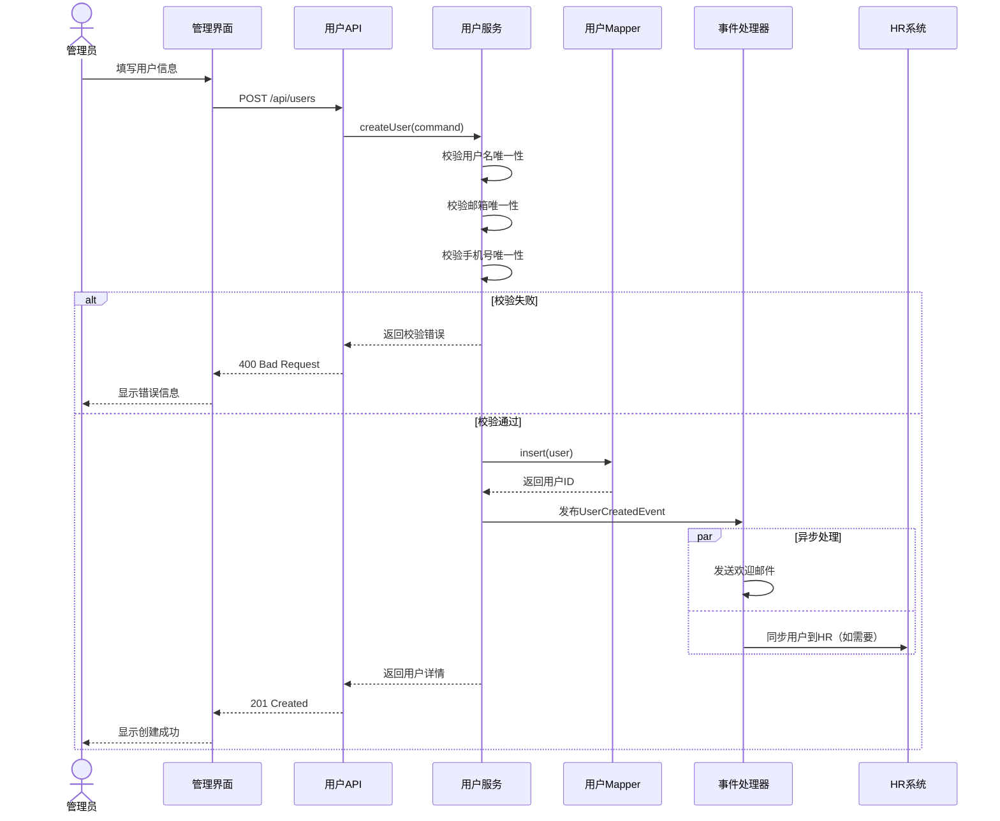
```mermaid
sequenceDiagram
    actor Admin as 管理员
    participant UI as 管理界面
    participant API as 用户API
    participant Service as 用户服务
    participant Mapper as 用户Mapper
    participant Event as 事件处理器
    participant HR as HR系统
    
    Admin->>UI: 填写用户信息
    UI->>API: POST /api/users
    API->>Service: createUser(command)
    
    Service->>Service: 校验用户名唯一性
    Service->>Service: 校验邮箱唯一性
    Service->>Service: 校验手机号唯一性
    
    alt 校验失败
        Service-->>API: 返回校验错误
        API-->>UI: 400 Bad Request
        UI-->>Admin: 显示错误信息
    else 校验通过
        Service->>Mapper: insert(user)
        Mapper-->>Service: 返回用户ID
        
        Service->>Event: 发布UserCreatedEvent
        
        par 异步处理
            Event->>Event: 发送欢迎邮件
        and
            Event->>HR: 同步用户到HR（如需要）
        end
        
        Service-->>API: 返回用户详情
        API-->>UI: 201 Created
        UI-->>Admin: 显示创建成功
    end
```

#### 2.2.2 批量导入用户

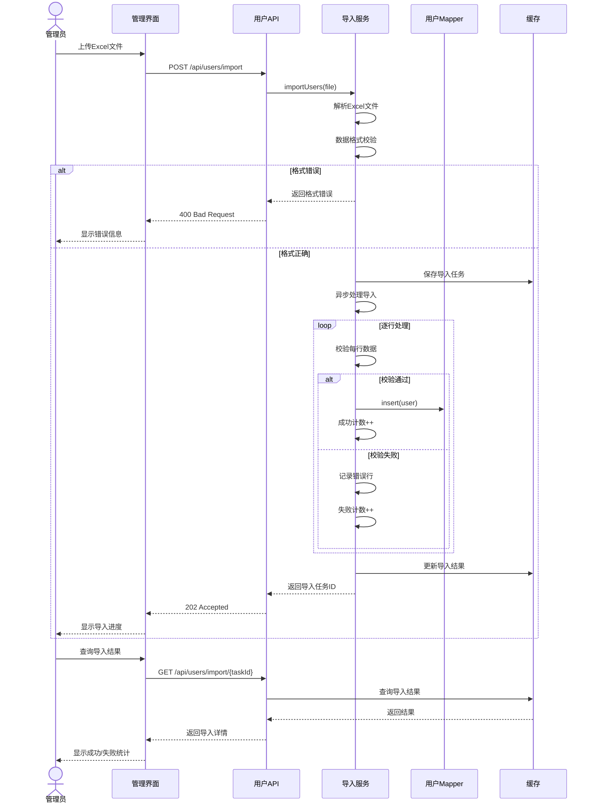
```mermaid
sequenceDiagram
    actor Admin as 管理员
    participant UI as 管理界面
    participant API as 用户API
    participant Service as 导入服务
    participant Mapper as 用户Mapper
    participant Cache as 缓存
    
    Admin->>UI: 上传Excel文件
    UI->>API: POST /api/users/import
    API->>Service: importUsers(file)
    
    Service->>Service: 解析Excel文件
    Service->>Service: 数据格式校验
    
    alt 格式错误
        Service-->>API: 返回格式错误
        API-->>UI: 400 Bad Request
        UI-->>Admin: 显示错误信息
    else 格式正确
        Service->>Cache: 保存导入任务
        Service->>Service: 异步处理导入
        
        loop 逐行处理
            Service->>Service: 校验每行数据
            alt 校验通过
                Service->>Mapper: insert(user)
                Service->>Service: 成功计数++
            else 校验失败
                Service->>Service: 记录错误行
                Service->>Service: 失败计数++
            end
        end
        
        Service->>Cache: 更新导入结果
        Service-->>API: 返回导入任务ID
        API-->>UI: 202 Accepted
        UI-->>Admin: 显示导入进度
    end
    
    Admin->>UI: 查询导入结果
    UI->>API: GET /api/users/import/{taskId}
    API->>Cache: 查询导入结果
    Cache-->>API: 返回结果
    API-->>UI: 返回导入详情
    UI-->>Admin: 显示成功/失败统计
```

### 2.3 用户与员工同步流程

#### 2.3.1 员工入职同步

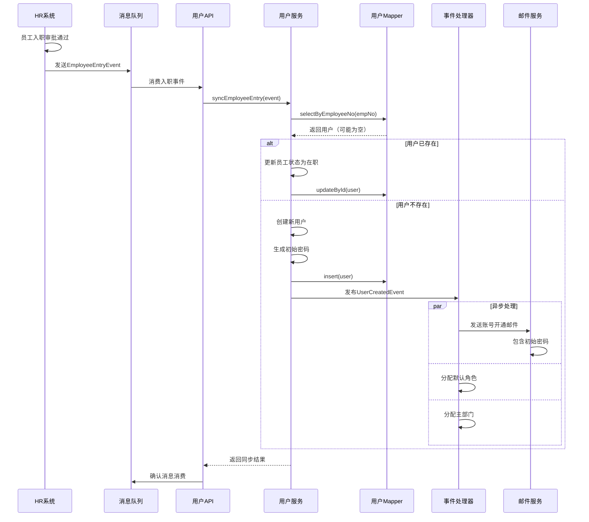
```mermaid
sequenceDiagram
    participant HR as HR系统
    participant MQ as 消息队列
    participant API as 用户API
    participant Service as 用户服务
    participant Mapper as 用户Mapper
    participant Event as 事件处理器
    participant Email as 邮件服务
    
    HR->>HR: 员工入职审批通过
    HR->>MQ: 发送EmployeeEntryEvent
    
    MQ->>API: 消费入职事件
    API->>Service: syncEmployeeEntry(event)
    
    Service->>Mapper: selectByEmployeeNo(empNo)
    Mapper-->>Service: 返回用户（可能为空）
    
    alt 用户已存在
        Service->>Service: 更新员工状态为在职
        Service->>Mapper: updateById(user)
    else 用户不存在
        Service->>Service: 创建新用户
        Service->>Service: 生成初始密码
        Service->>Mapper: insert(user)
        
        Service->>Event: 发布UserCreatedEvent
        
        par 异步处理
            Event->>Email: 发送账号开通邮件
            Email->>Email: 包含初始密码
        and
            Event->>Event: 分配默认角色
        and
            Event->>Event: 分配主部门
        end
    end
    
    Service-->>API: 返回同步结果
    API->>MQ: 确认消息消费
```

#### 2.3.2 员工离职同步

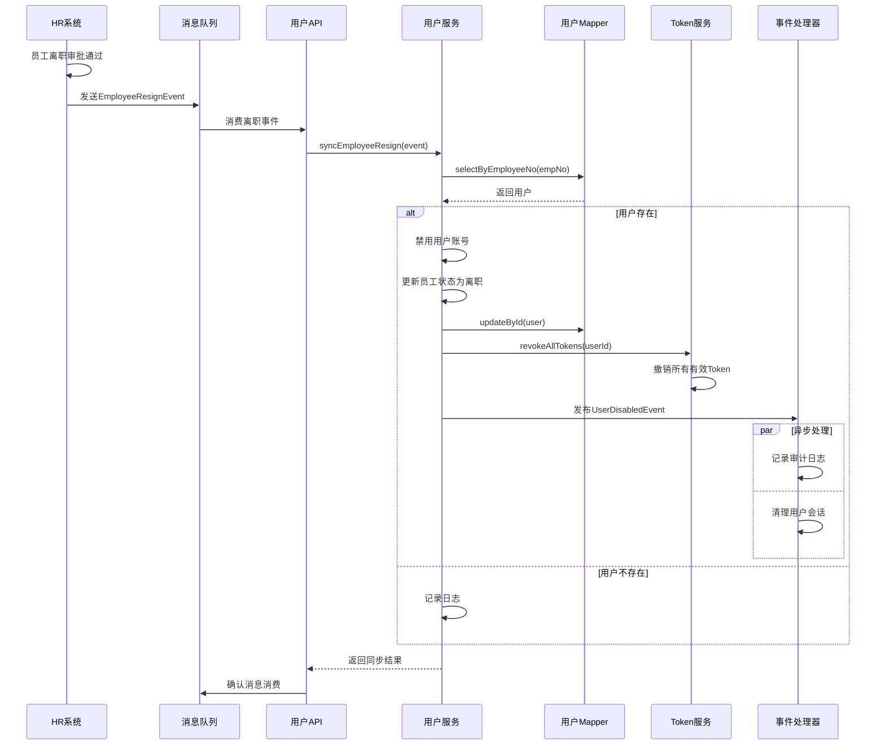
```mermaid
sequenceDiagram
    participant HR as HR系统
    participant MQ as 消息队列
    participant API as 用户API
    participant Service as 用户服务
    participant Mapper as 用户Mapper
    participant Token as Token服务
    participant Event as 事件处理器
    
    HR->>HR: 员工离职审批通过
    HR->>MQ: 发送EmployeeResignEvent
    
    MQ->>API: 消费离职事件
    API->>Service: syncEmployeeResign(event)
    
    Service->>Mapper: selectByEmployeeNo(empNo)
    Mapper-->>Service: 返回用户
    
    alt 用户存在
        Service->>Service: 禁用用户账号
        Service->>Service: 更新员工状态为离职
        Service->>Mapper: updateById(user)
        
        Service->>Token: revokeAllTokens(userId)
        Token->>Token: 撤销所有有效Token
        
        Service->>Event: 发布UserDisabledEvent
        
        par 异步处理
            Event->>Event: 记录审计日志
        and
            Event->>Event: 清理用户会话
        end
    else 用户不存在
        Service->>Service: 记录日志
    end
    
    Service-->>API: 返回同步结果
    API->>MQ: 确认消息消费
```

### 2.4 用户密码管理流程

#### 2.4.1 密码重置流程

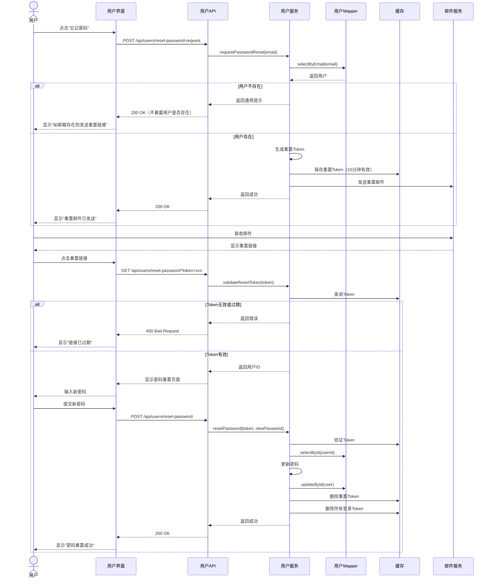
```mermaid
sequenceDiagram
    actor User as 用户
    participant UI as 用户界面
    participant API as 用户API
    participant Service as 用户服务
    participant Mapper as 用户Mapper
    participant Cache as 缓存
    participant Email as 邮件服务
    
    User->>UI: 点击"忘记密码"
    UI->>API: POST /api/users/reset-password-request
    API->>Service: requestPasswordReset(email)
    
    Service->>Mapper: selectByEmail(email)
    Mapper-->>Service: 返回用户
    
    alt 用户不存在
        Service-->>API: 返回通用提示
        API-->>UI: 200 OK（不暴露用户是否存在）
        UI-->>User: 显示"如邮箱存在则发送重置链接"
    else 用户存在
        Service->>Service: 生成重置Token
        Service->>Cache: 保存重置Token（15分钟有效）
        Service->>Email: 发送重置邮件
        
        Service-->>API: 返回成功
        API-->>UI: 200 OK
        UI-->>User: 显示"重置邮件已发送"
    end
    
    User->>Email: 查收邮件
    Email-->>User: 显示重置链接
    User->>UI: 点击重置链接
    UI->>API: GET /api/users/reset-password?token=xxx
    API->>Service: validateResetToken(token)
    Service->>Cache: 查询Token
    
    alt Token无效或过期
        Service-->>API: 返回错误
        API-->>UI: 400 Bad Request
        UI-->>User: 显示"链接已过期"
    else Token有效
        Service-->>API: 返回用户ID
        API-->>UI: 显示密码重置页面
        UI-->>User: 输入新密码
        
        User->>UI: 提交新密码
        UI->>API: POST /api/users/reset-password
        API->>Service: resetPassword(token, newPassword)
        
        Service->>Cache: 验证Token
        Service->>Mapper: selectById(userId)
        Service->>Service: 更新密码
        Service->>Mapper: updateById(user)
        Service->>Cache: 删除重置Token
        Service->>Cache: 删除所有登录Token
        
        Service-->>API: 返回成功
        API-->>UI: 200 OK
        UI-->>User: 显示"密码重置成功"
    end
```

---

## 3. 权限管理流程

### 3.1 角色管理流程

#### 3.1.1 角色创建与权限分配

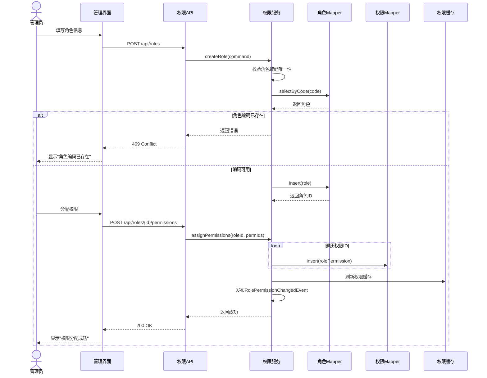
```mermaid
sequenceDiagram
    actor Admin as 管理员
    participant UI as 管理界面
    participant API as 权限API
    participant Service as 权限服务
    participant RoleMapper as 角色Mapper
    participant PermMapper as 权限Mapper
    participant Cache as 权限缓存
    
    Admin->>UI: 填写角色信息
    UI->>API: POST /api/roles
    API->>Service: createRole(command)
    
    Service->>Service: 校验角色编码唯一性
    Service->>RoleMapper: selectByCode(code)
    RoleMapper-->>Service: 返回角色
    
    alt 角色编码已存在
        Service-->>API: 返回错误
        API-->>UI: 409 Conflict
        UI-->>Admin: 显示"角色编码已存在"
    else 编码可用
        Service->>RoleMapper: insert(role)
        RoleMapper-->>Service: 返回角色ID
        
        Admin->>UI: 分配权限
        UI->>API: POST /api/roles/{id}/permissions
        API->>Service: assignPermissions(roleId, permIds)
        
        loop 遍历权限ID
            Service->>PermMapper: insert(rolePermission)
        end
        
        Service->>Cache: 刷新权限缓存
        Service->>Service: 发布RolePermissionChangedEvent
        
        Service-->>API: 返回成功
        API-->>UI: 200 OK
        UI-->>Admin: 显示"权限分配成功"
    end
```

### 3.2 用户授权流程

#### 3.2.1 角色分配流程

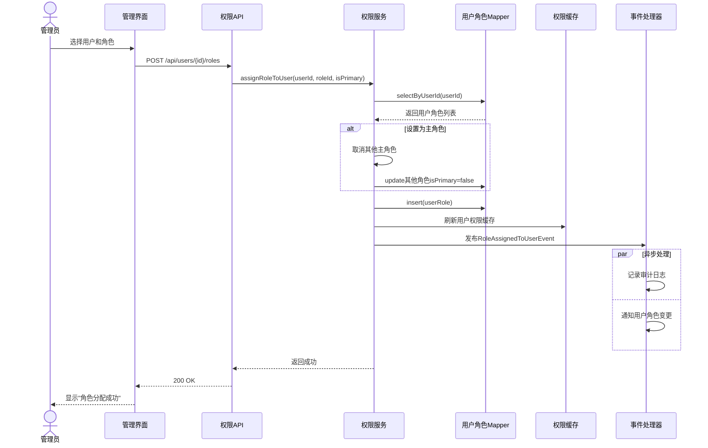
```mermaid
sequenceDiagram
    actor Admin as 管理员
    participant UI as 管理界面
    participant API as 权限API
    participant Service as 权限服务
    participant UserRoleMapper as 用户角色Mapper
    participant Cache as 权限缓存
    participant Event as 事件处理器
    
    Admin->>UI: 选择用户和角色
    UI->>API: POST /api/users/{id}/roles
    API->>Service: assignRoleToUser(userId, roleId, isPrimary)
    
    Service->>UserRoleMapper: selectByUserId(userId)
    UserRoleMapper-->>Service: 返回用户角色列表
    
    alt 设置为主角色
        Service->>Service: 取消其他主角色
        Service->>UserRoleMapper: update其他角色isPrimary=false
    end
    
    Service->>UserRoleMapper: insert(userRole)
    
    Service->>Cache: 刷新用户权限缓存
    Service->>Event: 发布RoleAssignedToUserEvent
    
    par 异步处理
        Event->>Event: 记录审计日志
    and
        Event->>Event: 通知用户角色变更
    end
    
    Service-->>API: 返回成功
    API-->>UI: 200 OK
    UI-->>Admin: 显示"角色分配成功"
```

### 3.3 权限校验流程

#### 3.3.1 实时权限校验

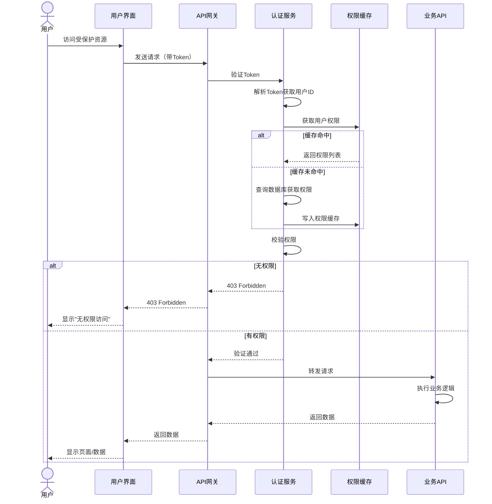
```mermaid
sequenceDiagram
    actor User as 用户
    participant UI as 用户界面
    participant Gateway as API网关
    participant Auth as 认证服务
    participant Cache as 权限缓存
    participant API as 业务API
    
    User->>UI: 访问受保护资源
    UI->>Gateway: 发送请求（带Token）
    
    Gateway->>Auth: 验证Token
    Auth->>Auth: 解析Token获取用户ID
    Auth->>Cache: 获取用户权限
    
    alt 缓存命中
        Cache-->>Auth: 返回权限列表
    else 缓存未命中
        Auth->>Auth: 查询数据库获取权限
        Auth->>Cache: 写入权限缓存
    end
    
    Auth->>Auth: 校验权限
    
    alt 无权限
        Auth-->>Gateway: 403 Forbidden
        Gateway-->>UI: 403 Forbidden
        UI-->>User: 显示"无权限访问"
    else 有权限
        Auth-->>Gateway: 验证通过
        Gateway->>API: 转发请求
        API->>API: 执行业务逻辑
        API-->>Gateway: 返回数据
        Gateway-->>UI: 返回数据
        UI-->>User: 显示页面/数据
    end
```

---

## 4. 组织架构管理流程

### 4.1 部门管理流程

#### 4.1.1 部门创建流程

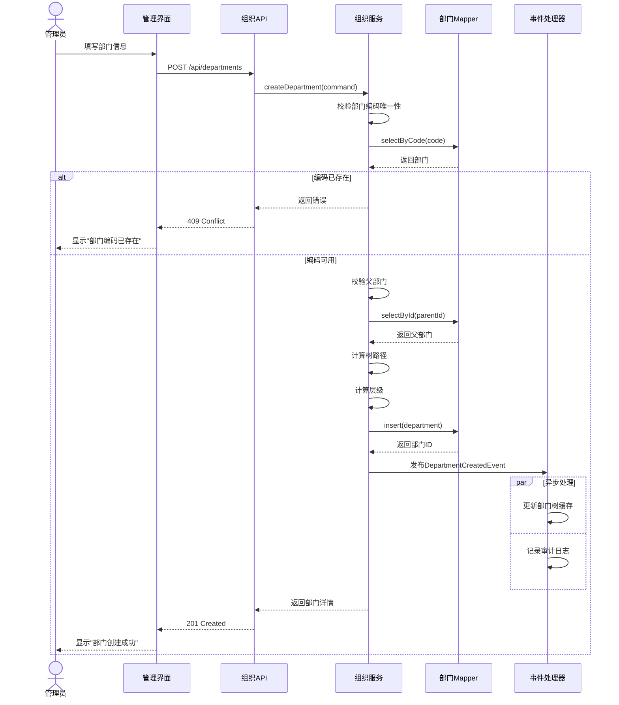
```mermaid
sequenceDiagram
    actor Admin as 管理员
    participant UI as 管理界面
    participant API as 组织API
    participant Service as 组织服务
    participant DeptMapper as 部门Mapper
    participant Event as 事件处理器
    
    Admin->>UI: 填写部门信息
    UI->>API: POST /api/departments
    API->>Service: createDepartment(command)
    
    Service->>Service: 校验部门编码唯一性
    Service->>DeptMapper: selectByCode(code)
    DeptMapper-->>Service: 返回部门
    
    alt 编码已存在
        Service-->>API: 返回错误
        API-->>UI: 409 Conflict
        UI-->>Admin: 显示"部门编码已存在"
    else 编码可用
        Service->>Service: 校验父部门
        Service->>DeptMapper: selectById(parentId)
        DeptMapper-->>Service: 返回父部门
        
        Service->>Service: 计算树路径
        Service->>Service: 计算层级
        
        Service->>DeptMapper: insert(department)
        DeptMapper-->>Service: 返回部门ID
        
        Service->>Event: 发布DepartmentCreatedEvent
        
        par 异步处理
            Event->>Event: 更新部门树缓存
        and
            Event->>Event: 记录审计日志
        end
        
        Service-->>API: 返回部门详情
        API-->>UI: 201 Created
        UI-->>Admin: 显示"部门创建成功"
    end
```

#### 4.1.2 部门调整流程

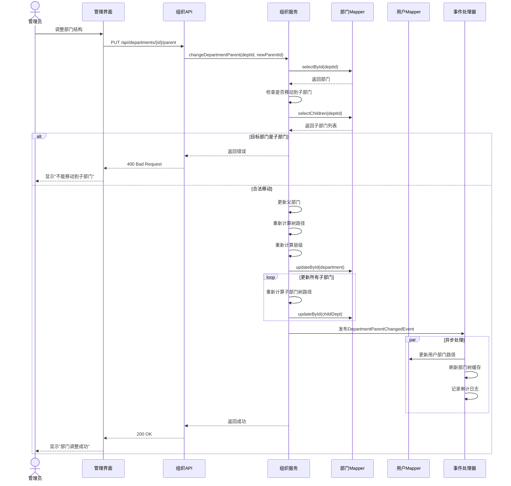
```mermaid
sequenceDiagram
    actor Admin as 管理员
    participant UI as 管理界面
    participant API as 组织API
    participant Service as 组织服务
    participant DeptMapper as 部门Mapper
    participant UserMapper as 用户Mapper
    participant Event as 事件处理器
    
    Admin->>UI: 调整部门结构
    UI->>API: PUT /api/departments/{id}/parent
    API->>Service: changeDepartmentParent(deptId, newParentId)
    
    Service->>DeptMapper: selectById(deptId)
    DeptMapper-->>Service: 返回部门
    
    Service->>Service: 检查是否移动到子部门
    Service->>DeptMapper: selectChildren(deptId)
    DeptMapper-->>Service: 返回子部门列表
    
    alt 目标部门是子部门
        Service-->>API: 返回错误
        API-->>UI: 400 Bad Request
        UI-->>Admin: 显示"不能移动到子部门"
    else 合法移动
        Service->>Service: 更新父部门
        Service->>Service: 重新计算树路径
        Service->>Service: 重新计算层级
        
        Service->>DeptMapper: updateById(department)
        
        loop 更新所有子部门
            Service->>Service: 重新计算子部门树路径
            Service->>DeptMapper: updateById(childDept)
        end
        
        Service->>Event: 发布DepartmentParentChangedEvent
        
        par 异步处理
            Event->>UserMapper: 更新用户部门路径
            Event->>Event: 刷新部门树缓存
            Event->>Event: 记录审计日志
        end
        
        Service-->>API: 返回成功
        API-->>UI: 200 OK
        UI-->>Admin: 显示"部门调整成功"
    end
```

### 4.2 用户部门分配流程

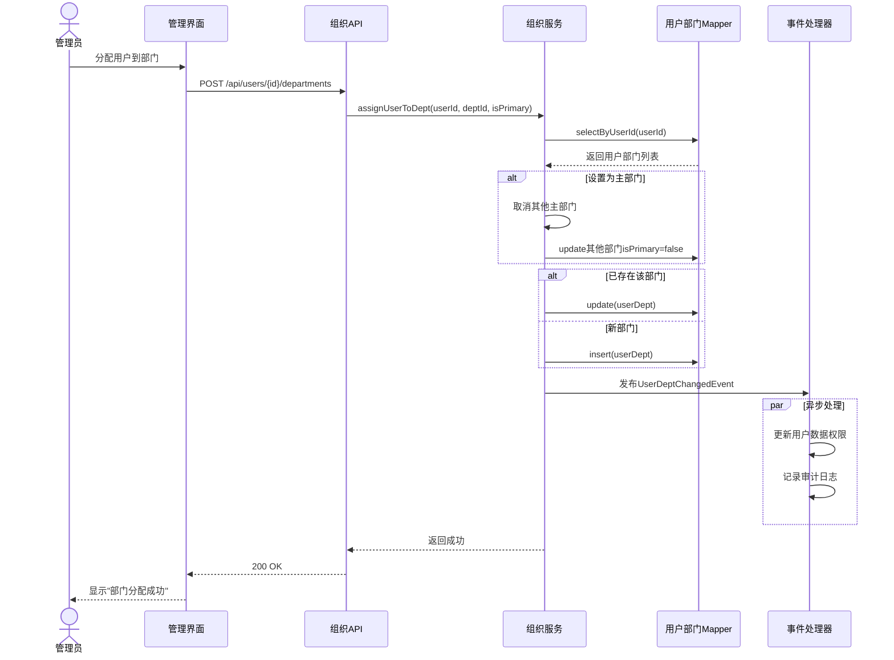
```mermaid
sequenceDiagram
    actor Admin as 管理员
    participant UI as 管理界面
    participant API as 组织API
    participant Service as 组织服务
    participant UserDeptMapper as 用户部门Mapper
    participant Event as 事件处理器
    
    Admin->>UI: 分配用户到部门
    UI->>API: POST /api/users/{id}/departments
    API->>Service: assignUserToDept(userId, deptId, isPrimary)
    
    Service->>UserDeptMapper: selectByUserId(userId)
    UserDeptMapper-->>Service: 返回用户部门列表
    
    alt 设置为主部门
        Service->>Service: 取消其他主部门
        Service->>UserDeptMapper: update其他部门isPrimary=false
    end
    
    alt 已存在该部门
        Service->>UserDeptMapper: update(userDept)
    else 新部门
        Service->>UserDeptMapper: insert(userDept)
    end
    
    Service->>Event: 发布UserDeptChangedEvent
    
    par 异步处理
        Event->>Event: 更新用户数据权限
        Event->>Event: 记录审计日志
    end
    
    Service-->>API: 返回成功
    API-->>UI: 200 OK
    UI-->>Admin: 显示"部门分配成功"
```

---

## 5. 认证授权流程

### 5.1 用户登录流程

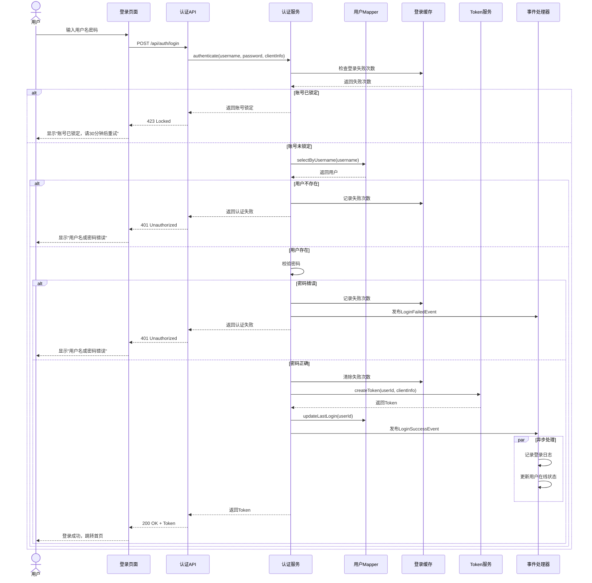
```mermaid
sequenceDiagram
    actor User as 用户
    participant UI as 登录页面
    participant API as 认证API
    participant AuthService as 认证服务
    participant UserMapper as 用户Mapper
    participant Cache as 登录缓存
    participant TokenService as Token服务
    participant Event as 事件处理器
    
    User->>UI: 输入用户名密码
    UI->>API: POST /api/auth/login
    API->>AuthService: authenticate(username, password, clientInfo)
    
    AuthService->>Cache: 检查登录失败次数
    Cache-->>AuthService: 返回失败次数
    
    alt 账号已锁定
        AuthService-->>API: 返回账号锁定
        API-->>UI: 423 Locked
        UI-->>User: 显示"账号已锁定，请30分钟后重试"
    else 账号未锁定
        AuthService->>UserMapper: selectByUsername(username)
        UserMapper-->>AuthService: 返回用户
        
        alt 用户不存在
            AuthService->>Cache: 记录失败次数
            AuthService-->>API: 返回认证失败
            API-->>UI: 401 Unauthorized
            UI-->>User: 显示"用户名或密码错误"
        else 用户存在
            AuthService->>AuthService: 校验密码
            
            alt 密码错误
                AuthService->>Cache: 记录失败次数
                AuthService->>Event: 发布LoginFailedEvent
                AuthService-->>API: 返回认证失败
                API-->>UI: 401 Unauthorized
                UI-->>User: 显示"用户名或密码错误"
            else 密码正确
                AuthService->>Cache: 清除失败次数
                AuthService->>TokenService: createToken(userId, clientInfo)
                TokenService-->>AuthService: 返回Token
                
                AuthService->>UserMapper: updateLastLogin(userId)
                AuthService->>Event: 发布LoginSuccessEvent
                
                par 异步处理
                    Event->>Event: 记录登录日志
                    Event->>Event: 更新用户在线状态
                end
                
                AuthService-->>API: 返回Token
                API-->>UI: 200 OK + Token
                UI-->>User: 登录成功，跳转首页
            end
        end
    end
```

### 5.2 Token刷新流程

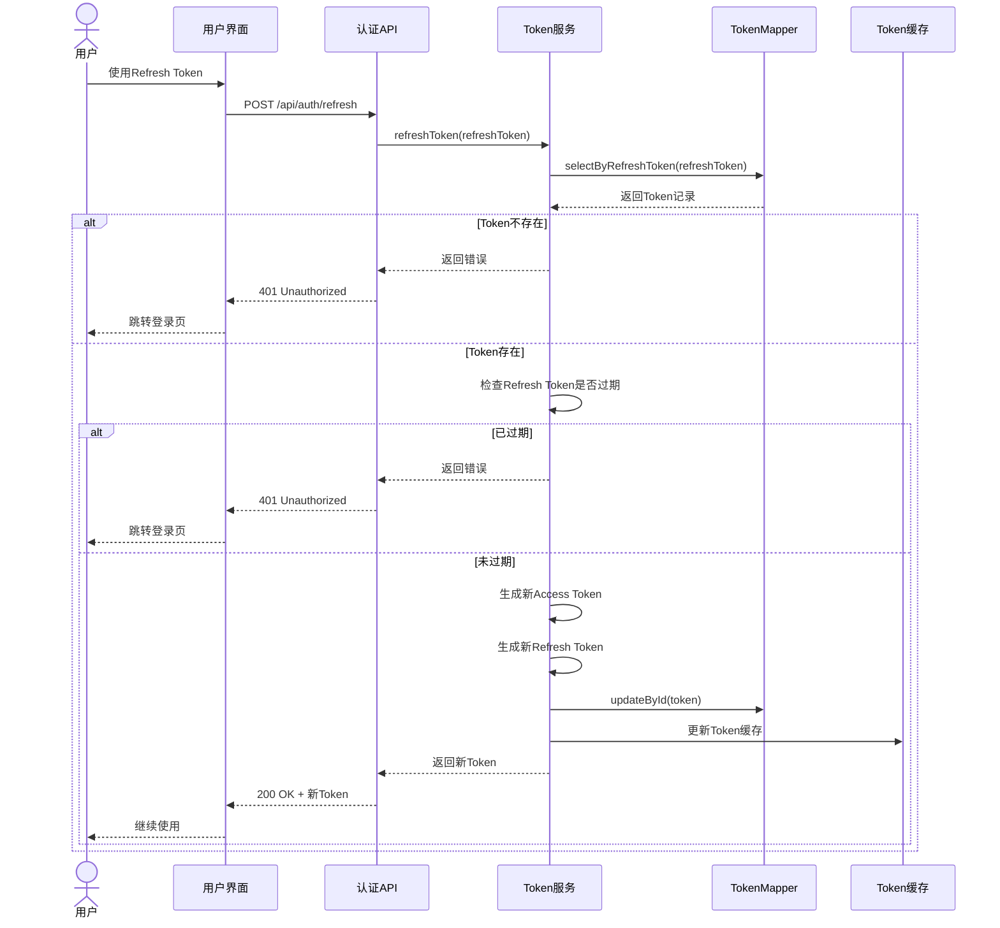
```mermaid
sequenceDiagram
    actor User as 用户
    participant UI as 用户界面
    participant API as 认证API
    participant TokenService as Token服务
    participant TokenMapper as TokenMapper
    participant Cache as Token缓存
    
    User->>UI: 使用Refresh Token
    UI->>API: POST /api/auth/refresh
    API->>TokenService: refreshToken(refreshToken)
    
    TokenService->>TokenMapper: selectByRefreshToken(refreshToken)
    TokenMapper-->>TokenService: 返回Token记录
    
    alt Token不存在
        TokenService-->>API: 返回错误
        API-->>UI: 401 Unauthorized
        UI-->>User: 跳转登录页
    else Token存在
        TokenService->>TokenService: 检查Refresh Token是否过期
        
        alt 已过期
            TokenService-->>API: 返回错误
            API-->>UI: 401 Unauthorized
            UI-->>User: 跳转登录页
        else 未过期
            TokenService->>TokenService: 生成新Access Token
            TokenService->>TokenService: 生成新Refresh Token
            TokenService->>TokenMapper: updateById(token)
            TokenService->>Cache: 更新Token缓存
            
            TokenService-->>API: 返回新Token
            API-->>UI: 200 OK + 新Token
            UI-->>User: 继续使用
        end
    end
```

### 5.3 单点登录（SSO）流程

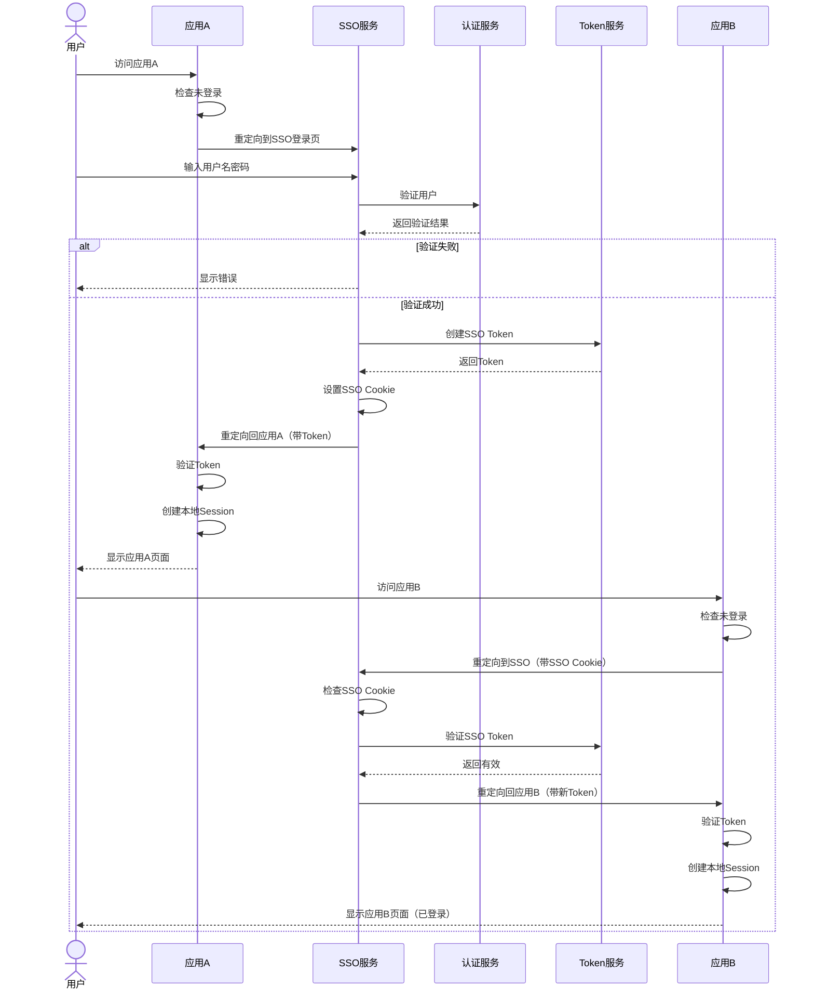
```mermaid
sequenceDiagram
    actor User as 用户
    participant AppA as 应用A
    participant SSO as SSO服务
    participant Auth as 认证服务
    participant TokenService as Token服务
    participant AppB as 应用B
    
    User->>AppA: 访问应用A
    AppA->>AppA: 检查未登录
    AppA->>SSO: 重定向到SSO登录页
    
    User->>SSO: 输入用户名密码
    SSO->>Auth: 验证用户
    Auth-->>SSO: 返回验证结果
    
    alt 验证失败
        SSO-->>User: 显示错误
    else 验证成功
        SSO->>TokenService: 创建SSO Token
        TokenService-->>SSO: 返回Token
        SSO->>SSO: 设置SSO Cookie
        SSO->>AppA: 重定向回应用A（带Token）
        
        AppA->>AppA: 验证Token
        AppA->>AppA: 创建本地Session
        AppA-->>User: 显示应用A页面
        
        User->>AppB: 访问应用B
        AppB->>AppB: 检查未登录
        AppB->>SSO: 重定向到SSO（带SSO Cookie）
        
        SSO->>SSO: 检查SSO Cookie
        SSO->>TokenService: 验证SSO Token
        TokenService-->>SSO: 返回有效
        
        SSO->>AppB: 重定向回应用B（带新Token）
        AppB->>AppB: 验证Token
        AppB->>AppB: 创建本地Session
        AppB-->>User: 显示应用B页面（已登录）
    end
```

---

## 6. 流程优化建议

### 6.1 性能优化

| 流程 | 优化点 | 优化方案 |
|-----|--------|---------|
| 权限校验 | 减少数据库查询 | 使用Redis缓存用户权限 |
| 批量导入 | 提高导入速度 | 使用批量插入，异步处理 |
| 部门树加载 | 减少查询次数 | 使用树路径冗余存储 |
| 登录认证 | 加速认证过程 | 使用JWT，减少Session查询 |

### 6.2 可靠性优化

| 流程 | 风险点 | 优化方案 |
|-----|--------|---------|
| HR同步 | 消息丢失 | 使用消息队列，保证至少一次投递 |
| 权限变更 | 缓存不一致 | 使用Cache-Aside模式，及时失效 |
| Token管理 | Token泄露 | 设置合理过期时间，支持主动撤销 |
| 批量操作 | 部分失败 | 使用事务，记录失败明细 |

---

## 7. 附录

### 7.1 流程状态码

| 状态码 | 含义 | 使用场景 |
|-------|------|---------|
| 200 | 成功 | 操作成功完成 |
| 201 | 创建成功 | 资源创建成功 |
| 202 | 已接受 | 异步任务已接受 |
| 400 | 请求错误 | 参数校验失败 |
| 401 | 未认证 | 登录失败或Token无效 |
| 403 | 无权限 | 权限校验失败 |
| 404 | 不存在 | 资源不存在 |
| 409 | 冲突 | 数据冲突（如重复） |
| 423 | 已锁定 | 账号被锁定 |
| 500 | 服务器错误 | 系统内部错误 |

### 7.2 修订记录

| 版本 | 日期 | 修订人 | 修订内容 |
|-----|------|-------|---------|
| 1.0 | 2026-03-08 | 架构师 | 初始版本 |

---

**文档编制**：架构师  
**文档审核**：技术负责人  
**编制日期**：2026-03-08
