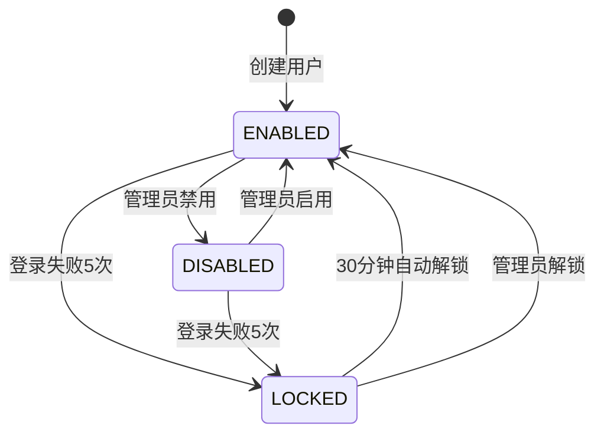

# 业务规则梳理

> **文档编号**：SYS-DES-BA-004  
> **文档版本**：1.0  
> **创建日期**：2026-03-08  
> **文档作者**：架构师  
> **文档状态**：✅ Reviewed and Approved（2026-03-08）

---

## 1. 概述

### 1.1 文档目的
本文档梳理System基础平台的核心业务规则，明确规则的优先级、实现方式和验证点，为系统开发和测试提供依据。

### 1.2 输入文档
- 领域边界划分（SYS-DES-BA-001）
- 领域模型设计（SYS-DES-BA-002）
- 核心业务流程（SYS-DES-BA-003）
- System系统业务需求文档（BRD）V1.1

### 1.3 规则分类
- **结构性规则**：数据结构和关系约束
- **行为性规则**：业务流程和状态转换规则
- **计算性规则**：数据计算和派生规则
- **安全性规则**：权限和安全控制规则

---

## 2. 用户管理规则

### 2.1 用户实体规则

#### 2.1.1 用户标识规则

| 规则编号 | 规则名称 | 规则描述 | 规则类型 | 优先级 | 实现方式 |
|---------|---------|---------|---------|--------|---------|
| UR-001 | 用户ID唯一性 | 用户ID全局唯一，系统自动生成UUID | 结构性 | 高 | 数据库主键约束 |
| UR-002 | 用户名唯一性 | 用户名全局唯一，不区分大小写 | 结构性 | 高 | 数据库唯一索引 |
| UR-003 | 用户名格式 | 字母开头，4-20位，允许字母数字下划线 | 结构性 | 高 | 正则表达式校验 |
| UR-004 | 邮箱唯一性 | 邮箱地址全局唯一 | 结构性 | 高 | 数据库唯一索引 |
| UR-005 | 邮箱格式 | 符合标准邮箱格式 | 结构性 | 高 | 正则表达式校验 |
| UR-006 | 手机号唯一性 | 手机号全局唯一 | 结构性 | 高 | 数据库唯一索引 |
| UR-007 | 手机号格式 | 大陆手机号11位 | 结构性 | 高 | 正则表达式校验 |

**实现示例**：
```java
public class Username {
    private static final Pattern PATTERN = Pattern.compile("^[a-zA-Z][a-zA-Z0-9_]{3,19}$");
    
    public Username(String value) {
        if (!PATTERN.matcher(value).matches()) {
            throw new InvalidUsernameException("用户名格式错误：字母开头，4-20位，允许字母数字下划线");
        }
        this.value = value.toLowerCase(); // 统一小写存储
    }
}
```

#### 2.1.2 用户状态规则

| 规则编号 | 规则名称 | 规则描述 | 规则类型 | 优先级 | 实现方式 |
|---------|---------|---------|---------|--------|---------|
| UR-008 | 状态枚举 | 用户状态：启用(ENABLED)、禁用(DISABLED)、锁定(LOCKED) | 结构性 | 高 | 枚举类型 |
| UR-009 | 状态转换-启用到禁用 | 管理员可以手动禁用已启用用户 | 行为性 | 高 | 权限控制+状态机 |
| UR-010 | 状态转换-禁用到启用 | 管理员可以手动启用已禁用用户 | 行为性 | 高 | 权限控制+状态机 |
| UR-011 | 状态转换-启用/禁用到锁定 | 登录失败5次自动锁定 | 行为性 | 高 | 登录失败计数器 |
| UR-012 | 状态转换-锁定到启用 | 锁定30分钟后自动解锁，或管理员手动解锁 | 行为性 | 高 | 定时任务/权限控制 |
| UR-013 | 锁定用户限制 | 锁定用户无法登录，Token立即失效 | 安全性 | 高 | 登录拦截+Token撤销 |

**状态转换图**：


#### 2.1.3 用户属性规则

| 规则编号 | 规则名称 | 规则描述 | 规则类型 | 优先级 | 实现方式 |
|---------|---------|---------|---------|--------|---------|
| UR-014 | 真实姓名必填 | 真实姓名不能为空，2-20位 | 结构性 | 中 | 非空校验+长度校验 |
| UR-015 | 主部门必填 | 用户必须有一个主部门 | 结构性 | 高 | 外键约束+业务校验 |
| UR-016 | 员工编号唯一 | 员工编号全局唯一，可为空 | 结构性 | 中 | 数据库唯一索引（允许NULL） |
| UR-017 | 员工状态关联 | 员工状态：在职(ACTIVE)、离职(RESIGNED)、试用期(PROBATION) | 结构性 | 中 | 枚举类型 |
| UR-018 | 员工离职自动禁用 | 员工离职时自动禁用用户账号 | 行为性 | 高 | HR同步事件处理 |
| UR-019 | 创建时间不可修改 | 用户创建时间一旦设置不可修改 | 结构性 | 低 | 只读字段 |
| UR-020 | 更新时间自动更新 | 用户信息变更时自动更新更新时间 | 结构性 | 低 | MyBatis Plus自动填充 |

### 2.2 用户密码规则

#### 2.2.1 密码复杂度规则

| 规则编号 | 规则名称 | 规则描述 | 规则类型 | 优先级 | 实现方式 |
|---------|---------|---------|---------|--------|---------|
| PR-001 | 密码长度 | 密码长度8-20位 | 结构性 | 高 | 长度校验 |
| PR-002 | 密码复杂度 | 必须包含大小写字母、数字、特殊字符 | 结构性 | 高 | 正则表达式校验 |
| PR-003 | 密码不能包含用户名 | 密码不能包含用户名或其逆序 | 安全性 | 中 | 字符串匹配校验 |
| PR-004 | 密码不能是常见密码 | 密码不能是常见弱密码（如123456） | 安全性 | 中 | 弱密码字典校验 |
| PR-005 | 密码历史检查 | 新密码不能与最近5次密码相同 | 安全性 | 中 | 密码历史表校验 |

**密码复杂度正则**：
```java
public class PasswordValidator {
    // 至少1个大写、1个小写、1个数字、1个特殊字符，8-20位
    private static final Pattern COMPLEXITY_PATTERN = 
        Pattern.compile("^(?=.*[a-z])(?=.*[A-Z])(?=.*\\d)(?=.*[@$!%*?&])[A-Za-z\\d@$!%*?&]{8,20}$");
    
    public void validate(String password, String username) {
        // 复杂度校验
        if (!COMPLEXITY_PATTERN.matcher(password).matches()) {
            throw new WeakPasswordException("密码必须包含大小写字母、数字、特殊字符，8-20位");
        }
        
        // 不能包含用户名
        if (password.toLowerCase().contains(username.toLowerCase())) {
            throw new WeakPasswordException("密码不能包含用户名");
        }
        
        // 弱密码字典校验
        if (isCommonPassword(password)) {
            throw new WeakPasswordException("密码过于简单，请使用更复杂的密码");
        }
    }
}
```

#### 2.2.2 密码安全规则

| 规则编号 | 规则名称 | 规则描述 | 规则类型 | 优先级 | 实现方式 |
|---------|---------|---------|---------|--------|---------|
| PR-006 | 密码加密存储 | 密码必须使用bcrypt加密存储 | 安全性 | 高 | Spring Security BCrypt |
| PR-007 | 密码不可反查 | 系统无法反查用户明文密码 | 安全性 | 高 | 单向哈希 |
| PR-008 | 密码有效期 | 密码有效期90天，到期需修改 | 安全性 | 中 | 定时任务提醒 |
| PR-009 | 首次登录修改密码 | 首次登录或使用初始密码必须修改密码 | 安全性 | 高 | 登录拦截+强制跳转 |
| PR-010 | 密码重置Token有效期 | 密码重置链接15分钟有效 | 安全性 | 高 | Redis过期时间 |
| PR-011 | 密码重置后失效Token | 密码重置后所有Token立即失效 | 安全性 | 高 | Token撤销 |

#### 2.2.3 登录安全规则

| 规则编号 | 规则名称 | 规则描述 | 规则类型 | 优先级 | 实现方式 |
|---------|---------|---------|---------|--------|---------|
| LR-001 | 登录失败计数 | 连续登录失败5次锁定账号 | 安全性 | 高 | Redis计数器 |
| LR-002 | 登录失败锁定时间 | 锁定30分钟后自动解锁 | 安全性 | 高 | Redis过期时间 |
| LR-003 | 登录IP限制 | 可配置允许登录的IP范围 | 安全性 | 低 | IP白名单校验 |
| LR-004 | 异地登录提醒 | 检测到异地登录发送提醒 | 安全性 | 低 | IP地理位置分析 |
| LR-005 | 会话超时 | 30分钟无操作自动退出 | 安全性 | 高 | Token过期时间 |
| LR-006 | 单点登录限制 | 同一用户同时只能在一个设备登录（可配置） | 安全性 | 低 | Token互斥 |

### 2.3 用户操作规则

| 规则编号 | 规则名称 | 规则描述 | 规则类型 | 优先级 | 实现方式 |
|---------|---------|---------|---------|--------|---------|
| OR-001 | 删除用户限制 | 已登录、有操作日志、有待办的用户不可删除 | 行为性 | 高 | 关联数据检查 |
| OR-002 | 删除用户处理 | 删除用户时保留历史数据，标记为已删除 | 行为性 | 高 | 逻辑删除 |
| OR-003 | 批量导入限制 | 单次批量导入最多1000条记录 | 行为性 | 中 | 参数校验 |
| OR-004 | 批量导入异步 | 超过100条记录使用异步处理 | 行为性 | 中 | 异步任务 |
| OR-005 | 用户信息变更审计 | 关键信息变更需记录审计日志 | 安全性 | 高 | AOP拦截 |

---

## 3. 权限管理规则

### 3.1 角色管理规则

#### 3.1.1 角色实体规则

| 规则编号 | 规则名称 | 规则描述 | 规则类型 | 优先级 | 实现方式 |
|---------|---------|---------|---------|--------|---------|
| RR-001 | 角色ID唯一性 | 角色ID全局唯一 | 结构性 | 高 | 数据库主键约束 |
| RR-002 | 角色编码唯一性 | 角色编码全局唯一 | 结构性 | 高 | 数据库唯一索引 |
| RR-003 | 角色编码格式 | 字母开头，2-50位，允许字母数字下划线 | 结构性 | 高 | 正则表达式校验 |
| RR-004 | 角色名称唯一性 | 角色名称全局唯一 | 结构性 | 高 | 数据库唯一索引 |
| RR-005 | 系统角色保护 | 系统预置角色不可删除 | 行为性 | 高 | 业务逻辑校验 |
| RR-006 | 系统角色编码保护 | 系统预置角色编码不可修改 | 行为性 | 高 | 业务逻辑校验 |

**系统预置角色清单**：
| 角色编码 | 角色名称 | 说明 | 可删除 |
|---------|---------|------|--------|
| SUPER_ADMIN | 超级管理员 | 系统最高权限 | 否 |
| SYSTEM_ADMIN | 系统管理员 | 系统管理权限 | 否 |
| DEPT_ADMIN | 部门管理员 | 部门管理权限 | 否 |
| NORMAL_USER | 普通用户 | 基础操作权限 | 否 |

#### 3.1.2 角色权限规则

| 规则编号 | 规则名称 | 规则描述 | 规则类型 | 优先级 | 实现方式 |
|---------|---------|---------|---------|--------|---------|
| RR-007 | 操作权限依赖菜单权限 | 分配操作权限必须先分配对应菜单权限 | 行为性 | 高 | 业务逻辑校验 |
| RR-008 | 数据权限范围 | 数据权限：全部 > 本部门及子部门 > 本部门 > 本人 | 结构性 | 高 | 枚举类型 |
| RR-009 | 角色权限缓存 | 角色权限变更后需刷新缓存 | 行为性 | 高 | Cache Aside模式 |
| RR-010 | 角色权限审计 | 角色权限变更需记录审计日志 | 安全性 | 高 | AOP拦截 |

### 3.2 用户授权规则

#### 3.2.1 用户角色规则

| 规则编号 | 规则名称 | 规则描述 | 规则类型 | 优先级 | 实现方式 |
|---------|---------|---------|---------|--------|---------|
| AR-001 | 用户必须有一个角色 | 用户至少分配一个角色 | 结构性 | 高 | 业务逻辑校验 |
| AR-002 | 主角色唯一 | 用户只能有一个主角色 | 结构性 | 高 | 业务逻辑校验 |
| AR-003 | 角色互斥 | 某些角色不能同时分配（如超级管理员和普通用户） | 行为性 | 低 | 互斥矩阵校验 |
| AR-004 | 角色继承 | 部门管理员自动继承该部门所有用户的数据权限 | 计算性 | 中 | 权限计算逻辑 |
| AR-005 | 角色变更实时生效 | 用户角色变更后权限立即生效 | 行为性 | 高 | 缓存刷新 |

#### 3.2.2 权限校验规则

| 规则编号 | 规则名称 | 规则描述 | 规则类型 | 优先级 | 实现方式 |
|---------|---------|---------|---------|--------|---------|
| AR-006 | 权限校验方式 | 用户权限 = 所有角色权限的并集 | 计算性 | 高 | 权限计算逻辑 |
| AR-007 | 数据权限计算 | 取用户所有角色中最大的数据权限范围 | 计算性 | 高 | 权限比较逻辑 |
| AR-008 | 权限缓存策略 | 用户权限缓存2小时，变更时主动失效 | 行为性 | 高 | Redis缓存 |
| AR-009 | 权限校验日志 | 敏感操作权限校验需记录日志 | 安全性 | 中 | AOP拦截 |

**权限计算示例**：
```java
public class PermissionCalculator {
    
    public boolean hasPermission(UserId userId, Permission requiredPermission) {
        // 获取用户所有角色
        List<Role> roles = roleMapper.selectByUserId(userId);
        
        // 获取所有角色的权限
        Set<Permission> userPermissions = roles.stream()
            .flatMap(role -> permissionMapper.selectByRoleId(role.getRoleId()).stream())
            .collect(Collectors.toSet());
        
        // 检查是否包含所需权限
        return userPermissions.stream()
            .anyMatch(permission -> permission.implies(requiredPermission));
    }
    
    public DataScope calculateDataScope(UserId userId) {
        List<Role> roles = roleMapper.selectByUserId(userId);
        
        // 取最大权限范围
        return roles.stream()
            .map(Role::getDataScope)
            .max(Comparator.comparingInt(DataScope::getPriority))
            .orElse(DataScope.SELF);
    }
}
```

---

## 4. 组织架构规则

### 4.1 部门管理规则

#### 4.1.1 部门实体规则

| 规则编号 | 规则名称 | 规则描述 | 规则类型 | 优先级 | 实现方式 |
|---------|---------|---------|---------|--------|---------|
| DR-001 | 部门ID唯一性 | 部门ID全局唯一 | 结构性 | 高 | 数据库主键约束 |
| DR-002 | 部门编码唯一性 | 部门编码全局唯一 | 结构性 | 高 | 数据库唯一索引 |
| DR-003 | 部门编码格式 | 2-50位，允许字母数字下划线 | 结构性 | 高 | 正则表达式校验 |
| DR-004 | 部门名称唯一性 | 部门名称全局唯一 | 结构性 | 高 | 数据库唯一索引 |
| DR-005 | 部门层级限制 | 部门层级建议不超过5级 | 结构性 | 中 | 业务逻辑校验 |
| DR-006 | 树路径冗余 | 部门树路径冗余存储，如：/1/2/5/ | 结构性 | 高 | 字段存储 |
| DR-007 | 树层级冗余 | 部门树层级冗余存储 | 结构性 | 高 | 字段存储 |

#### 4.1.2 部门结构规则

| 规则编号 | 规则名称 | 规则描述 | 规则类型 | 优先级 | 实现方式 |
|---------|---------|---------|---------|--------|---------|
| DR-008 | 父部门存在性 | 父部门必须存在（根部门除外） | 结构性 | 高 | 外键约束 |
| DR-009 | 无循环依赖 | 部门不能成为自己的子部门 | 结构性 | 高 | 业务逻辑校验 |
| DR-010 | 禁用部门限制 | 有子部门的部门不可禁用 | 行为性 | 高 | 关联数据检查 |
| DR-011 | 禁用部门限制 | 有用户的部门不可禁用 | 行为性 | 高 | 关联数据检查 |
| DR-012 | 部门删除限制 | 有子部门或用户的部门不可删除 | 行为性 | 高 | 关联数据检查 |
| DR-013 | 部门变更级联 | 部门父节点变更时，所有子部门树路径需更新 | 行为性 | 高 | 级联更新 |

**循环依赖检查示例**：
```java
public class DepartmentService {
    
    public void changeParent(DeptId deptId, DeptId newParentId) {
        // 检查是否移动到子部门
        List<DeptId> childrenIds = getAllChildrenIds(deptId);
        if (childrenIds.contains(newParentId)) {
            throw new InvalidOperationException("不能将部门移动到其子部门下");
        }
        
        // 更新父部门
        Department dept = departmentMapper.selectById(deptId);
        dept.changeParent(newParentId);
        departmentMapper.updateById(dept);
        
        // 级联更新子部门树路径
        cascadeUpdateTreePath(deptId);
    }
    
    private List<DeptId> getAllChildrenIds(DeptId deptId) {
        List<DeptId> result = new ArrayList<>();
        List<Department> children = departmentMapper.selectByParentId(deptId);
        for (Department child : children) {
            result.add(child.getDeptId());
            result.addAll(getAllChildrenIds(child.getDeptId()));
        }
        return result;
    }
}
```

### 4.2 用户部门关系规则

| 规则编号 | 规则名称 | 规则描述 | 规则类型 | 优先级 | 实现方式 |
|---------|---------|---------|---------|--------|---------|
| DR-014 | 主部门唯一 | 用户只能有一个主部门 | 结构性 | 高 | 业务逻辑校验 |
| DR-015 | 主部门必填 | 用户必须有一个主部门 | 结构性 | 高 | 非空校验 |
| DR-016 | 兼职部门可选 | 用户可以有多个兼职部门 | 结构性 | 中 | 业务逻辑支持 |
| DR-017 | 部门负责人 | 部门负责人自动获得部门管理员角色 | 行为性 | 中 | 事件处理 |
| DR-018 | 部门变更权限 | 用户部门变更时数据权限需重新计算 | 行为性 | 高 | 事件处理 |

---

## 5. 系统配置规则

### 5.1 配置管理规则

#### 5.1.1 配置实体规则

| 规则编号 | 规则名称 | 规则描述 | 规则类型 | 优先级 | 实现方式 |
|---------|---------|---------|---------|--------|---------|
| CR-001 | 配置键唯一性 | 配置键全局唯一 | 结构性 | 高 | 数据库唯一索引 |
| CR-002 | 配置键格式 | 格式：category.subcategory.name，如web.system.name | 结构性 | 高 | 正则表达式校验 |
| CR-003 | 配置类型限制 | 配置值必须符合配置类型（STRING/NUMBER/BOOLEAN/JSON） | 结构性 | 高 | 类型校验 |
| CR-004 | 系统配置保护 | 系统预置配置不可删除 | 行为性 | 高 | 业务逻辑校验 |
| CR-005 | 敏感配置加密 | 敏感配置（如密码、密钥）必须加密存储 | 安全性 | 高 | AES加密 |

#### 5.1.2 配置分类规则

| 规则编号 | 规则名称 | 规则描述 | 规则类型 | 优先级 | 实现方式 |
|---------|---------|---------|---------|--------|---------|
| CR-006 | Web配置分类 | 以web.开头的配置属于Web端展示配置 | 结构性 | 中 | 命名约定 |
| CR-007 | 商务配置分类 | 以biz.开头的配置属于商务信息配置 | 结构性 | 中 | 命名约定 |
| CR-008 | 系统配置分类 | 以sys.开头的配置属于系统参数配置 | 结构性 | 中 | 命名约定 |
| CR-009 | 配置缓存 | 配置变更后需刷新缓存 | 行为性 | 高 | Cache Aside模式 |
| CR-010 | 配置变更审计 | 配置变更需记录审计日志 | 安全性 | 高 | AOP拦截 |

---

## 6. 认证授权规则

### 6.1 Token管理规则

| 规则编号 | 规则名称 | 规则描述 | 规则类型 | 优先级 | 实现方式 |
|---------|---------|---------|---------|--------|---------|
| TR-001 | Access Token有效期 | Access Token有效期2小时 | 结构性 | 高 | JWT过期时间 |
| TR-002 | Refresh Token有效期 | Refresh Token有效期7天 | 结构性 | 高 | JWT过期时间 |
| TR-003 | Token唯一性 | 每个Token唯一标识 | 结构性 | 高 | UUID生成 |
| TR-004 | Token撤销 | 支持主动撤销Token | 行为性 | 高 | Token黑名单 |
| TR-005 | Token刷新 | Refresh Token只能使用一次 | 安全性 | 高 | 使用后失效 |
| TR-006 | Token绑定 | Token绑定设备和IP（可选） | 安全性 | 低 | JWT Claims |

### 6.2 会话管理规则

| 规则编号 | 规则名称 | 规则描述 | 规则类型 | 优先级 | 实现方式 |
|---------|---------|---------|---------|--------|---------|
| SR-001 | 会话超时 | 30分钟无操作会话超时 | 结构性 | 高 | Token过期时间 |
| SR-002 | 会话续期 | 活跃会话自动续期 | 行为性 | 高 | Token刷新机制 |
| SR-003 | 会话并发 | 同一用户支持多会话（可配置） | 行为性 | 低 | Token管理 |
| SR-004 | 强制下线 | 管理员可强制用户下线 | 行为性 | 高 | Token撤销 |

---

## 7. 审计日志规则

| 规则编号 | 规则名称 | 规则描述 | 规则类型 | 优先级 | 实现方式 |
|---------|---------|---------|---------|--------|---------|
| LR-001 | 关键操作审计 | 用户增删改、权限变更等关键操作必须记录审计日志 | 安全性 | 高 | AOP拦截 |
| LR-002 | 登录日志记录 | 所有登录尝试（成功/失败）必须记录 | 安全性 | 高 | 登录拦截器 |
| LR-003 | 审计日志不可修改 | 审计日志一旦生成不可修改 | 安全性 | 高 | 只读表 |
| LR-004 | 审计日志不可删除 | 审计日志在保留期内不可删除 | 安全性 | 高 | 业务逻辑控制 |
| LR-005 | 日志保留期限 | 在线查询3个月，归档保留1年 | 行为性 | 中 | 定时归档任务 |
| LR-006 | 敏感数据脱敏 | 审计日志中敏感数据需脱敏存储 | 安全性 | 高 | 数据脱敏处理 |

---

## 8. 规则优先级矩阵

### 8.1 按优先级分类

#### 高优先级规则（必须实现）

| 领域 | 规则数量 | 关键规则 |
|-----|---------|---------|
| 用户管理 | 15 | 用户标识唯一性、密码复杂度、登录安全 |
| 权限管理 | 10 | 角色编码唯一性、权限校验、数据权限 |
| 组织架构 | 8 | 部门编码唯一性、无循环依赖 |
| 认证授权 | 6 | Token有效期、会话超时 |
| 审计日志 | 4 | 关键操作审计、日志不可修改 |

#### 中优先级规则（建议实现）

| 领域 | 规则数量 | 关键规则 |
|-----|---------|---------|
| 用户管理 | 8 | 员工关联、批量导入限制 |
| 权限管理 | 4 | 角色继承、权限缓存 |
| 组织架构 | 4 | 部门层级限制、部门负责人 |
| 系统配置 | 3 | 配置分类、配置缓存 |

#### 低优先级规则（可选实现）

| 领域 | 规则数量 | 关键规则 |
|-----|---------|---------|
| 用户管理 | 3 | 异地登录提醒、单点登录限制 |
| 权限管理 | 1 | 角色互斥 |
| 认证授权 | 2 | Token绑定、会话并发 |

### 8.2 按实现阶段分类

#### 第一阶段（MVP必需）

- [ ] UR-001 ~ UR-007：用户标识规则
- [ ] UR-008 ~ UR-013：用户状态规则
- [ ] PR-001 ~ PR-007：密码基础规则
- [ ] LR-001 ~ LR-003：登录安全规则
- [ ] RR-001 ~ RR-007：角色基础规则
- [ ] AR-001 ~ AR-003：用户授权基础规则
- [ ] DR-001 ~ DR-007：部门基础规则
- [ ] TR-001 ~ TR-003：Token基础规则

#### 第二阶段（功能完善）

- [ ] UR-014 ~ UR-020：用户属性规则
- [ ] PR-008 ~ PR-011：密码高级规则
- [ ] RR-008 ~ RR-010：角色权限规则
- [ ] AR-004 ~ AR-009：权限计算规则
- [ ] DR-008 ~ DR-018：部门结构规则
- [ ] TR-004 ~ TR-006：Token高级规则
- [ ] CR-001 ~ CR-010：系统配置规则

#### 第三阶段（增强优化）

- [ ] LR-004 ~ LR-006：登录增强规则
- [ ] OR-001 ~ OR-005：用户操作规则
- [ ] SR-001 ~ SR-004：会话管理规则
- [ ] LR-001 ~ LR-006：审计日志规则

---

## 9. 规则实现检查清单

### 9.1 开发阶段检查点

| 检查项 | 检查内容 | 检查方式 |
|-------|---------|---------|
| 数据库约束 | 唯一索引、外键约束是否正确创建 | 数据库Schema检查 |
| 实体校验 | 值对象、实体属性校验是否正确实现 | 单元测试 |
| 业务逻辑 | 业务规则在Service层是否正确实现 | 单元测试 |
| 权限控制 | 权限校验是否正确配置 | 集成测试 |
| 事件处理 | 领域事件是否正确发布和处理 | 集成测试 |

### 9.2 测试阶段检查点

| 检查项 | 检查内容 | 检查方式 |
|-------|---------|---------|
| 正向测试 | 符合规则的数据是否能正常处理 | 功能测试 |
| 反向测试 | 违反规则的数据是否被正确拦截 | 异常测试 |
| 边界测试 | 边界值是否符合预期 | 边界测试 |
| 并发测试 | 并发场景下规则是否仍然有效 | 并发测试 |
| 性能测试 | 规则校验对性能的影响 | 性能测试 |

---

## 10. 附录

### 10.1 规则编号说明

| 前缀 | 含义 | 示例 |
|-----|------|------|
| UR | User Rule 用户规则 | UR-001 |
| PR | Password Rule 密码规则 | PR-001 |
| LR | Login Rule 登录规则 | LR-001 |
| OR | Operation Rule 操作规则 | OR-001 |
| RR | Role Rule 角色规则 | RR-001 |
| AR | Authorization Rule 授权规则 | AR-001 |
| DR | Department Rule 部门规则 | DR-001 |
| CR | Configuration Rule 配置规则 | CR-001 |
| TR | Token Rule Token规则 | TR-001 |
| SR | Session Rule 会话规则 | SR-001 |

### 10.2 规则类型说明

| 类型 | 说明 | 实现位置 |
|-----|------|---------|
| 结构性规则 | 数据结构和关系约束 | 数据库、实体类 |
| 行为性规则 | 业务流程和状态转换 | Service层、领域模型 |
| 计算性规则 | 数据计算和派生 | Service层、工具类 |
| 安全性规则 | 权限和安全控制 | 安全框架、拦截器 |

### 10.3 修订记录

| 版本 | 日期 | 修订人 | 修订内容 |
|-----|------|-------|---------|
| 1.0 | 2026-03-08 | 架构师 | 初始版本 |

---

**文档编制**：架构师  
**文档审核**：技术负责人  
**编制日期**：2026-03-08
