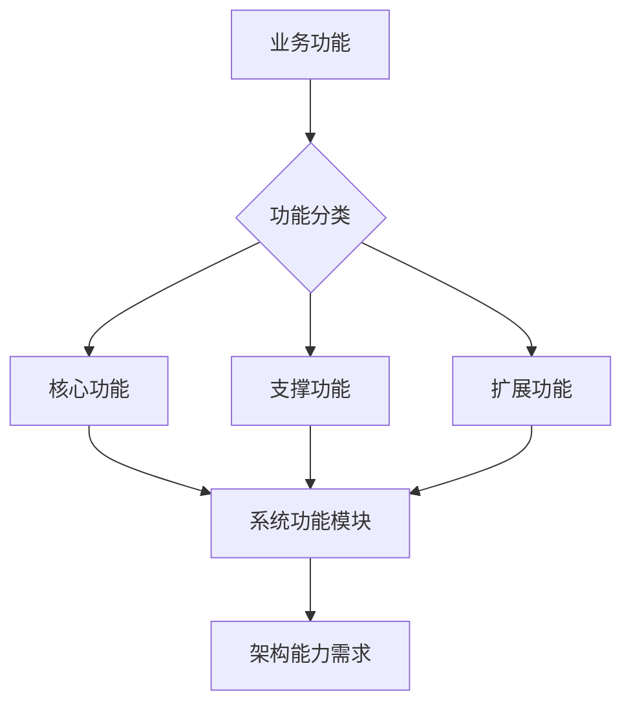
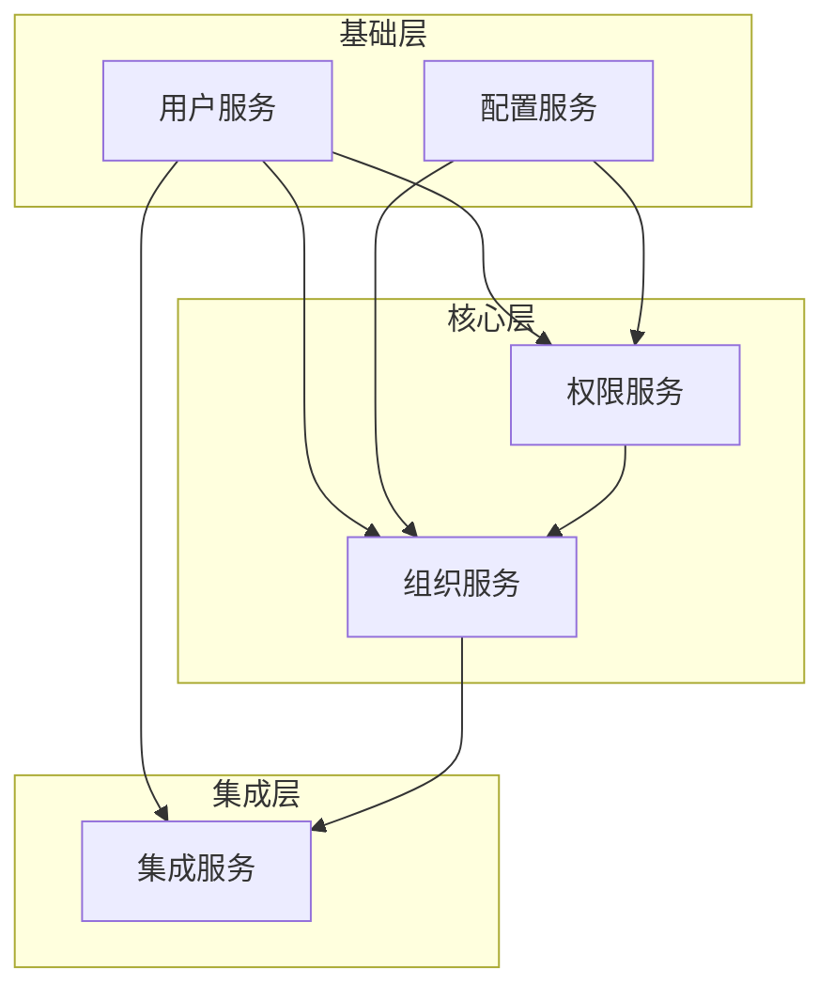
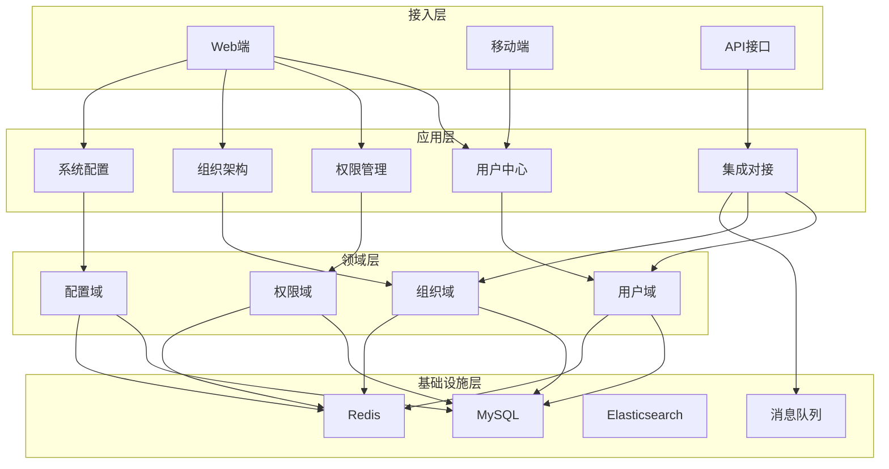
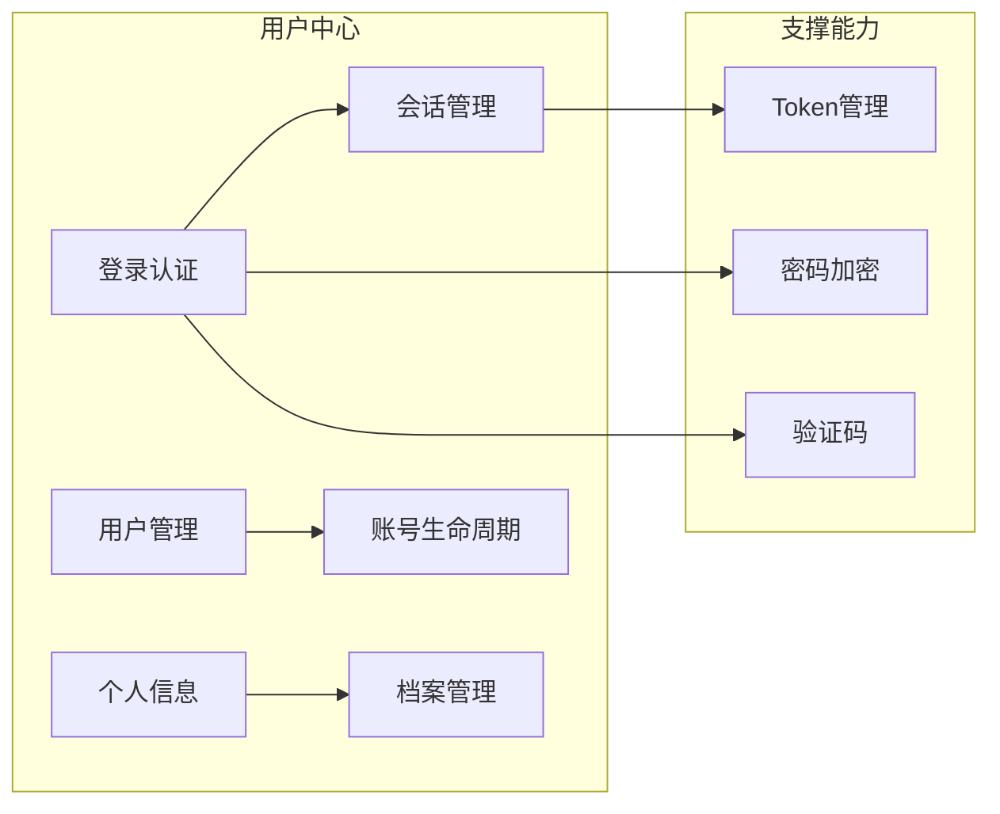
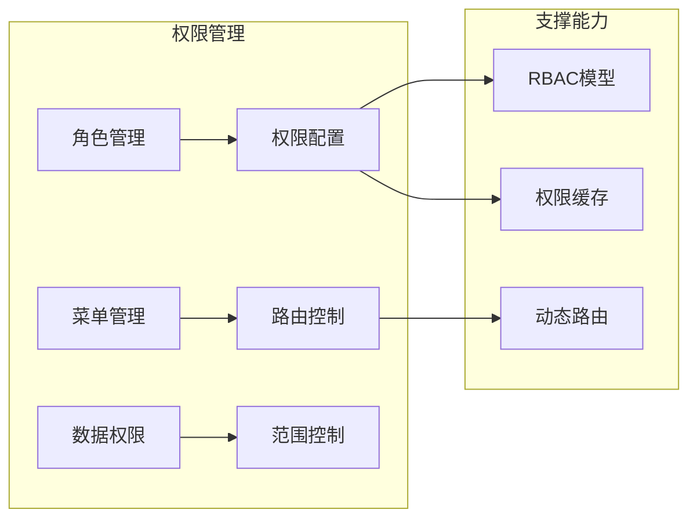
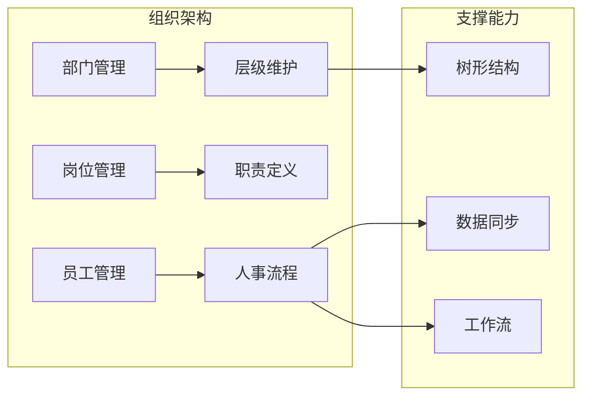
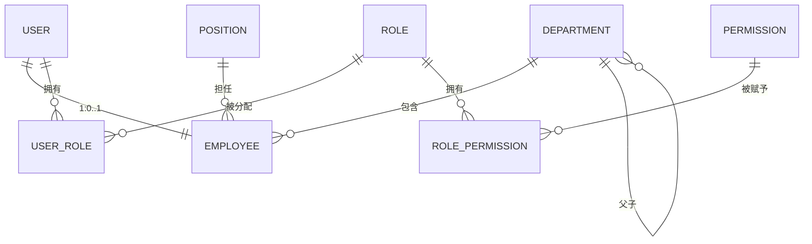
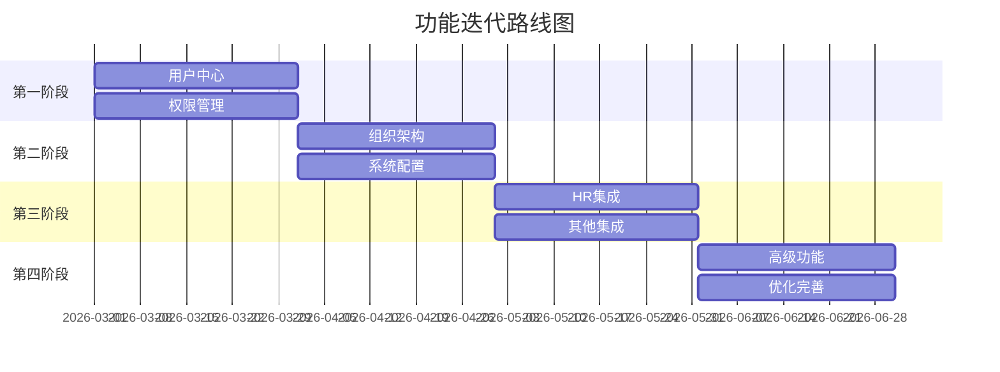

# 功能需求架构映射分析

> **文档编号**：SYS-ANA-ARCH-001  
> **文档版本**：1.0  
> **创建日期**：2026-03-08  
> **文档作者**：架构师  
> **文档状态**：草稿

---

## 1. 概述

### 1.1 文档目的
本文档将业务功能需求映射到系统功能，明确功能优先级与架构能力的对应关系，为架构设计提供需求依据。

### 1.2 输入文档
- 业务需求文档（BRD）
- 业务领域分析文档
- 核心业务流程分析文档
- 用户场景分析文档

### 1.3 输出目标
- 业务功能到系统功能的完整映射
- 功能优先级与架构能力的对应关系
- 架构设计的功能需求依据

---

## 2. 业务功能到系统功能映射

### 2.1 映射方法论

**映射原则**：
1. **单一职责**：每个系统功能模块职责单一明确
2. **高内聚低耦合**：相关功能聚合，模块间依赖最小化
3. **可扩展性**：预留功能扩展接口
4. **复用性**：通用功能抽象为公共服务

### 2.2 功能映射矩阵

#### 2.2.1 用户中心功能映射

| 业务功能 | 系统功能模块 | 功能描述 | 优先级 | 架构能力需求 |
|---------|-------------|---------|-------|-------------|
| 用户登录 | 认证服务 | 账号密码登录、验证码校验 | P0 | 安全认证、会话管理 |
| 用户注册 | 用户服务 | 账号创建、初始密码设置 | P0 | 数据验证、事务处理 |
| 密码管理 | 用户服务 | 密码修改、密码重置 | P0 | 加密存储、安全传输 |
| 个人信息管理 | 用户服务 | 头像、联系方式、密码修改 | P1 | 文件存储、数据更新 |
| 账号状态管理 | 用户服务 | 启用/禁用/锁定/注销 | P0 | 状态机、权限控制 |
| 用户查询 | 用户服务 | 多维度用户查询 | P1 | 搜索能力、分页处理 |

#### 2.2.2 权限管理功能映射

| 业务功能 | 系统功能模块 | 功能描述 | 优先级 | 架构能力需求 |
|---------|-------------|---------|-------|-------------|
| 角色管理 | 权限服务 | 角色CRUD、角色权限配置 | P0 | RBAC模型、权限树 |
| 菜单管理 | 权限服务 | 菜单CRUD、菜单权限绑定 | P0 | 树形结构、动态路由 |
| 按钮权限 | 权限服务 | 页面按钮级权限控制 | P1 | 细粒度权限、前端控制 |
| 数据权限 | 权限服务 | 部门/个人数据范围控制 | P1 | 数据过滤、动态SQL |
| 权限分配 | 权限服务 | 用户角色分配、权限继承 | P0 | 关联关系、批量操作 |
| 权限审计 | 权限服务 | 权限变更日志、操作记录 | P2 | 审计日志、异步处理 |

#### 2.2.3 组织架构功能映射

| 业务功能 | 系统功能模块 | 功能描述 | 优先级 | 架构能力需求 |
|---------|-------------|---------|-------|-------------|
| 部门管理 | 组织服务 | 部门CRUD、层级管理 | P0 | 树形结构、递归查询 |
| 岗位管理 | 组织服务 | 岗位CRUD、岗位权限 | P1 | 关联关系、数据字典 |
| 员工管理 | 组织服务 | 员工信息维护、部门调动 | P0 | 事务处理、数据同步 |
| 组织架构图 | 组织服务 | 可视化组织架构展示 | P2 | 图形渲染、数据聚合 |
| 部门合并/拆分 | 组织服务 | 部门调整、数据迁移 | P2 | 批量处理、数据一致性 |
| 员工离职处理 | 组织服务 | 离职流程、账号处理 | P1 | 工作流、状态变更 |

#### 2.2.4 系统配置功能映射

| 业务功能 | 系统功能模块 | 功能描述 | 优先级 | 架构能力需求 |
|---------|-------------|---------|-------|-------------|
| 基础配置 | 配置服务 | 系统名称、Logo、域名 | P0 | 配置中心、热更新 |
| 字典管理 | 配置服务 | 数据字典CRUD | P1 | 缓存策略、枚举管理 |
| 参数配置 | 配置服务 | 系统运行参数配置 | P1 | 动态配置、版本管理 |
| 定时任务 | 配置服务 | 任务调度、执行监控 | P2 | 调度中心、分布式锁 |
| 日志管理 | 配置服务 | 操作日志、登录日志 | P2 | 日志收集、检索分析 |
| 通知配置 | 配置服务 | 邮件/短信模板配置 | P2 | 模板引擎、多渠道 |

#### 2.2.5 集成对接功能映射

| 业务功能 | 系统功能模块 | 功能描述 | 优先级 | 架构能力需求 |
|---------|-------------|---------|-------|-------------|
| HR系统对接 | 集成服务 | 员工同步、组织架构同步 | P0 | API网关、消息队列 |
| ERP系统对接 | 集成服务 | 基础数据同步 | P1 | 数据映射、ETL |
| OA系统对接 | 集成服务 | SSO、待办同步 | P1 | 单点登录、消息推送 |
| 邮件服务 | 集成服务 | 邮件发送、模板管理 | P1 | SMTP、异步发送 |
| 短信服务 | 集成服务 | 短信发送、验证码 | P1 | HTTP API、限流 |
| 文件存储 | 集成服务 | 文件上传/下载/预览 | P1 | OSS、CDN、分片上传 |

### 2.3 功能依赖关系

**依赖说明**：
- 权限服务依赖用户服务（用户角色关联）
- 组织服务依赖用户服务（员工用户关联）
- 权限服务依赖组织服务（部门数据权限）
- 集成服务依赖用户服务和组织服务（数据同步）

---

## 3. 功能优先级与架构能力映射

### 3.1 P0级功能（核心功能）

**功能列表**：
1. 用户登录/注册
2. 密码管理
3. 角色管理
4. 菜单管理
5. 权限分配
6. 部门管理
7. 员工管理
8. 基础配置
9. HR系统对接

**架构能力需求**：

| 能力维度 | 需求描述 | 架构策略 |
|---------|---------|---------|
| 可用性 | 99.9%可用性 | 集群部署、负载均衡 |
| 性能 | 响应时间<500ms | 缓存优化、数据库索引 |
| 安全 | 等保三级 | 加密传输、访问控制 |
| 扩展性 | 支持1000+并发 | 无状态设计、水平扩展 |
| 数据一致性 | 强一致性 | 事务管理、分布式锁 |

### 3.2 P1级功能（重要功能）

**功能列表**：
1. 个人信息管理
2. 用户查询
3. 按钮权限
4. 数据权限
5. 岗位管理
6. 员工离职处理
7. 字典管理
8. 参数配置
9. ERP/OA系统对接
10. 邮件/短信/文件服务

**架构能力需求**：

| 能力维度 | 需求描述 | 架构策略 |
|---------|---------|---------|
| 可用性 | 99.5%可用性 | 主备部署 |
| 性能 | 响应时间<1s | 异步处理、缓存 |
| 安全 | 数据加密 | 字段加密、脱敏 |
| 扩展性 | 支持500+并发 | 服务拆分 |
| 数据一致性 | 最终一致性 | 消息队列、补偿机制 |

### 3.3 P2级功能（扩展功能）

**功能列表**：
1. 权限审计
2. 组织架构图
3. 部门合并/拆分
4. 定时任务
5. 日志管理
6. 通知配置

**架构能力需求**：

| 能力维度 | 需求描述 | 架构策略 |
|---------|---------|---------|
| 可用性 | 99%可用性 | 单点部署可接受 |
| 性能 | 响应时间<3s | 后台异步处理 |
| 安全 | 审计要求 | 日志留存、防篡改 |
| 扩展性 | 支持100+并发 | 独立服务 |
| 数据一致性 | 最终一致性 | 异步同步 |

---

## 4. 功能架构视图

### 4.1 功能架构总览

### 4.2 功能模块详细视图

#### 4.2.1 用户中心模块

#### 4.2.2 权限管理模块

#### 4.2.3 组织架构模块

---

## 5. 功能与数据映射

### 5.1 数据实体关系

### 5.2 功能数据需求

| 功能模块 | 主数据实体 | 关联数据实体 | 数据量预估 | 增长策略 |
|---------|-----------|-------------|-----------|---------|
| 用户中心 | sys_user | sys_employee | 10,000+ | 年增长20% |
| 权限管理 | sys_role, sys_permission | sys_user_role, sys_role_permission | 500+ | 稳定增长 |
| 组织架构 | sys_department, sys_position | sys_employee | 1,000+ | 年增长10% |
| 系统配置 | sys_config, sys_dict | - | 500+ | 稳定增长 |
| 集成对接 | sync_log, interface_log | - | 100万+/年 | 日志归档 |

---

## 6. 功能与接口映射

### 6.1 核心接口清单

| 功能模块 | 接口类型 | 接口数量 | 主要接口 |
|---------|---------|---------|---------|
| 用户中心 | REST API | 15+ | 登录、注册、密码修改、信息查询 |
| 权限管理 | REST API | 20+ | 角色CRUD、权限分配、菜单管理 |
| 组织架构 | REST API | 18+ | 部门CRUD、员工CRUD、组织树 |
| 系统配置 | REST API | 12+ | 配置CRUD、字典管理、日志查询 |
| 集成对接 | REST API | 8+ | 同步接口、Webhook、文件上传 |

### 6.2 接口设计原则

1. **RESTful规范**：遵循RESTful API设计规范
2. **版本控制**：API版本管理（v1, v2）
3. **统一响应**：统一的数据格式和错误码
4. **限流保护**：接口限流和熔断机制
5. **文档完善**：Swagger/OpenAPI文档

---

## 7. 功能迭代规划

### 7.1 迭代路线图

### 7.2 迭代功能清单

**第一阶段（MVP）**：
- 用户登录/注册
- 基础权限管理
- 角色/菜单管理
- 基础部门管理

**第二阶段**：
- 完整组织架构
- 员工管理
- 系统配置
- 数据字典

**第三阶段**：
- HR系统对接
- 单点登录
- 邮件/短信服务
- 文件存储

**第四阶段**：
- 高级权限（数据权限）
- 审计日志
- 定时任务
- 性能优化

---

## 8. 附录

### 8.1 术语表

| 术语 | 定义 |
|-----|------|
| P0 | 最高优先级，核心功能，必须实现 |
| P1 | 高优先级，重要功能，应该实现 |
| P2 | 中优先级，扩展功能，可以实现 |
| RBAC | 基于角色的访问控制（Role-Based Access Control）|
| SSO | 单点登录（Single Sign-On）|
| CRUD | 创建、读取、更新、删除操作 |

### 8.2 参考文档

- 业务需求文档（BRD）
- 业务领域分析文档
- 核心业务流程分析文档
- 用户场景分析文档

### 8.3 修订记录

| 版本 | 日期 | 作者 | 变更内容 |
|-----|------|------|---------|
| 1.0 | 2026-03-08 | 架构师 | 初始版本 |

---

**文档编制**：架构师  
**文档审核**：技术负责人  
**编制日期**：2026-03-08
