# 非功能需求架构映射分析

> **文档编号**：SYS-ANA-ARCH-002  
> **文档版本**：1.0  
> **创建日期**：2026-03-08  
> **文档作者**：架构师  
> **文档状态**：草稿

---

## 1. 概述

### 1.1 文档目的
本文档将非功能需求（性能、安全、可用性等）映射到架构能力，明确架构设计需要满足的非功能性指标。

### 1.2 输入文档
- 项目章程（非功能性需求定义）
- 业务需求文档（BRD）
- 功能需求架构映射分析

### 1.3 非功能需求分类

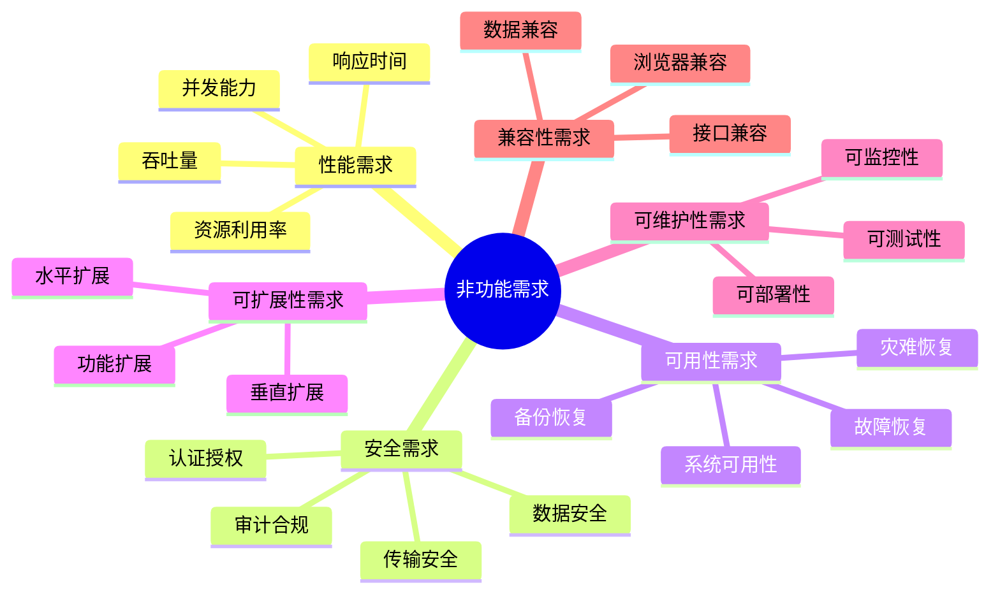

---

## 2. 性能需求映射

### 2.1 响应时间需求

#### 2.1.1 响应时间指标

| 场景类型 | 目标响应时间 | 最大响应时间 | 测量方法 | 架构策略 |
|---------|-------------|-------------|---------|---------|
| 页面加载 | < 2s | < 5s | 首屏时间 | CDN、懒加载、代码分割 |
| API响应 | < 500ms | < 1s | 服务端处理 | 缓存、异步、连接池 |
| 登录认证 | < 1s | < 3s | 端到端 | 缓存、JWT、会话优化 |
| 数据查询 | < 500ms | < 2s | 数据库查询 | 索引、分页、搜索优化 |
| 文件上传 | < 5s/MB | < 10s/MB | 传输时间 | 分片上传、CDN加速 |
| 报表生成 | < 10s | < 30s | 处理时间 | 异步处理、预计算 |

#### 2.1.2 响应时间架构映射

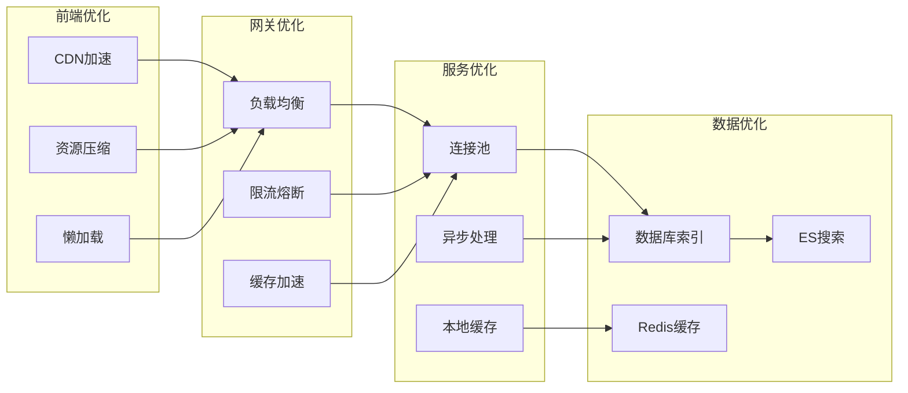

### 2.2 吞吐量需求

#### 2.2.1 吞吐量指标

| 指标项 | 目标值 | 峰值要求 | 测量周期 | 架构策略 |
|-------|-------|---------|---------|---------|
| 日活跃用户 | 10,000+ | 50,000 | 每日 | 水平扩展 |
| 并发用户数 | 1,000+ | 5,000 | 实时 | 负载均衡、无状态 |
| QPS | 2,000+ | 10,000 | 每秒 | 缓存、异步、分片 |
| TPS | 500+ | 2,000 | 每秒 | 消息队列、批量处理 |
| 数据写入 | 10万条/天 | 50万条/天 | 每日 | 批量插入、异步 |
| 数据查询 | 100万次/天 | 500万次/天 | 每日 | 缓存、搜索优化 |

#### 2.2.2 吞吐量架构映射

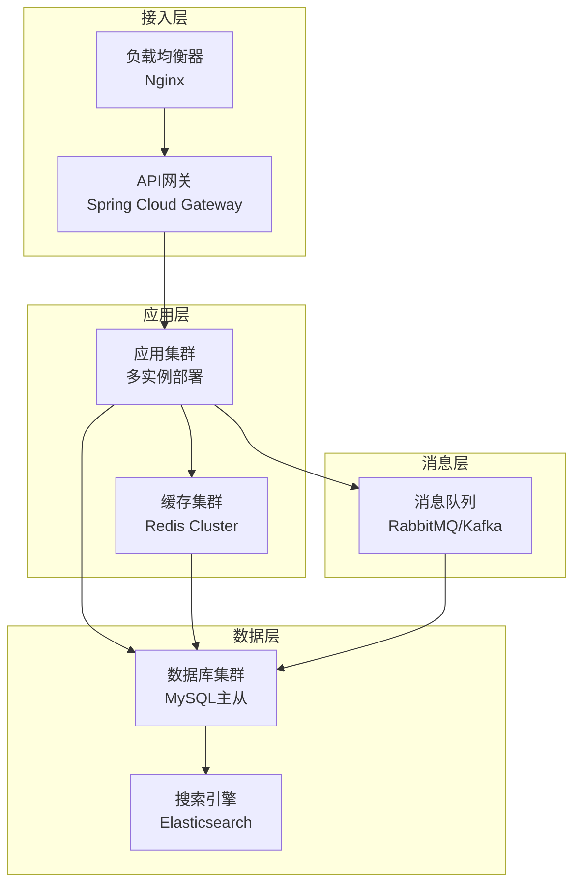

### 2.3 并发能力需求

#### 2.3.1 并发场景分析

| 并发场景 | 并发用户数 | 持续时间 | 资源需求 | 架构策略 |
|---------|-----------|---------|---------|---------|
| 早高峰登录 | 2,000 | 30分钟 | CPU/内存 | 弹性伸缩、缓存预热 |
| 批量操作 | 500 | 1小时 | 数据库 | 限流、队列削峰 |
| 数据同步 | 100 | 持续 | 网络/IO | 异步处理、增量同步 |
| 报表导出 | 50 | 2小时 | CPU/内存 | 异步任务、资源隔离 |
| 系统管理员 | 20 | 全天 | 数据库 | 连接池优化 |

#### 2.3.2 并发架构设计

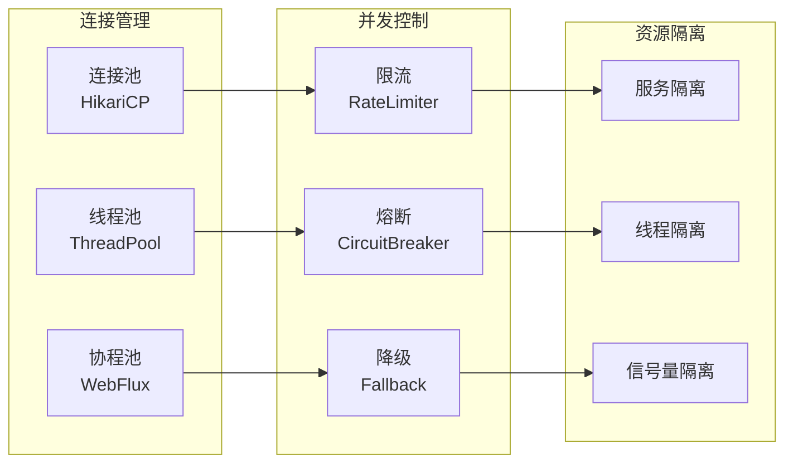

### 2.4 资源利用率需求

| 资源类型 | 正常范围 | 告警阈值 | 极限阈值 | 优化策略 |
|---------|---------|---------|---------|---------|
| CPU使用率 | < 60% | 70% | 85% | 弹性伸缩、代码优化 |
| 内存使用率 | < 70% | 80% | 90% | 缓存策略、垃圾回收 |
| 磁盘使用率 | < 70% | 80% | 90% | 日志归档、数据清理 |
| 网络带宽 | < 60% | 70% | 80% | CDN、压缩、缓存 |
| 数据库连接 | < 70% | 80% | 90% | 连接池优化、读写分离 |

---

## 3. 安全需求映射

### 3.1 认证授权需求

#### 3.1.1 认证安全要求

| 安全项 | 要求等级 | 具体要求 | 架构实现 |
|-------|---------|---------|---------|
| 密码策略 | 高 | 8-20位，复杂度要求 | bcrypt加密，正则校验 |
| 登录失败 | 高 | 5次失败锁定30分钟 | Redis计数，自动解锁 |
| 会话超时 | 高 | 30分钟无操作退出 | JWT过期，Refresh Token |
| 多因素认证 | 中 | 支持MFA | TOTP/短信验证码 |
| 单点登录 | 高 | 支持SSO | OAuth2.0 + JWT |
| 密码找回 | 高 | 安全验证流程 | 邮件/短信验证 |

#### 3.1.2 认证架构设计

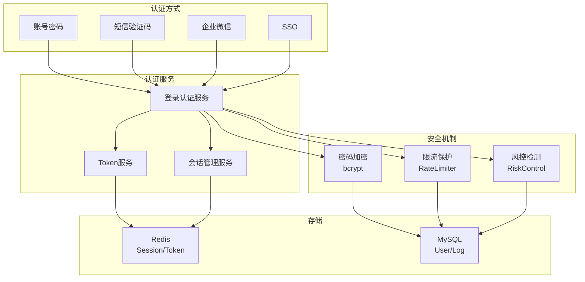

### 3.2 数据安全需求

#### 3.2.1 数据安全要求

| 数据类型 | 安全等级 | 存储要求 | 传输要求 | 架构实现 |
|---------|---------|---------|---------|---------|
| 用户密码 | 最高 | bcrypt加密 | HTTPS | 单向加密，盐值随机 |
| 手机号 | 高 | AES加密 | HTTPS | 字段级加密，密钥管理 |
| 身份证号 | 高 | AES加密 | HTTPS | 字段级加密，脱敏显示 |
| 邮箱地址 | 中 | 明文存储 | HTTPS | 格式校验，脱敏显示 |
| 操作日志 | 中 | 明文存储 | HTTPS | 完整性校验，防篡改 |
| 系统配置 | 高 | 加密存储 | HTTPS | 配置中心，访问控制 |

#### 3.2.2 数据安全架构

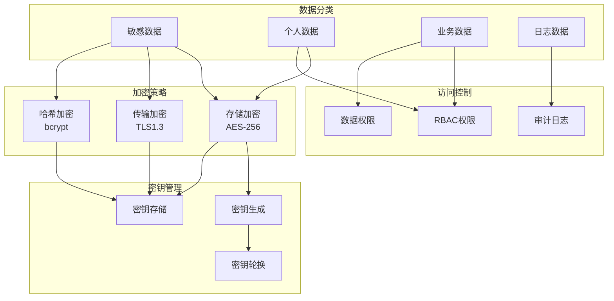

### 3.3 传输安全需求

| 安全项 | 要求 | 实现方式 | 配置要求 |
|-------|------|---------|---------|
| 传输协议 | HTTPS | TLS 1.2+ | 强制HTTPS，HSTS |
| 证书管理 | 有效证书 | Let's Encrypt/商业证书 | 自动续期，到期提醒 |
| 加密算法 | 强加密 | AES-256-GCM | 禁用弱算法 |
| 完美前向保密 | 支持 | ECDHE | 启用PFS |
| 证书固定 | 可选 | HPKP | 防止中间人攻击 |

### 3.4 审计合规需求

#### 3.4.1 审计要求

| 审计项 | 记录内容 | 保留期限 | 存储方式 |
|-------|---------|---------|---------|
| 登录日志 | 时间、IP、账号、结果 | 1年 | 数据库存储 |
| 操作日志 | 时间、用户、操作、对象 | 2年 | Elasticsearch |
| 权限变更 | 时间、操作人、变更内容 | 3年 | 数据库存储 |
| 数据导出 | 时间、用户、数据范围 | 3年 | 数据库存储 |
| 系统配置 | 时间、操作人、配置项 | 永久 | 版本控制 |

#### 3.4.2 审计架构

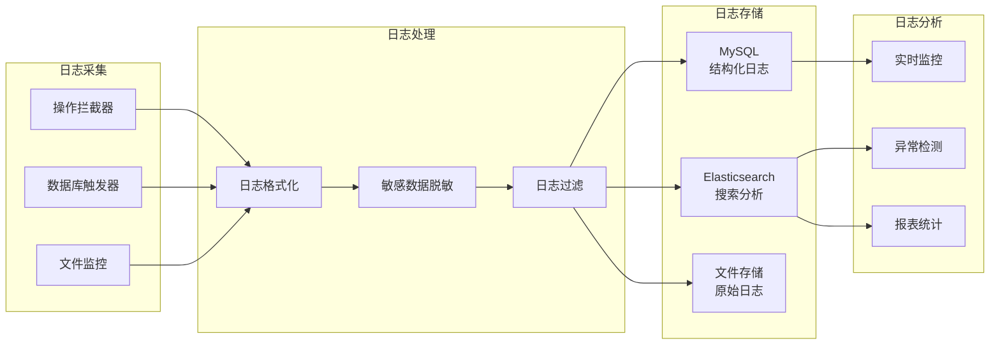

---

## 4. 可用性需求映射

### 4.1 系统可用性需求

| 可用性等级 | 可用性指标 | 年停机时间 | 适用场景 | 架构策略 |
|-----------|-----------|-----------|---------|---------|
| 高可用 | 99.9% | < 8.76小时 | 核心业务 | 集群部署、故障转移 |
| 极高可用 | 99.99% | < 52.6分钟 | 关键功能 | 多活架构、自动恢复 |
| 最高可用 | 99.999% | < 5.26分钟 | 认证服务 | 异地多活、零停机 |

### 4.2 故障恢复需求

| 故障类型 | RTO目标 | RPO目标 | 恢复策略 | 架构实现 |
|---------|--------|--------|---------|---------|
| 应用故障 | < 5分钟 | 0 | 自动重启、服务降级 | Kubernetes自愈 |
| 数据库故障 | < 15分钟 | < 1分钟 | 主从切换、读写分离 | MySQL MHA |
| 缓存故障 | < 5分钟 | 0 | 缓存重建、直接查库 | Redis Sentinel |
| 网络故障 | < 10分钟 | 0 | 多线路、自动切换 | 多ISP接入 |
| 机房故障 | < 30分钟 | < 5分钟 | 异地灾备、流量切换 | DNS切换 |

### 4.3 备份恢复需求

| 数据类型 | 备份频率 | 保留期限 | 备份方式 | 恢复测试 |
|---------|---------|---------|---------|---------|
| 数据库 | 每日全量+实时增量 | 30天 | 物理备份+逻辑备份 | 每月一次 |
| 配置文件 | 每次变更 | 永久 | Git版本控制 | 每季度一次 |
| 上传文件 | 实时同步 | 永久 | 对象存储多副本 | 每半年一次 |
| 日志数据 | 实时归档 | 1-3年 | 压缩存储 | 每年一次 |

### 4.4 高可用架构设计

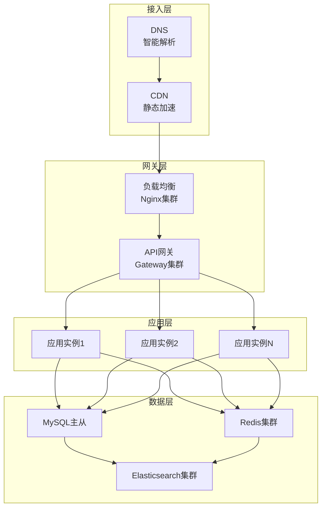

---

## 5. 可扩展性需求映射

### 5.1 水平扩展需求

| 扩展维度 | 当前规模 | 目标规模 | 扩展策略 | 架构支持 |
|---------|---------|---------|---------|---------|
| 用户规模 | 10,000 | 100,000 | 10倍扩展 | 无状态服务、分布式存储 |
| 并发能力 | 1,000 | 10,000 | 10倍扩展 | 负载均衡、弹性伸缩 |
| 数据存储 | 100GB | 1TB | 10倍扩展 | 分库分表、数据归档 |
| 功能模块 | 5个 | 20个 | 4倍扩展 | 微服务、插件化 |

### 5.2 垂直扩展需求

| 资源类型 | 当前配置 | 最大配置 | 扩展方式 | 架构支持 |
|---------|---------|---------|---------|---------|
| CPU | 4核 | 32核 | 升级实例 | 多线程优化 |
| 内存 | 8GB | 64GB | 升级实例 | 缓存优化 |
| 存储 | 100GB | 2TB | 扩容磁盘 | 数据分片 |
| 带宽 | 100Mbps | 1Gbps | 升级带宽 | CDN加速 |

### 5.3 功能扩展需求

| 扩展类型 | 扩展方式 | 实现机制 | 架构支持 |
|---------|---------|---------|---------|
| 新功能模块 | 插件化 | 动态加载、热部署 | 模块化设计 |
| 新集成系统 | 配置化 | 适配器模式、配置驱动 | 集成框架 |
| 新业务流程 | 工作流 | 流程引擎、可视化配置 | BPM集成 |
| 新报表类型 | 模板化 | 报表引擎、自定义模板 | 报表平台 |

---

## 6. 可维护性需求映射

### 6.1 可监控性需求

| 监控维度 | 监控指标 | 采集频率 | 告警阈值 | 存储期限 |
|---------|---------|---------|---------|---------|
| 应用性能 | QPS、RT、错误率 | 10秒 | 自动计算 | 15天 |
| 系统资源 | CPU、内存、磁盘 | 30秒 | 70% | 30天 |
| 业务指标 | 登录数、操作数 | 1分钟 | 自定义 | 90天 |
| 日志监控 | 错误日志、异常 | 实时 | 关键字匹配 | 30天 |
| 链路追踪 | 请求链路、依赖 | 全量采样 | 慢查询 | 7天 |

### 6.2 监控架构

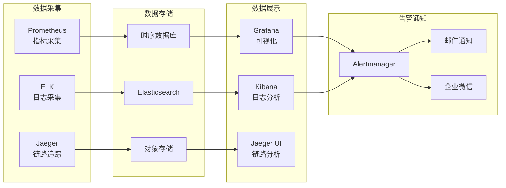

### 6.3 可测试性需求

| 测试类型 | 覆盖率要求 | 自动化程度 | 执行频率 | 架构支持 |
|---------|-----------|-----------|---------|---------|
| 单元测试 | > 80% | 100% | 每次构建 | 测试框架、Mock |
| 集成测试 | > 60% | 80% | 每日构建 | 测试环境、数据准备 |
| 接口测试 | > 90% | 100% | 每次部署 | API文档、测试工具 |
| 性能测试 | 关键路径 | 50% | 每周 | 压测工具、监控 |
| 安全测试 | 高危漏洞 | 30% | 每月 | 扫描工具、渗透测试 |

### 6.4 可部署性需求

| 部署特性 | 要求 | 实现方式 | 架构支持 |
|---------|------|---------|---------|
| 自动化部署 | 一键部署 | CI/CD流水线 | Jenkins/GitLab CI |
| 灰度发布 | 支持 | 金丝雀发布 | Kubernetes滚动更新 |
| 蓝绿部署 | 支持 | 双环境切换 | 负载均衡切换 |
| 回滚能力 | < 5分钟 | 版本管理 | 镜像版本、数据库迁移 |
| 配置分离 | 环境隔离 | 配置中心 | Nacos/Apollo |

---

## 7. 兼容性需求映射

### 7.1 浏览器兼容性

| 浏览器 | 最低版本 | 支持程度 | 测试要求 |
|-------|---------|---------|---------|
| Chrome | 90+ | 完全支持 | 必测 |
| Firefox | 88+ | 完全支持 | 必测 |
| Safari | 14+ | 完全支持 | 必测 |
| Edge | 90+ | 完全支持 | 必测 |
| IE | 不支持 | - | - |

### 7.2 接口兼容性

| 接口类型 | 版本策略 | 兼容性要求 | 废弃策略 |
|---------|---------|-----------|---------|
| REST API | URL版本化 | 向下兼容2个版本 | 提前3个月通知 |
| 消息格式 | JSON Schema | 字段兼容 | 新增可选字段 |
| 数据库 | 迁移脚本 | 支持回滚 | 双写过渡 |

### 7.3 数据兼容性

| 数据类型 | 兼容性要求 | 迁移策略 | 验证方式 |
|---------|-----------|---------|---------|
| 数据库结构 | 向前兼容 | 增量迁移 | 数据校验 |
| 配置文件 | 向后兼容 | 自动转换 | 配置验证 |
| 缓存数据 | 可重建 | 清空重建 | 功能测试 |

---

## 8. 非功能需求优先级矩阵

### 8.1 需求优先级评估

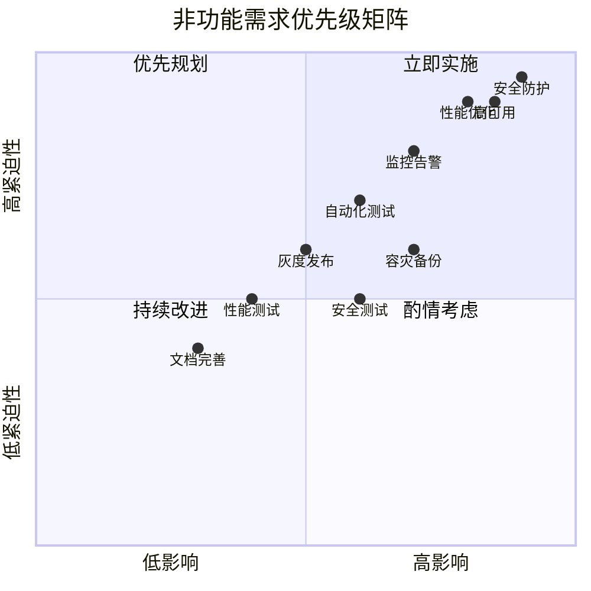

### 8.2 实施路线图

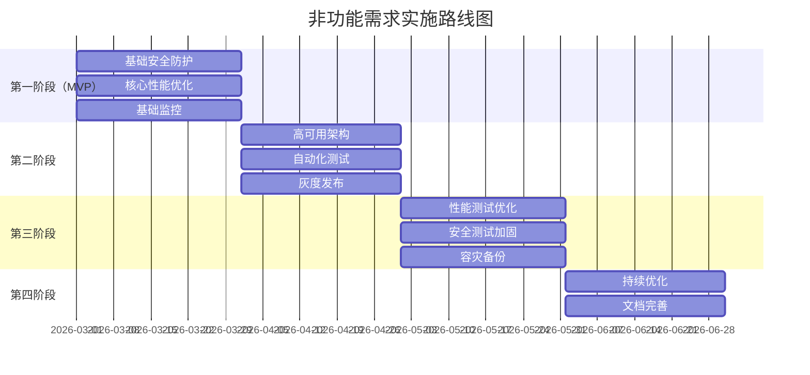

---

## 9. 附录

### 9.1 术语表

| 术语 | 定义 |
|-----|------|
| RTO | 恢复时间目标（Recovery Time Objective）|
| RPO | 恢复点目标（Recovery Point Objective）|
| QPS | 每秒查询数（Queries Per Second）|
| TPS | 每秒事务数（Transactions Per Second）|
| RT | 响应时间（Response Time）|
| MFA | 多因素认证（Multi-Factor Authentication）|
| SSO | 单点登录（Single Sign-On）|
| TLS | 传输层安全（Transport Layer Security）|
| HSTS | HTTP严格传输安全（HTTP Strict Transport Security）|
| HPKP | HTTP公钥固定（HTTP Public Key Pinning）|

### 9.2 参考文档

- 项目章程
- 业务需求文档（BRD）
- 功能需求架构映射分析
- 等保三级要求文档

### 9.3 修订记录

| 版本 | 日期 | 作者 | 变更内容 |
|-----|------|------|---------|
| 1.0 | 2026-03-08 | 架构师 | 初始版本 |

---

**文档编制**：架构师  
**文档审核**：技术负责人  
**编制日期**：2026-03-08
