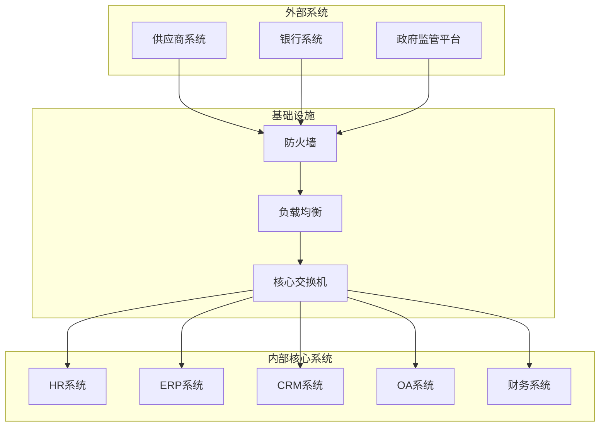
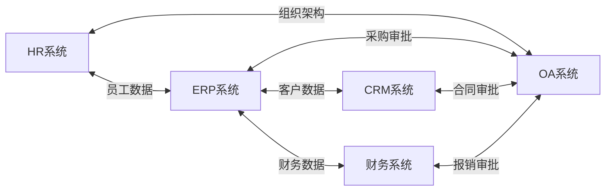
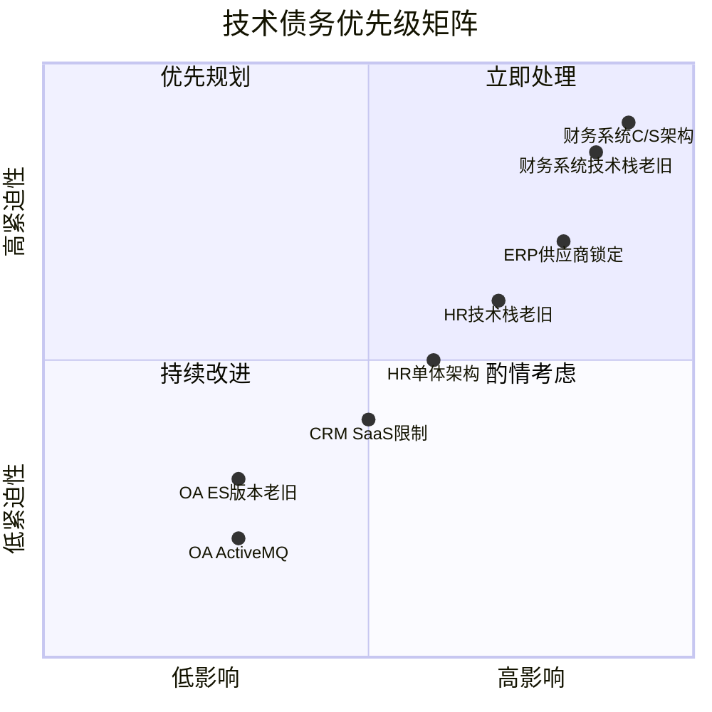
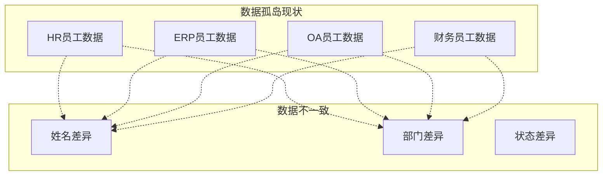
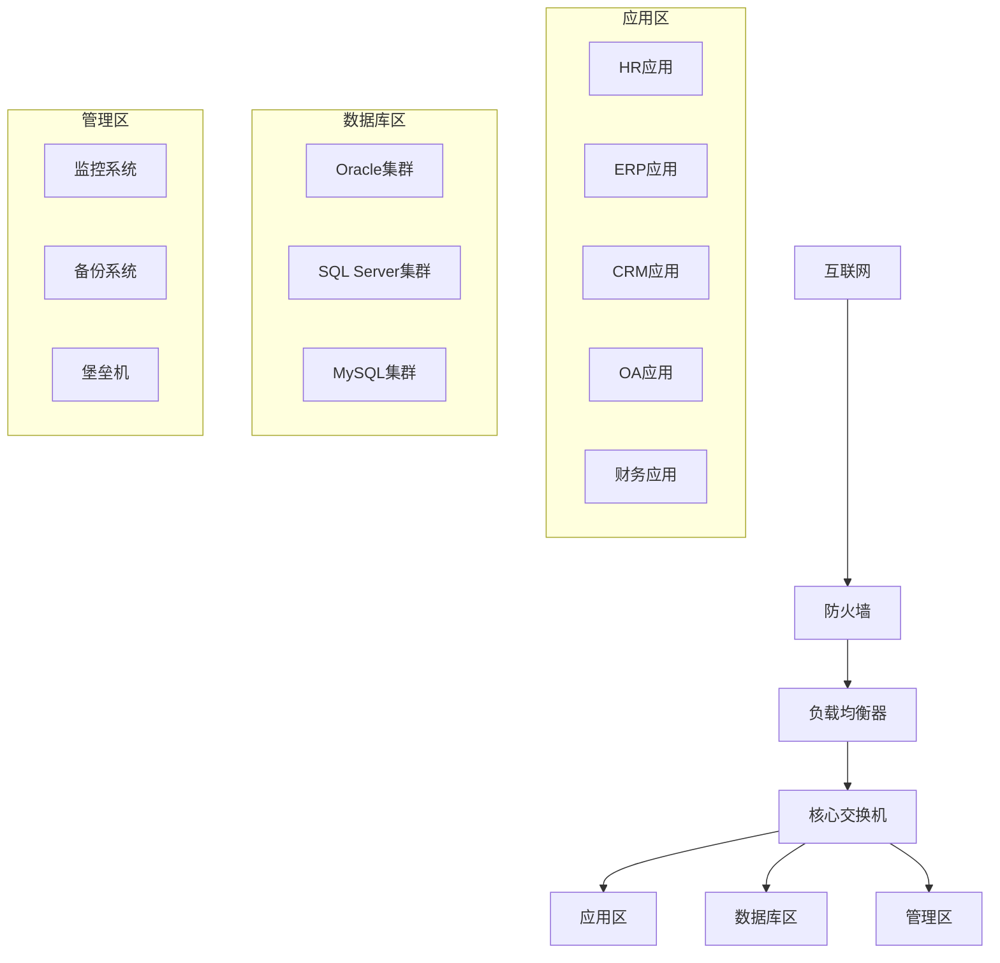

# 现状架构盘点

> **文档编号**: SYS-ANA-ARCH-003
> **版本**: 1.0
> **创建日期**: 2026-03-08
> **作者**: 架构师
> **状态**: ✅ 已评审通过

---

## 1. 概述

### 1.1 目的
本文档旨在全面盘点公司现有的IT系统架构，识别技术债务，为新建System平台的架构设计提供参考和约束。

### 1.2 范围
盘点范围包括与公司业务相关的5个核心系统：
- HR系统（人力资源管理系统）
- ERP系统（企业资源计划系统）
- CRM系统（客户关系管理系统）
- OA系统（办公自动化系统）
- 财务系统

### 1.3 方法
通过系统调研、文档审查、技术访谈等方式收集现有系统的架构信息。

---

## 2. 现有系统架构概览

### 2.1 系统架构全景图

### 2.2 系统间交互关系

---

## 3. 各系统详细架构

### 3.1 HR系统

#### 3.1.1 基本信息

| 属性 | 内容 |
|------|------|
| 系统名称 | HR人力资源管理系统 |
| 供应商 | 用友网络 |
| 上线时间 | 2019年 |
| 用户规模 | 500+ |
| 部署方式 | 本地部署 |
| 技术架构 | 单体架构 |

#### 3.1.2 技术栈

| 层级 | 技术组件 | 版本 |
|------|---------|------|
| 前端 | jQuery + Bootstrap | 2.x / 3.x |
| 后端 | Java + Spring MVC | Java 8, Spring 4.x |
| 数据库 | Oracle | 11g |
| 中间件 | Tomcat | 8.5 |
| 缓存 | Ehcache | 2.x |

#### 3.1.3 核心功能模块

- 组织架构管理
- 员工信息管理
- 薪酬福利管理
- 考勤管理
- 招聘管理
- 培训管理

#### 3.1.4 集成接口

| 接口类型 | 协议 | 数据格式 | 调用频率 |
|---------|------|---------|---------|
| 员工同步 | WebService | XML | 实时 |
| 组织架构同步 | WebService | XML | 实时 |
| 考勤数据导出 | SFTP | CSV | 每日 |

#### 3.1.5 技术债务

1. **技术栈老旧**：使用jQuery和Spring 4.x，缺乏现代前端框架支持
2. **单体架构**：系统耦合度高，难以独立扩展
3. **Oracle依赖**：商业数据库成本高，迁移困难
4. **缺乏API网关**：直接暴露服务接口，安全性不足

---

### 3.2 ERP系统

#### 3.2.1 基本信息

| 属性 | 内容 |
|------|------|
| 系统名称 | 企业资源计划系统 |
| 供应商 | SAP |
| 上线时间 | 2018年 |
| 用户规模 | 800+ |
| 部署方式 | 本地部署 |
| 技术架构 | 多层架构 |

#### 3.2.2 技术栈

| 层级 | 技术组件 | 版本 |
|------|---------|------|
| 前端 | SAP UI5 | 1.x |
| 后端 | SAP NetWeaver | 7.5 |
| 数据库 | SAP HANA | 2.0 |
| 中间件 | SAP Gateway | 2.0 |

#### 3.2.3 核心功能模块

- 采购管理
- 库存管理
- 销售管理
- 生产管理
- 财务管理集成
- 报表分析

#### 3.2.4 集成接口

| 接口类型 | 协议 | 数据格式 | 调用频率 |
|---------|------|---------|---------|
| 主数据同步 | OData | JSON | 实时 |
| 业务数据查询 | REST | JSON | 按需 |
| 报表数据导出 | RFC | Binary | 每日 |

#### 3.2.5 技术债务

1. **供应商锁定**：深度依赖SAP生态，替换成本高
2. **定制开发复杂**：ABAP开发门槛高，迭代慢
3. **HANA成本高**：内存数据库授权费用昂贵
4. **集成复杂**：专有协议多，集成难度大

---

### 3.3 CRM系统

#### 3.3.1 基本信息

| 属性 | 内容 |
|------|------|
| 系统名称 | 客户关系管理系统 |
| 供应商 | 销售易 |
| 上线时间 | 2020年 |
| 用户规模 | 300+ |
| 部署方式 | SaaS |
| 技术架构 | 微服务架构 |

#### 3.3.2 技术栈

| 层级 | 技术组件 | 版本 |
|------|---------|------|
| 前端 | React | 16.x |
| 后端 | Java + Spring Boot | 2.x |
| 数据库 | MySQL + MongoDB | 5.7 / 4.x |
| 缓存 | Redis | 5.x |
| 消息队列 | RabbitMQ | 3.x |

#### 3.3.3 核心功能模块

- 客户管理
- 销售管理
- 营销自动化
- 服务管理
- 数据分析

#### 3.3.4 集成接口

| 接口类型 | 协议 | 数据格式 | 调用频率 |
|---------|------|---------|---------|
| 客户数据同步 | REST | JSON | 实时 |
| 订单数据推送 | Webhook | JSON | 实时 |
| 报表数据导出 | REST | JSON | 每日 |

#### 3.3.5 技术债务

1. **SaaS限制**：定制化受限，数据本地化困难
2. **版本依赖**：受供应商升级节奏影响
3. **网络依赖**：需要稳定的互联网连接
4. **数据安全**：敏感客户数据在第三方平台

---

### 3.4 OA系统

#### 3.4.1 基本信息

| 属性 | 内容 |
|------|------|
| 系统名称 | 办公自动化系统 |
| 供应商 | 泛微 |
| 上线时间 | 2017年 |
| 用户规模 | 2000+ |
| 部署方式 | 本地部署 |
| 技术架构 | 多层架构 |

#### 3.4.2 技术栈

| 层级 | 技术组件 | 版本 |
|------|---------|------|
| 前端 | Vue 2 + Element UI | 2.x |
| 后端 | Java + Spring Cloud | Java 8, Spring Boot 2.x |
| 数据库 | SQL Server | 2016 |
| 缓存 | Redis | 5.x |
| 消息队列 | ActiveMQ | 5.x |
| 搜索引擎 | Elasticsearch | 6.x |

#### 3.4.3 核心功能模块

- 流程审批
- 公文管理
- 会议管理
- 知识管理
- 即时通讯
- 移动办公

#### 3.4.4 集成接口

| 接口类型 | 协议 | 数据格式 | 调用频率 |
|---------|------|---------|---------|
| 单点登录 | SAML | XML | 每次登录 |
| 待办同步 | REST | JSON | 实时 |
| 流程回调 | Webhook | JSON | 实时 |
| 组织架构同步 | REST | JSON | 每小时 |

#### 3.4.5 技术债务

1. **ES版本老旧**：Elasticsearch 6.x，功能受限
2. **ActiveMQ替代**：建议迁移到RabbitMQ或Kafka
3. **SQL Server依赖**：商业数据库成本高
4. **Vue 2升级**：需要升级到Vue 3

---

### 3.5 财务系统

#### 3.5.1 基本信息

| 属性 | 内容 |
|------|------|
| 系统名称 | 财务管理系统 |
| 供应商 | 金蝶 |
| 上线时间 | 2016年 |
| 用户规模 | 100+ |
| 部署方式 | 本地部署 |
| 技术架构 | C/S架构 |

#### 3.5.2 技术栈

| 层级 | 技术组件 | 版本 |
|------|---------|------|
| 客户端 | .NET WinForms | .NET Framework 4.5 |
| 服务端 | Java + EJB | Java 7 |
| 数据库 | Oracle | 11g |
| 报表 | Crystal Reports | 2013 |

#### 3.5.3 核心功能模块

- 总账管理
- 应收应付
- 固定资产
- 成本核算
- 预算管理
- 财务报表

#### 3.5.4 集成接口

| 接口类型 | 协议 | 数据格式 | 调用频率 |
|---------|------|---------|---------|
| 凭证同步 | WebService | XML | 每日 |
| 报表导出 | SFTP | Excel | 每月 |
| 预算数据 | 数据库直连 | SQL | 实时 |

#### 3.5.5 技术债务

1. **C/S架构限制**：需要安装客户端，维护困难
2. **技术栈老旧**：.NET Framework 4.5和Java 7已过时
3. **Oracle依赖**：商业数据库成本高
4. **缺乏移动端**：不支持移动办公

---

## 4. 技术债务汇总

### 4.1 技术债务矩阵

| 系统 | 技术债务 | 严重程度 | 影响范围 | 解决建议 |
|------|---------|---------|---------|---------|
| HR系统 | 技术栈老旧 | 高 | 用户体验、开发效率 | 逐步迁移到现代技术栈 |
| HR系统 | 单体架构 | 中 | 扩展性、维护性 | 服务化改造 |
| ERP系统 | 供应商锁定 | 高 | 成本、灵活性 | 建立抽象层，降低耦合 |
| ERP系统 | HANA成本高 | 中 | 运营成本 | 评估替代方案 |
| CRM系统 | SaaS限制 | 中 | 定制化、数据安全 | 评估私有化部署 |
| OA系统 | ES版本老旧 | 低 | 搜索功能 | 升级Elasticsearch |
| OA系统 | ActiveMQ | 低 | 消息队列 | 迁移到RabbitMQ |
| 财务系统 | C/S架构 | 高 | 用户体验、维护 | B/S架构改造 |
| 财务系统 | 技术栈老旧 | 高 | 安全性、支持 | 全面技术升级 |

### 4.2 技术债务优先级

---

## 5. 数据现状分析

### 5.1 数据分布

| 系统 | 数据类型 | 数据量 | 增长趋势 |
|------|---------|-------|---------|
| HR系统 | 员工数据、考勤数据 | 100GB | 10%/年 |
| ERP系统 | 业务数据、库存数据 | 500GB | 20%/年 |
| CRM系统 | 客户数据、销售数据 | 200GB | 30%/年 |
| OA系统 | 流程数据、文档数据 | 300GB | 25%/年 |
| 财务系统 | 财务数据、凭证数据 | 150GB | 15%/年 |

### 5.2 数据孤岛问题

**主要问题**:
1. **重复录入**：员工信息在多个系统重复录入
2. **数据不一致**：同一员工在不同系统信息不一致
3. **同步延迟**：系统间数据同步存在延迟
4. **缺乏主数据管理**：没有统一的数据标准

---

## 6. 基础设施现状

### 6.1 服务器资源

| 资源类型 | 配置 | 数量 | 利用率 |
|---------|------|------|-------|
| 应用服务器 | 16核64G | 10台 | 60% |
| 数据库服务器 | 32核128G | 5台 | 70% |
| 存储 | 100TB SAN | 1套 | 80% |
| 网络带宽 | 1Gbps | - | 50% |

### 6.2 网络架构

---

## 7. 安全现状

### 7.1 安全措施

| 安全层面 | 现有措施 | 评估 |
|---------|---------|------|
| 网络安全 | 防火墙、IDS | 基本满足 |
| 应用安全 | 部分系统有WAF | 需要加强 |
| 数据安全 | 数据库加密 | 需要完善 |
| 访问控制 | 各系统独立认证 | 需要统一 |
| 审计日志 | 部分系统有 | 需要完善 |

### 7.2 安全风险

1. **缺乏统一身份认证**：各系统独立登录，用户体验差
2. **数据泄露风险**：SaaS CRM数据在第三方
3. **老旧系统漏洞**：财务系统技术栈老旧，安全补丁不足
4. **缺乏零信任架构**：内网信任度过高

---

## 8. 总结与建议

### 8.1 现状总结

| 维度 | 现状 | 评估 |
|------|------|------|
| 技术架构 | 混合架构，新旧并存 | 需要统一规划 |
| 技术栈 | 多样化，部分老旧 | 需要标准化 |
| 数据管理 | 孤岛严重，缺乏标准 | 需要治理 |
| 安全体系 | 基础具备，需要完善 | 需要加强 |
| 运维能力 | 传统运维，自动化低 | 需要提升 |

### 8.2 架构设计建议

1. **建立统一身份认证平台**：解决多系统登录问题
2. **构建主数据管理平台**：统一员工、部门等主数据
3. **采用微服务架构**：提高系统灵活性和可维护性
4. **建立API网关**：统一接口管理，提高安全性
5. **推进云原生改造**：提高资源利用率和弹性

---

## 9. 附录

### 9.1 术语表

| 术语 | 定义 |
|------|------|
| SaaS | 软件即服务（Software as a Service） |
| C/S架构 | 客户端/服务器架构 |
| B/S架构 | 浏览器/服务器架构 |
| ESB | 企业服务总线 |
| MDM | 主数据管理 |

### 9.2 参考文档

- 各系统技术白皮书
- 系统运维手册
- 系统集成文档

### 9.3 修订记录

| 版本 | 日期 | 作者 | 变更内容 |
|------|------|------|---------|
| 1.0 | 2026-03-08 | 架构师 | 初始版本 |

---

**文档编制**: 架构师
**文档审核**: 技术负责人
**编制日期**: 2026-03-08
