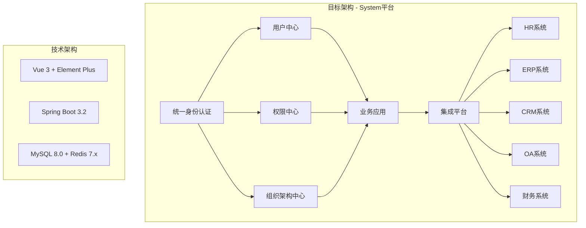
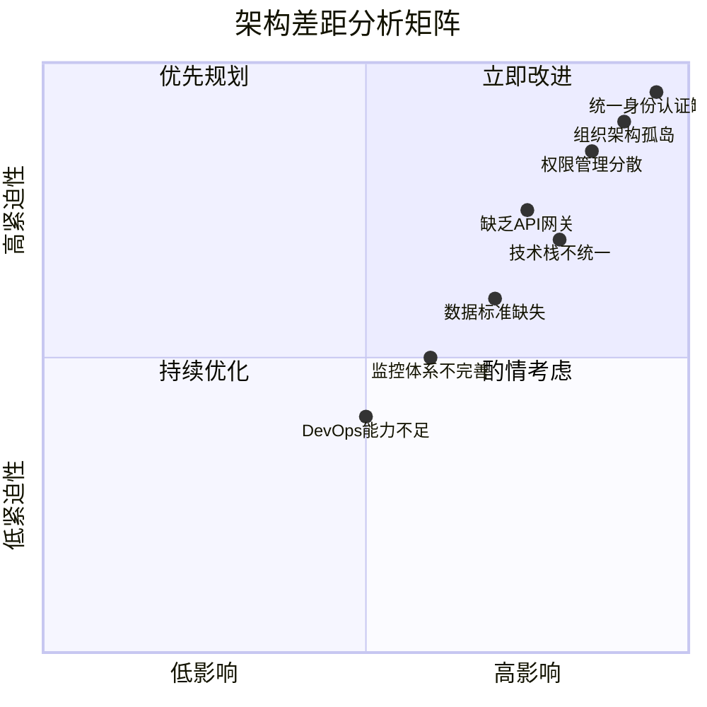
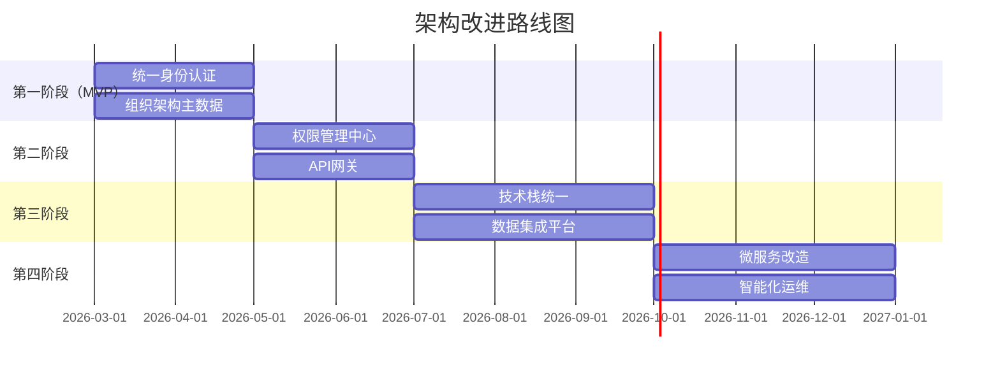
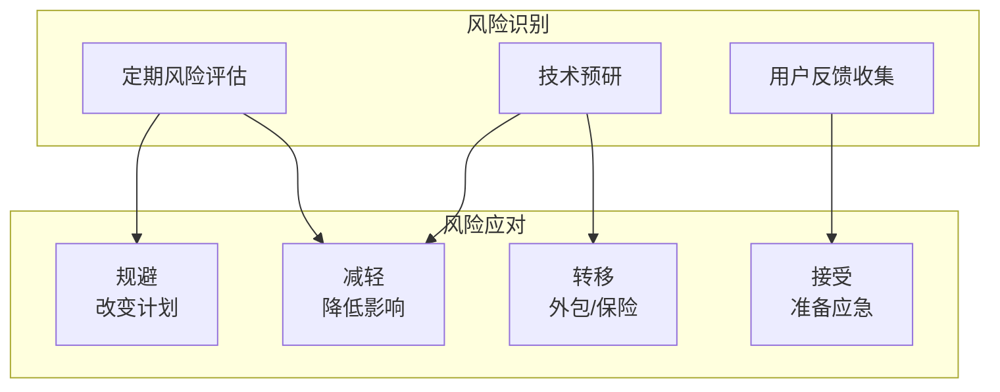

# 架构差距分析

> **文档编号**: SYS-ANA-ARCH-004
> **版本**: 1.0
> **创建日期**: 2026-03-08
> **作者**: 架构师
> **状态**: ✅ 已评审通过

---

## 1. 概述

### 1.1 目的
本文档分析目标架构与现状架构之间的差距，识别需要改进的关键领域，为架构设计提供决策依据。

### 1.2 分析范围
- 目标架构定义（基于需求架构映射分析）
- 现状架构盘点（基于现状架构盘点文档）
- 差距识别与分析
- 改进建议与路线图

### 1.3 分析方法
采用GAP分析法，从多个维度对比目标架构与现状架构的差异。

---

## 2. 目标架构定义

### 2.1 目标架构蓝图

### 2.2 目标架构能力要求

| 能力维度 | 目标状态 | 关键指标 |
|---------|---------|---------|
| 统一认证 | 单点登录（SSO） | 一次登录，全系统访问 |
| 权限管理 | 集中式RBAC | 统一权限模型，细粒度控制 |
| 组织架构 | 主数据管理 | 统一数据源，实时同步 |
| 系统集成 | API网关 + ESB | 标准化接口，统一管控 |
| 技术栈 | 云原生微服务 | 容器化，弹性伸缩 |

---

## 3. 差距分析矩阵

### 3.1 架构维度差距总览

### 3.2 详细差距分析

#### 3.2.1 身份认证与授权

| 评估项 | 现状 | 目标 | 差距 | 影响 | 优先级 |
|-------|------|------|------|------|--------|
| 认证方式 | 各系统独立登录 | 统一SSO | 高 | 用户体验、安全性 | P0 |
| 会话管理 | 各系统独立会话 | 统一会话管理 | 高 | 安全性、用户体验 | P0 |
| 权限模型 | 各系统独立实现 | 统一RBAC | 高 | 管理效率、安全性 | P0 |
| 多因素认证 | 部分系统支持 | 全系统MFA | 中 | 安全性 | P1 |

**差距说明**:
- 用户需要记忆多个账号密码
- 权限管理分散，无法统一审计
- 离职员工账号处理不及时

**改进建议**:
1. 建立统一身份认证平台（System平台）
2. 实现OAuth 2.0 + JWT认证机制
3. 集成企业微信/钉钉等第三方认证
4. 建立统一权限管理中心

---

#### 3.2.2 组织架构管理

| 评估项 | 现状 | 目标 | 差距 | 影响 | 优先级 |
|-------|------|------|------|------|--------|
| 数据源 | 5个系统各自维护 | 统一主数据 | 高 | 数据一致性 | P0 |
| 同步机制 | 定时批量同步 | 实时同步 | 高 | 数据时效性 | P0 |
| 数据标准 | 缺乏统一标准 | 统一数据标准 | 高 | 数据质量 | P0 |
| 变更通知 | 无自动通知 | 实时变更推送 | 中 | 业务连续性 | P1 |

**差距说明**:
- 同一员工在不同系统信息不一致
- 部门调整需要手动更新多个系统
- 新员工入职需要多次录入

**改进建议**:
1. 建立组织架构主数据管理平台
2. 制定统一的数据标准和规范
3. 实现实时数据同步机制
4. 建立数据质量监控体系

---

#### 3.2.3 系统集成能力

| 评估项 | 现状 | 目标 | 差距 | 影响 | 优先级 |
|-------|------|------|------|------|--------|
| 集成方式 | 点对点集成 | API网关 + ESB | 高 | 可维护性 | P0 |
| 接口标准 | 缺乏统一标准 | RESTful标准 | 高 | 开发效率 | P0 |
| 接口文档 | 文档缺失/过时 | 统一API文档 | 中 | 开发效率 | P1 |
| 接口监控 | 无统一监控 | 全链路监控 | 中 | 运维效率 | P1 |

**差距说明**:
- 系统间集成关系复杂，难以维护
- 接口协议多样（SOAP、REST、RFC等）
- 缺乏统一的接口管理和监控

**改进建议**:
1. 建立API网关，统一接口入口
2. 制定接口开发规范和标准
3. 建立接口文档管理平台（Swagger）
4. 实现接口全链路监控

---

#### 3.2.4 技术架构

| 评估项 | 现状 | 目标 | 差距 | 影响 | 优先级 |
|-------|------|------|------|------|--------|
| 架构模式 | 单体/多层架构 | 微服务架构 | 中 | 扩展性 | P1 |
| 技术栈 | 多样化，部分老旧 | 统一现代技术栈 | 高 | 开发效率 | P0 |
| 部署方式 | 虚拟机部署 | 容器化部署 | 中 | 资源利用率 | P1 |
| 弹性伸缩 | 手动扩容 | 自动弹性伸缩 | 中 | 成本、可用性 | P2 |

**差距说明**:
- 技术栈多样，团队学习成本高
- 老旧系统维护困难，安全隐患大
- 资源利用率低，扩容周期长

**改进建议**:
1. 统一技术栈（Vue 3 + Spring Boot 3.x）
2. 推进容器化改造（Docker + Kubernetes）
3. 建立DevOps流水线
4. 逐步淘汰老旧技术栈

---

#### 3.2.5 数据架构

| 评估项 | 现状 | 目标 | 差距 | 影响 | 优先级 |
|-------|------|------|------|------|--------|
| 数据孤岛 | 严重 | 统一数据平台 | 高 | 数据价值 | P0 |
| 数据标准 | 缺乏 | 统一数据标准 | 高 | 数据质量 | P0 |
| 主数据管理 | 无 | MDM平台 | 高 | 数据一致性 | P0 |
| 数据分析 | 各系统独立 | 统一数据仓库 | 中 | 决策支持 | P2 |

**差距说明**:
- 数据分散在多个系统，难以整合分析
- 缺乏统一的数据标准和治理
- 主数据重复录入，一致性差

**改进建议**:
1. 建立主数据管理平台
2. 制定企业级数据标准
3. 构建数据集成平台
4. 建设企业数据仓库

---

#### 3.2.6 安全架构

| 评估项 | 现状 | 目标 | 差距 | 影响 | 优先级 |
|-------|------|------|------|------|--------|
| 统一认证 | 缺失 | 统一IAM | 高 | 安全性 | P0 |
| 访问控制 | 分散 | 统一授权 | 高 | 安全性 | P0 |
| 数据加密 | 部分加密 | 全链路加密 | 中 | 合规性 | P1 |
| 审计日志 | 分散 | 统一审计 | 中 | 合规性 | P1 |
| 零信任 | 未实施 | 逐步实施 | 中 | 安全性 | P2 |

**差距说明**:
- 缺乏统一的安全管控体系
- 等保三级要求难以满足
- 安全审计分散，难以追溯

**改进建议**:
1. 建立统一身份和访问管理（IAM）
2. 实施全链路数据加密
3. 建立统一安全审计平台
4. 逐步实施零信任架构

---

## 4. 差距影响评估

### 4.1 业务影响

| 差距领域 | 业务影响 | 影响程度 |
|---------|---------|---------|
| 统一认证缺失 | 用户体验差，工作效率低 | 高 |
| 组织架构孤岛 | 数据不一致，决策失误 | 高 |
| 权限管理分散 | 安全风险，合规风险 | 高 |
| 数据孤岛 | 数据价值无法发挥 | 中 |
| 技术债务 | 维护成本高，创新受阻 | 中 |

### 4.2 技术影响

| 差距领域 | 技术影响 | 影响程度 |
|---------|---------|---------|
| 技术栈不统一 | 开发效率低，人员成本高 | 高 |
| 缺乏API网关 | 集成复杂，难以维护 | 高 |
| 单体架构 | 扩展性差，发布风险高 | 中 |
| 缺乏监控 | 故障定位困难 | 中 |
| 手动运维 | 运维效率低，易出错 | 中 |

---

## 5. 改进路线图

### 5.1 改进优先级

### 5.2 阶段目标

#### 第一阶段（MVP）- 2026年Q1-Q2

**目标**：解决最紧迫的认证和数据一致性问题

**关键任务**：
1. 建立System平台用户中心
2. 实现SSO单点登录
3. 建立组织架构主数据
4. 实现HR系统数据同步

**预期收益**：
- 用户只需一次登录
- 组织架构数据统一
- 新员工入职效率提升50%

#### 第二阶段 - 2026年Q2-Q3

**目标**：建立统一的权限和集成能力

**关键任务**：
1. 建立权限管理中心
2. 部署API网关
3. 统一接口标准
4. 建立接口监控

**预期收益**：
- 权限管理效率提升60%
- 接口开发效率提升40%
- 系统集成成本降低30%

#### 第三阶段 - 2026年Q3-Q4

**目标**：统一技术栈，建立数据平台

**关键任务**：
1. 统一前后端技术栈
2. 建立数据集成平台
3. 构建数据仓库
4. 建立数据治理体系

**预期收益**：
- 开发效率提升50%
- 数据质量提升80%
- 决策支持能力增强

#### 第四阶段 - 2026年Q4-2027年Q1

**目标**：架构现代化，智能化运维

**关键任务**：
1. 微服务架构改造
2. 容器化部署
3. DevOps体系建设
4. 智能化运维平台

**预期收益**：
- 系统可用性达到99.9%
- 部署效率提升70%
- 运维成本降低40%

---

## 6. 风险评估

### 6.1 改进风险

| 风险项 | 风险等级 | 风险描述 | 缓解措施 |
|-------|---------|---------|---------|
| 业务中断 | 高 | 系统改造期间业务中断 | 蓝绿部署，灰度发布 |
| 数据丢失 | 高 | 数据迁移过程中丢失 | 完整备份，逐步迁移 |
| 用户抵触 | 中 | 新系统用户不适应 | 充分培训，并行运行 |
| 技术风险 | 中 | 新技术不稳定 | 充分测试，渐进采用 |
| 资源不足 | 中 | 人力/资金不足 | 分阶段实施，优先级管理 |

### 6.2 风险应对策略

---

## 7. 投资估算

### 7.1 投资分类

| 投资类别 | 第一阶段 | 第二阶段 | 第三阶段 | 第四阶段 | 总计 |
|---------|---------|---------|---------|---------|------|
| 人力成本 | 100万 | 80万 | 120万 | 150万 | 450万 |
| 软硬件采购 | 50万 | 30万 | 80万 | 100万 | 260万 |
| 外部服务 | 30万 | 20万 | 40万 | 50万 | 140万 |
| 培训费用 | 10万 | 10万 | 15万 | 20万 | 55万 |
| **总计** | **190万** | **140万** | **255万** | **320万** | **905万** |

### 7.2 投资回报

| 收益类别 | 年度节省 | 说明 |
|---------|---------|------|
| 运维成本降低 | 80万 | 自动化运维，减少人工 |
| 开发效率提升 | 100万 | 统一技术栈，复用组件 |
| 数据错误减少 | 50万 | 数据一致性提升 |
| 安全事件减少 | 30万 | 统一安全管控 |
| **年度总收益** | **260万** | - |
| **投资回报期** | **3.5年** | - |

---

## 8. 总结与建议

### 8.1 关键差距总结

| 优先级 | 差距领域 | 改进紧迫性 | 投资规模 |
|-------|---------|-----------|---------|
| P0 | 统一身份认证 | 立即 | 中 |
| P0 | 组织架构主数据 | 立即 | 中 |
| P0 | 权限管理集中化 | 立即 | 中 |
| P1 | API网关建设 | 3个月内 | 中 |
| P1 | 技术栈统一 | 6个月内 | 大 |
| P2 | 微服务改造 | 12个月内 | 大 |

### 8.2 架构设计建议

1. **采用渐进式演进策略**：避免大爆炸式重构，分阶段实施
2. **建立System平台作为核心**：统一认证、组织、权限三大基础能力
3. **保持现有系统稳定运行**：通过集成方式逐步迁移
4. **重视数据治理**：建立主数据管理，统一数据标准
5. **投资DevOps能力**：提升交付效率和系统稳定性

### 8.3 下一步行动

1. **立即启动**：System平台MVP开发（用户中心+SSO）
2. **1个月内**：完成组织架构主数据设计
3. **2个月内**：完成HR系统集成对接
4. **3个月内**：完成权限管理中心设计

---

## 9. 附录

### 9.1 术语表

| 术语 | 定义 |
|------|------|
| GAP分析 | 差距分析，对比现状与目标的差异 |
| IAM | 身份和访问管理（Identity and Access Management）|
| MDM | 主数据管理（Master Data Management）|
| ESB | 企业服务总线（Enterprise Service Bus）|
| SSO | 单点登录（Single Sign-On）|

### 9.2 参考文档

- 现状架构盘点文档
- 需求架构映射分析文档
- 项目章程

### 9.3 修订记录

| 版本 | 日期 | 作者 | 变更内容 |
|------|------|------|---------|
| 1.0 | 2026-03-08 | 架构师 | 初始版本 |

---

**文档编制**: 架构师
**文档审核**: 技术负责人
**编制日期**: 2026-03-08
