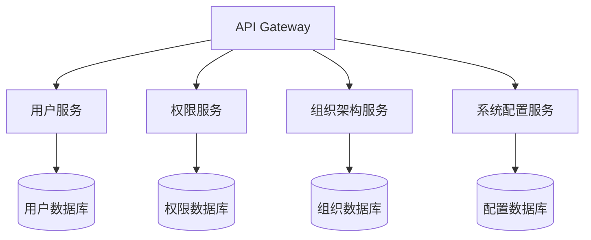
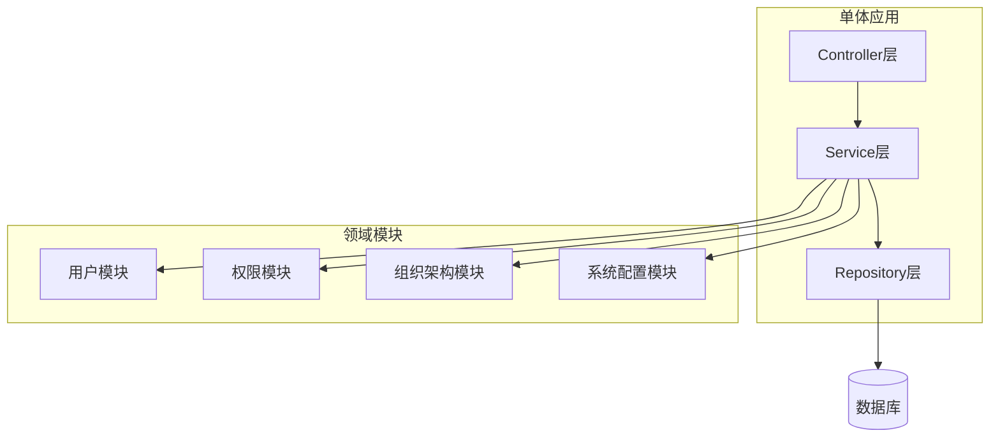
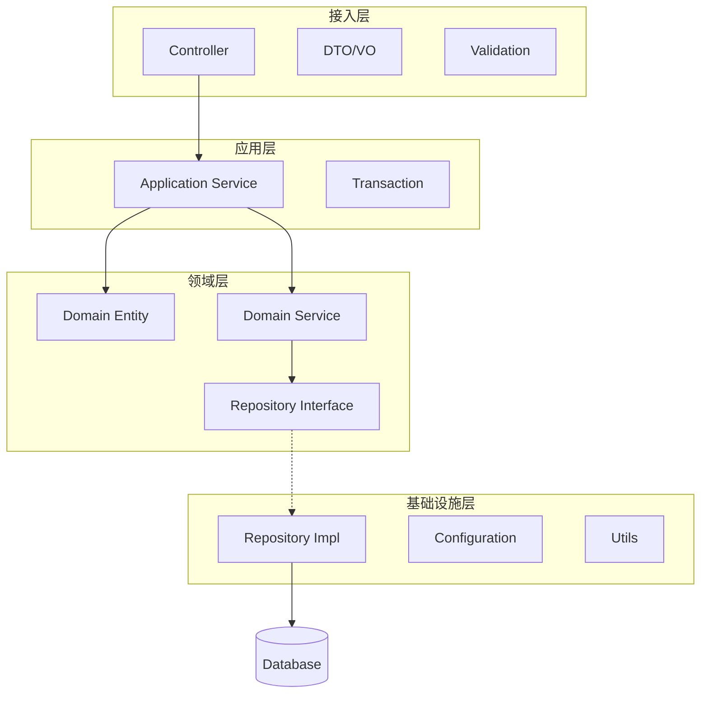
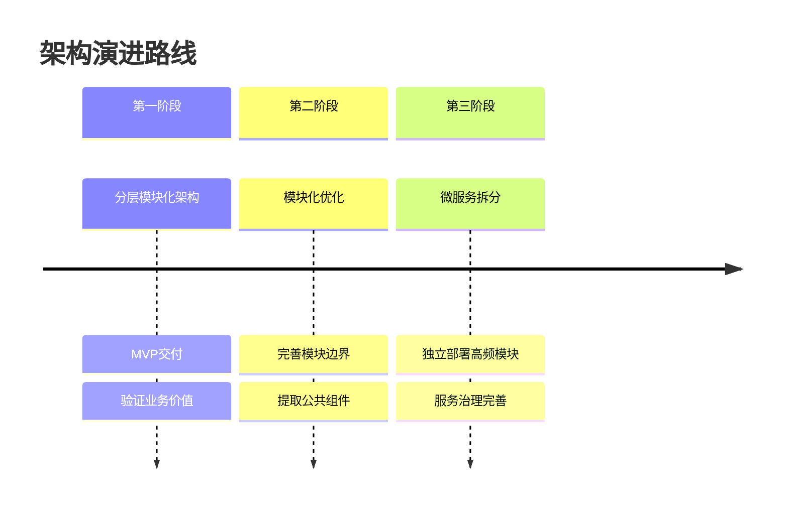

# 架构风格选型决策记录 (ADR)

> **ADR编号**: ADR-ARCH-001
> **标题**: System平台架构风格选型
> **日期**: 2026-03-08
> **状态**: 已接受
> **决策者**: 架构师、技术负责人

---

## 1. 背景

System平台作为企业级基础管理平台，需要支持用户管理、权限管理、组织架构管理等核心功能。在架构设计阶段，需要确定采用何种架构风格来构建系统。

### 1.1 业务背景

- **用户规模**: 初期1000+用户，未来可能扩展到5000+
- **功能范围**: 用户中心、权限中心、组织架构中心、系统配置
- **集成需求**: 需要与现有5个系统（HR/ERP/CRM/OA/财务）集成
- **部署环境**: 私有云/混合云部署

### 1.2 技术背景

- **团队规模**: 15人开发团队
- **技术栈**: Java/Spring生态、Vue前端
- **运维能力**: 具备DevOps基础能力
- **时间约束**: MVP需在3个月内交付

---

## 2. 决策驱动因素

### 2.1 关键决策因素

| 因素 | 权重 | 说明 |
|-----|------|------|
| 开发效率 | 25% | 团队规模和交付时间要求 |
| 运维复杂度 | 20% | 团队运维能力和成本 |
| 扩展性 | 20% | 未来业务增长需求 |
| 技术风险 | 15% | 团队技术储备和学习成本 |
| 性能要求 | 10% | 系统响应时间和吞吐量 |
| 集成能力 | 10% | 与现有系统的集成复杂度 |

### 2.2 约束条件

- **时间约束**: 3个月内交付MVP
- **人力约束**: 15人团队，需要快速上手
- **技术约束**: 基于Spring Boot技术栈
- **运维约束**: 运维团队规模有限

---

## 3. 候选方案

### 3.1 方案一：微服务架构

#### 3.1.1 架构描述

将系统拆分为多个独立部署的微服务：
- 用户服务
- 权限服务
- 组织架构服务
- 系统配置服务
- API网关



#### 3.1.2 优势

1. **独立部署**: 各服务可独立开发、测试、部署
2. **技术异构**: 不同服务可采用不同技术栈
3. **弹性伸缩**: 根据负载独立扩展特定服务
4. **故障隔离**: 单个服务故障不影响整体

#### 3.1.3 劣势

1. **复杂度高**: 分布式系统复杂度显著增加
2. **运维成本高**: 需要服务发现、配置中心、监控等基础设施
3. **开发成本高**: 需要处理分布式事务、服务间通信
4. **团队要求高**: 需要具备微服务开发和运维经验

### 3.2 方案二：模块化单体架构

#### 3.2.1 架构描述

采用单体应用，但内部按领域模块划分：
- 用户模块
- 权限模块
- 组织架构模块
- 系统配置模块



#### 3.2.2 优势

1. **开发简单**: 单体应用开发调试简单
2. **部署简单**: 单一部署单元
3. **事务简单**: 本地事务即可满足需求
4. **测试简单**: 集成测试成本低
5. **运维简单**: 监控和日志集中

#### 3.2.3 劣势

1. **扩展受限**: 只能整体扩展
2. **技术锁定**: 整个应用必须使用相同技术栈
3. **部署风险**: 任何修改都需要全量部署
4. **长期维护**: 随着功能增加，代码可能变得复杂

### 3.3 方案三：分层模块化架构（推荐）

#### 3.3.1 架构描述

在模块化单体基础上，增加清晰的分层和边界：
- **接入层**: Controller、DTO、Validation
- **应用层**: Service、事务控制
- **领域层**: Domain、Repository接口
- **基础设施层**: Repository实现、配置、工具



#### 3.3.2 优势

1. **结构清晰**: 分层明确，职责单一
2. **可测试**: 各层可独立测试
3. **可演进**: 未来可平滑演进到微服务
4. **开发效率**: 兼顾开发效率和架构质量
5. **维护性**: 代码结构清晰，易于维护

#### 3.3.3 劣势

1. **初始设计成本**: 需要精心设计分层和边界
2. **团队培训**: 需要团队理解DDD和分层架构

---

## 4. 方案评估

### 4.1 评估矩阵

| 评估维度 | 微服务架构 | 模块化单体 | 分层模块化 | 权重 |
|---------|-----------|-----------|-----------|------|
| 开发效率 | 6 | 9 | 8 | 25% |
| 运维复杂度 | 4 | 9 | 8 | 20% |
| 扩展性 | 9 | 6 | 7 | 20% |
| 技术风险 | 5 | 9 | 8 | 15% |
| 性能要求 | 8 | 8 | 8 | 10% |
| 集成能力 | 8 | 7 | 7 | 10% |
| **加权得分** | **6.35** | **8.15** | **7.75** | 100% |

### 4.2 详细评估

#### 4.2.1 开发效率

**微服务架构 (6分)**:
- 需要搭建服务治理基础设施
- 分布式事务处理复杂
- 开发调试成本高

**模块化单体 (9分)**:
- 开发调试简单
- 快速迭代

**分层模块化 (8分)**:
- 开发效率略低于纯单体
- 但结构更清晰，长期收益高

#### 4.2.2 运维复杂度

**微服务架构 (4分)**:
- 需要服务发现、配置中心、监控
- 运维成本高
- 故障排查复杂

**模块化单体 (9分)**:
- 单一部署单元
- 监控简单

**分层模块化 (8分)**:
- 运维与单体类似
- 日志和监控集中

#### 4.2.3 扩展性

**微服务架构 (9分)**:
- 服务可独立扩展
- 适合大规模系统

**模块化单体 (6分)**:
- 只能整体扩展
- 资源利用率低

**分层模块化 (7分)**:
- 单体扩展受限
- 但模块边界清晰，未来可拆分

---

## 5. 决策

### 5.1 最终决策

**采用方案三：分层模块化架构**

### 5.2 决策理由

1. **符合项目约束**:
   - 3个月交付MVP，微服务架构时间风险高
   - 15人团队，微服务运维能力不足

2. **平衡效率与质量**:
   - 开发效率高，可快速交付
   - 架构清晰，代码质量有保障
   - 为未来演进微服务打下基础

3. **技术风险可控**:
   - 基于成熟的Spring Boot技术栈
   - 团队学习成本低
   - 运维简单，故障排查容易

4. **可演进性**:
   - 模块边界清晰，未来可独立拆分
   - 分层设计便于重构
   - 支持渐进式架构演进

### 5.3 决策影响

#### 5.3.1 积极影响

- 快速交付MVP，验证业务价值
- 降低初期技术风险
- 团队可专注于业务功能开发
- 为未来架构演进保留空间

#### 5.3.2 消极影响

- 初期无法享受微服务的独立扩展能力
- 需要严格遵守分层规范，否则可能退化为大泥球
- 未来拆分微服务时需要一定重构成本

---

## 6. 实施策略

### 6.1 模块划分

```
com.linsir.system
├── user                    # 用户模块
│   ├── application         # 应用层
│   ├── entity              # 领域层（实体）
│   └── infrastructure      # 基础设施层
├── permission              # 权限模块
│   ├── application
│   ├── entity
│   └── infrastructure
├── organization            # 组织架构模块
│   ├── application
│   ├── entity
│   └── infrastructure
└── config                  # 系统配置模块
    ├── application
    ├── entity
    └── infrastructure
```

### 6.2 分层规范

| 层级 | 职责 | 依赖规则 |
|-----|------|---------|
| 接入层 | 接收请求、参数校验、DTO转换 | 只能调用应用层 |
| 应用层 | 编排领域服务、事务控制 | 只能调用领域层 |
| 领域层 | 核心业务逻辑、领域模型 | 不依赖其他层 |
| 基础设施层 | 数据访问、外部服务调用 | 实现领域层接口 |

### 6.3 演进路线



---

## 7. 风险与缓解

### 7.1 风险识别

| 风险 | 可能性 | 影响 | 缓解措施 |
|-----|-------|------|---------|
| 模块边界模糊 | 中 | 高 | 制定严格的编码规范，Code Review |
| 代码腐化 | 中 | 中 | 定期重构，技术债务管理 |
| 性能瓶颈 | 低 | 中 | 监控预警，提前优化 |
| 拆分困难 | 低 | 中 | 保持模块独立，减少耦合 |

### 7.2 监控指标

- 模块间依赖度
- 代码重复率
- 测试覆盖率
- 构建时间

---

## 8. 相关决策

### 8.1 前置决策

- ADR-TECH-001: 技术栈选型
- ADR-TECH-002: 数据库选型

### 8.2 后续决策

- ADR-ARCH-002: 服务拆分策略
- ADR-ARCH-003: 数据一致性策略

---

## 9. 附录

### 9.1 术语表

| 术语 | 定义 |
|------|------|
| ADR | 架构决策记录（Architecture Decision Record）|
| DDD | 领域驱动设计（Domain-Driven Design）|
| MVP | 最小可行产品（Minimum Viable Product）|

### 9.2 参考资料

- 《领域驱动设计》Eric Evans
- 《构建演进式架构》Neal Ford
- Spring官方文档

### 9.3 修订历史

| 版本 | 日期 | 作者 | 变更内容 |
|-----|------|------|---------|
| 1.0 | 2026-03-08 | 架构师 | 初始版本 |

---

**决策记录编制**: 架构师
**决策记录审核**: 技术负责人
**编制日期**: 2026-03-08
