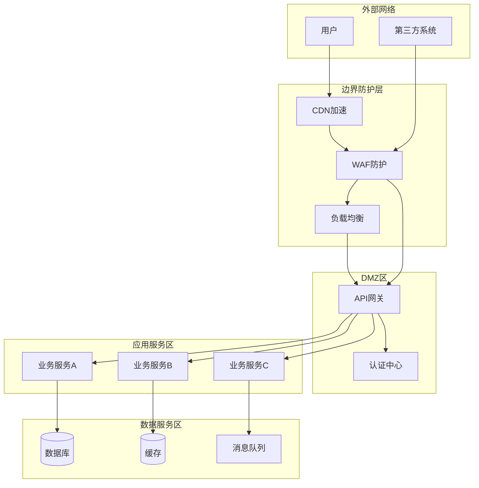
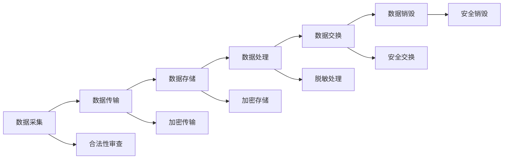
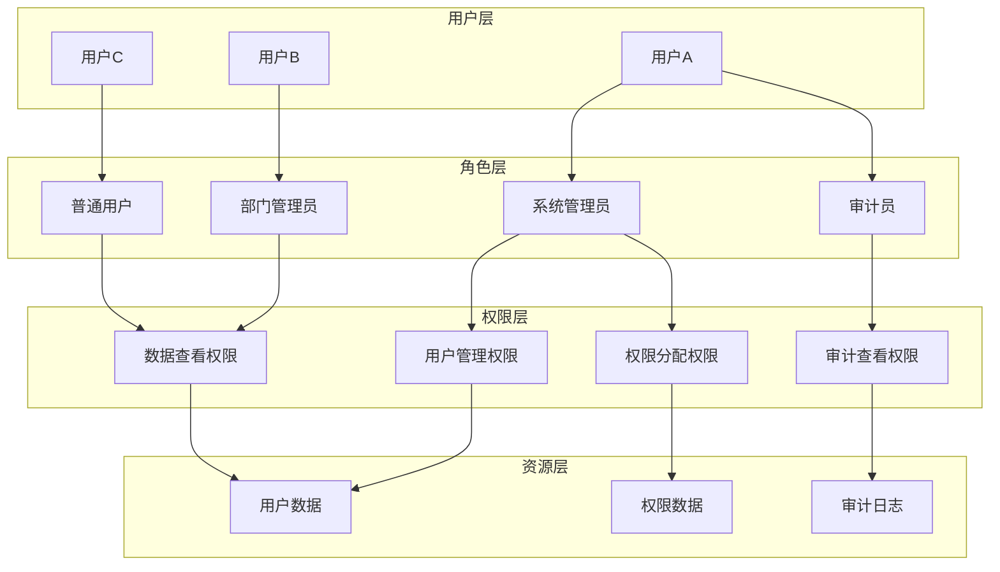
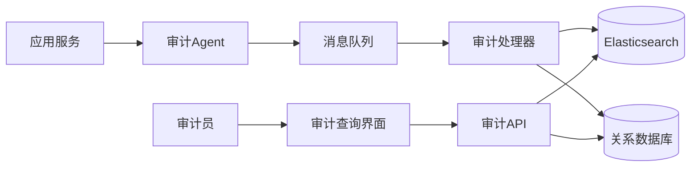
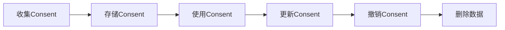

# 安全合规分析

> **文档编号**: SYS-DES-ARCH-SECURITY-001  
> **版本**: 1.0  
> **创建日期**: 2026-03-08  
> **作者**: 架构师  
> **状态**: ✅ 已审核通过

---

## 1. 概述

### 1.1 目的

本文档分析System平台项目面临的安全合规要求，明确系统必须遵守的安全标准和合规规范，为安全架构设计提供依据。

### 1.2 范围

本文档涵盖以下安全合规领域：
- 网络安全合规
- 数据安全合规
- 身份认证与访问控制合规
- 审计合规
- 隐私保护合规
- 行业特定合规要求

### 1.3 参考文档

- 《中华人民共和国网络安全法》
- 《中华人民共和国数据安全法》
- 《中华人民共和国个人信息保护法》
- 《信息安全技术 网络安全等级保护基本要求》（GB/T 22239-2019）
- 项目章程

---

## 2. 合规框架概述

### 2.1 适用法规标准

| 法规/标准 | 适用范围 | 合规等级 | 主要要求 |
|----------|---------|---------|---------|
| 网络安全法 | 全系统 | 强制 | 网络安全等级保护、数据安全 |
| 数据安全法 | 数据相关 | 强制 | 数据分类分级、安全评估 |
| 个人信息保护法 | 个人信息 | 强制 | 个人信息保护、 consent管理 |
| 等保2.0 | 全系统 | 强制 | 三级等保要求 |
| ISO 27001 | 信息安全管理 | 推荐 | 信息安全管理体系 |

### 2.2 合规责任矩阵

| 合规领域 | 责任部门 | 责任人 | 配合部门 |
|---------|---------|--------|---------|
| 网络安全 | 运维部 | 运维负责人 | 安全部、研发部 |
| 数据安全 | 数据部 | 数据负责人 | 安全部、法务部 |
| 应用安全 | 研发部 | 研发负责人 | 安全部、测试部 |
| 审计合规 | 合规部 | 合规负责人 | 各部门 |

---

## 3. 网络安全合规

### 3.1 等保2.0三级要求

#### 3.1.1 安全通信网络

| 控制点 | 合规要求 | 实现方式 | 验证方法 |
|-------|---------|---------|---------|
| 网络架构 | 网络架构冗余，关键链路双活 | 多可用区部署、负载均衡 | 架构评审 |
| 通信传输 | 重要数据传输加密 | TLS 1.3、国密算法 | 渗透测试 |
| 可信验证 | 基于可信根进行验证 | 可信计算环境 | 安全测评 |

#### 3.1.2 安全区域边界

| 控制点 | 合规要求 | 实现方式 | 验证方法 |
|-------|---------|---------|---------|
| 边界防护 | 部署边界防护设备 | WAF、防火墙 | 配置审计 |
| 访问控制 | 默认拒绝所有流量，仅开放必要端口 | 安全组、ACL | 端口扫描 |
| 入侵防范 | 检测入侵行为并告警 | IDS/IPS | 入侵测试 |
| 恶意代码防范 | 检测恶意代码 | 杀毒软件、沙箱 | 病毒扫描 |

#### 3.1.3 安全计算环境

| 控制点 | 合规要求 | 实现方式 | 验证方法 |
|-------|---------|---------|---------|
| 身份鉴别 | 用户身份唯一标识，强密码策略 | MFA、密码策略 | 登录测试 |
| 访问控制 | 基于角色的访问控制 | RBAC模型 | 权限测试 |
| 安全审计 | 审计记录留存6个月以上 | 审计日志系统 | 日志审计 |
| 数据完整性 | 重要数据完整性保护 | 数字签名、校验 | 完整性测试 |
| 数据保密性 | 敏感数据加密存储 | AES-256加密 | 加密验证 |

### 3.2 网络安全架构设计



---

## 4. 数据安全合规

### 4.1 数据分类分级

#### 4.1.1 数据分类

| 数据类别 | 定义 | 示例 | 保护级别 |
|---------|------|------|---------|
| 核心数据 | 对组织至关重要，泄露会造成重大损失 | 系统密钥、管理员账号 | 最高 |
| 重要数据 | 对业务重要，泄露会造成较大损失 | 用户密码、权限配置 | 高 |
| 敏感数据 | 涉及个人隐私或商业敏感 | 手机号、邮箱、部门信息 | 中 |
| 一般数据 | 普通业务数据 | 操作日志、配置信息 | 低 |

#### 4.1.2 数据分级保护

| 保护级别 | 存储保护 | 传输保护 | 访问控制 | 审计要求 |
|---------|---------|---------|---------|---------|
| 最高 | 加密+访问控制+完整性校验 | TLS+证书绑定 | 双人授权 | 实时审计 |
| 高 | 加密+访问控制 | TLS | RBAC | 详细审计 |
| 中 | 访问控制 | TLS | 身份认证 | 操作审计 |
| 低 | 基本访问控制 | HTTPS | 基本认证 | 日志记录 |

### 4.2 数据生命周期安全



#### 4.2.1 数据采集安全

| 控制点 | 合规要求 | 实现措施 |
|-------|---------|---------|
| 合法性 | 采集数据需有合法依据 | 隐私政策、用户授权 |
| 最小化 | 仅采集必要数据 | 数据需求评审 |
| 告知同意 | 告知用户并获取同意 | Consent管理 |
| 质量 | 确保数据准确性 | 数据校验机制 |

#### 4.2.2 数据传输安全

| 控制点 | 合规要求 | 实现措施 |
|-------|---------|---------|
| 加密传输 | 敏感数据传输必须加密 | TLS 1.3、国密SM2/SM3/SM4 |
| 完整性 | 防止数据篡改 | HMAC签名 |
| 身份认证 | 通信双方身份验证 | 双向TLS证书 |

#### 4.2.3 数据存储安全

| 控制点 | 合规要求 | 实现措施 |
|-------|---------|---------|
| 加密存储 | 敏感数据加密存储 | AES-256-GCM、国密SM4 |
| 密钥管理 | 密钥安全存储和轮换 | HSM、KMS |
| 访问控制 | 最小权限原则 | RBAC、字段级权限 |
| 备份恢复 | 定期备份和恢复测试 | 异地备份、恢复演练 |

#### 4.2.4 数据处理安全

| 控制点 | 合规要求 | 实现措施 |
|-------|---------|---------|
| 脱敏处理 | 非生产环境数据脱敏 | 动态脱敏、静态脱敏 |
| 访问审计 | 记录数据访问行为 | 审计日志 |
| 使用监控 | 监控异常数据访问 | 行为分析、告警 |

#### 4.2.5 数据销毁安全

| 控制点 | 合规要求 | 实现措施 |
|-------|---------|---------|
| 彻底销毁 | 数据不可恢复 | 安全擦除、物理销毁 |
| 销毁记录 | 记录销毁过程 | 销毁日志 |
| 定期清理 | 过期数据定期清理 | 数据生命周期管理 |

---

## 5. 身份认证与访问控制合规

### 5.1 身份认证要求

#### 5.1.1 用户身份认证

| 控制点 | 合规要求 | 实现方式 | 验证方法 |
|-------|---------|---------|---------|
| 身份唯一性 | 用户身份唯一标识 | 用户ID、工号 | 数据库约束 |
| 强密码策略 | 密码复杂度要求 | 8位以上、大小写+数字+特殊字符 | 密码策略配置 |
| 多因素认证 | 重要操作需MFA | 短信/邮箱/OTP | MFA功能测试 |
| 会话管理 | 会话超时和续期 | 30分钟超时、滑动续期 | 会话测试 |
| 登录失败处理 | 失败锁定和告警 | 5次失败锁定15分钟 | 登录测试 |

#### 5.1.2 服务身份认证

| 控制点 | 合规要求 | 实现方式 | 验证方法 |
|-------|---------|---------|---------|
| 服务间认证 | 服务间调用需认证 | mTLS、Service Account | 服务调用测试 |
| API认证 | API调用需认证 | API Key、OAuth 2.0 | API测试 |
| 第三方认证 | 第三方系统接入需认证 | OAuth 2.0、SAML | 集成测试 |

### 5.2 访问控制要求

#### 5.2.1 RBAC模型设计



#### 5.2.2 访问控制策略

| 控制点 | 合规要求 | 实现方式 | 验证方法 |
|-------|---------|---------|---------|
| 最小权限 | 仅授予必要权限 | 细粒度权限设计 | 权限审计 |
| 职责分离 | 关键操作需多人授权 | 双人授权机制 | 流程测试 |
| 权限审查 | 定期权限审查 | 季度权限审计 | 审计报告 |
| 离职处理 | 及时回收离职人员权限 | 自动权限回收 | 流程验证 |

---

## 6. 审计合规

### 6.1 审计要求

| 审计类型 | 合规要求 | 审计内容 | 留存期限 |
|---------|---------|---------|---------|
| 登录审计 | 记录所有登录行为 | 登录时间、IP、结果 | 6个月 |
| 操作审计 | 记录关键操作 | 操作人、时间、对象、结果 | 1年 |
| 数据访问审计 | 记录敏感数据访问 | 访问人、数据类型、目的 | 2年 |
| 权限变更审计 | 记录权限变更 | 变更人、变更内容、时间 | 3年 |
| 系统配置审计 | 记录配置变更 | 配置项、变更前后值 | 1年 |

### 6.2 审计日志规范

```json
{
  "timestamp": "2026-03-08T10:30:00+08:00",
  "eventType": "USER_LOGIN",
  "eventLevel": "INFO",
  "userId": "user_12345",
  "username": "zhangsan",
  "clientIp": "192.168.1.100",
  "userAgent": "Mozilla/5.0...",
  "operation": "用户登录",
  "resource": "认证服务",
  "result": "SUCCESS",
  "details": {
    "loginType": "PASSWORD",
    "mfaUsed": true,
    "sessionId": "sess_abc123"
  },
  "riskLevel": "LOW"
}
```

### 6.3 审计架构



---

## 7. 隐私保护合规

### 7.1 个人信息保护

#### 7.1.1 个人信息分类

| 信息类别 | 定义 | 示例 | 保护要求 |
|---------|------|------|---------|
| 个人敏感信息 | 一旦泄露会造成人身/财产危害 | 身份证号、银行卡号 | 最高保护 |
| 个人重要信息 | 与个人身份强关联 | 手机号、邮箱 | 高保护 |
| 个人一般信息 | 一般性个人信息 | 姓名、部门 | 中保护 |

#### 7.1.2 个人信息处理原则

| 原则 | 要求 | 实现措施 |
|------|------|---------|
| 合法正当 | 处理需有合法依据 | 隐私政策、用户授权 |
| 最小必要 | 仅处理必要信息 | 数据最小化设计 |
| 目的明确 | 处理目的明确告知 | 隐私政策透明 |
| 安全保障 | 采取安全措施 | 加密、访问控制 |
| 公开透明 | 处理规则公开 | 隐私政策公示 |

### 7.2 Consent管理

#### 7.2.1 Consent生命周期



#### 7.2.2 Consent管理要求

| 控制点 | 合规要求 | 实现措施 |
|-------|---------|---------|
| 明确同意 | 用户明确同意 | 勾选框、确认按钮 |
| 随时撤回 | 用户可随时撤回 | 撤回入口、一键撤回 |
| 同意记录 | 记录同意历史 | Consent日志 |
| 同意期限 | 设置同意有效期 | 定期重新获取同意 |

---

## 8. 安全合规检查清单

### 8.1 开发阶段检查项

| 检查项 | 检查内容 | 检查方式 | 责任方 |
|-------|---------|---------|--------|
| 安全编码 | 代码是否符合安全编码规范 | 代码审查 | 开发团队 |
| 依赖安全 | 第三方依赖是否存在漏洞 | 依赖扫描 | 安全团队 |
| 密钥管理 | 密钥是否安全存储 | 配置审查 | 安全团队 |
| 输入验证 | 是否对所有输入进行验证 | 代码审查 | 开发团队 |

### 8.2 测试阶段检查项

| 检查项 | 检查内容 | 检查方式 | 责任方 |
|-------|---------|---------|--------|
| 渗透测试 | 系统是否存在安全漏洞 | 渗透测试 | 安全团队 |
| 漏洞扫描 | 是否存在已知漏洞 | 自动化扫描 | 安全团队 |
| 配置审计 | 安全配置是否正确 | 配置检查 | 运维团队 |
| 权限测试 | 权限控制是否正确 | 功能测试 | 测试团队 |

### 8.3 上线阶段检查项

| 检查项 | 检查内容 | 检查方式 | 责任方 |
|-------|---------|---------|--------|
| 等保测评 | 是否符合等保三级要求 | 第三方测评 | 合规团队 |
| 安全加固 | 系统是否安全加固 | 加固检查 | 运维团队 |
| 监控配置 | 安全监控是否配置 | 配置验证 | 运维团队 |
| 应急响应 | 应急响应流程是否就绪 | 演练验证 | 安全团队 |

---

## 9. 合规风险与应对

### 9.1 合规风险识别

| 风险编号 | 风险描述 | 风险等级 | 影响范围 |
|---------|---------|---------|---------|
| R001 | 等保测评不通过 | 高 | 系统上线 |
| R002 | 数据泄露事件 | 高 | 企业声誉、法律责任 |
| R003 | 隐私合规违规 | 高 | 法律责任、罚款 |
| R004 | 审计日志缺失 | 中 | 合规检查 |
| R005 | 权限控制漏洞 | 中 | 数据安全 |

### 9.2 风险应对措施

| 风险编号 | 应对措施 | 责任人 | 完成时间 |
|---------|---------|--------|---------|
| R001 | 提前进行等保预评估，整改不符合项 | 合规负责人 | 上线前 |
| R002 | 实施数据加密、访问控制、监控告警 | 安全负责人 | 持续 |
| R003 | 建立隐私保护机制，定期合规审查 | 合规负责人 | 持续 |
| R004 | 完善审计日志功能，定期审计 | 架构师 | 上线前 |
| R005 | 定期权限审计，修复权限漏洞 | 安全负责人 | 季度 |

---

## 10. 附录

### 10.1 相关法规标准

1. 《中华人民共和国网络安全法》
2. 《中华人民共和国数据安全法》
3. 《中华人民共和国个人信息保护法》
4. 《信息安全技术 网络安全等级保护基本要求》（GB/T 22239-2019）
5. 《信息安全技术 个人信息安全规范》（GB/T 35273-2020）

### 10.2 术语表

| 术语 | 定义 |
|------|------|
| 等保 | 网络安全等级保护 |
| RBAC | 基于角色的访问控制 |
| MFA | 多因素认证 |
| TLS | 传输层安全协议 |
| HSM | 硬件安全模块 |
| KMS | 密钥管理服务 |
| PII | 个人身份信息 |
| Consent | 用户同意 |

### 10.3 修订记录

| 版本 | 日期 | 作者 | 变更内容 |
|-----|------|------|---------|
| 1.0 | 2026-03-08 | 架构师 | 初始版本 |

---

**文档编制**: 架构师  
**文档审核**: 安全负责人  
**编制日期**: 2026-03-08
