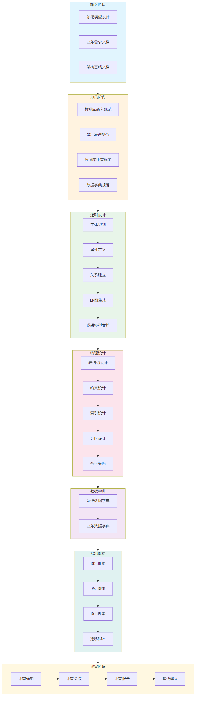

# 数据库设计流程指南

> **文档编号**: SYS-DB-PRO-GUIDE-001  
> **版本**: 1.0  
> **日期**: 2026-03-08  
> **作者**: 数据库架构师  
> **状态**: 🔄 进行中

---

## 一、流程概述

### 1.1 流程目标

规范System平台数据库设计全流程，确保数据库设计质量，建立完整的数据库设计文档和基线。

### 1.2 适用范围

适用于System平台及所有子系统的数据库设计工作。

### 1.3 流程阶段

数据库设计流程分为7个阶段：
1. **输入阶段** - 准备设计输入文档
2. **规范阶段** - 建立设计规范
3. **逻辑设计** - 设计逻辑数据模型
4. **物理设计** - 设计物理数据模型
5. **数据字典** - 建立数据字典
6. **SQL脚本** - 编写SQL脚本
7. **评审阶段** - 设计评审和基线建立

---

## 二、流程图

---

## 三、详细步骤

### 阶段1：输入阶段

**目标**：准备数据库设计所需的输入文档

**输入文档**：
- [ ] 领域模型设计（SYS-DES-BA-002）
- [ ] 业务需求文档（BRD）
- [ ] 架构基线文档（SYS-BASELINE-001）

**输出**：设计输入确认单

---

### 阶段2：规范阶段

**目标**：建立数据库设计规范

**规范文件**：

| 序号 | 规范文件 | 文件路径 | 状态 |
|-----|---------|---------|------|
| 1 | 数据库命名规范 | `01-database-design-standard/01-database-naming-convention.md` | 待创建 |
| 2 | SQL编码规范 | `01-database-design-standard/02-sql-coding-standard.md` | 待创建 |
| 3 | 数据库评审规范 | `01-database-design-standard/03-database-review-standard.md` | 待创建 |
| 4 | 数据字典规范 | `01-database-design-standard/04-data-dictionary-standard.md` | 待创建 |

**关键规范内容**：
- 命名规则（数据库、表、字段、索引、约束）
- SQL编码标准
- 评审检查项
- 数据字典格式

---

### 阶段3：逻辑设计

**目标**：设计逻辑数据模型

**步骤**：

#### 3.1 实体识别
- 从领域模型提取核心实体
- 识别关联实体和关系实体
- 定义实体命名

#### 3.2 属性定义
- 定义实体属性
- 确定数据类型和长度
- 标识必填/可选字段

#### 3.3 关系建立
- 定义实体间关系（1:1, 1:N, M:N）
- 建立外键关联
- 定义级联规则

#### 3.4 ER图生成
- 使用Mermaid绘制ER图
- 标注实体关系
- 验证关系完整性

#### 3.5 逻辑模型文档
- 编写逻辑数据模型文档
- 包含实体定义、属性列表、关系说明
- 输出：`02-database-design/01-logical-data-model.md`

**输出文档**：
- 逻辑数据模型文档（SYS-DB-DES-001）

---

### 阶段4：物理设计

**目标**：设计物理数据模型

**步骤**：

#### 4.1 表结构设计
- 定义表名、字段名
- 确定字段数据类型、长度、精度
- 设置默认值、是否为空
- 添加字段注释

#### 4.2 约束设计
- 主键约束（Primary Key）
- 外键约束（Foreign Key）
- 唯一约束（Unique）
- 检查约束（Check）

#### 4.3 索引设计
- 主键索引
- 外键索引
- 业务查询索引
- 联合索引

#### 4.4 分区设计（可选）
- 确定分区策略（Range/List/Hash）
- 选择分区键
- 设计分区规则

#### 4.5 备份策略
- 全量备份策略
- 增量备份策略
- 备份保留周期
- 恢复策略（RTO/RPO）

**输出文档**：
- 物理数据模型文档（SYS-DB-DES-002）
- 数据库索引设计（SYS-DB-DES-003）
- 数据库分区设计（SYS-DB-DES-004）
- 数据库备份策略（SYS-DB-DES-005）

---

### 阶段5：数据字典

**目标**：建立完整的数据字典

**步骤**：

#### 5.1 系统数据字典
- 系统配置表字典
- 系统日志表字典
- 枚举值定义

#### 5.2 业务数据字典
- 用户相关表字典
- 业务数据表字典
- 字段业务规则说明

**输出文档**：
- 系统数据字典（SYS-DB-DICT-001）
- 业务数据字典（SYS-DB-DICT-002）

---

### 阶段6：SQL脚本

**目标**：编写完整的SQL脚本

**步骤**：

#### 6.1 DDL脚本
- 数据库创建脚本
- 表创建脚本
- 索引创建脚本
- 约束创建脚本
- 视图创建脚本

#### 6.2 DML脚本
- 系统初始数据脚本
- 业务初始数据脚本

#### 6.3 DCL脚本
- 用户创建脚本
- 权限分配脚本

#### 6.4 迁移脚本
- 版本管理脚本
- 回滚脚本

**输出文件**：
- `04-sql-scripts/01-ddl-scripts/*.sql`
- `04-sql-scripts/02-dml-scripts/*.sql`
- `04-sql-scripts/03-dcl-scripts/*.sql`
- `04-sql-scripts/04-migration-scripts/*.sql`

---

### 阶段7：评审阶段

**目标**：完成设计评审，建立数据库基线

**步骤**：

#### 7.1 评审准备
- 发布评审通知
- 准备评审材料
- 制定评审议程

#### 7.2 评审执行
- 召开评审会议
- 记录评审问题
- 编写评审报告

#### 7.3 基线建立
- 确认评审结论
- 建立数据库基线
- 基线签字确认

**输出文档**：
- 数据库评审通知（SYS-DB-REV-001）
- 评审会议议程（SYS-DB-REV-002）
- 数据库评审报告（SYS-DB-REV-003）
- 评审会议记录（SYS-DB-REV-004）
- 数据库基线（SYS-DB-REV-005）

---

## 四、流程检查清单

### 4.1 逻辑设计检查项

- [ ] 所有实体都有主键
- [ ] 所有实体都有审计字段
- [ ] 命名符合规范
- [ ] 关系定义清晰
- [ ] ER图完整
- [ ] 业务规则文档化

### 4.2 物理设计检查项

- [ ] 所有表都有主键
- [ ] 所有字段都有注释
- [ ] 外键关系定义
- [ ] 索引设计合理
- [ ] 分区策略合理（如需要）
- [ ] 备份策略完整

### 4.3 数据字典检查项

- [ ] 所有表都有字典条目
- [ ] 所有字段都有说明
- [ ] 枚举值已定义
- [ ] 业务规则已说明

### 4.4 SQL脚本检查项

- [ ] DDL脚本可执行
- [ ] DML脚本数据完整
- [ ] DCL脚本权限正确
- [ ] 迁移脚本规范

---

## 五、输出文档清单

### 数据库设计文档（6个）

| 序号 | 文档名称 | 文档编号 | 输出位置 |
|-----|---------|---------|---------|
| 1 | 逻辑数据模型 | SYS-DB-DES-001 | `02-database-design/01-logical-data-model.md` |
| 2 | 物理数据模型 | SYS-DB-DES-002 | `02-database-design/02-physical-data-model.md` |
| 3 | 数据库索引设计 | SYS-DB-DES-003 | `02-database-design/03-database-index-design.md` |
| 4 | 数据库分区设计 | SYS-DB-DES-004 | `02-database-design/04-database-partition-design.md` |
| 5 | 数据库备份策略 | SYS-DB-DES-005 | `02-database-design/05-database-backup-strategy.md` |
| 6 | 数据库设计评审记录 | SYS-DB-DES-006 | `02-database-design/06-database-design-review-record.md` |

### 数据字典文档（3个）

| 序号 | 文档名称 | 文档编号 | 输出位置 |
|-----|---------|---------|---------|
| 1 | 系统数据字典 | SYS-DB-DICT-001 | `03-data-dictionary/01-system-data-dictionary.md` |
| 2 | 业务数据字典 | SYS-DB-DICT-002 | `03-data-dictionary/02-business-data-dictionary.md` |
| 3 | 数据字典评审记录 | SYS-DB-DICT-003 | `03-data-dictionary/03-data-dictionary-review-record.md` |

### 数据库评审文档（5个）

| 序号 | 文档名称 | 文档编号 | 输出位置 |
|-----|---------|---------|---------|
| 1 | 数据库评审通知 | SYS-DB-REV-001 | `05-database-review/01-database-review-notice.md` |
| 2 | 评审会议议程 | SYS-DB-REV-002 | `05-database-review/02-database-review-agenda.md` |
| 3 | 数据库评审报告 | SYS-DB-REV-003 | `05-database-review/03-database-review-report.md` |
| 4 | 评审会议记录 | SYS-DB-REV-004 | `05-database-review/04-database-review-record.md` |
| 5 | 数据库基线 | SYS-DB-REV-005 | `05-database-review/05-database-baseline.md` |

---

## 六、修订记录

| 版本 | 日期 | 作者 | 变更内容 |
|-----|------|------|---------|
| 1.0 | 2026-03-08 | 数据库架构师 | 初始版本，建立数据库设计流程指南 |
