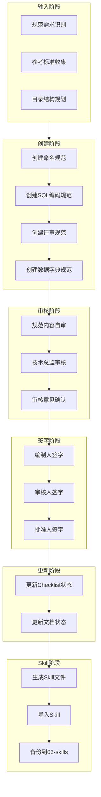

# 数据库设计规范文件清单流程

> **文档编号**: SYS-DB-PRO-002  
> **版本**: 1.0  
> **日期**: 2026-03-08  
> **作者**: 数据库架构师  
> **状态**: ✅ 已发布

---

## 一、流程概述

### 1.1 流程目的

本流程指导数据库设计规范文件的创建、审核、发布和备份全过程，确保规范文件的质量和可追溯性。

### 1.2 适用范围

- 数据库命名规范
- SQL编码规范
- 数据库评审规范
- 数据字典规范

### 1.3 流程目标

1. 规范文件标准化创建
2. 审核流程规范化
3. 版本管理可追溯
4. Skill知识库沉淀

---

## 二、流程图



---

## 三、流程步骤

### 步骤1: 输入阶段

#### 1.1 规范需求识别

**输入**:
- 项目数据库设计需求
- 团队技术栈（MySQL/PostgreSQL/Oracle等）
- 项目规模和复杂度

**输出**:
- 规范需求清单
- 规范优先级排序

#### 1.2 参考标准收集

**参考标准**:
- ISO/IEC 11179 数据元素规范
- 行业数据库设计最佳实践
- 团队历史项目经验

**输出**:
- 参考标准清单

#### 1.3 目录结构规划

**目录结构**:
```
01-database-design-standard/
├── 01-database-naming-convention.md    # 数据库命名规范
├── 02-sql-coding-standard.md           # SQL编码规范
├── 03-database-review-standard.md      # 数据库评审规范
└── 04-data-dictionary-standard.md      # 数据字典规范
```

---

### 步骤2: 创建阶段

#### 2.1 创建命名规范

**文档位置**: `01-database-design-standard/01-database-naming-convention.md`

**内容框架**:
```markdown
# 数据库命名规范

> **文档编号**: SYS-DB-STD-001
> **版本**: 1.0
> **日期**: YYYY-MM-DD
> **作者**: 数据库架构师
> **状态**: 🔄 进行中

## 一、概述
## 二、数据库命名规范
## 三、表命名规范
## 四、字段命名规范
## 五、索引命名规范
## 六、约束命名规范
## 七、视图命名规范
## 八、存储过程/函数命名规范
## 九、命名禁用清单
## 十、命名示例汇总
## 十一、审核签字
## 十二、修订记录
```

**关键内容**:
- 数据库命名: `db_<系统名>[_<环境标识>]`
- 表命名: `<前缀>_<模块名>_<表名>`
- 字段命名: 小写+下划线
- 索引命名: `idx_<表名>_<字段名>`

#### 2.2 创建SQL编码规范

**文档位置**: `01-database-design-standard/02-sql-coding-standard.md`

**内容框架**:
```markdown
# SQL编码规范

> **文档编号**: SYS-DB-STD-002
...

## 一、概述
## 二、基本格式规范
## 三、SELECT语句规范
## 四、INSERT语句规范
## 五、UPDATE语句规范
## 六、DELETE语句规范
## 七、DDL语句规范
## 八、注释规范
## 九、性能优化规范
## 十、安全规范
## 十一、审核签字
## 十二、修订记录
```

**关键内容**:
- SQL关键字大写，表名字段名小写
- 2个空格缩进
- 明确指定列，避免SELECT *
- UPDATE/DELETE必须使用WHERE

#### 2.3 创建评审规范

**文档位置**: `01-database-design-standard/03-database-review-standard.md`

**内容框架**:
```markdown
# 数据库评审规范

> **文档编号**: SYS-DB-STD-003
...

## 一、概述
## 二、评审流程
## 三、评审检查项
## 四、评审标准
## 五、评审工具
## 六、审核签字
## 七、修订记录
```

**关键内容**:
- 评审流程: 准备→执行→跟踪→基线
- 问题分级: P0严重/P1重要/P2一般/P3提示
- 通过标准: 无P0问题，P1问题≤3个

#### 2.4 创建数据字典规范

**文档位置**: `01-database-design-standard/04-data-dictionary-standard.md`

**内容框架**:
```markdown
# 数据字典规范

> **文档编号**: SYS-DB-STD-004
...

## 一、概述
## 二、数据字典分类
## 三、数据字典格式规范
## 四、字段描述规范
## 五、枚举值定义规范
## 六、数据字典维护规范
## 七、数据字典模板
## 八、数据字典质量检查清单
## 九、审核签字
## 十、修订记录
```

**关键内容**:
- 表级字典格式: 基本信息、字段定义、索引定义、约束定义
- 字段级字典格式: 字段名、中文名、数据类型、必填、默认值、业务含义
- 常用枚举: 状态(0-禁用/1-启用)、删除标志(0-正常/1-删除)

---

### 步骤3: 审核阶段

#### 3.1 规范内容自审

**检查清单**:
- [ ] 文档结构完整
- [ ] 内容准确无误
- [ ] 格式规范统一
- [ ] 示例清晰易懂
- [ ] 无错别字

#### 3.2 技术总监审核

**审核要点**:
- 规范是否符合项目实际
- 是否与现有标准冲突
- 是否覆盖全面
- 是否可执行

#### 3.3 审核意见确认

**审核结果处理**:
- 通过: 进入签字阶段
- 修改: 根据意见修改后重新审核
- 拒绝: 重新设计规范内容

---

### 步骤4: 签字阶段

#### 4.1 编制人签字

**操作**: 在文档末尾添加签字信息

```markdown
## 审核签字

| 角色 | 签字 | 日期 |
|-----|------|------|
| 编制人 | 数据库架构师 | YYYY-MM-DD |
| 审核人 | 技术总监 | YYYY-MM-DD |
| 批准人 | 技术总监 | YYYY-MM-DD |

**审核意见**: [审核意见内容]
```

#### 4.2 审核人签字

**操作**: 技术总监确认审核意见

#### 4.3 批准人签字

**操作**: 技术总监批准发布

---

### 步骤5: 更新阶段

#### 5.1 更新Checklist状态

**文件**: `00-database-standard/database-design-checklist.md`

**更新内容**:
```markdown
| 序号 | 规范文件 | 文件路径 | 状态 |
|-----|---------|---------|------|
| 1 | 数据库命名规范 | `01-database-design-standard/01-database-naming-convention.md` | ✅ 已完成 |
| 2 | SQL编码规范 | `01-database-design-standard/02-sql-coding-standard.md` | ✅ 已完成 |
| 3 | 数据库评审规范 | `01-database-design-standard/03-database-review-standard.md` | ✅ 已完成 |
| 4 | 数据字典规范 | `01-database-design-standard/04-data-dictionary-standard.md` | ✅ 已完成 |
```

#### 5.2 更新文档状态

**更新文档头部**:
```markdown
> **状态**: ✅ 已发布
> **审核状态**: ✓ 已审核通过
> **审核日期**: YYYY-MM-DD
> **审核人**: 技术总监
```

---

### 步骤6: Skill阶段

#### 6.1 生成Skill文件

**Skill名称**: `database-design-standard-process`

**Skill内容框架**:
```markdown
# 数据库设计规范文件清单流程

## 流程目标
指导数据库设计规范文件的创建、审核、发布和备份全过程

## 输入
- 项目数据库设计需求
- 团队技术栈
- 参考标准

## 输出
- 4个规范文件
- Skill知识库

## 流程步骤
1. 输入阶段: 需求识别、标准收集、目录规划
2. 创建阶段: 创建4个规范文件
3. 审核阶段: 自审、技术总监审核
4. 签字阶段: 编制人、审核人、批准人签字
5. 更新阶段: 更新Checklist和文档状态
6. Skill阶段: 生成、导入、备份Skill

## 规范文件清单
1. 数据库命名规范
2. SQL编码规范
3. 数据库评审规范
4. 数据字典规范

## 关键检查点
- [ ] 4个规范文件已创建
- [ ] 审核签字完成
- [ ] Checklist状态已更新
- [ ] Skill已生成并导入
```

#### 6.2 导入Skill

**操作**: 使用skill-creator工具导入Skill

#### 6.3 备份到03-skills

**备份位置**: `03-skills/database-design-standard-process.skill.md`

---

## 四、输出清单

### 4.1 规范文件

| 序号 | 文档名称 | 文档编号 | 位置 |
|-----|---------|---------|------|
| 1 | 数据库命名规范 | SYS-DB-STD-001 | `01-database-design-standard/01-database-naming-convention.md` |
| 2 | SQL编码规范 | SYS-DB-STD-002 | `01-database-design-standard/02-sql-coding-standard.md` |
| 3 | 数据库评审规范 | SYS-DB-STD-003 | `01-database-design-standard/03-database-review-standard.md` |
| 4 | 数据字典规范 | SYS-DB-STD-004 | `01-database-design-standard/04-data-dictionary-standard.md` |

### 4.2 Skill文件

| 文件 | 位置 |
|-----|------|
| Skill定义 | `03-skills/database-design-standard-process.skill.md` |

---

## 五、质量检查清单

### 5.1 创建阶段检查

- [ ] 4个规范文件已创建
- [ ] 文档编号正确
- [ ] 文档格式统一
- [ ] 内容完整无遗漏

### 5.2 审核阶段检查

- [ ] 自审已完成
- [ ] 技术总监审核通过
- [ ] 审核意见已记录

### 5.3 签字阶段检查

- [ ] 编制人已签字
- [ ] 审核人已签字
- [ ] 批准人已签字
- [ ] 审核意见已添加

### 5.4 更新阶段检查

- [ ] Checklist状态已更新为"✅ 已完成"
- [ ] 文档状态已更新
- [ ] 审核信息已添加

### 5.5 Skill阶段检查

- [ ] Skill文件已生成
- [ ] Skill已导入
- [ ] Skill已备份到03-skills

---

## 六、修订记录

| 版本 | 日期 | 作者 | 变更内容 |
|-----|------|------|---------|
| 1.0 | 2026-03-08 | 数据库架构师 | 初始版本，建立数据库设计规范文件清单流程 |
