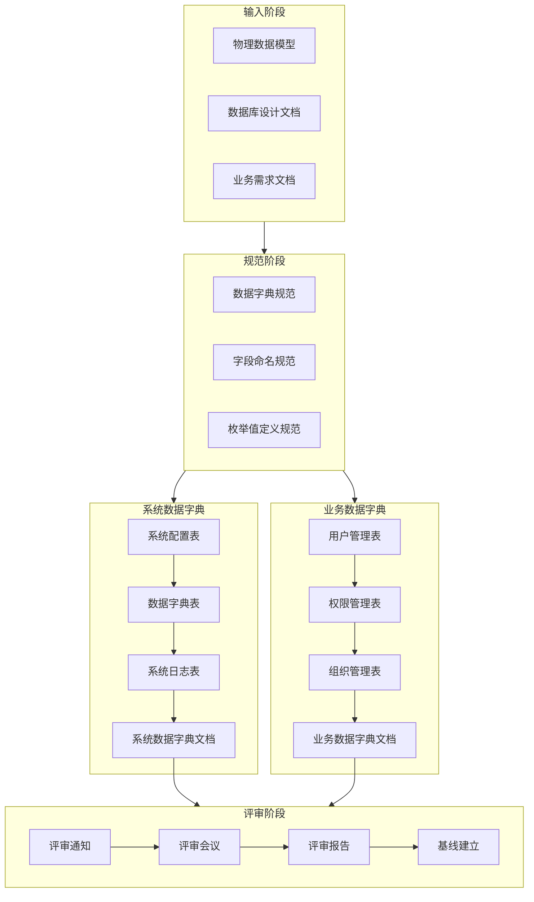

# 数据字典流程

> **流程编号**: SYS-PROC-DB-002  
> **流程名称**: 数据字典流程  
> **版本**: 1.0  
> **日期**: 2026-03-08  
> **作者**: 数据库架构师  
> **状态**: ✅ 已发布

---

## 一、流程概述

### 1.1 流程目的

规范System平台数据字典的建立和维护流程，确保数据字典的完整性、准确性和一致性。

### 1.2 适用范围

适用于System平台所有数据库表的数据字典管理。

### 1.3 流程目标

- 建立完整的数据字典文档
- 规范字段命名和定义
- 统一枚举值管理
- 支持多租户数据隔离

---

## 二、流程图



---

## 三、流程步骤

### 步骤1: 准备输入文档

**输入**:
- 物理数据模型文档
- 数据库设计文档
- 业务需求文档

**输出**:
- 数据字典设计输入清单

**负责人**: 数据库架构师

**任务清单**:
- [ ] 收集物理数据模型
- [ ] 整理数据库设计文档
- [ ] 分析业务需求文档
- [ ] 确定数据字典范围

---

### 步骤2: 建立规范

**输入**:
- 数据字典规范
- 字段命名规范
- 枚举值定义规范

**输出**:
- 数据字典规范文档

**负责人**: 数据库架构师

**任务清单**:
- [ ] 定义数据字典格式
- [ ] 制定字段描述规范
- [ ] 制定枚举值定义规范
- [ ] 制定数据字典维护流程

**规范要求**:

| 规范项 | 要求 |
|-------|------|
| 文档格式 | Markdown格式，统一模板 |
| 字段描述 | 包含字段名、类型、可空性、默认值、说明、业务规则 |
| 枚举值 | 包含值、标签、说明三列 |
| 版本管理 | 每次变更更新修订记录 |

---

### 步骤3: 创建系统数据字典

**输入**:
- 系统配置表设计
- 数据字典表设计
- 系统日志表设计

**输出**:
- 系统数据字典文档 (SYS-DB-DICT-001)

**负责人**: 数据库架构师

**任务清单**:
- [ ] 系统配置表字典
  - 租户基本信息配置表
  - Web信息配置表
  - 商务信息配置表
- [ ] 数据字典表字典
  - 数据字典类型表
  - 数据字典项表
- [ ] 系统日志表字典
  - 操作日志表
  - 登录日志表

**系统数据字典内容**:

| 表类别 | 表名 | 字段数 | 枚举值数 |
|-------|------|-------|---------|
| 系统配置 | sys_tenant_config | 19 | 18 |
| 系统配置 | sys_web_config | 20 | 5 |
| 系统配置 | sys_business_config | 25 | 6 |
| 数据字典 | sys_dict_type | 11 | 16 |
| 数据字典 | sys_dict_item | 13 | 50+ |
| 系统日志 | sys_operation_log | 16 | 11 |
| 系统日志 | sys_login_log | 14 | 6 |

---

### 步骤4: 创建业务数据字典

**输入**:
- 用户管理表设计
- 权限管理表设计
- 组织管理表设计

**输出**:
- 业务数据字典文档 (SYS-DB-DICT-002)

**负责人**: 数据库架构师

**任务清单**:
- [ ] 用户管理表字典
  - 用户表
  - 用户角色关系表
  - 用户部门关系表
- [ ] 权限管理表字典
  - 角色表
  - 角色权限关系表
  - 权限表
  - 菜单表
- [ ] 组织管理表字典
  - 部门表
  - 岗位表
  - 员工表

**业务数据字典内容**:

| 表类别 | 表名 | 字段数 | 枚举值数 |
|-------|------|-------|---------|
| 用户管理 | sys_user | 20 | 3 |
| 用户管理 | sys_user_role | 7 | 2 |
| 用户管理 | sys_user_dept | 7 | 2 |
| 权限管理 | sys_role | 14 | 10 |
| 权限管理 | sys_role_permission | 6 | - |
| 权限管理 | sys_permission | 12 | 6 |
| 权限管理 | sys_menu | 20 | 10 |
| 组织管理 | sys_dept | 16 | 2 |
| 组织管理 | sys_position | 13 | 2 |
| 组织管理 | sys_employee | 26 | 7 |

---

### 步骤5: 数据字典评审

**输入**:
- 系统数据字典文档
- 业务数据字典文档

**输出**:
- 数据字典评审记录 (SYS-DB-DICT-003)

**负责人**: 技术负责人

**评审检查项**:

| 检查项 | 检查内容 | 通过标准 |
|-------|---------|---------|
| 字段完整性 | 所有字段都有完整定义 | 100%字段有定义 |
| 数据类型 | 数据类型选择合理 | 符合设计规范 |
| 枚举值 | 枚举值定义完整 | 所有枚举字段有定义 |
| 业务规则 | 业务规则描述清晰 | 关键字段有规则说明 |
| 关联关系 | 表间关系定义准确 | 外键关系正确 |

**评审参与人员**:
- 评审组长: 技术负责人
- 汇报人: 数据库架构师
- 评审员: 系统架构师、后端开发负责人、前端开发负责人、测试负责人
- 记录员: 项目经理

---

### 步骤6: 建立基线

**输入**:
- 评审通过的数据字典文档
- 评审记录

**输出**:
- 数据字典基线

**负责人**: 配置管理员

**任务清单**:
- [ ] 归档数据字典文档
- [ ] 建立版本基线
- [ ] 通知相关人员

---

## 四、数据字典模板

### 4.1 表字典模板

```markdown
### X.X 表名 (table_name)

**表说明**: 表的功能说明

#### X.X.1 表基本信息

| 属性 | 值 |
|-----|---|
| 表名 | table_name |
| 中文名 | 表中文名 |
| 存储引擎 | InnoDB |
| 字符集 | utf8mb4 |

#### X.X.2 字段字典

| 字段名 | 数据类型 | 可空 | 默认值 | 说明 | 业务规则 |
|-------|---------|------|-------|------|---------|
| id | BIGINT | 否 | 自增 | 主键ID | 主键 |
| ... | ... | ... | ... | ... | ... |

#### X.X.3 枚举值定义

**enum_field（枚举字段）**:

| 值 | 标签 | 说明 |
|---|------|------|
| 0 | 禁用 | 说明 |
| 1 | 启用 | 说明 |

#### X.X.4 业务规则

1. 业务规则1
2. 业务规则2
```

### 4.2 字段定义规范

| 属性 | 说明 | 示例 |
|-----|------|------|
| 字段名 | 小写下划线命名 | user_name |
| 数据类型 | 标准SQL类型 | VARCHAR(50) |
| 可空 | 是/否 | 否 |
| 默认值 | 默认值或NULL | 0 |
| 说明 | 字段用途说明 | 用户姓名 |
| 业务规则 | 业务约束和规则 | 2-20个字符 |

### 4.3 枚举值定义规范

| 属性 | 说明 | 示例 |
|-----|------|------|
| 值 | 存储值 | 0, 1, 2 |
| 标签 | 显示文本 | 禁用, 启用 |
| 说明 | 详细说明 | 账号被禁用 |

---

## 五、输出文档清单

| 序号 | 文档名称 | 文档编号 | 说明 |
|-----|---------|---------|------|
| 1 | 系统数据字典 | SYS-DB-DICT-001 | 系统级数据字典 |
| 2 | 业务数据字典 | SYS-DB-DICT-002 | 业务级数据字典 |
| 3 | 数据字典评审记录 | SYS-DB-DICT-003 | 评审记录文档 |

---

## 六、流程指标

### 6.1 质量指标

| 指标 | 目标值 | 说明 |
|-----|-------|------|
| 字段定义完整率 | 100% | 所有字段必须有定义 |
| 枚举值定义完整率 | 100% | 所有枚举字段必须有枚举值 |
| 业务规则覆盖率 | ≥90% | 关键字段必须有业务规则 |

### 6.2 效率指标

| 指标 | 目标值 | 说明 |
|-----|-------|------|
| 数据字典完成时间 | ≤3天 | 从设计到评审完成 |
| 评审问题数 | ≤5个 | 每次评审发现问题数 |
| 评审通过率 | ≥90% | 一次评审通过率 |

---

## 七、修订记录

| 版本 | 日期 | 作者 | 变更内容 |
|-----|------|------|---------|
| 1.0 | 2026-03-08 | 数据库架构师 | 初始版本，创建数据字典流程 |
