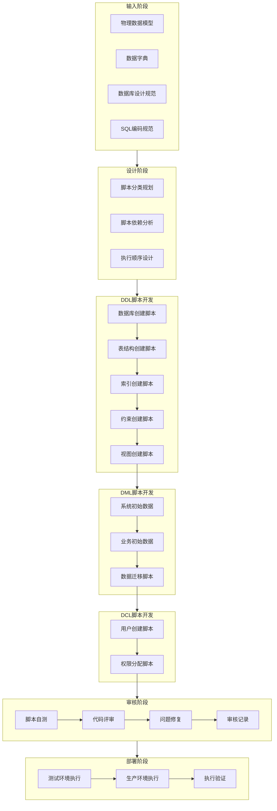

# SQL脚本开发流程

> **流程编号**: DB-PROC-004  
> **版本**: 1.0  
> **日期**: 2026-03-08  
> **作者**: 数据库架构师  
> **状态**: ✅ 已发布

---

## 一、流程概述

### 1.1 流程目标

规范SQL脚本的开发、审核、执行流程，确保数据库脚本的质量、安全性和可维护性。

### 1.2 适用范围

- DDL脚本（数据定义语言）：数据库、表、索引、约束、视图创建
- DML脚本（数据操作语言）：数据初始化、数据迁移
- DCL脚本（数据控制语言）：用户权限配置
- 迁移脚本：数据库版本升级脚本

### 1.3 流程输入

- 物理数据模型设计文档
- 数据字典文档
- 数据库设计规范
- SQL编码规范

### 1.4 流程输出

- DDL脚本文件
- DML脚本文件
- DCL脚本文件
- 迁移脚本文件
- SQL脚本审核记录

---

## 二、流程图



---

## 三、流程步骤

### 步骤1：脚本规划（Script Planning）

**目标**：规划SQL脚本的分类、依赖关系和执行顺序

**输入**：
- 物理数据模型设计文档
- 数据字典文档

**活动**：
1. 根据物理数据模型确定需要创建的表结构
2. 根据查询需求确定索引设计
3. 根据业务关系确定外键约束
4. 根据业务需求确定视图设计
5. 根据系统需求确定初始化数据
6. 根据安全需求确定权限配置

**输出**：
- 脚本清单（包含脚本类型、文件名、依赖关系）
- 脚本执行顺序表

**脚本分类规范**：

| 类别 | 目录 | 文件命名规范 | 说明 |
|-----|------|-------------|------|
| DDL | 01-ddl-scripts/ | XX-操作-对象.sql | 数据库结构定义 |
| DML | 02-dml-scripts/ | XX-操作-数据.sql | 数据操作 |
| DCL | 03-dcl-scripts/ | XX-操作-权限.sql | 权限控制 |
| Migration | 04-migration-scripts/ | V版本号__描述.sql | 版本迁移 |

---

### 步骤2：DDL脚本开发（DDL Script Development）

**目标**：创建数据库结构定义脚本

#### 2.1 数据库创建脚本

**文件**：`01-create-database.sql`

**内容要求**：
```sql
-- ========================================================
-- 文档头部注释（必须）
-- ========================================================
-- 文档编号: SYS-DB-SQL-001
-- 版本: 1.0
-- 日期: YYYY-MM-DD
-- 作者: 开发者姓名
-- ========================================================

-- 创建数据库
CREATE DATABASE IF NOT EXISTS 数据库名
    DEFAULT CHARACTER SET utf8mb4
    DEFAULT COLLATE utf8mb4_unicode_ci;

-- 使用数据库
USE 数据库名;

-- 设置参数
SET NAMES utf8mb4;
SET FOREIGN_KEY_CHECKS = 0;
```

**检查项**：
- [ ] 字符集设置为utf8mb4
- [ ] 排序规则设置为utf8mb4_unicode_ci
- [ ] 包含文档头部信息

#### 2.2 表结构创建脚本

**文件**：`02-create-tables.sql`

**内容要求**：
```sql
-- 表创建模板
DROP TABLE IF EXISTS `表名`;
CREATE TABLE `表名` (
    `id` bigint NOT NULL AUTO_INCREMENT COMMENT '主键ID',
    -- 业务字段
    `business_field` varchar(100) NOT NULL COMMENT '业务字段',
    -- 必备字段
    `create_time` datetime NOT NULL DEFAULT CURRENT_TIMESTAMP COMMENT '创建时间',
    `update_time` datetime NOT NULL DEFAULT CURRENT_TIMESTAMP ON UPDATE CURRENT_TIMESTAMP COMMENT '更新时间',
    `create_by` bigint DEFAULT NULL COMMENT '创建人ID',
    `update_by` bigint DEFAULT NULL COMMENT '更新人ID',
    `deleted` tinyint NOT NULL DEFAULT '0' COMMENT '删除标志',
    `tenant_id` bigint NOT NULL COMMENT '租户ID',
    PRIMARY KEY (`id`),
    UNIQUE KEY `uk_唯一标识` (`唯一字段`),
    KEY `idx_索引名` (`索引字段`)
) ENGINE=InnoDB DEFAULT CHARSET=utf8mb4 COLLATE=utf8mb4_unicode_ci COMMENT='表注释';
```

**检查项**：
- [ ] 表名使用小写下划线命名，sys_前缀
- [ ] 包含id、create_time、update_time、create_by、update_by、deleted、tenant_id必备字段
- [ ] 字段有COMMENT注释
- [ ] 主键使用bigint自增
- [ ] 存储引擎为InnoDB
- [ ] 字符集为utf8mb4

#### 2.3 索引创建脚本

**文件**：`03-create-indexes.sql`

**内容要求**：
```sql
-- 普通索引
CREATE INDEX `idx_表名_字段名` ON `表名`(`字段名`);

-- 复合索引
CREATE INDEX `idx_表名_字段1_字段2` ON `表名`(`字段1`, `字段2`);

-- 前缀索引（适用于长文本）
CREATE INDEX `idx_表名_字段名` ON `表名`(`字段名`(100));
```

**索引设计原则**：
1. 主键索引：每个表必须有主键
2. 唯一索引：唯一性约束字段
3. 外键索引：外键字段自动创建索引
4. 查询索引：WHERE条件字段、ORDER BY字段、JOIN字段
5. 复合索引：遵循最左前缀原则

**检查项**：
- [ ] 索引命名规范：idx_表名_字段名
- [ ] 避免重复索引
- [ ] 控制单表索引数量（建议不超过5个）

#### 2.4 约束创建脚本

**文件**：`04-create-constraints.sql`

**内容要求**：
```sql
-- 外键约束
ALTER TABLE `从表`
    ADD CONSTRAINT `fk_从表_主表` 
    FOREIGN KEY (`外键字段`) 
    REFERENCES `主表`(`主键字段`) 
    ON DELETE CASCADE 
    ON UPDATE CASCADE;

-- 检查约束（MySQL 8.0.16+）
ALTER TABLE `表名`
    ADD CONSTRAINT `chk_约束名` 
    CHECK (`字段` IN (值1, 值2));
```

**外键策略**：
- ON DELETE CASCADE：级联删除（适用于强关联）
- ON DELETE SET NULL：置空（适用于弱关联）
- ON DELETE RESTRICT：禁止删除（默认）

**检查项**：
- [ ] 外键命名规范：fk_从表_主表
- [ ] 级联策略合理
- [ ] 外键字段类型与主键一致

#### 2.5 视图创建脚本

**文件**：`05-create-views.sql`

**内容要求**：
```sql
-- 删除已存在视图
DROP VIEW IF EXISTS `v_视图名`;

-- 创建视图
CREATE VIEW `v_视图名` AS
SELECT 
    字段列表
FROM 表1
LEFT JOIN 表2 ON 关联条件
WHERE 过滤条件;
```

**视图命名规范**：
- 用户视图：v_user_xxx
- 部门视图：v_dept_xxx
- 角色视图：v_role_xxx
- 统计视图：v_xxx_stats

**检查项**：
- [ ] 视图命名规范：v_视图名
- [ ] 使用DROP VIEW IF EXISTS避免重复创建错误
- [ ] 视图逻辑清晰，性能可接受

---

### 步骤3：DML脚本开发（DML Script Development）

**目标**：创建数据初始化脚本

#### 3.1 系统初始数据

**文件**：`01-init-data.sql`

**内容要求**：
```sql
-- 初始化租户数据
INSERT INTO `sys_tenant_config` (字段列表) VALUES (值列表);

-- 初始化字典数据
INSERT INTO `sys_dict_type` (字段列表) VALUES (值列表);
INSERT INTO `sys_dict_item` (字段列表) VALUES (值列表);

-- 初始化权限数据
INSERT INTO `sys_permission` (字段列表) VALUES (值列表);

-- 初始化角色数据
INSERT INTO `sys_role` (字段列表) VALUES (值列表);

-- 初始化菜单数据
INSERT INTO `sys_menu` (字段列表) VALUES (值列表);

-- 初始化用户数据（密码使用BCrypt加密）
INSERT INTO `sys_user` (username, password, ...) 
VALUES ('admin', '$2a$10$...', ...);

-- 初始化角色权限关系
INSERT INTO `sys_role_permission` (role_id, permission_id) VALUES (1, 1);

-- 初始化用户角色关系
INSERT INTO `sys_user_role` (user_id, role_id, is_primary) VALUES (1, 1, 1);
```

**数据初始化顺序**：
1. 租户数据（sys_tenant_config）
2. 字典数据（sys_dict_type、sys_dict_item）
3. 权限数据（sys_permission）
4. 角色数据（sys_role）
5. 菜单数据（sys_menu）
6. 部门数据（sys_dept）
7. 岗位数据（sys_position）
8. 用户数据（sys_user）
9. 角色权限关系（sys_role_permission）
10. 用户角色关系（sys_user_role）
11. 用户部门关系（sys_user_dept）
12. 员工数据（sys_employee）

**检查项**：
- [ ] 数据初始化顺序正确（先父表后子表）
- [ ] 密码使用加密存储
- [ ] 外键关联数据存在
- [ ] 包含初始化统计查询

---

### 步骤4：DCL脚本开发（DCL Script Development）

**目标**：创建数据库用户权限配置脚本

#### 4.1 权限配置脚本

**文件**：`01-grant-permissions.sql`

**内容要求**：
```sql
-- ========================================================
-- 说明：
-- 本脚本创建数据库用户并分配权限
-- 根据安全原则，遵循最小权限原则
-- ========================================================

-- 1. 创建应用只读用户（用于报表查询等）
-- DROP USER IF EXISTS 'app_reader'@'%';
-- CREATE USER 'app_reader'@'%' IDENTIFIED BY '强密码';

-- 2. 创建应用读写用户（用于普通业务操作）
-- DROP USER IF EXISTS 'app_writer'@'%';
-- CREATE USER 'app_writer'@'%' IDENTIFIED BY '强密码';

-- 3. 创建应用管理员用户（用于DDL操作）
-- DROP USER IF EXISTS 'app_admin'@'%';
-- CREATE USER 'app_admin'@'%' IDENTIFIED BY '强密码';

-- 只读用户权限
-- GRANT SELECT ON 数据库名.* TO 'app_reader'@'%';

-- 读写用户权限
-- GRANT SELECT, INSERT, UPDATE, DELETE ON 数据库名.* TO 'app_writer'@'%';

-- 管理员用户权限
-- GRANT ALL PRIVILEGES ON 数据库名.* TO 'app_admin'@'%';

-- 刷新权限
-- FLUSH PRIVILEGES;
```

**用户分类**：

| 用户类型 | 权限范围 | 使用场景 |
|---------|---------|---------|
| app_reader | SELECT | 报表查询、数据分析 |
| app_writer | SELECT, INSERT, UPDATE, DELETE | 业务操作 |
| app_admin | ALL PRIVILEGES | DDL操作、维护 |
| backup_user | SELECT, LOCK TABLES | 数据备份 |
| monitor_user | PROCESS, REPLICATION CLIENT | 监控查询 |

**安全要求**：
1. 密码必须使用强密码（12位以上，包含大小写字母、数字、特殊字符）
2. 生产环境限制用户访问IP（使用'user'@'ip'格式）
3. 遵循最小权限原则
4. 定期审计用户权限
5. 及时回收不再需要的权限

**检查项**：
- [ ] 默认注释状态，需手动启用
- [ ] 包含安全建议和最佳实践
- [ ] 密码使用占位符提示修改

---

### 步骤5：脚本审核（Script Review）

**目标**：确保SQL脚本质量和安全性

#### 5.1 自测检查

**执行前检查**：
```bash
# 检查SQL语法
mysql -u root -p --dry-run < script.sql

# 检查脚本执行时间
mysql -u root -p -e "source script.sql;" 2>&1 | tee execution.log
```

**检查项**：
- [ ] SQL语法正确
- [ ] 无重复创建错误（使用IF EXISTS/IF NOT EXISTS）
- [ ] 外键依赖顺序正确
- [ ] 字符集设置一致

#### 5.2 代码评审

**评审内容**：

| 检查类别 | 检查项 | 标准 |
|---------|-------|------|
| 命名规范 | 数据库命名 | 小写，使用下划线 |
| | 表命名 | sys_前缀，小写下划线 |
| | 字段命名 | 小写下划线 |
| | 索引命名 | idx_表名_字段名 |
| | 外键命名 | fk_从表_主表 |
| | 视图命名 | v_视图名 |
| 结构设计 | 主键设计 | bigint自增 |
| | 必备字段 | 包含标准字段 |
| | 字段注释 | 所有字段有注释 |
| | 存储引擎 | InnoDB |
| | 字符集 | utf8mb4 |
| 索引设计 | 主键索引 | 每个表必须有 |
| | 外键索引 | 外键自动创建 |
| | 查询索引 | 覆盖查询条件 |
| 安全性 | 密码加密 | BCrypt加密 |
| | 权限控制 | 最小权限原则 |
| | SQL注入防护 | 使用参数化查询 |
| 性能 | 大表分区 | 超过1000万条考虑分区 |
| | 索引数量 | 单表不超过5个 |
| | 大字段 | TEXT/BLOB单独存储 |

#### 5.3 审核记录

**审核文档**：`sql-scripts-review-record.md`

**内容要求**：
- 审核概述（审核对象、范围、日期）
- 审核人员（审核人、批准人）
- 审核内容（DDL/DML/DCL脚本审核详情）
- 审核结论（通过/不通过）
- 审核签字

---

### 步骤6：脚本部署（Script Deployment）

**目标**：在目标环境执行SQL脚本

#### 6.1 测试环境执行

**执行步骤**：
1. 备份测试数据库
2. 按顺序执行DDL脚本
3. 执行DML初始化脚本
4. 执行DCL权限脚本（可选）
5. 验证数据完整性
6. 运行功能测试

**验证查询**：
```sql
-- 验证表结构
SHOW TABLES;

-- 验证表结构
DESCRIBE sys_user;

-- 验证索引
SHOW INDEX FROM sys_user;

-- 验证外键
SELECT * FROM INFORMATION_SCHEMA.KEY_COLUMN_USAGE 
WHERE REFERENCED_TABLE_NAME IS NOT NULL;

-- 验证数据
SELECT COUNT(*) FROM sys_user;
```

#### 6.2 生产环境执行

**执行步骤**：
1. 申请变更窗口
2. 备份生产数据库
3. 在维护窗口执行脚本
4. 验证执行结果
5. 恢复业务访问

**安全要求**：
- 必须在维护窗口执行
- 必须有回滚方案
- 必须有人值守
- 必须记录执行日志

---

## 四、质量标准

### 4.1 SQL脚本质量标准

| 质量维度 | 要求 | 检查方式 |
|---------|------|---------|
| 正确性 | 语法正确，逻辑正确 | 语法检查、单元测试 |
| 完整性 | 覆盖所有需求 | 需求追溯 |
| 一致性 | 命名、风格一致 | 代码评审 |
| 安全性 | 无SQL注入风险 | 安全扫描 |
| 性能 | 执行效率高 | 性能测试 |
| 可维护性 | 注释清晰，结构清晰 | 代码评审 |

### 4.2 审核通过标准

- 所有检查项通过
- 无高危问题
- 中危问题有解决方案
- 审核人和批准人签字确认

---

## 五、工具支持

### 5.1 推荐工具

| 工具类型 | 工具名称 | 用途 |
|---------|---------|------|
| SQL客户端 | MySQL Workbench | SQL开发、模型设计 |
| | Navicat | 数据库管理 |
| | DataGrip | SQL开发 |
| 版本控制 | Git | 脚本版本管理 |
| 迁移工具 | Flyway | 数据库迁移 |
| | Liquibase | 数据库迁移 |
| 代码检查 | SQLLint | SQL语法检查 |
| | SonarQube | 代码质量检查 |

### 5.2 脚本模板

项目提供以下脚本模板：
- 数据库创建模板
- 表结构创建模板
- 索引创建模板
- 约束创建模板
- 视图创建模板
- 数据初始化模板
- 权限配置模板

---

## 六、相关文档

| 文档名称 | 文档编号 | 位置 |
|---------|---------|------|
| 数据库命名规范 | DB-STD-001 | 01-database-design-standard/01-database-naming-convention.md |
| SQL编码规范 | DB-STD-002 | 01-database-design-standard/02-sql-coding-standard.md |
| 物理数据模型 | SYS-DB-DES-002 | 02-database-design/02-physical-data-model.md |
| 数据字典 | SYS-DB-DICT-001 | 03-data-dictionary/01-system-data-dictionary.md |

---

## 七、流程指标

| 指标名称 | 目标值 | 说明 |
|---------|-------|------|
| 脚本开发周期 | ≤5天 | 从设计到审核完成 |
| 审核通过率 | ≥95% | 首次审核通过比例 |
| 生产问题率 | ≤1% | 生产环境脚本问题比例 |
| 回滚率 | ≤2% | 脚本执行回滚比例 |

---

## 八、修订记录

| 版本 | 日期 | 作者 | 变更内容 |
|-----|------|------|---------|
| 1.0 | 2026-03-08 | 数据库架构师 | 初始版本，定义SQL脚本开发流程 |
