# 逻辑数据模型

> **文档编号**: SYS-DB-DES-001\
> **版本**: 1.0\
> **日期**: 2026-03-08\
> **作者**: 数据库架构师\
> **状态**: ✅ 已完成

***

## 一、概述

### 1.1 文档目的

本文档基于领域模型设计，建立System平台的逻辑数据模型（Logical Data Model），定义实体、属性、关系和业务规则，为物理数据模型设计提供基础。

### 1.2 输入文档

- 领域模型设计（SYS-DES-BA-002）
- 架构基线文档（SYS-BASELINE-001）
- 业务需求文档（BRD）

### 1.3 设计原则

- **业务一致性**: 逻辑模型忠实反映业务领域模型
- **规范化设计**: 遵循数据库范式（3NF）
- **可扩展性**: 支持未来业务扩展
- **清晰性**: 实体关系清晰，易于理解

***

## 二、实体清单

### 2.1 用户管理域实体

| 序号 | 实体名称   | 实体代码            | 说明      | 对应领域聚合   |
| -- | ------ | --------------- | ------- | -------- |
| 1  | 用户     | sys\_user       | 系统用户信息  | 用户聚合     |
| 2  | 用户角色关系 | sys\_user\_role | 用户与角色关联 | 用户角色关系聚合 |
| 3  | 用户部门关系 | sys\_user\_dept | 用户与部门关联 | 用户部门关系聚合 |

### 2.2 权限管理域实体

| 序号 | 实体名称   | 实体代码                  | 说明      | 对应领域聚合   |
| -- | ------ | --------------------- | ------- | -------- |
| 4  | 角色     | sys\_role             | 系统角色定义  | 角色聚合     |
| 5  | 角色权限关系 | sys\_role\_permission | 角色与权限关联 | 角色权限关系聚合 |
| 6  | 权限     | sys\_permission       | 系统权限定义  | 权限聚合     |
| 7  | 菜单     | sys\_menu             | 系统菜单定义  | 菜单聚合     |

### 2.3 组织管理域实体

| 序号 | 实体名称 | 实体代码          | 说明     | 对应领域聚合 |
| -- | ---- | ------------- | ------ | ------ |
| 8  | 部门   | sys\_dept     | 组织架构部门 | 部门聚合   |
| 9  | 岗位   | sys\_position | 岗位定义   | 岗位聚合   |
| 10 | 员工   | sys\_employee | 员工信息   | 员工聚合   |

### 2.4 系统配置域实体

| 序号 | 实体名称     | 实体代码                     | 说明       | 对应领域聚合     |
| ---- | ------------ | ---------------------------- | ---------- | ---------------- |
| 11   | 租户基本信息配置 | sys\_tenant\_config          | 租户基本信息配置 | 租户配置聚合     |
| 12   | Web信息配置  | sys\_web\_config             | Web端配置信息  | Web配置聚合      |
| 13   | 商务信息配置 | sys\_business\_config        | 商务信息配置   | 商务配置聚合     |
| 14   | 数据字典类型 | sys\_dict\_type              | 字典类型定义   | 字典类型聚合     |
| 15   | 数据字典项   | sys\_dict\_item              | 字典项定义     | 字典项聚合       |

### 2.5 审计日志域实体

| 序号 | 实体名称 | 实体代码                | 说明     | 对应领域聚合 |
| -- | ---- | ------------------- | ------ | ------ |
| 16 | 操作日志 | sys\_operation\_log | 用户操作记录 | 操作日志聚合 |
| 17 | 登录日志 | sys\_login\_log     | 用户登录记录 | 登录日志聚合 |

***

## 三、实体详细定义

### 3.1 用户实体 (sys\_user)

**实体说明**: 存储系统用户的基本信息

**主键**: id

**属性列表**:

| 属性名          | 数据类型         | 必填 | 说明     | 业务规则           |
| ------------ | ------------ | -- | ------ | -------------- |
| id           | BIGINT       | 是  | 用户ID   | 自增主键           |
| username     | VARCHAR(50)  | 是  | 用户名    | 唯一，登录账号        |
| password     | VARCHAR(100) | 是  | 密码     | 加密存储           |
| nickname     | VARCHAR(50)  | 否  | 昵称     | 显示名称           |
| email        | VARCHAR(100) | 否  | 邮箱     | 唯一             |
| phone        | VARCHAR(20)  | 否  | 手机号    | 唯一             |
| avatar       | VARCHAR(200) | 否  | 头像URL  |           |
| status       | TINYINT      | 是  | 状态     | 0-禁用, 1-启用     |
| gender       | TINYINT      | 否  | 性别     | 0-未知, 1-男, 2-女 |
| employee\_no | VARCHAR(50)  | 否  | 员工编号   | 唯一             |
| dept\_id     | BIGINT       | 否  | 主属部门ID | 外键关联部门         |
| remark       | VARCHAR(500) | 否  | 备注     |           |
| create\_time | DATETIME     | 是  | 创建时间   |           |
| update\_time | DATETIME     | 是  | 更新时间   |           |
| create\_by   | BIGINT       | 否  | 创建人ID  |           |
| update\_by   | BIGINT       | 否  | 更新人ID  |           |
| deleted      | TINYINT      | 是  | 删除标志   | 0-正常, 1-删除     |
| tenant\_id   | BIGINT       | 是  | 租户ID   | 多租户隔离          |

**业务规则**:

1. 用户名全局唯一，不可重复
2. 密码必须加密存储（BCrypt）
3. 邮箱和手机号如果填写必须唯一
4. 员工编号如果填写必须唯一
5. 逻辑删除，不物理删除数据

***

### 3.2 角色实体 (sys\_role)

**实体说明**: 定义系统角色，用于权限控制

**主键**: id

**属性列表**:

| 属性名          | 数据类型         | 必填 | 说明    | 业务规则                                 |
| ------------ | ------------ | -- | ----- | ------------------------------------ |
| id           | BIGINT       | 是  | 角色ID  | 自增主键                                 |
| role\_code   | VARCHAR(50)  | 是  | 角色编码  | 唯一                                   |
| role\_name   | VARCHAR(50)  | 是  | 角色名称  |                                 |
| role\_type   | TINYINT      | 是  | 角色类型  | 1-系统角色, 2-业务角色                       |
| data\_scope  | TINYINT      | 是  | 数据范围  | 1-全部, 2-本部门, 3-本部门及子部门, 4-仅本人, 5-自定义 |
| status       | TINYINT      | 是  | 状态    | 0-禁用, 1-启用                           |
| sort\_order  | INT          | 是  | 排序号   | 升序排列                                 |
| remark       | VARCHAR(500) | 否  | 备注    |                                 |
| create\_time | DATETIME     | 是  | 创建时间  |                                 |
| update\_time | DATETIME     | 是  | 更新时间  |                                 |
| create\_by   | BIGINT       | 否  | 创建人ID |                                 |
| update\_by   | BIGINT       | 否  | 更新人ID |                                 |
| deleted      | TINYINT      | 是  | 删除标志  | 0-正常, 1-删除                           |
| tenant\_id   | BIGINT       | 是  | 租户ID  |                                 |

**业务规则**:

1. 角色编码全局唯一
2. 系统角色不可删除
3. 数据范围决定用户可查看的数据范围

***

### 3.3 用户角色关系实体 (sys\_user\_role)

**实体说明**: 用户与角色的多对多关系

**主键**: id

**属性列表**:

| 属性名          | 数据类型     | 必填 | 说明    | 业务规则     |
| ------------ | -------- | -- | ----- | -------- |
| id           | BIGINT   | 是  | 关系ID  | 自增主键     |
| user\_id     | BIGINT   | 是  | 用户ID  | 外键关联用户   |
| role\_id     | BIGINT   | 是  | 角色ID  | 外键关联角色   |
| is\_primary  | TINYINT  | 是  | 是否主角色 | 0-否, 1-是 |
| create\_time | DATETIME | 是  | 创建时间  |     |
| tenant\_id   | BIGINT   | 是  | 租户ID  |     |

**业务规则**:

1. 一个用户可以有多个角色
2. 一个角色可以分配给多个用户
3. 一个用户只能有一个主角色
4. 用户ID和角色ID组合唯一

***

### 3.4 权限实体 (sys\_permission)

**实体说明**: 定义系统权限点

**主键**: id

**属性列表**:

| 属性名            | 数据类型         | 必填 | 说明     | 业务规则                |
| -------------- | ------------ | -- | ------ | ------------------- |
| id             | BIGINT       | 是  | 权限ID   | 自增主键                |
| perm\_code     | VARCHAR(100) | 是  | 权限编码   | 唯一，如: sys:user:add  |
| perm\_name     | VARCHAR(50)  | 是  | 权限名称   |                |
| resource\_type | TINYINT      | 是  | 资源类型   | 1-菜单, 2-按钮, 3-接口    |
| resource\_url  | VARCHAR(200) | 否  | 资源URL  | 接口地址或路由             |
| http\_method   | VARCHAR(10)  | 否  | HTTP方法 | GET/POST/PUT/DELETE |
| status         | TINYINT      | 是  | 状态     | 0-禁用, 1-启用          |
| remark         | VARCHAR(500) | 否  | 备注     |                |
| create\_time   | DATETIME     | 是  | 创建时间   |                |
| update\_time   | DATETIME     | 是  | 更新时间   |                |
| deleted        | TINYINT      | 是  | 删除标志   |                |

**业务规则**:

1. 权限编码全局唯一，使用冒号分隔的层级结构
2. 接口类型的权限需要配置URL和HTTP方法

***

### 3.5 角色权限关系实体 (sys\_role\_permission)

**实体说明**: 角色与权限的多对多关系

**主键**: id

**属性列表**:

| 属性名            | 数据类型     | 必填 | 说明   | 业务规则   |
| -------------- | -------- | -- | ---- | ------ |
| id             | BIGINT   | 是  | 关系ID | 自增主键   |
| role\_id       | BIGINT   | 是  | 角色ID | 外键关联角色 |
| permission\_id | BIGINT   | 是  | 权限ID | 外键关联权限 |
| create\_time   | DATETIME | 是  | 创建时间 |   |

**业务规则**:

1. 一个角色可以有多个权限
2. 一个权限可以分配给多个角色
3. 角色ID和权限ID组合唯一

***

### 3.6 部门实体 (sys\_dept)

**实体说明**: 组织架构部门信息

**主键**: id

**属性列表**:

| 属性名          | 数据类型         | 必填 | 说明    | 业务规则       |
| ------------ | ------------ | -- | ----- | ---------- |
| id           | BIGINT       | 是  | 部门ID  | 自增主键       |
| dept\_code   | VARCHAR(50)  | 是  | 部门编码  | 唯一         |
| dept\_name   | VARCHAR(50)  | 是  | 部门名称  |       |
| parent\_id   | BIGINT       | 是  | 父部门ID | 0表示根部门     |
| ancestors    | VARCHAR(500) | 是  | 祖先路径  | 逗号分隔的ID路径  |
| dept\_level  | INT          | 是  | 部门层级  | 从1开始       |
| leader\_id   | BIGINT       | 否  | 负责人ID | 外键关联用户     |
| phone        | VARCHAR(20)  | 否  | 联系电话  |       |
| email        | VARCHAR(100) | 否  | 邮箱    |       |
| sort\_order  | INT          | 是  | 排序号   |       |
| status       | TINYINT      | 是  | 状态    | 0-禁用, 1-启用 |
| remark       | VARCHAR(500) | 否  | 备注    |       |
| create\_time | DATETIME     | 是  | 创建时间  |       |
| update\_time | DATETIME     | 是  | 更新时间  |       |
| create\_by   | BIGINT       | 否  | 创建人ID |       |
| update\_by   | BIGINT       | 否  | 更新人ID |       |
| deleted      | TINYINT      | 是  | 删除标志  |       |
| tenant\_id   | BIGINT       | 是  | 租户ID  |       |

**业务规则**:

1. 部门编码全局唯一
2. 支持多级部门结构
3. 祖先路径用于快速查询子部门
4. 删除部门前需检查是否有子部门或关联用户

***

### 3.7 用户部门关系实体 (sys\_user\_dept)

**实体说明**: 用户与部门的多对多关系

**主键**: id

**属性列表**:

| 属性名          | 数据类型     | 必填 | 说明    | 业务规则     |
| ------------ | -------- | -- | ----- | -------- |
| id           | BIGINT   | 是  | 关系ID  | 自增主键     |
| user\_id     | BIGINT   | 是  | 用户ID  | 外键关联用户   |
| dept\_id     | BIGINT   | 是  | 部门ID  | 外键关联部门   |
| is\_primary  | TINYINT  | 是  | 是否主部门 | 0-否, 1-是 |
| create\_time | DATETIME | 是  | 创建时间  |     |
| tenant\_id   | BIGINT   | 是  | 租户ID  |     |

**业务规则**:

1. 一个用户可以属于多个部门
2. 一个部门可以有多个用户
3. 一个用户只能有一个主部门
4. 用户ID和部门ID组合唯一

***

### 3.8 岗位实体 (sys\_position)

**实体说明**: 岗位定义

**主键**: id

**属性列表**:

| 属性名             | 数据类型         | 必填 | 说明    | 业务规则       |
| --------------- | ------------ | -- | ----- | ---------- |
| id              | BIGINT       | 是  | 岗位ID  | 自增主键       |
| position\_code  | VARCHAR(50)  | 是  | 岗位编码  | 唯一         |
| position\_name  | VARCHAR(50)  | 是  | 岗位名称  |       |
| position\_level | INT          | 否  | 岗位级别  | 数字越小级别越高   |
| status          | TINYINT      | 是  | 状态    | 0-禁用, 1-启用 |
| sort\_order     | INT          | 是  | 排序号   |       |
| remark          | VARCHAR(500) | 否  | 备注    |       |
| create\_time    | DATETIME     | 是  | 创建时间  |       |
| update\_time    | DATETIME     | 是  | 更新时间  |       |
| create\_by      | BIGINT       | 否  | 创建人ID |       |
| update\_by      | BIGINT       | 否  | 更新人ID |       |
| deleted         | TINYINT      | 是  | 删除标志  |       |
| tenant\_id      | BIGINT       | 是  | 租户ID  |       |

***

### 3.9 员工实体 (sys\_employee)

**实体说明**: 员工信息，存储企业员工的详细信息，与系统用户账号关联

**主键**: id

**属性列表**:

| 属性名                | 数据类型         | 必填 | 说明     | 业务规则              |
| ------------------ | ------------ | -- | ------ | ----------------- |
| id                 | BIGINT       | 是  | 员工ID   | 自增主键              |
| employee\_no       | VARCHAR(50)  | 是  | 员工编号   | 唯一，企业内唯一标识        |
| employee\_name     | VARCHAR(50)  | 是  | 员工姓名   |              |
| user\_id           | BIGINT       | 否  | 关联用户ID | 外键关联sys\_user，可为空 |
| dept\_id           | BIGINT       | 是  | 所属部门ID | 外键关联sys\_dept     |
| position\_id       | BIGINT       | 否  | 岗位ID   | 外键关联sys\_position |
| gender             | TINYINT      | 否  | 性别     | 0-未知, 1-男, 2-女    |
| birthday           | DATE         | 否  | 出生日期   |              |
| id\_card           | VARCHAR(18)  | 否  | 身份证号   | 加密存储              |
| phone              | VARCHAR(20)  | 否  | 联系电话   |              |
| email              | VARCHAR(100) | 否  | 邮箱     |              |
| entry\_date        | DATE         | 否  | 入职日期   |              |
| leave\_date        | DATE         | 否  | 离职日期   | 为空表示在职            |
| employment\_status | TINYINT      | 是  | 在职状态   | 1-在职, 2-离职, 3-试用期 |
| work\_location     | VARCHAR(100) | 否  | 工作地点   |              |
| address            | VARCHAR(200) | 否  | 家庭住址   |              |
| emergency\_contact | VARCHAR(50)  | 否  | 紧急联系人  |              |
| emergency\_phone   | VARCHAR(20)  | 否  | 紧急联系电话 |              |
| remark             | VARCHAR(500) | 否  | 备注     |              |
| create\_time       | DATETIME     | 是  | 创建时间   |              |
| update\_time       | DATETIME     | 是  | 更新时间   |              |
| create\_by         | BIGINT       | 否  | 创建人ID  |              |
| update\_by         | BIGINT       | 否  | 更新人ID  |              |
| deleted            | TINYINT      | 是  | 删除标志   | 0-正常, 1-删除        |
| tenant\_id         | BIGINT       | 是  | 租户ID   |              |

**业务规则**:

1. 员工编号全局唯一，不可重复
2. 一个员工可以关联一个系统用户账号（可选）
3. 一个员工必须属于一个部门
4. 员工可以分配一个岗位（可选）
5. 身份证号加密存储，保障隐私安全
6. 支持记录员工入职、离职时间

***

### 3.10 菜单实体 (sys\_menu)

**实体说明**: 系统菜单定义

**主键**: id

**属性列表**:

| 属性名          | 数据类型         | 必填 | 说明    | 业务规则             |
| ------------ | ------------ | -- | ----- | ---------------- |
| id           | BIGINT       | 是  | 菜单ID  | 自增主键             |
| menu\_name   | VARCHAR(50)  | 是  | 菜单名称  |             |
| menu\_type   | TINYINT      | 是  | 菜单类型  | 1-目录, 2-菜单, 3-按钮 |
| icon         | VARCHAR(100) | 否  | 菜单图标  |             |
| path         | VARCHAR(200) | 否  | 路由路径  |             |
| component    | VARCHAR(200) | 否  | 组件路径  |             |
| permission   | VARCHAR(100) | 否  | 权限标识  |             |
| parent\_id   | BIGINT       | 是  | 父菜单ID | 0表示根菜单           |
| menu\_level  | INT          | 是  | 菜单层级  |             |
| sort\_order  | INT          | 是  | 排序号   |             |
| is\_cache    | TINYINT      | 是  | 是否缓存  | 0-否, 1-是         |
| is\_visible  | TINYINT      | 是  | 是否可见  | 0-否, 1-是         |
| status       | TINYINT      | 是  | 状态    | 0-禁用, 1-启用       |
| remark       | VARCHAR(500) | 否  | 备注    |             |
| create\_time | DATETIME     | 是  | 创建时间  |             |
| update\_time | DATETIME     | 是  | 更新时间  |             |
| create\_by   | BIGINT       | 否  | 创建人ID |             |
| update\_by   | BIGINT       | 否  | 更新人ID |             |
| deleted      | TINYINT      | 是  | 删除标志  |             |
| tenant\_id   | BIGINT       | 是  | 租户ID  |             |

***

### 3.10 租户基本信息配置实体 (sys\_tenant\_config)

**实体说明**: 存储租户的基本信息配置，如租户名称、Logo、联系人等

**主键**: id

**属性列表**:

| 属性名                | 数据类型         | 必填 | 说明         | 业务规则         |
| --------------------- | ---------------- | ---- | ------------ | ---------------- |
| id                    | BIGINT           | 是   | 配置ID       | 自增主键         |
| tenant\_name          | VARCHAR(100)     | 是   | 租户名称     | 显示名称         |
| tenant\_code          | VARCHAR(50)      | 是   | 租户编码     | 唯一标识         |
| logo\_url             | VARCHAR(200)     | 否   | 租户Logo     | 图片URL          |
| contact\_name         | VARCHAR(50)      | 否   | 联系人姓名   |                  |
| contact\_phone        | VARCHAR(20)      | 否   | 联系人电话   |                  |
| contact\_email        | VARCHAR(100)     | 否   | 联系人邮箱   |                  |
| address               | VARCHAR(200)     | 否   | 公司地址     |                  |
| industry\_type        | VARCHAR(50)      | 否   | 行业类型     |                  |
| company\_scale        | VARCHAR(50)      | 否   | 公司规模     |                  |
| expire\_time          | DATETIME         | 否   | 到期时间     | 租户服务到期时间 |
| status                | TINYINT          | 是   | 租户状态     | 0-禁用, 1-启用   |
| remark                | VARCHAR(500)     | 否   | 备注         |                  |
| create\_time          | DATETIME         | 是   | 创建时间     |                  |
| update\_time          | DATETIME         | 是   | 更新时间     |                  |
| create\_by            | BIGINT           | 否   | 创建人ID     |                  |
| update\_by            | BIGINT           | 否   | 更新人ID     |                  |
| deleted               | TINYINT          | 是   | 删除标志     | 0-正常, 1-删除   |
| tenant\_id            | BIGINT           | 是   | 租户ID       | 当前租户标识     |

**业务规则**:

1. 租户编码全局唯一，不可重复
2. 每个租户只有一条基本信息配置记录
3. 租户到期后自动禁用
4. 支持逻辑删除

***

### 3.11 Web信息配置实体 (sys\_web\_config)

**实体说明**: 存储Web端的配置信息，如网站标题、主题、版权信息等

**主键**: id

**属性列表**:

| 属性名                | 数据类型         | 必填 | 说明         | 业务规则              |
| --------------------- | ---------------- | ---- | ------------ | --------------------- |
| id                    | BIGINT           | 是   | 配置ID       | 自增主键              |
| site\_title           | VARCHAR(100)     | 否   | 网站标题     | 浏览器标签页显示      |
| site\_logo            | VARCHAR(200)     | 否   | 网站Logo     | 图片URL               |
| site\_favicon         | VARCHAR(200)     | 否   | 网站图标     | 浏览器标签图标        |
| login\_bg\_image      | VARCHAR(200)     | 否   | 登录背景图   | 登录页面背景          |
| login\_title          | VARCHAR(100)     | 否   | 登录页标题   | 登录页面显示          |
| copyright             | VARCHAR(200)     | 否   | 版权信息     | 页面底部显示          |
| icp\_record           | VARCHAR(100)     | 否   | ICP备案号    | 页面底部显示          |
| theme\_color          | VARCHAR(20)      | 否   | 主题色       | 系统主题颜色          |
| sidebar\_theme        | TINYINT          | 否   | 侧边栏主题   | 1-深色, 2-浅色        |
| layout\_mode          | TINYINT          | 否   | 布局模式     | 1-左侧菜单, 2-顶部菜单 |
| is\_show\_watermark   | TINYINT          | 是   | 是否显示水印 | 0-否, 1-是            |
| watermark\_text       | VARCHAR(100)     | 否   | 水印文字     |                       |
| remark                | VARCHAR(500)     | 否   | 备注         |                       |
| create\_time          | DATETIME         | 是   | 创建时间     |                       |
| update\_time          | DATETIME         | 是   | 更新时间     |                       |
| create\_by            | BIGINT           | 否   | 创建人ID     |                       |
| update\_by            | BIGINT           | 否   | 更新人ID     |                       |
| deleted               | TINYINT          | 是   | 删除标志     | 0-正常, 1-删除        |
| tenant\_id            | BIGINT           | 是   | 租户ID       | 当前租户标识          |

**业务规则**:

1. 每个租户只有一条Web信息配置记录
2. 主题色使用十六进制格式，如 #1890ff
3. 支持逻辑删除

***

### 3.12 商务信息配置实体 (sys\_business\_config)

**实体说明**: 存储商务相关的配置信息，如合同信息、支付配置、发票信息等

**主键**: id

**属性列表**:

| 属性名                | 数据类型         | 必填 | 说明         | 业务规则              |
| --------------------- | ---------------- | ---- | ------------ | --------------------- |
| id                    | BIGINT           | 是   | 配置ID       | 自增主键              |
| contract\_no          | VARCHAR(50)      | 否   | 合同编号     |                       |
| contract\_start\_date | DATE             | 否   | 合同开始日期 |                       |
| contract\_end\_date   | DATE             | 否   | 合同结束日期 |                       |
| service\_type         | VARCHAR(50)      | 否   | 服务类型     |                       |
| service\_level        | VARCHAR(50)      | 否   | 服务等级     |                       |
| max\_user\_count      | INT              | 否   | 最大用户数   | 租户可创建的最大用户数 |
| max\_storage\_size    | BIGINT           | 否   | 最大存储空间 | 单位MB                |
| payment\_cycle        | TINYINT          | 否   | 付款周期     | 1-月付, 2-季付, 3-年付 |
| payment\_status       | TINYINT          | 否   | 付款状态     | 0-未付款, 1-已付款    |
| invoice\_title        | VARCHAR(200)     | 否   | 发票抬头     |                       |
| invoice\_tax\_no      | VARCHAR(50)      | 否   | 发票税号     |                       |
| invoice\_address      | VARCHAR(200)     | 否   | 发票地址     |                       |
| invoice\_phone        | VARCHAR(20)      | 否   | 发票电话     |                       |
| invoice\_bank         | VARCHAR(100)     | 否   | 开户银行     |                       |
| invoice\_account      | VARCHAR(50)      | 否   | 银行账号     |                       |
| sales\_manager        | VARCHAR(50)      | 否   | 销售经理     |                       |
| sales\_phone          | VARCHAR(20)      | 否   | 销售电话     |                       |
| remark                | VARCHAR(500)     | 否   | 备注         |                       |
| create\_time          | DATETIME         | 是   | 创建时间     |                       |
| update\_time          | DATETIME         | 是   | 更新时间     |                       |
| create\_by            | BIGINT           | 否   | 创建人ID     |                       |
| update\_by            | BIGINT           | 否   | 更新人ID     |                       |
| deleted               | TINYINT          | 是   | 删除标志     | 0-正常, 1-删除        |
| tenant\_id            | BIGINT           | 是   | 租户ID       | 当前租户标识          |

**业务规则**:

1. 每个租户只有一条商务信息配置记录
2. 合同结束日期必须晚于开始日期
3. 最大用户数用于限制租户创建用户数量
4. 支持逻辑删除

***

### 3.13 数据字典类型实体 (sys\_dict\_type)

**实体说明**: 数据字典类型

**主键**: id

**属性列表**:

| 属性名          | 数据类型         | 必填 | 说明    | 业务规则       |
| ------------ | ------------ | -- | ----- | ---------- |
| id           | BIGINT       | 是  | 类型ID  | 自增主键       |
| dict\_code   | VARCHAR(50)  | 是  | 字典编码  | 唯一         |
| dict\_name   | VARCHAR(50)  | 是  | 字典名称  |       |
| status       | TINYINT      | 是  | 状态    | 0-禁用, 1-启用 |
| remark       | VARCHAR(500) | 否  | 备注    |       |
| create\_time | DATETIME     | 是  | 创建时间  |       |
| update\_time | DATETIME     | 是  | 更新时间  |       |
| create\_by   | BIGINT       | 否  | 创建人ID |       |
| update\_by   | BIGINT       | 否  | 更新人ID |       |
| deleted      | TINYINT      | 是  | 删除标志  |       |
| tenant\_id   | BIGINT       | 是  | 租户ID  |       |

***

### 3.14 数据字典项实体 (sys\_dict\_item)

**实体说明**: 数据字典项

**主键**: id

**属性列表**:

| 属性名            | 数据类型         | 必填 | 说明     | 业务规则       |
| -------------- | ------------ | -- | ------ | ---------- |
| id             | BIGINT       | 是  | 项ID    | 自增主键       |
| dict\_type\_id | BIGINT       | 是  | 字典类型ID | 外键关联字典类型   |
| item\_code     | VARCHAR(50)  | 是  | 项编码    |       |
| item\_label    | VARCHAR(50)  | 是  | 项标签    | 显示文本       |
| item\_value    | VARCHAR(100) | 是  | 项值     | 实际值        |
| sort\_order    | INT          | 是  | 排序号    |       |
| status         | TINYINT      | 是  | 状态     | 0-禁用, 1-启用 |
| remark         | VARCHAR(500) | 否  | 备注     |       |
| create\_time   | DATETIME     | 是  | 创建时间   |       |
| update\_time   | DATETIME     | 是  | 更新时间   |       |
| create\_by     | BIGINT       | 否  | 创建人ID  |       |
| update\_by     | BIGINT       | 否  | 更新人ID  |       |
| deleted        | TINYINT      | 是  | 删除标志   |       |
| tenant\_id     | BIGINT       | 是  | 租户ID   |       |

***

### 3.15 操作日志实体 (sys\_operation\_log)

**实体说明**: 用户操作日志

**主键**: id

**属性列表**:

| 属性名             | 数据类型         | 必填 | 说明       | 业务规则        |
| --------------- | ------------ | -- | -------- | ----------- |
| id              | BIGINT       | 是  | 日志ID     | 自增主键        |
| user\_id        | BIGINT       | 否  | 用户ID     |        |
| username        | VARCHAR(50)  | 否  | 用户名      |        |
| operation\_type | VARCHAR(50)  | 是  | 操作类型     | 如: 新增、修改、删除 |
| operation\_desc | VARCHAR(200) | 是  | 操作描述     |        |
| request\_method | VARCHAR(10)  | 否  | 请求方法     |        |
| request\_url    | VARCHAR(500) | 否  | 请求URL    |        |
| request\_params | TEXT         | 否  | 请求参数     | JSON格式      |
| response\_data  | TEXT         | 否  | 响应数据     | JSON格式      |
| ip\_address     | VARCHAR(50)  | 否  | IP地址     |        |
| user\_agent     | VARCHAR(500) | 否  | 浏览器UA    |        |
| execution\_time | INT          | 否  | 执行时长(ms) |        |
| status          | TINYINT      | 是  | 操作状态     | 0-失败, 1-成功  |
| error\_msg      | TEXT         | 否  | 错误信息     |        |
| create\_time    | DATETIME     | 是  | 创建时间     |        |
| tenant\_id      | BIGINT       | 是  | 租户ID     |        |

***

### 3.16 登录日志实体 (sys\_login\_log)

**实体说明**: 用户登录日志

**主键**: id

**属性列表**:

| 属性名             | 数据类型         | 必填 | 说明   | 业务规则                |
| --------------- | ------------ | -- | ---- | ------------------- |
| id              | BIGINT       | 是  | 日志ID | 自增主键                |
| user\_id        | BIGINT       | 否  | 用户ID |                |
| username        | VARCHAR(50)  | 否  | 用户名  |                |
| login\_type     | TINYINT      | 是  | 登录类型 | 1-账号密码, 2-手机号, 3-邮箱 |
| ip\_address     | VARCHAR(50)  | 否  | IP地址 |                |
| login\_location | VARCHAR(100) | 否  | 登录地点 |                |
| browser         | VARCHAR(50)  | 否  | 浏览器  |                |
| os              | VARCHAR(50)  | 否  | 操作系统 |                |
| status          | TINYINT      | 是  | 登录状态 | 0-失败, 1-成功          |
| error\_msg      | VARCHAR(500) | 否  | 错误信息 |                |
| create\_time    | DATETIME     | 是  | 创建时间 |                |
| tenant\_id      | BIGINT       | 是  | 租户ID |                |

***

## 四、实体关系图

```mermaid
erDiagram
    sys_user ||--o{ sys_user_role : "拥有"
    sys_role ||--o{ sys_user_role : "分配给"
    sys_role ||--o{ sys_role_permission : "拥有"
    sys_permission ||--o{ sys_role_permission : "分配给"
    sys_user ||--o{ sys_user_dept : "属于"
    sys_dept ||--o{ sys_user_dept : "包含"
    sys_dept ||--o{ sys_dept : "父子"
    sys_dept ||--o{ sys_employee : "包含"
    sys_position ||--o{ sys_employee : "分配"
    sys_user ||--o| sys_employee : "关联"
    sys_user ||--o{ sys_login_log : "产生"
    sys_user ||--o{ sys_operation_log : "产生"
    sys_dict_type ||--o{ sys_dict_item : "包含"
    sys_menu ||--o{ sys_menu : "父子"

    sys_user {
        bigint id PK
        varchar username
        varchar password
        varchar nickname
        varchar email
        varchar phone
        tinyint status
        bigint dept_id
        bigint tenant_id
    }

    sys_role {
        bigint id PK
        varchar role_code
        varchar role_name
        tinyint role_type
        tinyint data_scope
        tinyint status
        bigint tenant_id
    }

    sys_user_role {
        bigint id PK
        bigint user_id FK
        bigint role_id FK
        tinyint is_primary
        bigint tenant_id
    }

    sys_permission {
        bigint id PK
        varchar perm_code
        varchar perm_name
        tinyint resource_type
        varchar resource_url
        varchar http_method
    }

    sys_role_permission {
        bigint id PK
        bigint role_id FK
        bigint permission_id FK
    }

    sys_dept {
        bigint id PK
        varchar dept_code
        varchar dept_name
        bigint parent_id
        varchar ancestors
        int dept_level
        bigint tenant_id
    }

    sys_user_dept {
        bigint id PK
        bigint user_id FK
        bigint dept_id FK
        tinyint is_primary
        bigint tenant_id
    }

    sys_menu {
        bigint id PK
        varchar menu_name
        tinyint menu_type
        varchar path
        bigint parent_id
        int sort_order
        bigint tenant_id
    }

    sys_tenant_config {
        bigint id PK
        varchar tenant_name
        varchar tenant_code
        varchar logo_url
        varchar contact_name
        varchar contact_phone
        datetime expire_time
        tinyint status
        bigint tenant_id
    }

    sys_web_config {
        bigint id PK
        varchar site_title
        varchar site_logo
        varchar theme_color
        tinyint sidebar_theme
        tinyint layout_mode
        bigint tenant_id
    }

    sys_business_config {
        bigint id PK
        varchar contract_no
        date contract_start_date
        date contract_end_date
        int max_user_count
        bigint max_storage_size
        tinyint payment_cycle
        tinyint payment_status
        bigint tenant_id
    }

    sys_dict_type {
        bigint id PK
        varchar dict_code
        varchar dict_name
        bigint tenant_id
    }

    sys_dict_item {
        bigint id PK
        bigint dict_type_id FK
        varchar item_code
        varchar item_label
        varchar item_value
        bigint tenant_id
    }

    sys_operation_log {
        bigint id PK
        bigint user_id
        varchar username
        varchar operation_type
        varchar request_url
        int execution_time
        tinyint status
        datetime create_time
        bigint tenant_id
    }

    sys_login_log {
        bigint id PK
        bigint user_id
        varchar username
        tinyint login_type
        varchar ip_address
        tinyint status
        datetime create_time
        bigint tenant_id
    }

    sys_employee {
        bigint id PK
        varchar employee_no
        varchar employee_name
        bigint user_id FK
        bigint dept_id FK
        bigint position_id FK
        tinyint gender
        date birthday
        varchar id_card
        varchar phone
        varchar email
        date entry_date
        date leave_date
        tinyint employment_status
        bigint tenant_id
    }
```

***

## 五、关系说明

### 5.1 用户-角色关系

**关系类型**: 多对多（通过sys\_user\_role关联）

**关系说明**:

- 一个用户可以拥有多个角色
- 一个角色可以分配给多个用户
- 通过is\_primary标识用户的主角色

### 5.2 角色-权限关系

**关系类型**: 多对多（通过sys\_role\_permission关联）

**关系说明**:

- 一个角色可以拥有多个权限
- 一个权限可以分配给多个角色
- 权限控制到按钮和接口级别

### 5.3 用户-部门关系

**关系类型**: 多对多（通过sys\_user\_dept关联）

**关系说明**:

- 一个用户可以属于多个部门
- 一个部门可以包含多个用户
- 通过is\_primary标识用户的主部门

### 5.4 部门层级关系

**关系类型**: 自引用一对多

**关系说明**:

- 部门支持多级结构
- 通过parent\_id指向父部门
- 通过ancestors记录完整路径

### 5.5 字典类型-字典项关系

**关系类型**: 一对多

**关系说明**:

- 一个字典类型包含多个字典项
- 字典项通过dict\_type\_id关联字典类型

### 5.6 部门-员工关系

**关系类型**: 一对多

**关系说明**:

- 一个部门可以包含多个员工
- 一个员工必须属于一个部门
- 通过dept\_id关联部门

### 5.7 岗位-员工关系

**关系类型**: 一对多（可选）

**关系说明**:

- 一个岗位可以分配给多个员工
- 一个员工可以分配一个岗位（可选）
- 通过position\_id关联岗位

### 5.8 用户-员工关系

**关系类型**: 一对一或一对零（1:1 或 1:0）

**关系说明**:

- 一个员工可以关联一个系统用户账号（可选）
- 一个系统用户最多关联一个员工（也可能不关联员工）
- 通过user\_id关联用户
- 用于员工登录系统
- 需在sys\_employee.user\_id上建立唯一索引，确保一个用户只能关联一个员工

***

## 六、业务规则汇总

### 6.1 唯一性约束

| 实体              | 字段             | 说明          |
| --------------- | -------------- | ----------- |
| sys\_user       | username       | 用户名全局唯一     |
| sys\_user       | email          | 邮箱唯一（非空时）   |
| sys\_user       | phone          | 手机号唯一（非空时）  |
| sys\_user       | employee\_no   | 员工编号唯一（非空时） |
| sys\_role       | role\_code     | 角色编码全局唯一    |
| sys\_dept       | dept\_code     | 部门编码全局唯一    |
| sys\_position   | position\_code | 岗位编码全局唯一    |
| sys\_tenant\_config | tenant\_code | 租户编码全局唯一 |
| sys\_dict\_type | dict\_code     | 字典编码全局唯一    |

### 6.2 外键关系

| 子表                    | 外键字段           | 父表                 | 父表字段 |
| --------------------- | -------------- | ------------------ | ---- |
| sys\_user             | dept\_id       | sys\_dept          | id   |
| sys\_user\_role       | user\_id       | sys\_user          | id   |
| sys\_user\_role       | role\_id       | sys\_role          | id   |
| sys\_role\_permission | role\_id       | sys\_role          | id   |
| sys\_role\_permission | permission\_id | sys\_permission    | id   |
| sys\_user\_dept       | user\_id       | sys\_user          | id   |
| sys\_user\_dept       | dept\_id       | sys\_dept          | id   |
| sys\_dept             | parent\_id     | sys\_dept          | id   |
| sys\_dept             | leader\_id     | sys\_user          | id   |
| sys\_menu             | parent\_id     | sys\_menu          | id   |
| sys\_dict\_item       | dict\_type\_id | sys\_dict\_type    | id   |
| sys\_employee         | user\_id       | sys\_user          | id   |
| sys\_employee         | dept\_id       | sys\_dept          | id   |
| sys\_employee         | position\_id   | sys\_position      | id   |

### 6.3 逻辑删除规则

以下实体支持逻辑删除（deleted字段）：

- sys\_user
- sys\_role
- sys\_dept
- sys\_position
- sys\_employee
- sys\_tenant\_config
- sys\_web\_config
- sys\_business\_config
- sys\_menu
- sys\_dict\_type
- sys\_dict\_item

**删除检查**:

1. 删除部门前检查是否有子部门
2. 删除部门前检查是否有关联用户
3. 删除部门前检查是否有关联员工
4. 删除角色前检查是否有分配用户
5. 删除岗位前检查是否有关联员工
6. 删除字典类型前检查是否有字典项

***

## 七、修订记录

| 版本  | 日期         | 作者     | 变更内容          |
| --- | ---------- | ------ | ------------- |
| 1.0 | 2026-03-08 | 数据库架构师 | 初始版本，建立逻辑数据模型 |

