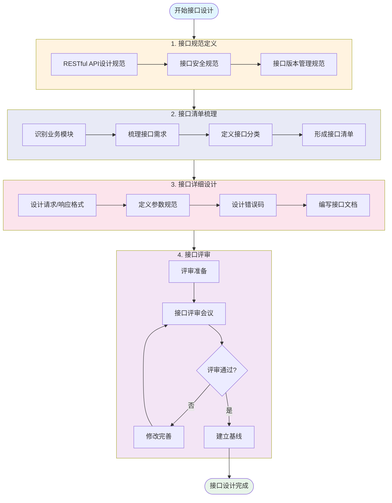

# 接口设计流程图

## 概述

本文档描述System平台接口设计的完整流程，包括规范定义、接口清单梳理、详细设计和评审四个阶段。

## 流程图

## 流程说明

### 阶段1：接口规范定义

建立接口设计的基础规范，确保所有接口设计的一致性和规范性。

| 步骤 | 任务 | 输出 |
|-----|------|------|
| 1.1 | RESTful API设计规范 | 定义URL规范、HTTP方法、响应格式等 |
| 1.2 | 接口安全规范 | 定义认证机制、签名规则、限流策略等 |
| 1.3 | 接口版本管理规范 | 定义版本号规则、兼容性策略等 |

### 阶段2：接口清单梳理

基于业务需求和架构设计，梳理所有需要设计的API接口。

| 步骤 | 任务 | 输出 |
|-----|------|------|
| 2.1 | 识别业务模块 | 用户管理、角色权限、组织架构、系统配置等 |
| 2.2 | 梳理接口需求 | 每个模块的CRUD接口、业务接口等 |
| 2.3 | 定义接口分类 | 公开接口、认证接口、管理接口等 |
| 2.4 | 形成接口清单 | API接口清单文档 |

### 阶段3：接口详细设计

对每个接口进行详细设计，包括请求参数、响应格式、错误处理等。

| 步骤 | 任务 | 输出 |
|-----|------|------|
| 3.1 | 设计请求/响应格式 | 统一的JSON格式规范 |
| 3.2 | 定义参数规范 | 参数命名、类型、校验规则 |
| 3.3 | 设计错误码 | 错误码体系、错误信息规范 |
| 3.4 | 编写接口文档 | 接口详细设计文档 |

### 阶段4：接口评审

组织接口设计评审会议，确保接口设计的合理性和完整性。

| 步骤 | 任务 | 输出 |
|-----|------|------|
| 4.1 | 评审准备 | 评审通知、评审材料 |
| 4.2 | 接口评审会议 | 评审记录、问题清单 |
| 4.3 | 修改完善 | 问题修复、文档更新 |
| 4.4 | 建立基线 | 接口基线文档 |

## 流程图文件

- **Mermaid源文件**: [interface-design-process.mmd](./interface-design-process.mmd)
- **PNG图片**: [interface-design-process.png](./interface-design-process.png)

## 相关文档

- [接口设计检查清单](../../interface-design-checklist.md)
- [RESTful API设计规范](../../01-rest-api-standard/01-restful-api-standard.md)
- [接口安全规范](../../01-rest-api-standard/02-interface-security-standard.md)
- [接口版本管理规范](../../01-rest-api-standard/03-interface-version-standard.md)
