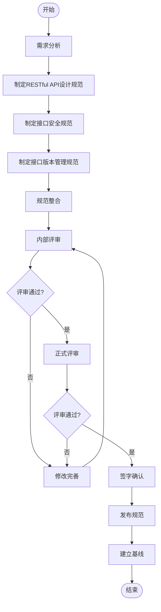

# 接口规范标准制定流程

> **流程编号**: INT-PROC-001  
> **版本**: 1.0  
> **日期**: 2026-03-09  
> **作者**: 系统架构师  
> **状态**: ✅ 已发布

---

## 一、流程概述

### 1.1 流程目的

规范System平台接口规范标准的制定过程，确保接口设计的一致性、安全性和可维护性。

### 1.2 适用范围

适用于System平台所有RESTful API接口规范的制定和维护。

### 1.3 输出物

- RESTful API设计规范
- 接口安全规范
- 接口版本管理规范

---

## 二、流程图



---

## 三、流程步骤

### 步骤1：需求分析

**输入**: 业务需求、架构设计、行业最佳实践  
**输出**: 接口规范需求清单

**任务清单**:
- [ ] 分析业务接口需求
- [ ] 调研行业RESTful API规范
- [ ] 识别安全需求
- [ ] 确定版本管理策略
- [ ] 形成规范需求清单

**交付物**:
```markdown
## 接口规范需求清单

### RESTful API设计需求
- URL设计规范
- HTTP方法规范
- 请求响应格式
- 状态码规范
- 分页排序规范

### 接口安全需求
- 认证机制（JWT）
- 请求签名
- 防重放攻击
- 限流策略
- 数据加密

### 版本管理需求
- 版本号规则
- 兼容性策略
- 废弃流程
```

---

### 步骤2：制定RESTful API设计规范

**输入**: 接口规范需求清单  
**输出**: RESTful API设计规范文档

**任务清单**:
- [ ] 定义URL设计规范
  - 基础路径格式
  - 资源命名规范
  - URL结构示例
- [ ] 定义HTTP方法规范
  - GET/POST/PUT/PATCH/DELETE使用规则
- [ ] 定义请求规范
  - 请求头规范
  - 请求参数规范（路径、查询、请求体）
- [ ] 定义响应规范
  - 统一响应格式
  - 成功/错误响应示例
- [ ] 定义状态码规范
  - HTTP状态码
  - 业务状态码
- [ ] 定义分页和排序规范
- [ ] 定义批量操作规范
- [ ] 定义文件上传规范

**文档模板**:
```markdown
# RESTful API设计规范

> **文档编号**: SYS-INT-STD-001
> **版本**: 1.0
> **状态**: 🔄 进行中

## 一、概述
...

## 二、URL设计规范
...

## 三、HTTP方法规范
...

## 四、请求规范
...

## 五、响应规范
...

## 六、状态码规范
...

## 七、分页规范
...

## 八、排序规范
...

## 九、批量操作规范
...

## 十、文件上传规范
...

## 十一、修订记录
...
```

**检查点**:
- [ ] URL规范是否符合RESTful标准
- [ ] HTTP方法使用是否正确
- [ ] 请求响应格式是否统一
- [ ] 状态码定义是否完整

---

### 步骤3：制定接口安全规范

**输入**: 接口规范需求清单、安全架构设计  
**输出**: 接口安全规范文档

**任务清单**:
- [ ] 定义认证机制
  - JWT Token结构设计
  - Token有效期设置
  - Token刷新机制
- [ ] 定义请求签名机制
  - HMAC-SHA256签名算法
  - 签名参数规范
- [ ] 定义防重放攻击机制
  - 时间戳校验
  - Nonce机制
- [ ] 定义限流策略
  - 限流维度（全局、接口、用户、IP）
  - 限流算法（令牌桶）
- [ ] 定义数据加密策略
  - 传输加密（HTTPS/TLS）
  - 敏感数据加密（AES-256）
  - 字段级加密
- [ ] 定义安全Header
  - HSTS、CORS、XSS防护
- [ ] 定义输入验证规则
  - 参数校验
  - SQL注入防护
  - XSS防护
- [ ] 定义日志审计要求
  - 安全日志内容
  - 敏感操作日志

**文档模板**:
```markdown
# 接口安全规范

> **文档编号**: SYS-INT-STD-002
> **版本**: 1.0
> **状态**: 🔄 进行中

## 一、概述
...

## 二、认证机制
...

## 三、请求签名
...

## 四、防重放攻击
...

## 五、限流策略
...

## 六、数据加密
...

## 七、安全Header
...

## 八、输入验证
...

## 九、日志审计
...

## 十、安全测试
...

## 十一、安全响应
...

## 十二、修订记录
...
```

**检查点**:
- [ ] 认证机制是否安全可靠
- [ ] 签名算法是否标准
- [ ] 限流策略是否合理
- [ ] 加密方案是否符合安全要求

---

### 步骤4：制定接口版本管理规范

**输入**: 接口规范需求清单  
**输出**: 接口版本管理规范文档

**任务清单**:
- [ ] 定义版本号规范
  - 语义化版本控制（MAJOR.MINOR.PATCH）
  - API版本与系统版本区分
- [ ] 定义版本控制策略
  - URL路径版本（推荐）
  - 请求头版本（备选）
- [ ] 定义版本演进策略
  - 向后兼容变更
  - 不兼容变更
  - 废弃（Deprecation）流程
- [ ] 定义版本兼容性规则
  - 兼容性矩阵
  - 多版本支持策略
- [ ] 定义版本文档要求
  - 变更日志
  - 迁移指南
  - API文档版本化
- [ ] 定义版本实现方案
  - 后端实现（Spring Boot）
  - 前端实现（版本适配层）
- [ ] 定义版本监控指标
  - 版本使用统计
  - 下线决策条件

**文档模板**:
```markdown
# 接口版本管理规范

> **文档编号**: SYS-INT-STD-003
> **版本**: 1.0
> **状态**: 🔄 进行中

## 一、概述
...

## 二、版本号规范
...

## 三、版本控制策略
...

## 四、版本演进策略
...

## 五、版本兼容性
...

## 六、版本文档
...

## 七、版本实现
...

## 八、版本监控
...

## 九、最佳实践
...

## 十、修订记录
...
```

**检查点**:
- [ ] 版本号规范是否清晰
- [ ] 版本控制策略是否合理
- [ ] 废弃流程是否完整
- [ ] 兼容性策略是否可行

---

### 步骤5：规范整合

**输入**: 三个规范文档  
**输出**: 接口规范标准合集

**任务清单**:
- [ ] 统一文档格式和风格
- [ ] 检查文档间引用关系
- [ ] 确保术语一致性
- [ ] 整合相关文档链接
- [ ] 更新接口设计检查清单

**检查点**:
- [ ] 文档格式是否统一
- [ ] 术语定义是否一致
- [ ] 引用链接是否正确

---

### 步骤6：内部评审

**输入**: 接口规范标准文档  
**输出**: 内部评审意见

**任务清单**:
- [ ] 架构师初审
- [ ] 安全工程师审核
- [ ] 后端开发负责人审核
- [ ] 前端开发负责人审核
- [ ] 汇总评审意见

**评审检查表**:

| 评审项 | 评审内容 | 评审标准 |
|-------|---------|---------|
| RESTful API设计 | URL规范、HTTP方法、响应格式 | 符合RESTful标准 |
| 接口安全 | 认证、签名、加密、限流 | 满足安全要求 |
| 版本管理 | 版本号、兼容性、废弃流程 | 策略合理可行 |
| 可实施性 | 技术可行性、开发成本 | 可落地执行 |
| 完整性 | 文档完整性、示例充分性 | 内容完整 |

---

### 步骤7：正式评审

**输入**: 内部评审通过的规范文档  
**输出**: 正式评审结论

**任务清单**:
- [ ] 准备评审材料
- [ ] 召开评审会议
- [ ] 记录评审意见
- [ ] 形成评审结论

**评审会议议程**:
1. 规范文档概述（15分钟）
2. RESTful API设计规范评审（20分钟）
3. 接口安全规范评审（20分钟）
4. 接口版本管理规范评审（15分钟）
5. 讨论与答疑（15分钟）
6. 形成评审结论（5分钟）

---

### 步骤8：修改完善

**输入**: 评审意见  
**输出**: 修改后的规范文档

**任务清单**:
- [ ] 分析评审意见
- [ ] 修改规范文档
- [ ] 更新修订记录
- [ ] 重新提交评审

---

### 步骤9：签字确认

**输入**: 评审通过的规范文档  
**输出**: 签字确认表

**签字人员**:
- 技术总监
- 系统架构师
- 后端架构师
- 前端负责人
- 安全工程师（安全规范）

**签字表模板**:
```markdown
### 签字确认

| 角色 | 姓名 | 签字 | 日期 | 意见 |
|-----|------|------|------|------|
| 技术总监 | | _______________ | | |
| 系统架构师 | | _______________ | | |
| 后端架构师 | | _______________ | | |
| 前端负责人 | | _______________ | | |
| 安全工程师 | | _______________ | | |
```

---

### 步骤10：发布规范

**输入**: 签字确认后的规范文档  
**输出**: 正式发布版本

**任务清单**:
- [ ] 更新文档状态为"已发布"
- [ ] 发布到文档中心
- [ ] 通知相关团队
- [ ] 组织规范培训

---

### 步骤11：建立基线

**输入**: 发布的规范文档  
**输出**: 规范基线

**任务清单**:
- [ ] 创建基线标签
- [ ] 归档文档
- [ ] 建立变更控制流程
- [ ] 更新接口设计检查清单状态

---

## 四、角色职责

| 角色 | 职责 |
|-----|------|
| 系统架构师 | 主导规范制定，负责技术方案 |
| 安全工程师 | 审核安全规范，提出安全建议 |
| 后端架构师 | 审核技术可行性，参与评审 |
| 前端负责人 | 审核接口可用性，参与评审 |
| 技术总监 | 最终审批，签字确认 |

---

## 五、检查清单

### 5.1 RESTful API设计规范检查项

- [ ] URL设计符合RESTful标准
- [ ] HTTP方法使用正确
- [ ] 请求响应格式统一
- [ ] 状态码定义完整
- [ ] 分页排序规范明确
- [ ] 示例充分且正确

### 5.2 接口安全规范检查项

- [ ] JWT认证机制完善
- [ ] 请求签名算法标准
- [ ] 防重放机制有效
- [ ] 限流策略合理
- [ ] 加密方案安全
- [ ] 安全Header完整

### 5.3 接口版本管理规范检查项

- [ ] 版本号规范清晰
- [ ] 版本控制策略可行
- [ ] 兼容性策略明确
- [ ] 废弃流程完整
- [ ] 迁移指南详细
- [ ] 实现方案可行

---

## 六、相关文档

- [RESTful API设计规范](../01-rest-api-standard/01-restful-api-standard.md)
- [接口安全规范](../01-rest-api-standard/02-interface-security-standard.md)
- [接口版本管理规范](../01-rest-api-standard/03-interface-version-standard.md)
- [接口设计检查清单](../interface-design-checklist.md)

---

## 七、修订记录

| 版本 | 日期 | 作者 | 变更内容 |
|-----|------|------|---------|
| 1.0 | 2026-03-09 | 系统架构师 | 初始版本，建立接口规范标准制定流程 |
