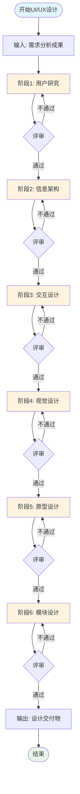
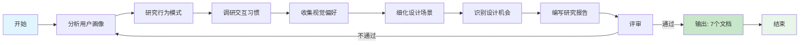
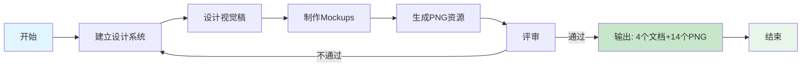
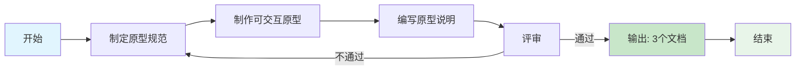
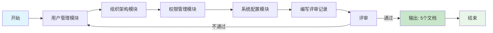
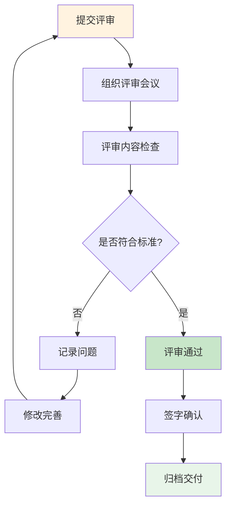

# UI/UX设计整体流程

## 1. 流程概述

本文档描述系统平台项目UI/UX设计的完整流程，基于 `ui-ux-design-checklist.md` 中的阶段划分和交付物要求。

## 2. 整体流程图

## 3. 各阶段详细流程

### 3.1 用户研究阶段 (4-01)

**交付物清单：**
1. 设计导向用户画像
2. 用户行为模式分析
3. 交互习惯研究报告
4. 视觉偏好调研
5. 设计场景细化
6. 设计机会点清单
7. 用户研究评审记录

### 3.2 信息架构阶段 (4-02)

**交付物清单：**
1. 站点地图
2. 导航结构设计
3. 内容分类体系
4. 信息架构评审记录

### 3.3 交互设计阶段 (4-03)

**交付物清单：**
1. 任务流程设计
2. 线框图设计
3. 交互说明文档
4. 交互设计评审记录

### 3.4 视觉设计阶段 (4-04)

**交付物清单：**
1. 设计系统
2. 视觉稿设计
3. Mockups设计
4. 视觉设计评审记录

**PNG资源：**
- 设计系统：4个（颜色、字体、组件、间距）
- 视觉稿：5个（登录页、仪表盘、用户列表、用户创建、部门管理）
- Mockups：5个（同上）

### 3.5 原型设计阶段 (4-05)

**交付物清单：**
1. 原型设计规范
2. 可交互原型说明
3. 原型设计评审记录

### 3.6 模块设计阶段 (4-06)

**交付物清单：**
1. 用户管理模块设计
2. 组织架构模块设计
3. 权限管理模块设计
4. 系统配置模块设计
5. 模块设计评审记录

## 4. 评审流程

## 5. 交付物汇总

| 阶段 | 文档数量 | PNG数量 | 评审次数 |
|------|---------|---------|----------|
| 用户研究 | 7 | 0 | 1 |
| 信息架构 | 4 | 0 | 1 |
| 交互设计 | 4 | 0 | 1 |
| 视觉设计 | 4 | 14 | 1 |
| 原型设计 | 3 | 0 | 1 |
| 模块设计 | 5 | 0 | 1 |
| **总计** | **27** | **14** | **6** |

## 6. 流程特点

1. **分阶段推进**：每个阶段有明确的输入、输出和评审点
2. **质量门禁**：每个阶段必须通过评审才能进入下一阶段
3. **迭代优化**：评审不通过时返回修改，确保质量
4. **文档驱动**：每个阶段产生标准化文档，便于追溯
5. **可视化交付**：视觉设计阶段产出PNG资源，便于沟通

## 7. 修订记录

| 版本 | 日期 | 作者 | 变更内容 |
|------|------|------|----------|
| 1.0 | 2026-03-09 | UI/UX设计师 | 初始版本，创建UI/UX设计整体流程 |
