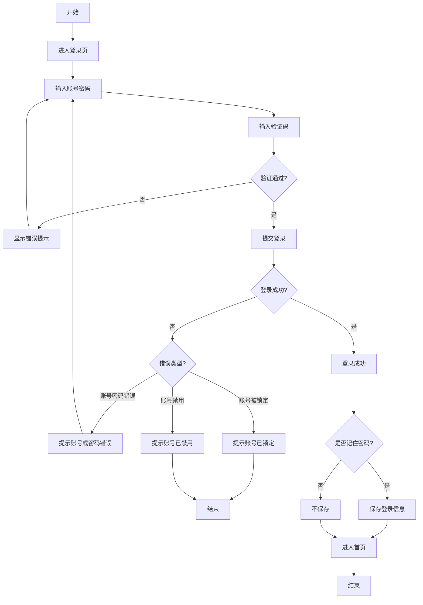
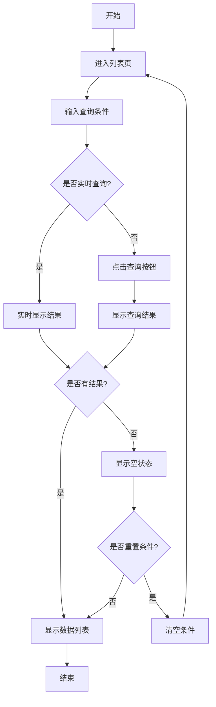
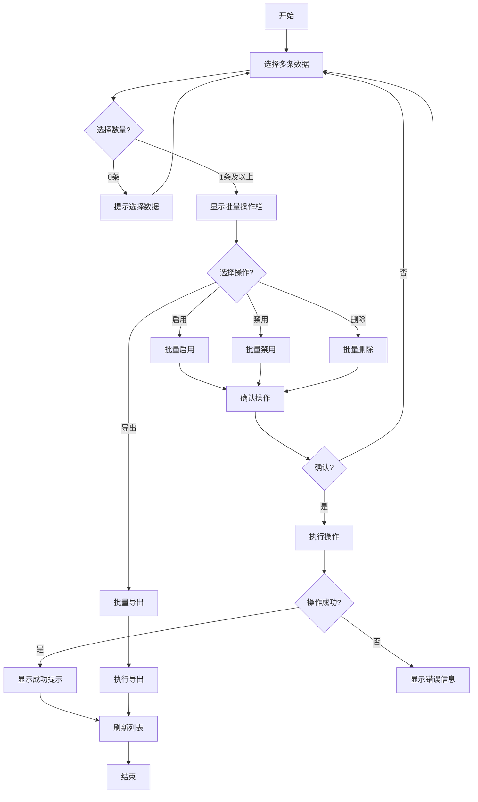
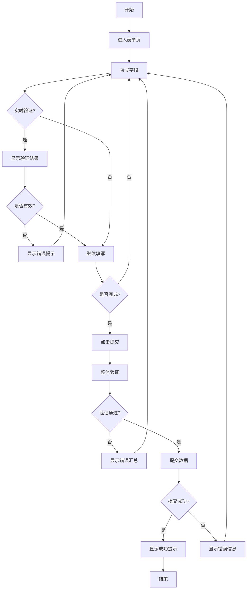
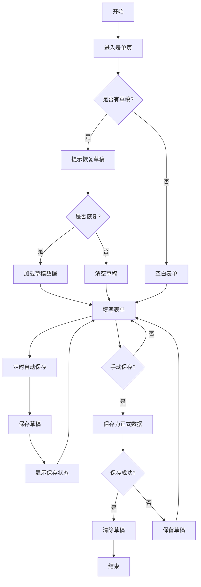
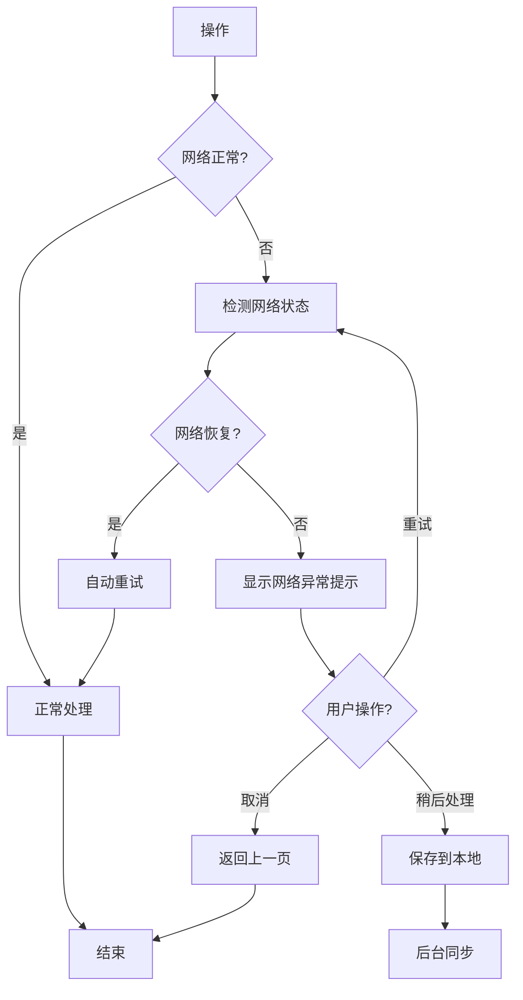
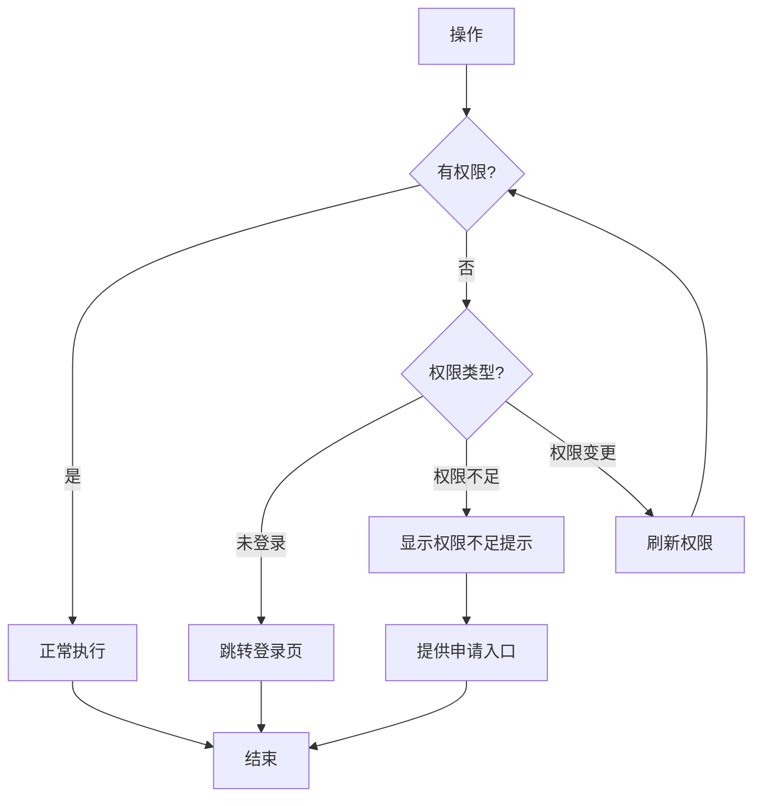

# 任务流程设计

**文档编号**: SYS-UX-IX-001  
**版本**: 1.0  
**日期**: 2026-03-09  
**编制**: UI/UX设计师  
**审核**: 产品经理  
**批准**: 项目总监  
**状态**: ✓ 已批准

---

## 一、文档概述

### 1.1 文档目的

本文档定义系统的核心任务流程，包括用户完成特定任务的步骤、决策点、异常处理等，为线框图设计和交互实现提供流程依据。

### 1.2 参考文档

- [站点地图](../02-information-architecture/01-site-map.md)
- [导航结构设计](../02-information-architecture/02-navigation-structure.md)
- [设计导向用户画像](../01-user-research/01-user-personas-design.md)

---

## 二、任务流程设计原则

### 2.1 核心原则

| 原则 | 描述 | 设计体现 |
|------|------|---------|
| **简洁性** | 减少步骤，提高效率 | 最短路径原则，3步内完成核心任务 |
| **一致性** | 相同类型任务流程一致 | 统一的表单流程、统一的确认机制 |
| **容错性** | 允许错误，支持恢复 | 撤销操作、自动保存、错误提示 |
| **反馈性** | 及时反馈操作结果 | 进度指示、成功/失败提示 |
| **可预测性** | 用户能预知操作结果 | 明确的按钮文案、操作前确认 |

### 2.2 流程设计标准

| 标准 | 要求 |
|------|------|
| **步骤数** | 核心任务不超过5步，简单任务不超过3步 |
| **决策点** | 每个流程决策点不超过3个选项 |
| **异常处理** | 每个流程必须包含异常分支 |
| **退出机制** | 每个步骤都支持取消/返回 |

---

## 三、核心任务流程

### 3.1 用户管理流程

#### 3.1.1 创建用户流程

```mermaid
flowchart TD
    A[开始] --> B[点击"新建用户"按钮]
    B --> C{是否有模板?}
    C -->|是| D[选择用户模板]
    C -->|否| E[进入空白表单]
    D --> F[填写用户信息]
    E --> F
    F --> G{信息是否完整?}
    G -->|否| H[显示必填提示]
    H --> F
    G -->|是| I{手机号是否重复?}
    I -->|是| J[提示手机号已存在]
    J --> F
    I -->|否| K[提交创建]
    K --> L{创建成功?}
    L -->|是| M[显示成功提示]
    L -->|否| N[显示错误信息]
    N --> F
    M --> O{是否继续创建?}
    O -->|是| B
    O -->|否| P[返回用户列表]
    P --> Q[结束]
```

**流程说明**:

| 步骤 | 操作 | 页面/组件 | 说明 |
|------|------|----------|------|
| 1 | 点击新建 | 用户列表页 | 触发创建流程 |
| 2 | 填写信息 | 用户创建表单 | 包含基础信息、组织信息、权限信息 |
| 3 | 验证信息 | 表单验证 | 实时验证必填项和格式 |
| 4 | 提交创建 | 确认对话框 | 二次确认后提交 |
| 5 | 完成提示 | 成功提示 | 显示创建成功，提供后续操作选项 |

**异常处理**:

| 异常场景 | 处理方式 | 提示信息 |
|---------|---------|---------|
| 手机号重复 | 阻止提交，提示修改 | "该手机号已被使用，请更换" |
| 必填项为空 | 高亮显示，阻止提交 | "请填写必填项" |
| 网络错误 | 允许重试 | "网络异常，请稍后重试" |
| 权限不足 | 阻止操作 | "您没有创建用户的权限" |

---

#### 3.1.2 编辑用户流程

```mermaid
flowchart TD
    A[开始] --> B[选择用户]
    B --> C[点击"编辑"按钮]
    C --> D[加载用户数据]
    D --> E[显示编辑表单]
    E --> F[修改信息]
    F --> G{是否有修改?}
    G -->|否| H[点击返回]
    H --> I[返回列表]
    G -->|是| J{点击保存?}
    J -->|否| K{点击取消?}
    K -->|是| L[提示保存确认]
    L -->|保存| M[保存修改]
    L -->|不保存| I
    K -->|否| F
    J -->|是| M
    M --> N{保存成功?}
    N -->|是| O[显示成功提示]
    N -->|否| P[显示错误信息]
    P --> F
    O --> I
    I --> Q[结束]
```

---

#### 3.1.3 批量导入流程

```mermaid
flowchart TD
    A[开始] --> B[点击"批量导入"]
    B --> C[下载导入模板]
    C --> D[填写Excel数据]
    D --> E[上传文件]
    E --> F{文件格式正确?}
    F -->|否| G[提示格式错误]
    G --> E
    F -->|是| H[解析文件]
    H --> I{数据验证}
    I -->|有错误| J[显示错误列表]
    J --> K{是否下载错误报告?}
    K -->|是| L[下载错误报告]
    K -->|否| D
    L --> D
    I -->|验证通过| M[预览导入数据]
    M --> N{确认导入?}
    N -->|否| D
    N -->|是| O[执行导入]
    O --> P{导入成功?}
    P -->|是| Q[显示导入结果]
    P -->|否| R[显示错误信息]
    R --> S{是否重试?}
    S -->|是| O
    S -->|否| T[返回列表]
    Q --> T
    T --> U[结束]
```

---

### 3.2 组织架构管理流程

#### 3.2.1 部门管理流程

```mermaid
flowchart TD
    A[开始] --> B[进入部门管理]
    B --> C{操作类型?}
    C -->|创建部门| D[点击"新建部门"]
    D --> E[填写部门信息]
    E --> F[选择上级部门]
    F --> G[提交创建]
    G --> H{创建成功?}
    H -->|是| I[更新部门树]
    H -->|否| J[显示错误]
    J --> E
    
    C -->|编辑部门| K[选择部门]
    K --> L[点击"编辑"]
    L --> M[修改信息]
    M --> N[保存修改]
    N --> O{保存成功?}
    O -->|是| I
    O -->|否| P[显示错误]
    P --> M
    
    C -->|删除部门| Q[选择部门]
    Q --> R[点击"删除"]
    R --> S{部门下有人员?}
    S -->|是| T[提示先转移人员]
    T --> U[人员转移]
    U --> R
    S -->|否| V[确认删除]
    V --> W{删除成功?}
    W -->|是| I
    W -->|否| X[显示错误]
    X --> Q
    
    I --> Y[结束]
```

---

#### 3.2.2 人员调动流程

```mermaid
flowchart TD
    A[开始] --> B[选择人员]
    B --> C[点击"调动"]
    C --> D[选择目标部门]
    D --> E{是否调整岗位?}
    E -->|是| F[选择新岗位]
    E -->|否| G[保持原岗位]
    F --> H[确认调动信息]
    G --> H
    H --> I{确认?}
    I -->|否| B
    I -->|是| J[执行调动]
    J --> K{调动成功?}
    K -->|是| L[显示成功提示]
    K -->|否| M[显示错误]
    M --> B
    L --> N[发送通知]
    N --> O[结束]
```

---

### 3.3 权限管理流程

#### 3.3.1 角色创建与权限分配流程

```mermaid
flowchart TD
    A[开始] --> B[点击"新建角色"]
    B --> C[填写角色信息]
    C --> D[保存角色]
    D --> E{保存成功?}
    E -->|否| F[显示错误]
    F --> C
    E -->|是| G[进入权限分配]
    G --> H[选择菜单权限]
    H --> I[选择操作权限]
    I --> J[选择数据权限]
    J --> K[预览权限配置]
    K --> L{确认保存?}
    L -->|否| H
    L -->|是| M[保存权限配置]
    M --> N{保存成功?}
    N -->|是| O[显示成功提示]
    N -->|否| P[显示错误]
    P --> H
    O --> Q{是否分配用户?}
    Q -->|是| R[进入用户分配]
    Q -->|否| S[返回角色列表]
    R --> T[选择用户]
    T --> U[确认分配]
    U --> S
    S --> V[结束]
```

---

### 3.4 系统登录流程



---

## 四、通用交互流程

### 4.1 列表操作通用流程

#### 4.1.1 查询流程



---

#### 4.1.2 批量操作流程



---

### 4.2 表单操作通用流程

#### 4.2.1 表单填写流程



---

#### 4.2.2 表单自动保存流程



---

## 五、异常处理流程

### 5.1 网络异常处理



### 5.2 权限异常处理



---

## 六、移动端适配流程

### 6.1 移动端简化流程

#### 6.1.1 移动端用户创建流程

```mermaid
flowchart TD
    A[开始] --> B[点击"新建用户"]
    B --> C[步骤1: 基础信息]
    C --> D[填写姓名、手机号]
    D --> E[下一步]
    E --> F[步骤2: 组织信息]
    F --> G[选择部门、岗位]
    G --> H[下一步]
    H --> I[步骤3: 确认]
    I --> J[预览信息]
    J --> K{确认创建?}
    K -->|否| L[返回修改]
    L --> C
    K -->|是| M[提交创建]
    M --> N{创建成功?}
    N -->|是| O[显示成功]
    N -->|否| P[显示错误]
    P --> C
    O --> Q[结束]
```

**移动端特点**:
- 分步表单，每步2-3个字段
- 底部固定操作按钮
- 支持滑动返回上一步

---

## 七、流程优化建议

### 7.1 效率优化

| 优化点 | 当前流程 | 优化方案 | 预期效果 |
|--------|---------|---------|---------|
| 快速创建 | 进入表单填写 | 提供快捷创建（仅必填项） | 减少50%操作时间 |
| 智能填充 | 手动填写所有字段 | 根据历史数据智能推荐 | 减少30%输入量 |
| 批量操作 | 单条操作 | 支持更多批量操作场景 | 提升批量处理效率 |

### 7.2 体验优化

| 优化点 | 优化方案 | 预期效果 |
|--------|---------|---------|
| 操作引导 | 新增功能引导提示 | 降低学习成本 |
| 快捷操作 | 支持右键菜单、快捷键 | 提升操作效率 |
| 操作反馈 | 优化加载动画、成功提示 | 提升感知体验 |

---

## 八、修订记录

| 版本 | 日期 | 作者 | 变更内容 |
|-----|------|------|---------|
| 1.0 | 2026-03-09 | UI/UX设计师 | 初始版本，创建任务流程设计 |

---

**文档状态**: ⏳ 进行中  
**最后更新**: 2026-03-09  
**文档作者**: UI/UX设计师
