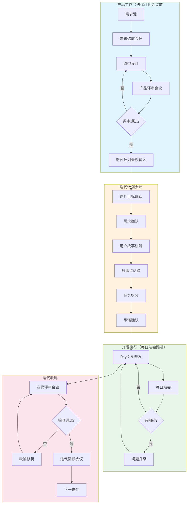
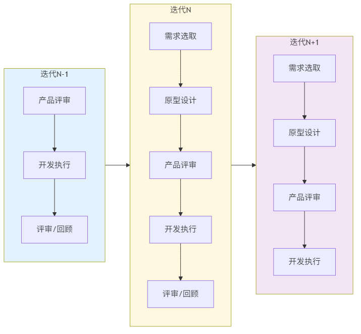
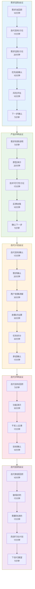

# 迭代开发流程图

**文档编号:** SYS-IT-PD-001  
**版本:** 1.0  
**日期:** 2026-03-11  
**状态:** 已完成

---

## 一、流程图概览

本文档定义迭代开发阶段的流程图，包括迭代主流程、滚动流水线、会议流程等。

---

## 二、迭代主流程图

### 2.1 流程图



### 2.2 流程说明

迭代开发流程分为四个主要阶段：

| 阶段 | 说明 | 产出物 |
|------|------|--------|
| **产品工作** | 需求选取、原型设计、产品评审 | 迭代需求列表、原型设计稿 |
| **迭代计划** | 目标确认、故事估算、任务拆分 | 迭代计划文档、任务列表 |
| **开发执行** | 功能开发、每日站会、问题解决 | 源代码、单元测试 |
| **迭代收尾** | 迭代评审、迭代回顾 | 评审报告、回顾报告 |

---

## 三、滚动式产品-开发流水线

### 3.1 流程图



### 3.2 流程说明

滚动式流水线实现产品与开发的并行工作：

```
迭代N-1     │ 产品评审 │────────── 开发执行 ──────────│ 评审 │ 回顾 │
            └────┬────┘                              └───┬──┘
                 │                                       │
迭代N       │ 需求选取 │ 原型设计 │ 产品评审 │────────── 开发执行 ────>
            └────┬─────┴────┬────┴────┬────┘
                 │          │         │
迭代N+1          │ 需求选取 │ 原型设计 │ 产品评审 │── 开发 ──>
```

**关键原则：**
- 产品工作提前一个迭代进行
- 当迭代N开始开发时，产品团队已完成迭代N的产品工作
- 产品团队同时进行迭代N+1的产品工作

---

## 四、迭代会议流程图

### 4.1 流程图



### 4.2 会议说明

| 会议 | 时长 | 参与人 | 产出物 |
|------|------|--------|--------|
| **需求选取会议** | 70分钟 | 产品、架构师 | 迭代需求列表 |
| **产品评审会议** | 55分钟 | 产品、开发、测试、干系人 | 评审通过确认 |
| **迭代计划会议** | 140分钟 | 全员 | 迭代计划文档 |
| **迭代评审会议** | 60分钟 | 全员+干系人 | 验收确认记录 |
| **迭代回顾会议** | 60分钟 | 开发团队 | 改进行动计划 |

---

## 五、会议详细议程

### 5.1 需求选取会议

| 序号 | 议程 | 时长 | 产出物 |
|------|------|------|--------|
| 1 | 需求池回顾 | 10分钟 | 需求池状态 |
| 2 | 迭代目标讨论 | 15分钟 | 迭代目标草案 |
| 3 | 需求选取讨论 | 20分钟 | 候选需求列表 |
| 4 | 优先级确认 | 10分钟 | 优先级排序 |
| 5 | 风险评估 | 10分钟 | 风险清单 |
| 6 | 下一步确认 | 5分钟 | 行动计划 |

### 5.2 产品评审会议

| 序号 | 议程 | 时长 |
|------|------|------|
| 1 | 需求背景说明 | 5分钟 |
| 2 | 原型演示 | 20分钟 |
| 3 | 技术可行性讨论 | 15分钟 |
| 4 | 反馈收集 | 10分钟 |
| 5 | 确认下一步 | 5分钟 |

### 5.3 迭代计划会议

| 序号 | 议程 | 时长 | 产出物 |
|------|------|------|--------|
| 1 | 迭代目标确认 | 15分钟 | 迭代目标文档 |
| 2 | 需求确认 | 20分钟 | 本次迭代需求列表 |
| 3 | 用户故事讲解 | 30分钟 | 用户故事理解 |
| 4 | 故事点估算 | 30分钟 | 故事点数 |
| 5 | 任务拆分 | 30分钟 | 任务列表 |
| 6 | 承诺确认 | 15分钟 | 迭代承诺 |

### 5.4 迭代评审会议

| 序号 | 议程 | 时长 |
|------|------|------|
| 1 | 迭代目标回顾 | 5分钟 |
| 2 | 功能演示 | 30分钟 |
| 3 | 干系人反馈 | 15分钟 |
| 4 | 验收确认 | 10分钟 |

### 5.5 迭代回顾会议

| 序号 | 议程 | 时长 |
|------|------|------|
| 1 | 迭代数据回顾 | 10分钟 |
| 2 | 做得好的 | 15分钟 |
| 3 | 需要改进的 | 15分钟 |
| 4 | 改进行动计划 | 15分钟 |
| 5 | 下迭代展望 | 5分钟 |

---

## 六、版本历史

| 版本 | 日期 | 修改内容 | 修改人 |
|-----|------|---------|--------|
| 1.0 | 2026-03-11 | 初始版本，定义迭代流程图 | 架构师 |

---

**编制:** 架构师  
**审核:** 已审核  
**批准:** 已批准
